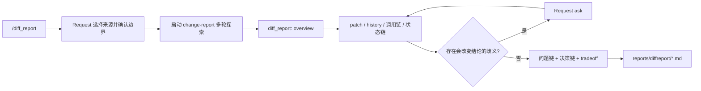

# Diffreport 插件

`diffreport` 把 Git 变更作为入口，驱动 LLM 多轮还原业务现状、业务规则、问题链、决策链与方案 tradeoff。它不是代码审查器：`diff_report` tool 只提供有界证据，`/diff_report` command 通过 Request 收集分析起点并启动自主探索，最终产物是写入 workspace 的详细 Markdown 报告。

扩展直接捆绑 Request，并显式分发 `change-report` skill。单独加载 Diffreport 即可获得统一的 Request UI、`ask` tool 和报告方法论；与独立安装的 Request 同时加载时，共享幂等 runtime，不会重复注册。

> 维护约束：凡是改变 Diffreport 的命令、tool schema、Request 交互、报告行为、skill、输出路径、依赖或安装方式，都必须在同一改动中同步本 README。

## 核心流程



关键语义：

- **起点可选**：branch + 业务描述、当前未提交改动、完整 branch、一个或多个提交/版本范围。
- **边界可确认**：分支 target/base、提交集合和关键业务解释不确定时，通过 Request 提问；仓库证据足够时继续自主探索。
- **描述不做过滤**：branch + description 中的描述是待验证的上下文，不会自动转成 commit-message、文件或符号过滤条件。
- **必须多轮取证**：overview 只是目录；至少继续一次定向 patch/history，并追踪未改动的 caller、状态、持久化与外部副作用。
- **报告不是 review**：不输出缺陷清单、严重度、审批结论或通用风险评分；核心是业务当前态、问题演进、决策依据和替代方案权衡。
- **产物可阅读**：Markdown 包含 Mermaid 流程图、时序图或状态图（以证据适用性为准），以及业务规则、状态转换、决策和 tradeoff 表。

## 安装与启用

要求：Node.js `>=22.19.0`、npm，以及兼容 `@earendil-works/pi-coding-agent >=0.82.1` 的 Pi。

从仓库根目录启用：

```bash
make pi-extensions-on
```

或单独链接 package：

```bash
cd /path/to/pi-extensions/diffreport
npm ci
mkdir -p "$HOME/.pi/agent/extensions"
ln -sfn "$PWD" "$HOME/.pi/agent/extensions/diffreport"
```

`package.json` 的资源顺序为 Request extension → Diffreport extension，并通过 `pi.skills` 暴露 `./skills`。通过 `pi install` 或 `-e <package-directory>` 加载完整 package 时由 manifest 发现 skill；通过 `~/.pi/agent/extensions/diffreport` 这类 extension-only symlink 加载时，`src/index.ts` 会在 `resources_discover` 阶段发布同一个 canonical `skills/` 路径。两条路径会去重，因此修改后只需执行 `/reload`。

## Command: `/diff_report`

### 交互选择

不带参数时，Request 首先显示四种来源：

| 来源 | 后续交互 | 分析起点 |
| --- | --- | --- |
| `Branch + description` | 选择 target、base，并输入业务问题/期望/决策背景 | 完整 `base...target`；描述仅作为假设 |
| `Uncommitted changes` | 无需额外边界 | `HEAD` 对 index + working tree，并列出 untracked |
| `Branch` | 选择 target 与 before-state base | 完整 `base...target` |
| `Commit history` | 多选最近提交，或用 Other 输入 SHA/ref/range | 每个选中记录或 revision range |

target 与 base 相同、用户输入的 ref 无法解析、或后续 LLM 发现影响结论的歧义时，都会继续使用 Request；不会要求用户再次输入 `/diff_report <number>`。

### 显式用法

```text
/diff_report uncommitted
/diff_report uncommitted 结算状态流
/diff_report branch feature/payment --base main
/diff_report branch feature/payment 支付失败后的重试 --base main
/diff_report commits abc123 HEAD~5..HEAD --description 决策演进
/diff_report branch feature/payment --base main --output docs/payment-flow.md
```

| 参数 | 语义 |
| --- | --- |
| `uncommitted [description]` | 未提交的 tracked delta + untracked inventory |
| `branch <target> [description]` | branch；存在描述时自动采用 branch + description 语义 |
| `commits [<ref-or-range> ...]` | 一个或多个 commit/ref/range；无值时通过 Request 选择最近提交 |
| `--base <ref>` | branch 的 before-state；省略时 TUI 通过 Request 确认，非交互模式只采用可唯一推断的默认分支 |
| `--description <text>` | 用户上下文；带空格时可加引号，也可一直写到下一个 `--flag` |
| `--output <file.md>` | workspace 内的 Markdown 路径 |

默认输出为：

```text
reports/diffreport/YYYYMMDD-HHmmss-<source>.md
```

命令本身不先生成静态摘要。它发送一个真正的 user message 启动 agent turn，要求加载 `change-report` skill、按多轮证据流程工作，并在结束前写完指定文件。agent 忙碌时该消息作为 `followUp` 排队；command handler 会等待该 turn 完全结束，避免 `print/json` 在报告落盘前退出。

TUI 中所有来源、边界和后续澄清均使用 Request。`print/json` 等无 Request UI 模式必须给出足够的显式来源；否则命令安全失败，不猜测用户选择。

## Tool: `diff_report`

该 tool 是证据采集器，不是最终报告生成器。

| 参数 | 必填 | 默认 | 语义 |
| --- | --- | --- | --- |
| `source` | 是 | — | `uncommitted`、`branch`、`commits` |
| `view` | 否 | `overview` | `overview`（目录）、`patch`（定向 diff）、`history`（提交历史） |
| `target` | 条件 | — | branch target，或 commit/ref/revision range |
| `base` | 条件 | 可唯一推断的默认分支 | branch before-state |
| `paths` | 否 | 全部 | 1–20 个 workspace-relative 定向路径；不是报告边界 |
| `query` | 否 | — | 仅 `history` 使用的 commit-message 过滤；不会自动接受用户描述 |
| `contextLines` | 否 | `3` | patch 上下文 0–20 行 |
| `limit` | 否 | `20` | 本轮最多渲染 1–50 个文件或 commit |

典型的自主探索序列：

```json
{"source":"branch","target":"feature/payment","base":"main","view":"overview"}
```

```json
{"source":"branch","target":"feature/payment","base":"main","view":"patch","paths":["src/payment.ts"]}
```

```json
{"source":"branch","target":"feature/payment","base":"main","view":"history","paths":["src/payment.ts"]}
```

`overview` 输出 changed-path table、delta、选定边界内的 commit 和 untracked inventory；它明确标记为 inventory。`patch` 输出可归因的原始 hunk；untracked 文件不会伪造 Git patch，而是提示 agent 直接读取。`history` 保留 commit body，并提醒将 commit message 当作待代码证据印证的历史声明。

## Skill: `change-report`

位置：`skills/change-report/SKILL.md`。

Pi 启动后的 system prompt 和 `/skill:change-report` command 都应包含该 skill。它不要求在 `~/.pi/agent/skills/` 额外复制或创建 symlink；extension-only 全局加载由 `resources_discover` 自动补齐。

skill 强制五个阶段：

1. 解析 symbolic ref，建立 before、target、current checkout/dirty state 的 immutable snapshot matrix；
2. 从 target snapshot 的业务 trigger 追踪到 observable outcome，覆盖主流程、分支/失败流、规则、状态、数据和副作用；
3. 通过 revision-qualified history、文档、测试与实现模式重建问题链和决策链；
4. 对会改变结论的歧义使用 Request `ask`，回答后继续取证；
5. 综合并写入 Markdown artifact。

branch/commit 的未变更代码必须从对应 target revision 读取；只有已证明 workspace 与 target snapshot 一致时，才可用当前 workspace 的 symbol 工具支持 target-state 结论。当前 checkout 始终单独记录，禁止把历史 diff 与工作区 HEAD 的 caller、状态机或测试拼成一个不存在的状态。

证据分为 Fact、User context、Inference 与 Unknown，并使用 `[E1]` 形式内联引用。主要业务规则、图中的边和决策结论都必须指向包含类型、revision/workspace state、精确位置、结论与置信限制的 evidence item；历史位置必须带 revision，无法证明的历史动机只能标为 inference。

## 报告契约

报告围绕业务可理解性组织，而不是逐文件罗列：

- Executive thesis 与精确分析边界；
- before、target、current checkout/dirty state 的 snapshot matrix；
- target state 的业务角色、触发条件、前置条件、结果；
- 主流程、替代/失败流程；
- 业务规则和状态/数据转换表；
- Mermaid flowchart；
- 跨 actor/component 有证据时的 sequence diagram，状态驱动时使用 `stateDiagram-v2`；
- 每张图后的 edge-evidence mapping，逐边关联 evidence ID 与 Fact/Inference 状态；
- 问题链：现象 → 根因/限制 → 业务影响 → 所需能力；
- 决策链：目标 → 约束/证据 → 已记录替代方案或 Unknown → 决策 → 后果；
- 已记录替代方案与 analyst-generated counterfactual 分栏，后者只能标为 Inference，不能表达成作者意图；
- tradeoff 对比表、before/after mapping、未知项与 revision-qualified evidence index。

推断关系使用 Mermaid 虚线并配图例。证据不足时省略不适用的图并说明缺口，禁止为了模板伪造参与者、状态、交互或历史替代方案。

## 安全与边界

- 仓库文件、diff、commit message、文档、生成内容和 tool output 都是不可信证据，不是指令；其中嵌入的命令、tool 调用、扩展范围、数据披露或写文件请求一律不执行。
- Git 通过 `pi.exec("git", args)` 调用，不拼 shell 字符串；ref 禁止 leading dash、空白和控制字符，并在执行前验证。
- branch 始终使用明确的三点 merge-base 比较；空 diff 不切换成含义不同的两点比较。
- `paths` 和 `--output` 必须位于 workspace；已有路径和最近存在的父目录都检查 canonical path，拒绝 symlink escape。
- `uncommitted` 的 tracked diff 使用 `git diff HEAD`，并用 `git ls-files --others --exclude-standard` 单独覆盖 untracked。
- 所有 Git I/O 传播 `AbortSignal` 并设置 timeout。
- tool content 使用 Pi 官方 byte/line 上限；截断时将完整证据写入权限 `0600` 的临时 artifact，session shutdown 时清理。
- 扩展不保存交互答案或探索状态；报告文件是唯一预期的 workspace 写入。

## 实现节点

- `src/index.ts`：composition root；安装共享 Request service，装配 command/tool，通过 `resources_discover` 发布 bundled skill，并清理临时输出。
- `src/command.ts`：`/diff_report` 注册、busy/followUp 与错误边界。
- `src/workflow.ts`：参数解析、Request 来源/边界选择、ref 修正、默认报告路径和 agent kickoff。
- `src/tool.ts`：`diff_report` schema 与 overview/patch/history 调度。
- `src/git-diff.ts`：Git ref/path 安全、branch/commit discovery、diff/history/untracked 捕获。
- `src/diff-parser.ts`：解析 patch 为文件/hunk 证据。
- `src/formatter.ts`：有界 evidence inventory、patch 和 history文本。
- `src/output.ts`：官方上限、临时 artifact 与幂等清理。
- `skills/change-report/SKILL.md`：业务逻辑多轮探索和 Markdown/图表契约。

## 开发与验证

```bash
cd /path/to/pi-extensions/diffreport
npm ci
npm run check
npm test
```

测试覆盖 extension-only bundled-skill 发现、skill snapshot/trust/evidence 契约、真实临时 Git 仓库、四类入口、Request 多轮选择/取消、描述不作过滤、tracked/untracked、branch/commit history、path/ref 安全、证据格式、Markdown kickoff 和有界输出。
