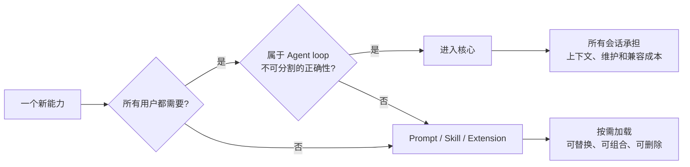
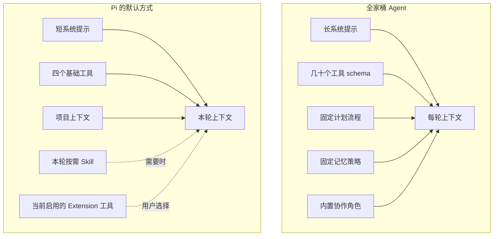
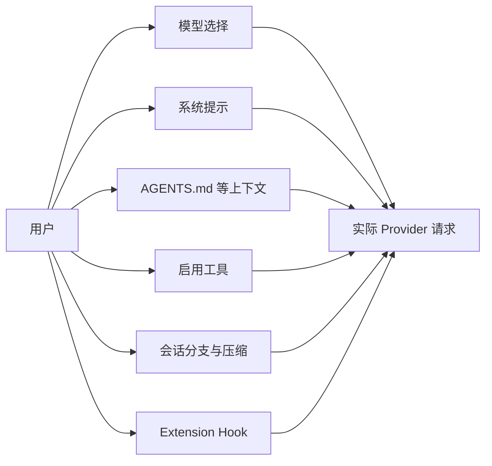
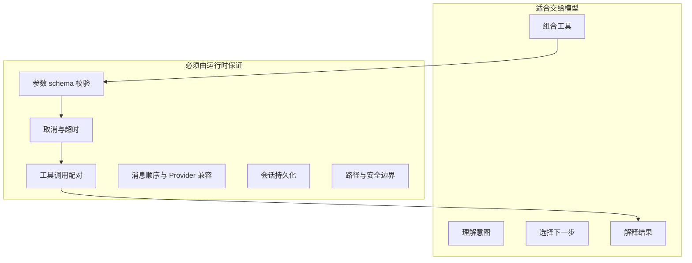
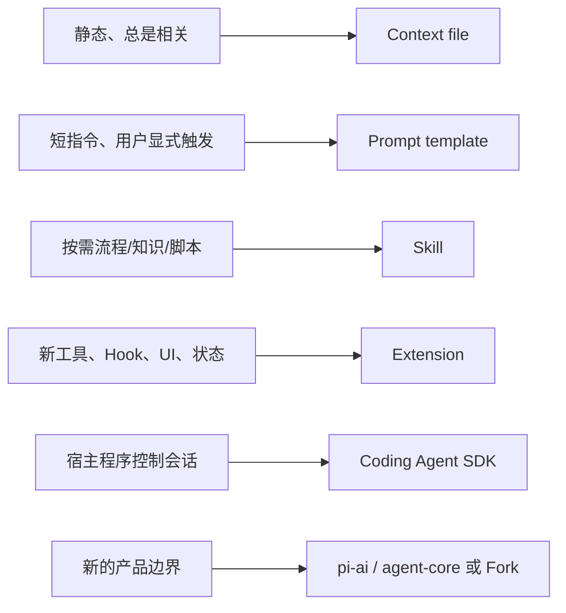
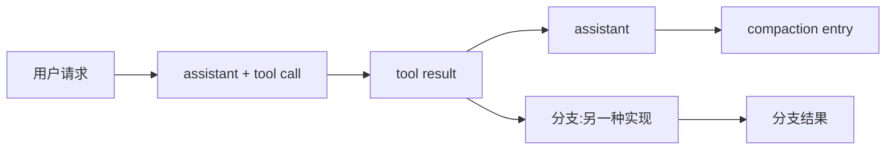
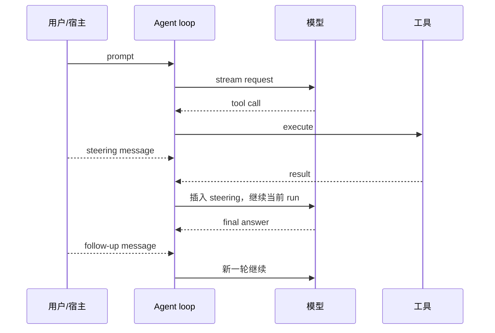
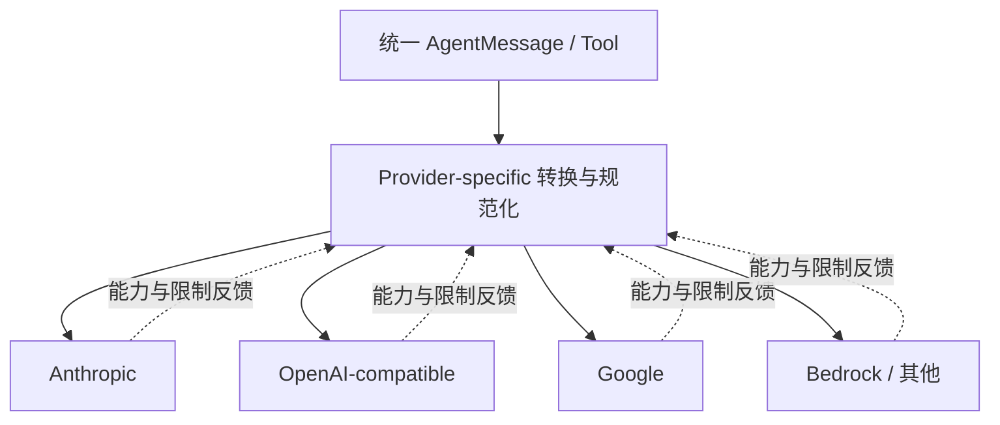
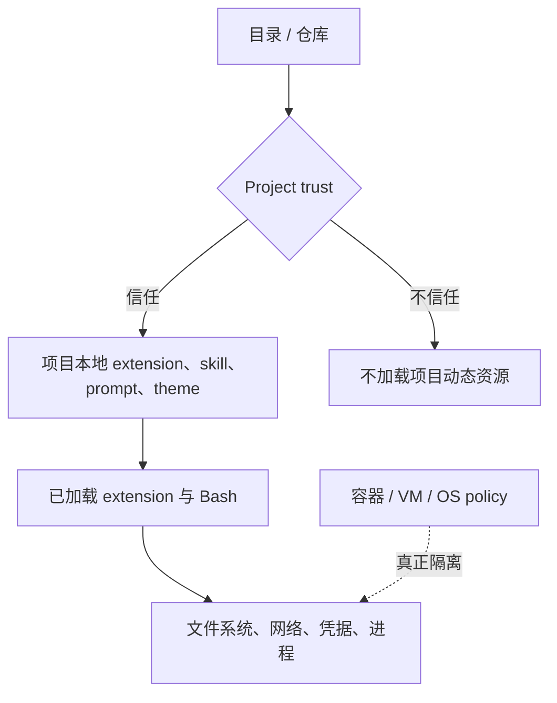

# 01 · 设计哲学：小核心不是少做功能，而是保留控制权

> 本篇回答：Pi 为什么刻意不做成“全家桶”，这种选择怎样影响上下文、模型能力、安全、可调试性和生态；哪些是收益，哪些只是被转移出去的成本。

## 1. 核心命题：Agent 的默认行为越多，使用者真正控制的越少

Pi 当前 README 的产品主张是：**让 Pi 适应你的工作流，而不是让你的工作流迁就 Pi。** 它默认提供读取、写入、编辑和 Bash 四类工具，不内置 MCP、plan mode、sub-agent 和权限弹窗。这不是在断言这些能力无用，而是在划分基座责任：

[设计解读] Pi 的最小主义不是“代码行数越少越好”，而是一个**默认成本审查机制**：任何内置能力都会成为所有用户的上下文、行为和兼容负担，所以应证明自己必须存在于核心。

作者在 2025 年的[设计复盘](https://mariozechner.at/posts/2025-11-30-pi-coding-agent/)中把最初原则概括为：不默认依赖 MCP，不附带 sub-agent，不内置 plan mode，不维护内部 todo，不在 Agent 内实现后台 Bash，也不塞入大量系统提示。0.81.1 已经演进出 compaction、并行工具执行和更完整生命周期，因此应把这段话理解为**初始方向**，而不是永远不增加机制的誓言。

## 2. 生活化类比：把 Agent 想成出差行李箱

一个“功能很多”的 Agent，常常在每次请求前替你装好所有东西：三双鞋、急救箱、露营炉、十本手册、二十个工具 schema。即使今天只去楼下开会，模型也要先翻过整只箱子。

这里的关键不是 token 账单本身，而是三种更隐蔽的影响：

- **注意力竞争**：工具和规则越多，模型越可能选错、忘记优先级，或在无关步骤上模仿提示中的模式。
- **行为先验**：内置 plan/sub-agent 不只是“可用功能”，也会诱导模型把简单问题仪式化。
- **缓存稳定性**：频繁变化的大 system prompt 和工具集合，会减少 Provider prompt cache 的命中机会。

代价同样真实：Pi 用户必须知道“该装什么”，团队还要维护自己的资源组合。开箱即用体验让位于可塑性。

## 3. 哲学一：上下文主权优先于功能展示

Agent 并不只由模型决定。更准确的表达是：

$$
\text{Observed behavior} = f(\text{model},\ \text{system prompt},\ \text{messages},\ \text{tools},\ \text{runtime policy})
$$

换模型却保留一个混乱的上下文，通常不会得到预期提升；反过来，收紧工具说明和上下文边界，往往会在同一模型上显著改善行为。

Pi 将控制面拆开：

### 好处

- 能准确解释“模型这一轮究竟看到了什么”。
- 可以为不同项目使用不同工具与规则，不让低频能力常驻。
- 可以比较模型、prompt 和工具的独立影响，调试不必靠玄学。
- 领域产品能重用同一 loop，却替换消息转换、工具和界面。

### Tradeoff

- 使用者需要理解上下文工程，而不是只开一个“智能模式”。
- 多个 extension 都能改 system prompt 或消息时，加载顺序会成为语义。
- 动态启停工具必须兼顾缓存、可发现性和扩展共存，不能粗暴覆盖全局集合。

## 4. 哲学二：相信强模型，把 Harness 复杂度放在边界

传统软件倾向把每一步决策写进代码；Agent 框架容易沿用这种直觉，增加 planner、router、critic、memory manager 和固定角色。Pi 的默认倾向相反：让模型做语义判断，运行时负责那些不能靠模型“尽量做好”的确定性边界。

这不是“模型会解决一切”。恰好相反：Pi 把确定性要求集中在 Harness：

- 模型可以决定用哪个工具，但 runtime 必须校验参数。
- 模型可以写计划，但用户批准前是否允许写文件必须由 tool gate 强制。
- 模型可以总结历史，但原始 session 和压缩边界必须可追溯。
- 模型可以请求并行调用，但 tool result 的配对、顺序和错误表示必须稳定。

### 好处

- 核心 loop 不绑死某一种认知流程，能跟随模型能力提升。
- 简单任务不会被多 Agent 编排和固定阶段拖慢。
- 失败路径更清楚：语义错误看 prompt/model，边界错误看 runtime。

### Tradeoff

- 弱模型或含糊工具说明下，默认行为可能不如强约束工作流稳定。
- 需要严格审批、合规步骤或领域状态机时，必须用 extension/上层产品补上。
- 少写 planner 代码不等于系统简单；复杂度转移到了消息规范化、错误、生命周期和恢复。

## 5. 哲学三：组合优于中心化配置

Pi 把定制能力分成不同重量级，而不是一个万能插件 API：

这种分层让每项能力只支付必要成本：一段团队规范不需要常驻运行时代码，一个只在发布时使用的流程不必每轮进入 context，一个真正需要拦截工具调用的安全策略也不应伪装成 prompt。

生活化类比：

- context file 像办公室墙上的长期规章；
- prompt template 像常用邮件模板；
- skill 像需要时从抽屉取出的作业手册和专用夹具；
- extension 像给车间安装一台新机器；
- SDK 像把整条生产线嵌进自己的工厂。

### 好处

- 删除一个能力时边界清晰，不必拆框架内部模块。
- 社区可以并行探索 MCP、sub-agent、plan、browser、voice 等不同方案。
- 同一 Pi 基座可以服务终端 Coding Agent、聊天机器人、自动化 worker 和远程控制面。

### Tradeoff

- 组合不是自动兼容。两个扩展可能抢同名工具、状态栏、快捷键或 system prompt 顺序。
- 缺少唯一“标准解”意味着生态会出现功能重叠和质量差异。
- 包在用户进程内执行；可组合性越强，供应链与权限风险越高。

## 6. 哲学四：状态必须可观察、可重放，而不是藏在内存里

Pi 的 session 是 append-only JSONL 树。用户消息、assistant 消息、工具结果、模型切换、thinking level、compaction、branch summary 和 extension custom entry 都可以成为有父子关系的 entry。

[设计解读] 这体现一种“可恢复优先”的状态观：真正的长期状态不是某个 extension 的变量，而是**当前分支上可重放的事实**。内存对象只是该事实的缓存。

这也是本仓库 Plan 和 Goal 在 `session_start` / `session_tree` 上从 branch 重建状态的原因。若只在内存里存 `planPhase`：

1. `/reload` 后状态丢失；
2. `/tree` 切到旧分支后状态仍来自新分支；
3. fork 会继承错误未来；
4. UI 看起来正常，实际 tool policy 已漂移。

### 好处

- 恢复、分支、导出和调试建立在同一事实源上。
- 扩展能持久化自己的状态而不改核心 session schema。
- 压缩可以改变“送入模型的投影”，却保留原始历史用于追溯。

### Tradeoff

- append-only 需要显式版本和 replay 逻辑，不能随意修改旧数据。
- custom entry 是不可信输入；升级后必须兼容或拒绝旧 payload。
- 分支让状态模型从列表变成树，简单的“取最后一条记录”可能跨错路径。

详见 [03 · 上下文、会话与记忆](03-context-and-sessions.md)。

## 7. 哲学五：流式、取消和纠偏是核心语义，不是 UI 糖衣

LLM 请求可能持续几十秒，工具可能运行数分钟。若系统只支持“请求 → 最终答案”，用户无法在方向错时及时纠偏，自动化系统也无法安全停止。

Pi Agent Core 区分两类中途消息：

- **steering** 在当前 run 的工具阶段之后尽快进入上下文，用来纠正正在进行的工作。
- **follow-up** 等当前 run 完整结束后再启动后续工作。
- `AbortSignal` 必须穿过 Provider、工具和子进程，才能真正取消，而不只是让 UI 停止显示。

### 好处

- 人可以在长任务中保持驾驶权。
- RPC/自动化宿主可以排队任务而不重造 loop。
- 事件流让 TUI、JSON 输出、日志和测试消费同一执行语义。

### Tradeoff

- 并发状态明显变复杂：abort、steer、tool completion 和 shutdown 可能竞态。
- “消息何时生效”必须有稳定定义，否则会出现幽灵指令或重复执行。
- extension 的命令若要改变运行状态，通常应先 abort 并等待 idle。

## 8. 哲学六：多 Provider 是协议翻译，不是假装所有模型相同

`pi-ai` 提供统一的流式接口、模型目录和消息类型，但不同 Provider 仍有真实差异：thinking block、tool call ID、缓存控制、图片、token 字段、错误语义和上下文限制。

好的抽象不是消灭差异，而是把共同部分统一、把不可统一部分显式留在边界。Pi 支持 extension 的 `context` Hook 和 `transformContext`，允许在 Provider 转换前修复自定义消息；`convertToLlm` 再决定哪些消息真正发给模型。

### 好处

- Agent loop 和上层产品不必为每个 Provider 重写。
- 用户可按任务、成本、延迟和能力切换模型。
- 领域 Agent 可以保留自定义内部消息，不污染 Provider 协议。

### Tradeoff

- “同一 prompt 跨模型完全等价”不成立。
- Provider 切换时历史中的 thinking/tool 结构需要兼容转换。
- 最小公分母抽象会丢能力；全能力抽象又会泄漏 Provider 细节。Pi 选择后者中较克制的一侧。

## 9. 哲学七：高权限本地工具带来真实能力，也要求诚实的安全边界

Pi 当前[安全文档](https://github.com/earendil-works/pi/blob/main/packages/coding-agent/docs/security.md)明确区分：

Project trust 防的是“进入未知目录就自动执行该目录的动态资源”。它**不是**：

- 工具逐次授权系统；
- Bash 沙箱；
- 网络隔离；
- 已安装第三方 extension 的权限边界。

Extension 与 Pi 进程同权限运行。一个权限确认插件可以减少误操作，却不能阻止恶意代码绕过自己。真正处理不可信仓库时，应把 Pi 整体放入容器、VM、micro-VM 或受限 OS 身份中。

### 好处

- Coding Agent 可以真正安装依赖、运行编译器、访问仓库和完成任务，而不是停留在模拟层。
- 权限模型不伪装成安全沙箱，部署者知道边界在哪里。
- 企业或远程执行产品可以在 Pi 外围选择符合自身威胁模型的隔离层。

### Tradeoff

- 默认本地能力强，误操作和 prompt injection 的后果也更真实。
- 第三方包审计是安装者责任；生态规模放大供应链风险。
- 安全不能只靠系统提示，必须在 Hook、路径解析、网络策略和外部沙箱分层落实。

## 10. 哲学八：为演进保留接口，而不是把第一版洁癖当教条

Pi 的历史变化很能说明这一点：

| 主题 | 早期设计 | 0.81.1 / 当前方向 | 不变的原则 |
| --- | --- | --- | --- |
| Compaction | 初版刻意没有 | 已支持自动/手动压缩、分支摘要、扩展自定义压缩 | 用户可见、会话可追溯 |
| Tool execution | 早期工具顺序执行 | Agent Core 默认支持并行，也可配置 sequential | loop 语义明确、result 配对稳定 |
| Tool result streaming | 最初追求极简，未做 | 当前工具可发 update，UI 可渐进显示 | 事件优先、长操作可观察 |
| 生命周期 | 早期事件较少 | 增加 `agent_settled` 等更可靠边界 | 扩展不应猜测运行状态 |
| 默认工作流 | 不内置 plan/sub-agent/MCP | 仍主要由 package 生态提供 | 不替所有用户固化流程 |

[设计解读] 真正稳定的是**决策准则**，不是功能清单。只要一个机制证明属于所有 Agent 的可靠边界，它可以进入核心；只适合某类工作流的能力则继续留在组合层。

## 11. 总体取舍矩阵

| 设计选择 | 直接收益 | 支付的成本 | 适合 | 不太适合 |
| --- | --- | --- | --- | --- |
| 最小默认 prompt/工具 | 上下文干净、行为可解释 | 需要自己装配能力 | 高自主模型、个性化工作流 | 追求零配置统一流程的团队 |
| 语义交给模型 | 少规则、能随模型升级 | 弱模型下稳定性降低 | 开放式研发、探索 | 强合规固定步骤 |
| Extension 进程内执行 | 能力极强、API 直接、低延迟 | 无故障/安全隔离 | 可信本地扩展 | 不可信多租户插件 |
| Append-only session tree | 可恢复、可分支、可审计 | replay/version 复杂 | 长会话、实验和调试 | 只需无状态问答 |
| 多 Provider 抽象 | 模型可替换 | 等价性有限、适配成本高 | 成本/能力动态选择 | 依赖单一厂商独占语义 |
| 外部沙箱 | 安全边界诚实、可按部署定制 | 运维与集成成本 | 企业、远程 worker、不可信代码 | 只靠内置确认追求“绝对安全” |
| 资源分层组合 | 可替换、生态创新快 | 发现、冲突、质量分散 | 会维护工具链的个人/团队 | 需要单一认证发行版 |

## 12. 什么时候应该选择 Pi 的思路

Pi 的设计尤其适合：

- 你希望清楚控制 system prompt、工具和会话，而不是接受隐藏策略；
- 你准备围绕强模型构建专用 Agent，但不想重写 Provider 与 tool loop；
- 你需要在终端、SDK、RPC 或聊天界面间复用同一运行时；
- 你愿意把 plan、memory、sub-agent、MCP 等视为可替换策略；
- 你能在外部提供与风险匹配的隔离和运维。

以下需求则可能需要在 Pi 上再建一层强约束产品，甚至选择别的基座：

- 所有用户必须遵循不可绕过、集中治理的固定工作流；
- 第三方插件需要真正的进程/租户隔离；
- 需要开箱即用的企业管理面、审计平台和权限中心；
- 团队不愿维护资源组合，只想采用单一官方范式。

这里没有“极简一定更高级”的结论。Pi 的选择是：**宁可让高级能力显式组合，也不让默认复杂度悄悄替用户做决定。** 它换来的不是免费简洁，而是一份更清楚的责任清单。

## 参考资料

- [Pi Coding Agent README](https://github.com/earendil-works/pi/tree/main/packages/coding-agent)
- [Mario Zechner：What I learned building an opinionated and minimal coding agent](https://mariozechner.at/posts/2025-11-30-pi-coding-agent/)
- [Pi Agent Core README](https://github.com/earendil-works/pi/tree/main/packages/agent)
- [Pi Security](https://github.com/earendil-works/pi/blob/main/packages/coding-agent/docs/security.md)
- [Pi Packages：扩展具有完整系统权限](https://github.com/earendil-works/pi/blob/main/packages/coding-agent/docs/packages.md)
- [下一篇：运行时分层与 Agent Loop](02-runtime-architecture.md)
