# 02 · 运行时分层与 Agent Loop：循环很小，边界很厚

> 本篇回答：Pi 的四个主要 package 怎样分工；一次请求怎样穿过消息转换、流式响应、工具执行、steering、follow-up、retry 和 compaction；这些边界为什么不能都塞进一个“万能 Agent 类”。

## 1. 四层不是目录美学，而是四种复用尺度

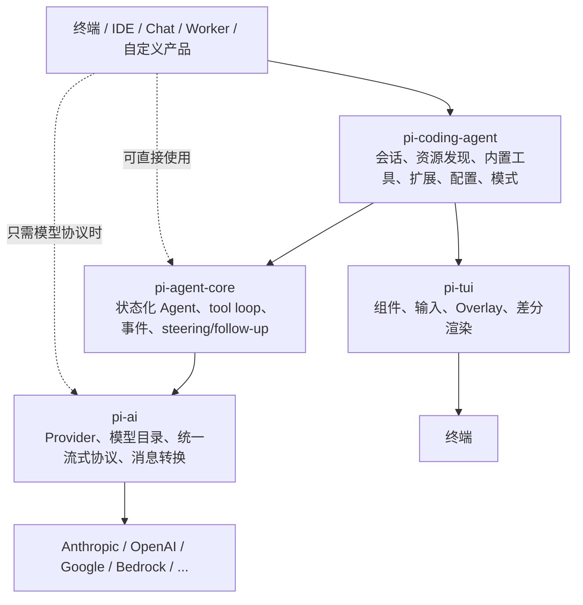

| 层 | 它负责保证什么 | 它刻意不知道什么 |
| --- | --- | --- |
| `pi-ai` | Provider 请求、流式事件、模型能力/用量、消息与工具协议 | session、TUI、项目文件、extension |
| `pi-agent-core` | Agent 状态、turn/tool loop、消息队列、取消、事件流 | JSONL session、资源发现、具体 Coding 工具 |
| `pi-coding-agent` | Coding 产品语义：会话树、压缩、配置、资源、extension、四种运行模式 | 具体宿主产品的业务 UI/权限中心 |
| `pi-tui` | 终端组件、键盘输入、overlay、宽度约束、无闪烁更新 | Agent 或 session 的业务含义 |

### 为什么不合并

如果 Provider 适配直接读项目配置，任何聊天机器人都要携带 Coding Agent；如果 core 直接写 JSONL，会话后端就无法替换；如果 TUI 组件知道 Plan 状态，它就不再是通用终端库。

[设计解读] 分层的价值不是“每层都纯粹”，而是允许三个不同选择：

1. 只借 `pi-ai` 构建完全不同的推理程序；
2. 借 `pi-agent-core` 复用可靠 tool loop；
3. 借 Coding Agent SDK 或 extension 复用完整 Harness。

代价是跨层概念较多：`Message`、`AgentMessage`、session entry、extension event 并不完全相同，开发者需要知道当前位于哪一层。

## 2. 最小 Agent Loop

去掉流式、错误、Hook 和队列后，循环只有四步：

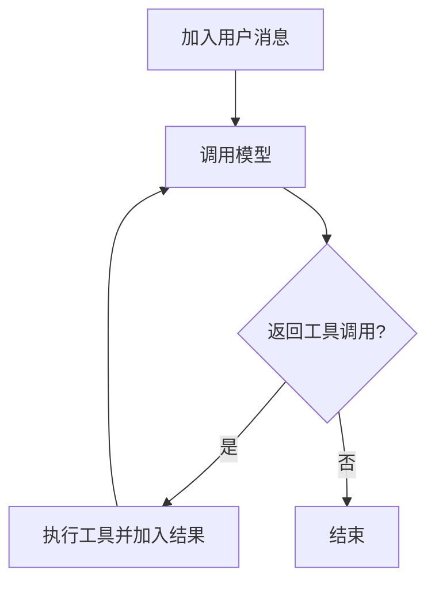

真正的实现之所以长，是因为每条箭头都必须回答边界问题：

- 模型响应流到一半被取消，历史保存什么？
- 工具参数能解析但被 token limit 截断，是否执行？
- 一条 assistant message 有多个 tool call，顺序还是并行？
- 用户在工具运行时发来纠偏，何时插入？
- 自定义内部消息怎样转换成 Provider 能接受的 role？
- API 失败后自动 retry，`agent_end` 算不算真正结束？

Pi 的复杂度主要在这些确定性问题，而不是再实现一个隐藏 planner。

## 3. 一次完整请求的时序

下面把 `pi-coding-agent` 的扩展生命周期与 core loop 放在一起。事件名以 0.81.1 Extension API 为准。

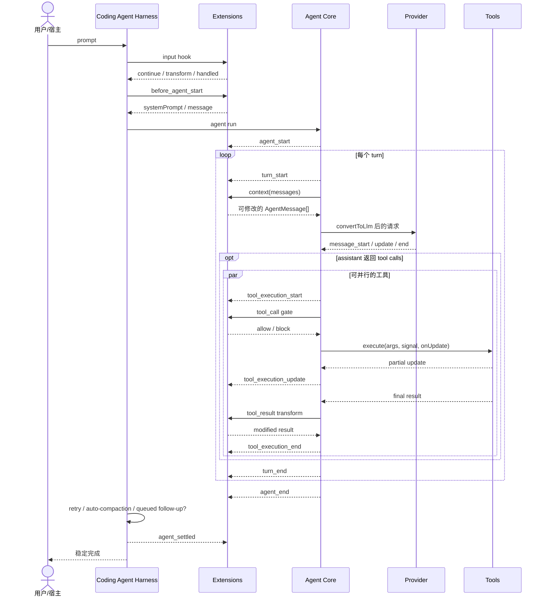

注意三个容易混淆的边界：

- `turn_end`：一条 assistant 响应及其工具结果完成。
- `agent_end`：一次底层 core run 完成；上层仍可能自动 retry、compact 后 retry，或处理 follow-up。
- `agent_settled`：Coding Agent 确认没有自动后续动作，适合 Goal、状态栏、清理和“真正空闲”判断。

本仓库 Goal 选择 `agent_settled` 排队 continuation，正是为了避免在自动 compaction/retry 尚未结束时启动重叠 run。

## 4. 双循环：工具链与后续消息不是同一队列

当前 [agent-loop.ts](https://github.com/earendil-works/pi/blob/main/packages/agent/src/agent-loop.ts) 是一个内外双循环：

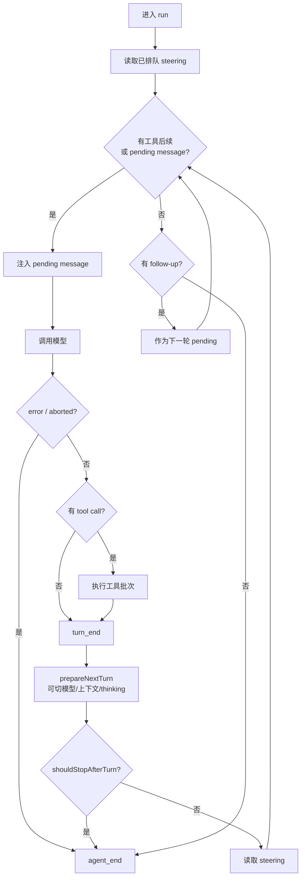

### Steering 与 follow-up 的语义差异

| 队列 | 何时读取 | 目的 | 例子 |
| --- | --- | --- | --- |
| steering | run 开始及每个 turn 结束后 | 尽快改变当前方向 | “先别改数据库，先确认调用方” |
| follow-up | Agent 原本要停止时 | 当前请求完成后继续 | “完成后再跑一次性能对比” |

两者均支持 `one-at-a-time` 或 `all` 投递模式。拆成两类的好处是语义稳定：用户无需用“消息排队顺序”猜它会打断当前推理还是启动下一项工作。代价是宿主 UI 和 RPC 必须让调用方明确选择。

## 5. 消息转换：内部状态可以丰富，Provider 输入必须收敛

Agent Core 全程使用 `AgentMessage`，只在调用模型前转换成 `pi-ai` 的 `Message[]`：

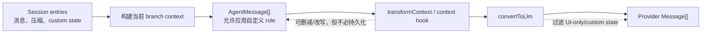

这条边界解决了一个常见矛盾：应用需要保存比 Provider 协议更丰富的状态，但 Provider 只接受有限 role 和 block 类型。

例如一个 Review UI 可以保存结构化审阅结果：

```ts
type ReviewMessage = {
  role: "review";
  decision: "approve" | "reject";
  comments: string[];
};
```

它可以存在于应用/session 中；`convertToLlm` 决定把它转成一条用户文本、摘要，或完全过滤。无需欺骗类型系统，把所有状态硬塞成 user message。

### 两阶段转换的 Tradeoff

- `transformContext` 适合临时裁剪、缓存提示和扩展协作；结果不自动成为 session 事实。
- `convertToLlm` 是 Provider 前的最终协议边界；若最后一条内部消息被过滤成空，Provider 可能拒绝 continuation。
- 多个 extension 的 `context` handler 按注册顺序串联，后者看到前者结果。组合能力强，但顺序就是行为，必须避免两个扩展互相“纠正”同一消息。

## 6. 流式响应：事件是事实，UI 只是订阅者

模型不会直接返回完整 assistant message。Core 先把 partial message 放入当前 context，再随 Provider delta 替换它并发事件：

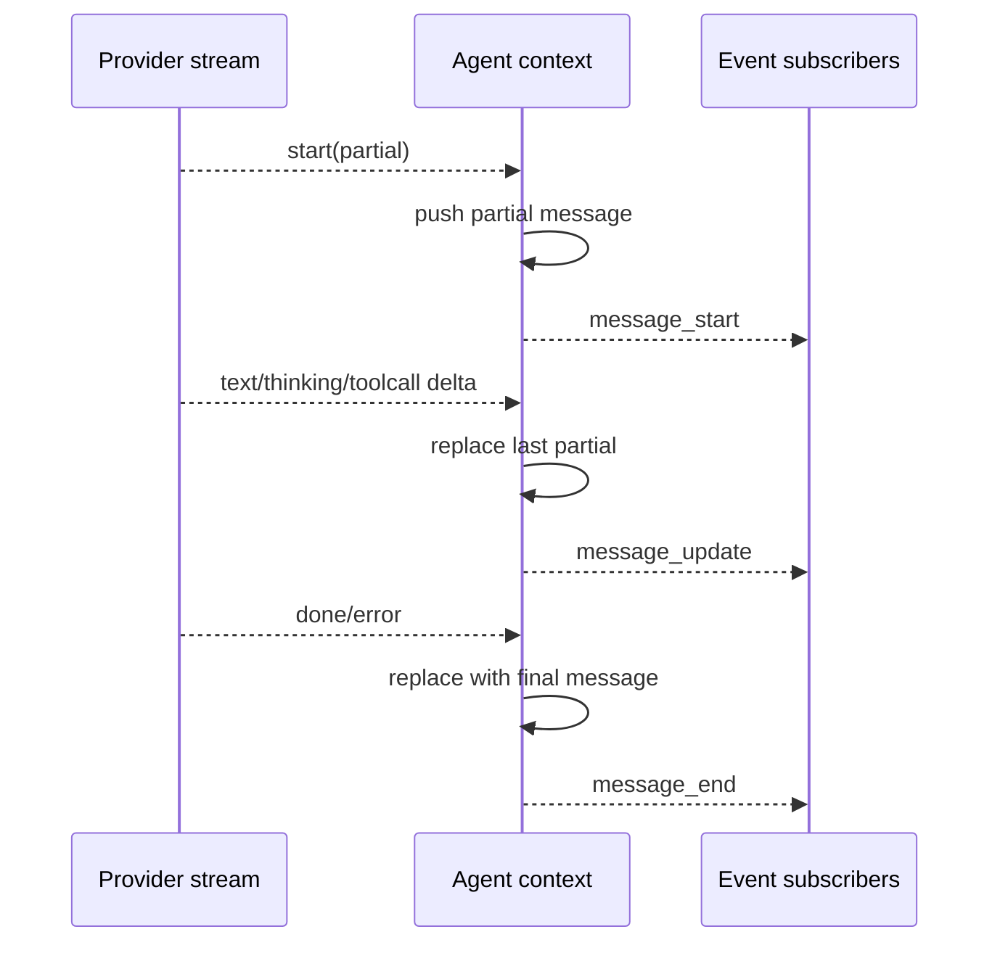

因此同一事件流可以驱动：

- TUI 的实时文本与 thinking 展示；
- JSON mode 的机器可读输出；
- RPC 客户端；
- 测试和遥测；
- extension 的状态/UI 更新。

[设计解读] “流式优先”不是显示效果，而是把长操作建模为可观察状态机。若运行时只在末尾返回 Promise，取消、进度、工具输出和远程 UI 都只能另造旁路协议。

### TUI 为什么独立成包

`pi-tui` 使用三种渲染策略：首次输出保留 scrollback；宽度变化或视口上方变化时全量重绘；普通更新只从首个变化行重绘到末尾。更新包在 CSI 2026 synchronized output 中，减少闪烁。

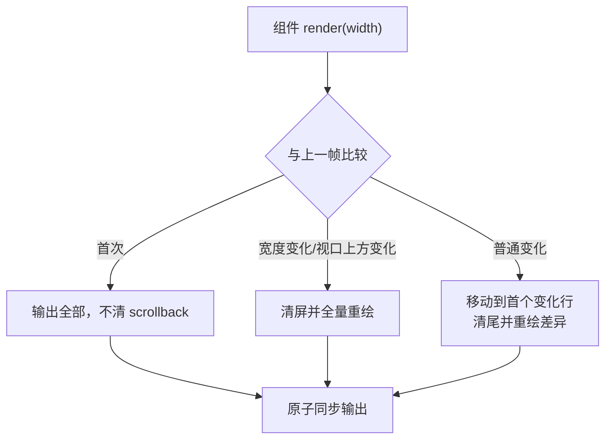

Tradeoff：组件必须严格保证每行不超过给定 width；复杂 overlay、窄终端和输入焦点都需要显式处理。换来的则是 Agent 事件与终端绘制解耦，Headless 模式无需加载一套假 UI。

## 7. 工具执行：并行完成，但保持模型可理解的顺序

一条 assistant message 可以包含多个 tool call。当前 Core 默认允许并行；全局可设 sequential，单个工具也可声明 `executionMode: "sequential"`。批次里只要存在 sequential 工具，整个批次顺序执行。

并行模式有意区分四种顺序：

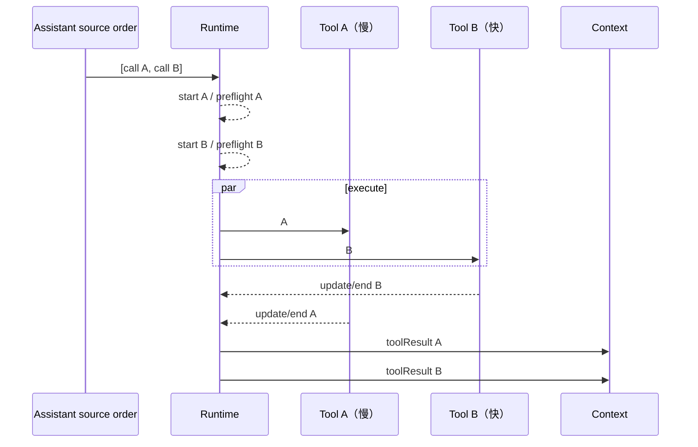

| 事件/数据 | 顺序 |
| --- | --- |
| `tool_execution_start` 与 preflight | assistant 源码顺序 |
| `tool_execution_update` | 可交错 |
| `tool_execution_end` | 实际完成顺序 |
| 最终 tool result message | assistant 源码顺序 |

为什么不让结果按完成顺序进入模型？因为 tool call 与 result 是对话协议的一部分，稳定的源顺序更容易满足 Provider 配对要求，也让同一 assistant message 的语义不受网络/磁盘时序随机影响。

为什么 `end` 又按完成顺序发？因为 UI 和监控应该立即知道快工具已完成，不必等慢工具。

### Preflight、执行、finalize 三段式

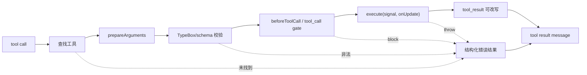

工具失败通常被转换成 `isError` tool result，而不是让整个 loop 因异常消失。模型能看到错误并修正参数或选择替代方案。

一个细节体现了运行时边界意识：若 assistant 因 output token limit 以 `stopReason: "length"` 结束，Core **不会执行其中任何 tool call**。流式 JSON 修复可能让被截断参数“刚好可解析且通过 schema”，执行它会把残缺意图变成真实副作用；安全做法是全部返回错误，让模型重发完整调用。

### 并行的 Tradeoff

- 读取两个独立文件时，并行直接降低延迟。
- 两个写工具可能修改同一文件，完成顺序不代表语义顺序；应声明 sequential 或由上层避免同批冲突。
- `Promise.all` 保留最终数组顺序，但每个工具的副作用仍真实并发；“结果有序”不等于“执行隔离”。
- abort 后已进入不可取消系统调用的工具可能仍完成，因此工具自身必须传播 signal 并清理子进程。

## 8. Turn 边界是安全的重新配置点

每个 `turn_end` 后，Core 可调用 `prepareNextTurn`，原子地替换下一 turn 使用的 context、model 和 thinking level；还可用 `shouldStopAfterTurn` 强制结束。

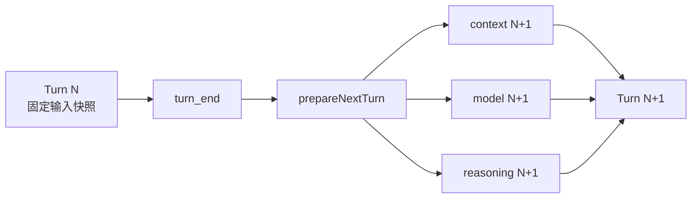

这比在 Provider stream 中途修改全局变量可靠：当前请求的工具 schema、模型和上下文保持一致，变化从下一 turn 生效。

适用场景：

- 预算接近上限时切换便宜模型；
- 工具阶段完成后加入压缩上下文；
- 某个领域状态变化后更换 system/tool set；
- 每 turn 执行外部策略检查。

Tradeoff：如果上层改变了工具集合，却没有同步 system prompt 中的说明，下一 turn 会收到自相矛盾的上下文。快照边界提供时序正确性，不替调用者保证语义一致。

## 9. Coding Harness 在 Core 之外补上的机制

Core 只负责一次状态化运行。`pi-coding-agent` 再组合：

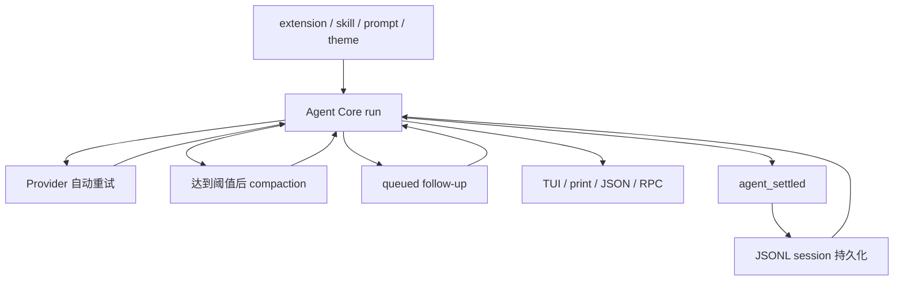

这解释了为什么 extension 不应把 `agent_end` 当成“用户任务彻底结束”。Core 不知道上层是否会自动压缩或续跑；Harness 才能发出 `agent_settled`。

## 10. 一个实践链路：安全重命名导出符号

以“重命名 TypeScript 导出函数”为例：

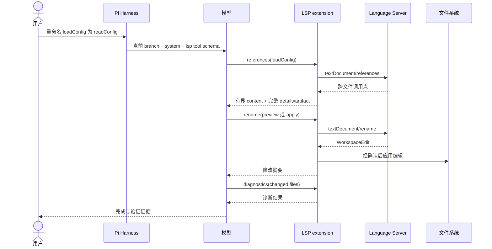

这里每层只做自己擅长的事：模型判断目标，LSP 提供语义，Server 保证引用解析，Extension 约束路径和输出，Harness 保证取消/会话，用户仍能 steering。若把所有能力写成一条超级 prompt，任何一层失败都难以定位。

## 11. 选择哪个运行层

| 需求 | 推荐入口 | 原因 | 主要代价 |
| --- | --- | --- | --- |
| 只统一调用多个模型 | `pi-ai` | 不携带 Agent/session 语义 | tool loop 自己实现 |
| 自定义领域 Agent loop | `pi-agent-core` + `pi-ai` | 复用事件、工具、队列 | session/UI/资源自己组合 |
| 在现有 Pi 增加能力 | Extension | 最短路径，复用完整 Harness | 与 Pi 同进程、受生命周期约束 |
| 在应用中嵌入 Pi 会话 | Coding Agent SDK | 复用 session、工具、扩展 | 需管理宿主与资源边界 |
| 终端之外远程控制 | RPC mode | 事件/命令协议现成 | 连接、鉴权和隔离由外层负责 |
| 产品长期改变核心语义 | fork 或内化 package | 可以重设产品边界 | 跟进上游成本最高 |

## 12. 本篇结论

Pi 的 Agent loop 可以画成四个框，但可生产运行时需要处理：

- 内部消息到 Provider 消息的单向收敛；
- partial message 的可观察流；
- 工具参数、门禁、错误和并发顺序；
- steering 与 follow-up 的确定语义；
- turn、core run 与 settled 的不同完成边界；
- 上层 retry、compaction、session 和资源生命周期。

因此“小核心”不等于“简单实现”。它意味着：**认知流程保持开放，协议和生命周期边界做厚。**

## 参考资料

- [Agent Core README](https://github.com/earendil-works/pi/tree/main/packages/agent)
- [Agent loop source](https://github.com/earendil-works/pi/blob/main/packages/agent/src/agent-loop.ts)
- [Extension lifecycle](https://github.com/earendil-works/pi/blob/main/packages/coding-agent/docs/extensions.md)
- [Coding Agent SDK](https://github.com/earendil-works/pi/blob/main/packages/coding-agent/docs/sdk.md)
- [JSON mode](https://github.com/earendil-works/pi/blob/main/packages/coding-agent/docs/json.md)
- [RPC mode](https://github.com/earendil-works/pi/blob/main/packages/coding-agent/docs/rpc.md)
- [pi-tui README](https://github.com/earendil-works/pi/tree/main/packages/tui)
- [上一篇：设计哲学](01-philosophy.md) · [下一篇：上下文、会话与记忆](03-context-and-sessions.md)
