# 03 · 上下文、会话与记忆：完整事实与有损投影

> 本篇回答：模型真正看到什么；session 为什么是树而不是聊天数组；compaction 为什么保留历史却仍会丢语义；extension 状态、tool `details` 和 artifact 应放在哪里。

## 1. 先拆开三个经常混用的词

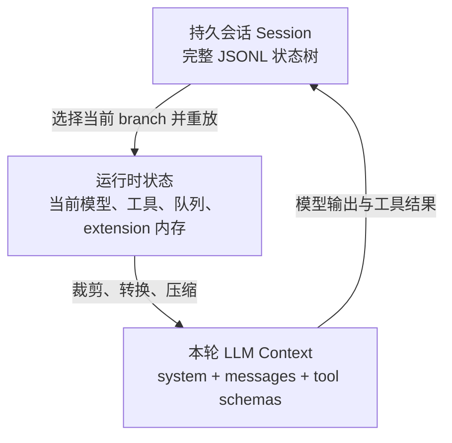

| 层 | 是否完整 | 生命周期 | 典型内容 |
| --- | --- | --- | --- |
| Session | 尽可能完整、append-only | 跨重启 | 消息、模型切换、压缩、branch summary、custom entry |
| Runtime state | 当前有效投影 | 当前进程/session | active tools、steering queue、LSP client、Plan phase |
| LLM context | 为本轮有损选择 | 单次 Provider 请求 | system prompt、转换后的 branch messages、tool schema |

最重要的结论：**存在于 session 中，不等于发送给模型；当前模型看见，不等于已经持久化。**

生活化类比：session 是项目完整账本，runtime 是今天办公桌上的材料，LLM context 是带进这场会议的一页 briefing。账本可以追责，briefing 必须精简；不能因为 briefing 写了“已经批准”就假装账本里真有批准记录。

## 2. 一次 Provider 请求的上下文从哪里来

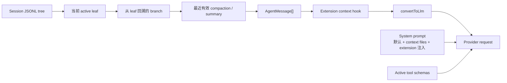

最终请求至少由三块组成：

1. **system prompt**：基础行为、项目上下文、按需能力和 extension 注入；
2. **messages**：当前 branch 经 compaction、Hook 与 Provider 转换后的消息；
3. **tools**：本轮启用工具的名称、描述与参数 schema。

Tool schema 也占上下文。注册 100 个工具但只用 2 个，成本不仅是 token：模型还要在 100 个相似选项中做分类。因此 Pi 的 package 生态常用少量搜索/加载器，再按需激活领域工具。

## 3. 两条内容通道：给模型的 `content`，给系统的 `details`

一个 tool result 可以同时承载模型可读内容与机器可读细节：

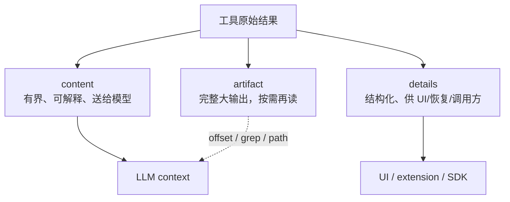

例如 LSP `references` 找到 10,000 个位置：

- `content`：前 100 个位置、总数、截断说明和继续读取方法；
- `details`：action、server、统计、完整输出路径等稳定字段；
- artifact：完整文本，模型只有需要时才按范围读取。

### 为什么不能只返回完整 JSON

- 大结果会在后续每个 turn 重复占上下文；
- 机器字段、绝对路径和 UI metadata 会分散模型注意力；
- Provider context window 有硬上限，单次工具输出可以挤掉用户早期约束；
- 有些 details 含内部数据，不应自动进入提示。

### 为什么不能只截断

静默截断会让模型把“不完整”误认成“全部”。所有有界输出都应明确：

```text
显示 100 / 10,000 项；完整输出：<path>；可从 offset=100 继续。
```

[设计解读] `content/details/artifact` 是一种三级记忆：热数据直接进上下文，结构化状态留给系统，冷数据按需换入。

## 4. Session 是 append-only 树

Session 文件为 JSONL。首行是 header；其余 entry 通过 `id` / `parentId` 形成树，当前位置是 active leaf。

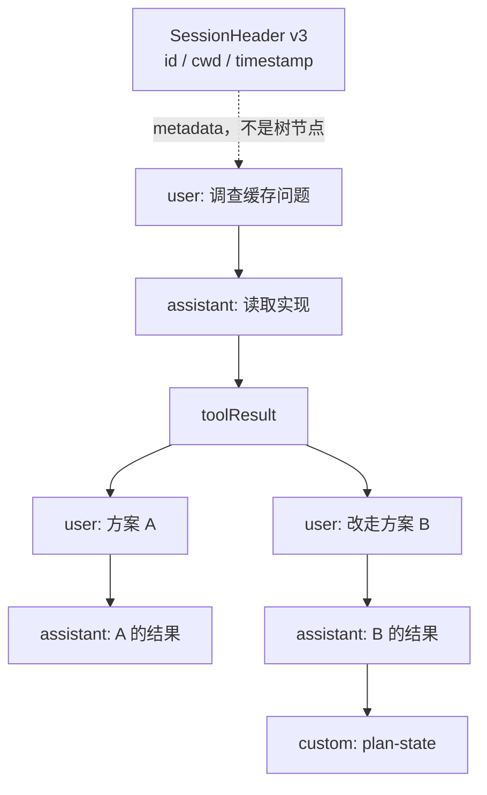

它与“消息数组”的区别：

- 切换分支不复制整个文件；新 entry 只指向选定 parent；
- 原路径仍存在，可以回去比较；
- model change、thinking level、compaction 和 extension state 与消息处在同一时序树中；
- “当前状态”由 active leaf 的祖先链决定，不由文件最后一行决定。

### Entry 类别

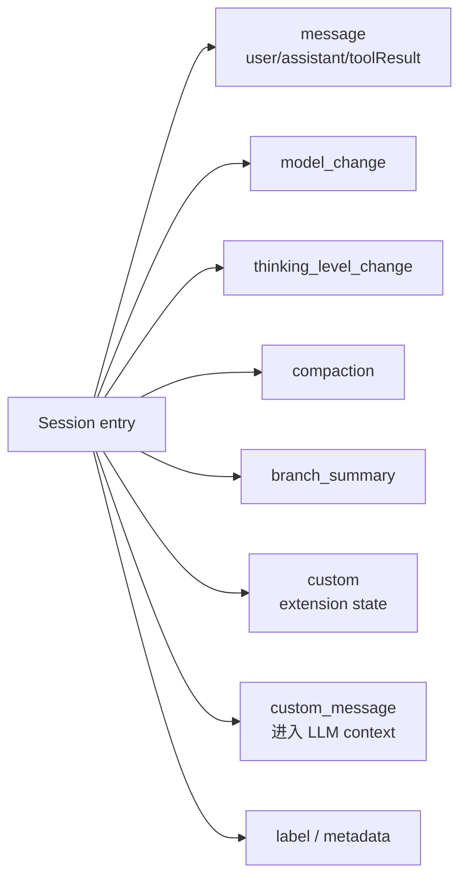

当前格式为 v3；旧线性 v1 和树形 v2 在加载时迁移。Extension 自己的数据仍需独立版本，因为 session schema 升级不会自动理解第三方 payload。

## 5. 分支不是复制会话，而是改变“现在”的定义

`/tree` 选择节点时：

- 选择 user/custom message：leaf 移到该消息的 parent，并把文本放回编辑器，修改后创建新分支；
- 选择 assistant/tool/compaction 等：leaf 直接移到该 entry，之后从那里继续；
- `/fork`：从早期用户消息创建新 session 文件；
- `/clone`：复制当前 active branch 到新 session 文件。

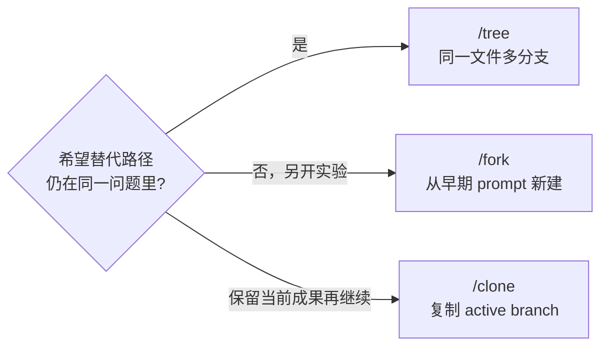

### Branch summary 解决什么

从 A 分支跳到 B 分支时，B 的祖先链天然不包含 A 的工作。Pi 可以总结离开的分支，把重要发现附加到新位置：

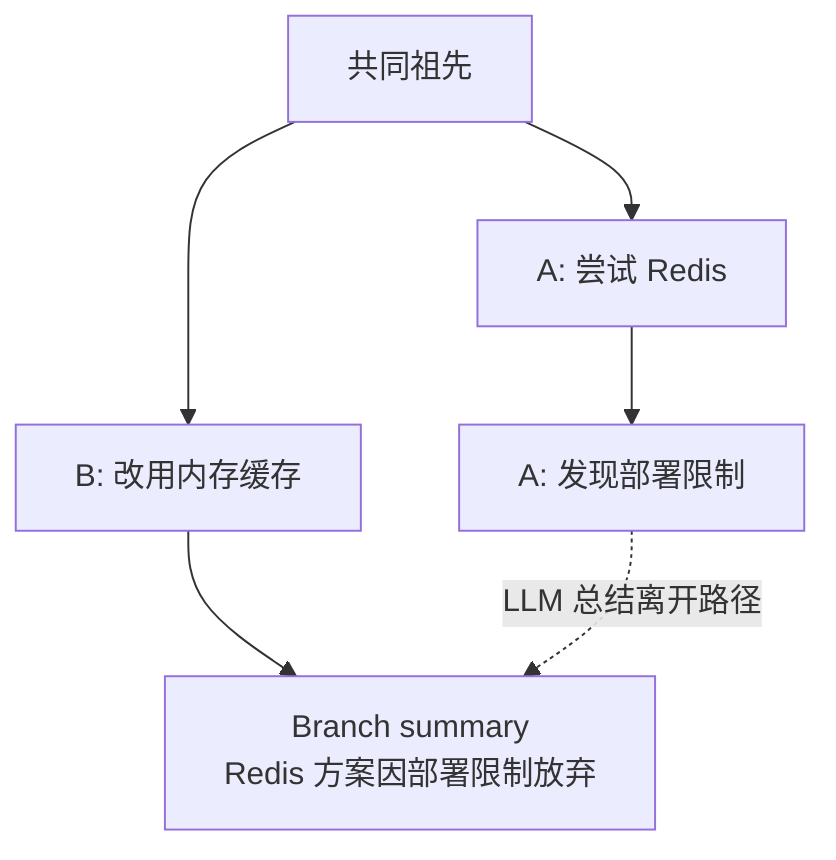

Tradeoff：summary 把跨分支经验带回来，也可能把 A 的假设误写成事实。关键约束和失败证据仍应在用户可查的原 branch 或外部 artifact 中保留。

## 6. Extension 持久状态：事件日志，而不是内存快照幻觉

### 两种 custom 数据完全不同

| API/entry | 进入 LLM context | 用途 |
| --- | --- | --- |
| `appendEntry(customType, data)` / `custom` | 否 | 状态 journal、checkpoint、协议数据 |
| `appendCustomMessage(...)` / `custom_message` | 是 | 真正需要模型看到的上下文 |

不要用隐藏 custom entry 保存一条必须影响模型判断的约束；也不要用 custom message 保存只供 UI 的计数器。

### Branch-aware replay 模型

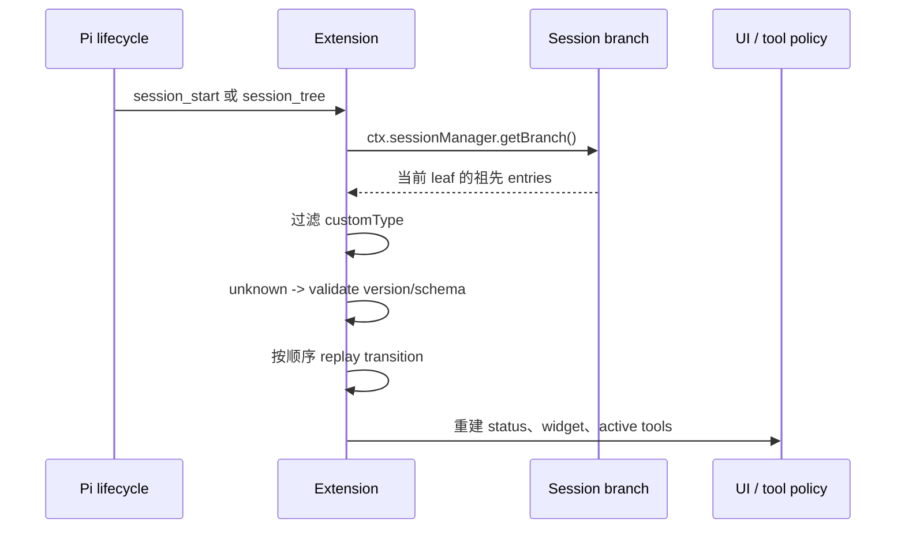

推荐写成版本化 journal：

```ts
type CounterEntry = {
  version: 1;
  action: "increment" | "reset";
  value: number;
};

function decodeCounterEntry(value: unknown): CounterEntry | undefined {
  if (!value || typeof value !== "object") return undefined;
  const data = value as Record<string, unknown>;
  if (data.version !== 1) return undefined;
  if (data.action !== "increment" && data.action !== "reset") return undefined;
  if (!Number.isFinite(data.value)) return undefined;
  return data as CounterEntry;
}
```

读取时必须把 payload 当 `unknown`：session 可能来自旧版本、手工编辑、另一台机器或损坏文件。

### 本仓库的 Plan / Goal / Todo 实践

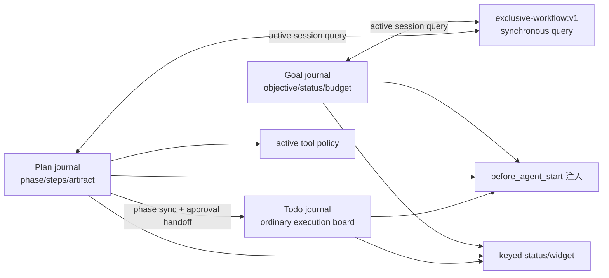

Plan 与 Goal 生产代码不互相 import，而是各自定义并验证版本化互斥 query；session 切 branch 后各自 replay journal，后续启动命令同步读取对方当前 session 的 live state。Todo 是 Plan 的声明依赖：Plan restore 时直接同步 phase，批准时把步骤一次性提交为普通 Todo tasks，之后 Plan 关闭。三者都必须用 coexistence test 防止协议、加载顺序和 branch identity 漂移。

## 7. Compaction：不删账本，只替换给模型的历史投影

自动压缩条件为：

$$
\text{contextTokens} > \text{contextWindow} - \text{reserveTokens}
$$

0.81.1 文档默认 `reserveTokens = 16384`，近期保留预算 `keepRecentTokens = 20000`，均可配置。手动 `/compact [instructions]` 也可触发。

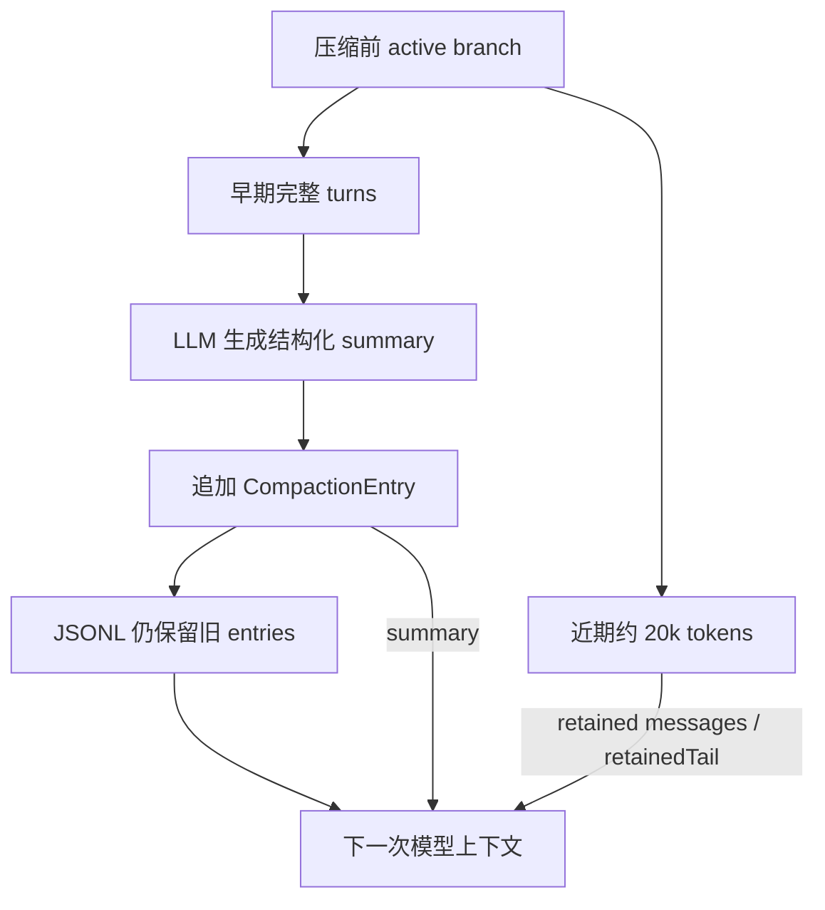

### 默认步骤

1. 从最新消息向前估算，找到保留近期内容的 cut point；
2. 收集上次保留边界到本次 cut point 之间的消息；
3. 若已有 summary，把它作为迭代上下文一起总结；
4. 追加 `CompactionEntry`，记录 summary、`tokensBefore`、用量与保留边界；
5. 重建 context 为 `system + compaction summary + retained tail`。

兼容旧 session 时使用 `firstKeptEntryId` 回到树上找保留消息；较新的 Harness 会把 `retainedTail` 直接物化到 compaction entry，形成自足 checkpoint，不必再遍历压缩点之前的旧 entry。

### 为什么尽量在 turn 边界切

一个 tool result 必须与发起它的 assistant tool call 配对。若 cut point 落在孤立 tool result 上，Provider 会看到无来源结果。

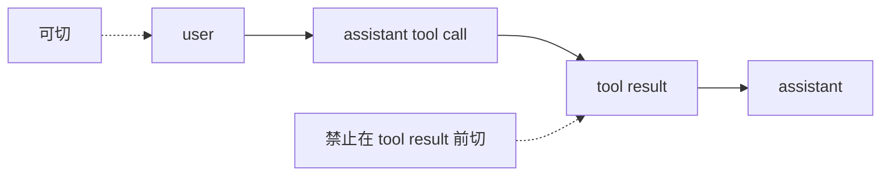

当单个 turn 自身超过 `keepRecentTokens`，Pi 才进行 split-turn：分别总结历史和这个超长 turn 的前缀，再合并。它仍不会把 tool result 与调用拆开。

### Summary 的结构化目标

默认摘要显式保留：Goal、约束、进度、阻塞、关键决策、下一步、关键上下文，以及累计读/改文件列表。工具输出在发给 summarizer 前截到 2,000 字符，避免“为了压缩而再次溢出”。

### Compaction 的不可消除损失

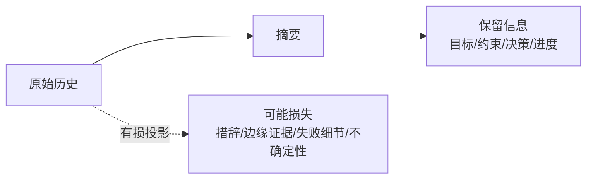

- 摘要模型可能把假设升级成结论；
- 一次遗漏会在后续迭代摘要中被永久放大；
- 工具原始输出被截断，细节不可能全进 summary；
- summary 质量受生成模型和自定义 focus 指令影响。

所以 compaction 是 context 管理，不是可靠知识库。长期不变的接口、验收标准和安全约束应放在仓库文档/代码/测试等外部事实源；大型调查输出应落 artifact；重要状态应有结构化 custom entry。

## 8. 四种“记忆”应各司其职

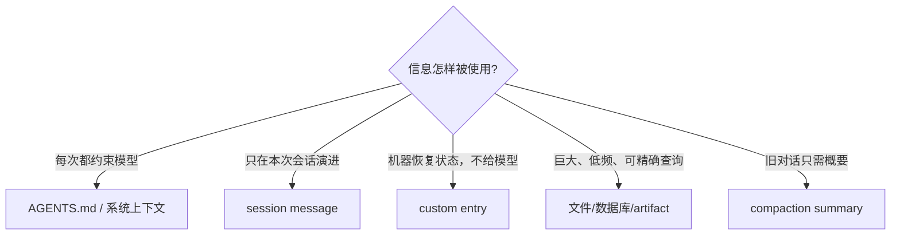

| 信息 | 正确位置 | 反例 |
| --- | --- | --- |
| “本项目禁止修改生成文件” | 受版本控制的 context file | 只在第一个 user message 提一次 |
| 用户本轮偏好 | session user/custom message | 写进全局配置永久生效 |
| Plan 当前步骤 | versioned custom entry，并按需注入 prompt | 只存模块变量 |
| 10 MB 搜索结果 | artifact + 有界 content 索引 | 全量 tool result |
| 旧轮次进展 | compaction summary | 每次重新回放所有输出 |
| 结构化审批证据 | journal/details | 靠摘要中的自然语言“已批准” |

## 9. Context budget 的实战分配

可把一次请求粗略看成：

$$
B_{total} = B_{system} + B_{tools} + B_{history} + B_{current} + B_{output\ reserve}
$$

设计目标不是把每项都压到最小，而是让高价值信息优先：


推荐策略：

- system prompt 写稳定行为，不复制工具 schema 已能表达的参数细节；
- Skill 只在匹配任务时载入，reference 再按需读；
- 工具先返回摘要、计数和继续检索句柄；
- 大结果以 artifact 保存，明确生命周期和清理；
- 动态工具只启用当前领域，但避免每 turn 无意义抖动；
- compaction 前把验收条件、已做决策和未解决风险写成清楚事实；
- 任何“必须精确恢复”的状态不要只靠自然语言摘要。

## 10. 常见失败与根因

| 症状 | 根因 | 修正 |
| --- | --- | --- |
| reload 后 UI 还在，门禁状态丢了 | UI/内存被当作事实源 | 从 current branch custom entries replay |
| 切回旧 branch 仍执行新计划 | 读取文件最后 entry，而非祖先链 | 只重建 active branch |
| 模型不知道 details 中的重要错误 | 把机器数据误当模型内容 | 在有界 `content` 中给可行动摘要 |
| 每轮 prompt 越来越大 | extension 反复注入同一上下文 | 使用稳定 system 片段/去重/按需 skill |
| 压缩后忘记关键限制 | 限制只存在于旧对话 | 固化到 context file 或结构化状态并重注入 |
| Tool result 截断后模型以为搜索完了 | 缺少截断标记和 continuation | 返回 `shown/total` 与读取句柄 |
| fork 后恢复另一个 session 的资源 | 长生命周期对象未按 cwd/session 重建 | `session_start/tree/shutdown` 绑定资源 |
| Custom entry 升级后崩溃 | 直接类型断言旧 payload | unknown 边界 + versioned decoder |

## 11. 自定义压缩的边界

Extension 可在 `session_before_compact`：

- 取消；
- 用其他模型生成 summary；
- 返回自定义 `details`；
- 读取完整 branch entries 以保留领域状态。

也可在 `session_before_tree` 自定义 branch summary 或阻止导航。

但 Hook 必须保持 Harness 的基本不变量：正确保留边界、tool call/result 配对、`tokensBefore`、可序列化 details、AbortSignal。自定义 summary 不是绕过 context 上限的魔法；它只是改变有损编码器。

## 12. 本篇结论

Pi 的记忆设计可以浓缩为一句话：

> **Session 保存可重放事实，context 保存当前需要，compaction 在两者之间做显式的有损投影。**

这套设计的好处是分支、恢复、压缩和 extension 状态共享一棵树；代价是开发者必须认真处理版本、branch、replay 和“谁能看见什么”。一旦把 session、runtime 和 context 混为一谈，长期 Agent 就会在 reload、fork 或 compaction 后出现最难排查的状态漂移。

## 参考资料

- [Session format](https://github.com/earendil-works/pi/blob/main/packages/coding-agent/docs/session-format.md)
- [Sessions](https://github.com/earendil-works/pi/blob/main/packages/coding-agent/docs/sessions.md)
- [Compaction and branch summarization](https://github.com/earendil-works/pi/blob/main/packages/coding-agent/docs/compaction.md)
- [Extension custom entries/messages](https://github.com/earendil-works/pi/blob/main/packages/coding-agent/docs/extensions.md)
- [上一篇：运行时分层与 Agent Loop](02-runtime-architecture.md) · [下一篇：扩展系统设计](04-extension-system.md)
