# 04 · 扩展系统设计：进程内控制平面与组合责任

> 本篇回答：Extension 能改什么、生命周期怎样约束资源和状态、多个扩展如何共享工具/UI/事件；为什么这种高可塑性与低隔离是同一项设计的两面。

## 1. 先选最轻的定制面

Pi 的可扩展性不是只有 Extension。正确问题不是“这个功能怎样写插件”，而是“它需要改变哪一层”。

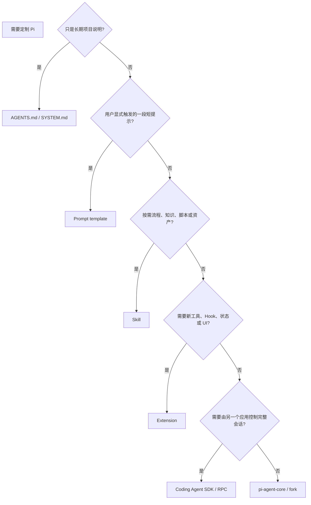

原则：**不要用常驻代码解决静态提示能解决的问题，也不要用 prompt 假装一个必须强制执行的安全策略。**

| 需求 | 最轻正确方案 | 原因 |
| --- | --- | --- |
| 团队编码规范 | context file | 稳定、可审查、随仓库版本化 |
| `/release` 操作模板 | prompt template | 用户显式调用，无运行状态 |
| 数据库迁移完整作业手册 | skill | 按需加载，可带 references/scripts |
| 禁止审批前写文件 | extension `tool_call` gate | 必须由 runtime 强制 |
| 远程 Web UI 控制 Pi | RPC/SDK | 宿主需要事件与会话控制 |
| 完全不同的 Agent 产品 | Agent Core | 不必继承 Coding Agent 产品语义 |

## 2. Extension 的能力面有多大

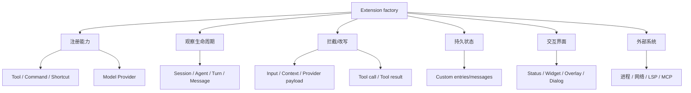

这已经不是浏览器式“受限插件”。Extension 是与 Pi 同进程、同用户权限的 TypeScript 模块：能修改模型上下文和工具，能启动子进程，能访问网络和凭据，也能因未捕获错误拖累当前会话。

[设计解读] Pi 用**信任换能力和低摩擦组合**：本地开发者可以在一个文件里改造 Harness，而不需要 IPC、插件沙箱或第二套 schema；代价是安装源审计、扩展共存和故障控制由用户/作者承担。

## 3. Factory 只注册，不启动

最小入口：

```ts
import type { ExtensionAPI } from "@earendil-works/pi-coding-agent";

export default function myExtension(pi: ExtensionAPI): void {
  pi.registerTool({ /* ... */ });
  pi.registerCommand("my-command", { /* ... */ });
  pi.on("session_start", async (_event, ctx) => { /* restore */ });
  pi.on("session_shutdown", async () => { /* cleanup */ });
}
```

官方明确要求不要在 factory 中启动进程、socket、watcher 或 timer。原因不是风格，而是加载语义：某些 Pi 操作会加载 extension 来发现能力，却不真正开始 session。

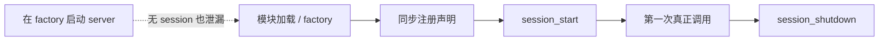

推荐边界：

- factory：声明工具、命令、事件 handler；
- `session_start`：恢复 branch 状态、建立 session-scoped 资源；
- 首次 tool call：懒启动昂贵资源；
- `session_shutdown`：关闭子进程、timer、listener、临时文件。

本仓库 LSP 进一步延迟到第一次 `lsp` 调用才创建 `ServerManager`；cwd 变化时先 shutdown 旧 manager，再加载新项目配置。

## 4. 生命周期是一张状态图，不是一串可选 callback

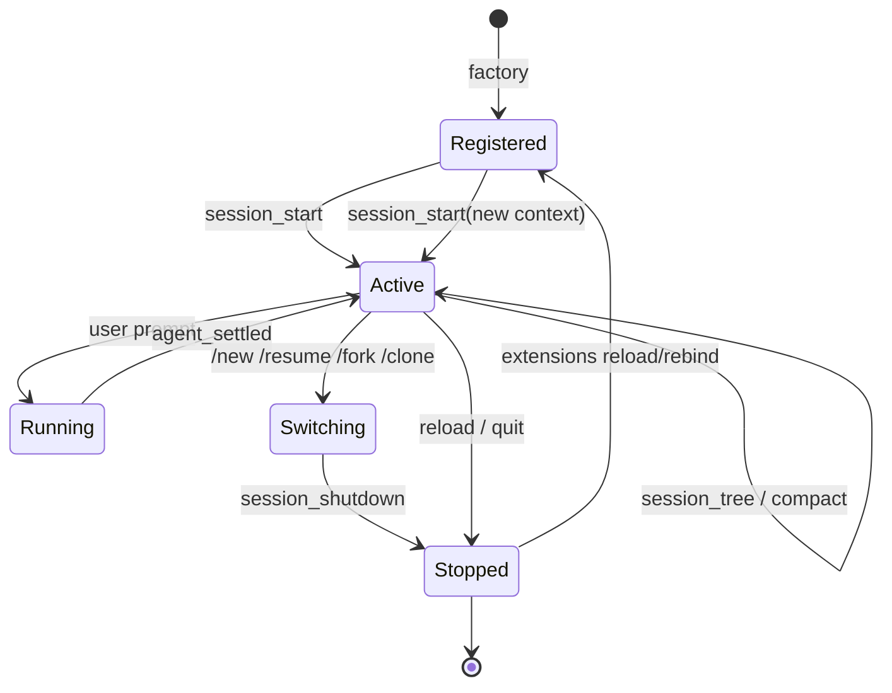

关键事实：成功 `/new`、`/resume`、`/fork`、`/clone` 时，旧 extension instance 收到 `session_shutdown`，之后 Extension 被重新加载/绑定，新实例收到 `session_start`。不要假设模块闭包跨 session 连续。

### 生命周期总顺序

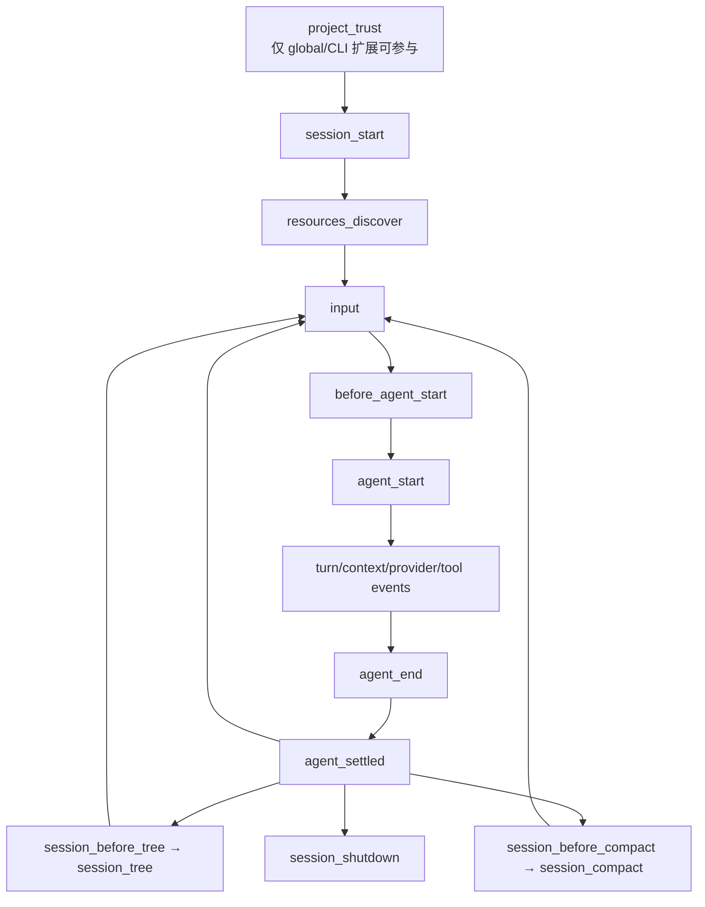

前置事件通常可以阻止或替换动作；后置事件用于观察、重建 UI 和同步状态。若 extension 在后置事件才做权限门禁，副作用已经发生。

## 5. 六个控制平面

### 5.1 输入平面：Command 与 `input`

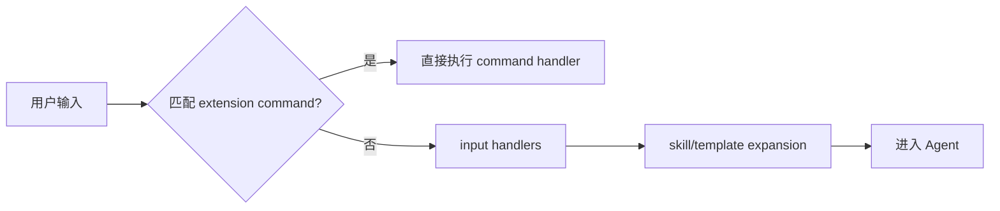

- Command 是用户控制面，例如 `/goal pause`；匹配后不进入模型。
- Tool 是模型控制面，例如 `update_goal`；参数必须 schema 校验。
- `input` Hook 可 `continue`、`transform` 或 `handled`，适合别名、外部协议和输入预处理。

不要为同一危险动作只做模型 tool 而没有用户控制面，也不要让 slash command 绕过与 tool 一致的状态不变量。

### 5.2 Prompt/Context 平面

| Hook | 频率 | 能做什么 | 主要风险 |
| --- | --- | --- | --- |
| `before_agent_start` | 每次用户 prompt 前 | 注入持久 custom message；链式改 system prompt | 重复注入、prompt 膨胀 |
| `context` | 每次 LLM call 前 | 对 deep copy 的 `AgentMessage[]` 临时裁剪/改写 | 不持久化；handler 顺序影响结果 |
| `message_end` | 每条最终消息 | 保持 role 不变地替换消息 | 改写审计事实、破坏 Provider 语义 |

`before_agent_start` 的 `event.systemPrompt` 已包含更早 handler 的修改，后续 handler 又能继续改。组合模型是**有序函数链**，不是独立 patch：

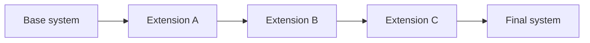

所以修改应尽量局部、可识别、幂等。三个扩展都“重写整个 system prompt”无法可靠组合。

### 5.3 Provider 平面

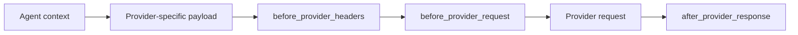

适合：gateway trace header、调试最终 payload、特定 Provider 兼容层、429 观测。

风险：`before_provider_request` 改的是最终 Provider payload，`ctx.getSystemPrompt()` 不会反映它；过度依赖私有 payload 结构会随 Provider adapter 升级破坏。它是低层逃生口，不是日常 prompt API。

### 5.4 工具平面

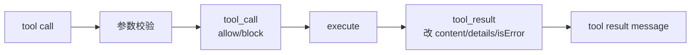

双层保护是必要的：

- active tool 集合和 prompt 告诉模型“可用什么”；
- `tool_call` gate 在运行时保证“即使模型仍发出调用也不能越界”。

本仓库 Plan 在 planning 阶段既限制 active tools，又拦截写操作。仅从 prompt 移除工具属于引导，不是强制。

### 5.5 Session 平面

- `session_start` / `session_tree`：从当前 branch replay；
- `session_before_switch` / `session_before_fork`：可取消危险切换；
- `session_before_compact`：自定义有损投影；
- `session_shutdown`：有界清理；
- `appendEntry`：保存不进模型的状态；
- `appendCustomMessage`：保存并进入模型的上下文。

详见 [03 · 上下文、会话与记忆](03-context-and-sessions.md)。

### 5.6 UI 平面

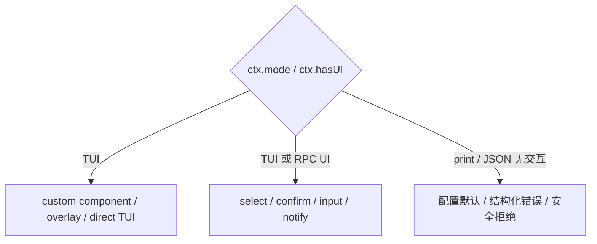

`ctx.hasUI` 表示通用 dialog 可用；只有 `ctx.mode === "tui"` 才可安全使用 `custom()`、组件 factory 和终端专属交互。无 UI 模式下，危险动作不能把“没有弹窗”解释成批准。

## 6. 注册工具不等于启用工具

Extension 可以注册工具定义；当前模型只看到 active tools。`getActiveTools()` / `setActiveTools()` 是共享全局状态。

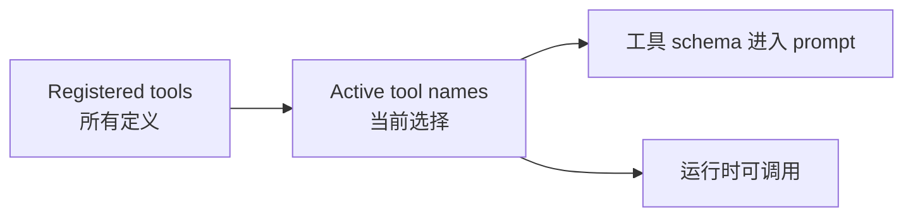

这使 plan mode、profile 和领域按需加载成为可能，也引入共享状态问题：扩展 A 读取 `[read, bash]`，扩展 B 加入 `lsp`，A 随后把旧数组写回，就会误删 `lsp`。

### 简单追加的正确模式

```ts
const active = new Set(pi.getActiveTools());
active.add("my_tool");
pi.setActiveTools([...active]);
```

只适合单调追加/删除自己工具的场景。若暂时替换整组工具，必须使用租约式协调。

## 7. 工具租约：暂时接管，但不吞掉别人的变化

本仓库 `PlanToolLease` 保存四组信息：

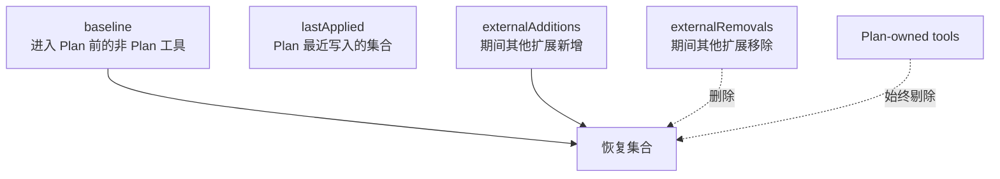

恢复关系可写成：

$$
T_{restore} = (T_{baseline} \cup T_{external+}) - T_{external-} - T_{owned}
$$

时序示例：

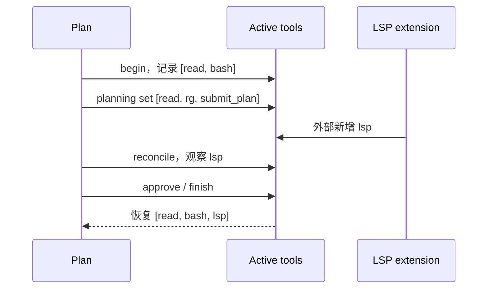

若期间用户/另一扩展移除了 `bash`，租约也应尊重移除，而不是用旧 baseline 复活它。

Tradeoff：共享集合没有事务和所有权元数据，租约只能通过“上次自己写了什么”和当前差异推断外部变化。若多个扩展同时大范围接管工具，仍可能冲突；更可靠的组合是一个策略层统一管理，或让每个扩展只操作自己拥有的工具。

## 8. 跨扩展边界：direct service、compatibility channel 与 broadcast

所有 package 都保持独立安装，但硬依赖不能通过 `../../other-extension/src/...` 或可缺席 EventBus RPC 偷渡。Plan 明确依赖 Request/Todo：其 manifest 声明、捆绑并先加载这两个 package resource，随后从 package root 调用幂等 installer，取得同 EventBus 上唯一的 typed service。未声明依赖的独立 consumer 才使用 compatibility channel。

| 模式 | 当前实例 | 关键边界 |
| --- | --- | --- |
| Direct service | Plan → Request/Todo | package dependency、manifest resource order、EventBus-scoped installer、typed method |
| 单接收者 compatibility request/response | Todo service、Request UI | listener 同步 `accept()`；完成时 `resolve/reject()` |
| 单向 state broadcast | Plan phase → Goal | sender 发 immutable snapshot；consumer 按 session 校验和 reconcile |

Plan phase 广播只服务 Goal；Todo 获得同一转换时由 Plan 直接调用 `todo.syncPlanPhase()`：

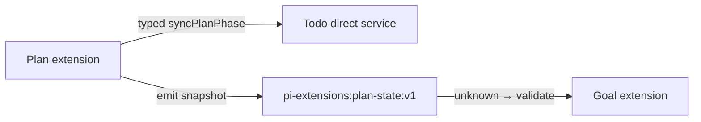

广播字段包含 `version`、`sessionId`、phase、readOnly、awaitingApproval、是否会触发 turn 与 reason。设计规则：

1. 硬依赖只从 package root import public installer/types，并以 manifest 声明、捆绑和 resource order 落地；
2. compatibility channel 名带 namespace/capability/version，例如 `pi-extensions:<capability>:vN`；
3. 接收 payload 一律视为 `unknown`，验证 discriminant、字段、上限与 session identity；
4. 发送 immutable snapshot，不暴露内部可变状态；
5. EventBus `emit()` 不等待异步 listener，因此 `accept()` 必须同步完成，异步结果走显式 completion callback；
6. Bus 不 replay；当前状态要在 `session_start` / `session_tree` 重发，早到信号要按 session 缓存后 reconcile；
7. protocol、installer 或 manifest 改动同时更新所有受影响的 package、README 和 coexistence tests。

Tradeoff：EventBus 兼容协议保持 package 独立，却没有编译期跨包契约；runtime decoder 与跨包测试是防漂移成本。直接 service 保留类型与调用路径，但仅适用于明确声明的同进程、同信任域 hard dependency。详见 [09 · 跨扩展通用协议](09-cross-extension-protocols.md)。

## 9. 长生命周期资源：懒加载、去重、按 cwd 轮换、有界关闭

LSP server、MCP connection、browser 和 file watcher 都比一次 tool call 活得久。推荐状态机：

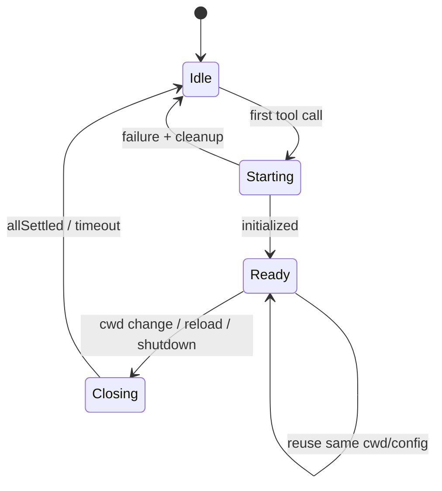

本仓库 LSP 的关键模式：

- `managerPromise` 合并并发首次调用，避免启动两个同类 server；
- 只有 manager.cwd 等于当前 `ctx.cwd` 才复用；
- 切换时先把共享引用清空，再 shutdown previous；
- config 根据 project trust 加载；
- tool 接收并传播 `AbortSignal`；
- `session_shutdown` 用 `Promise.allSettled` 同时关闭 manager 和清理 output store，一项失败不阻止另一项。

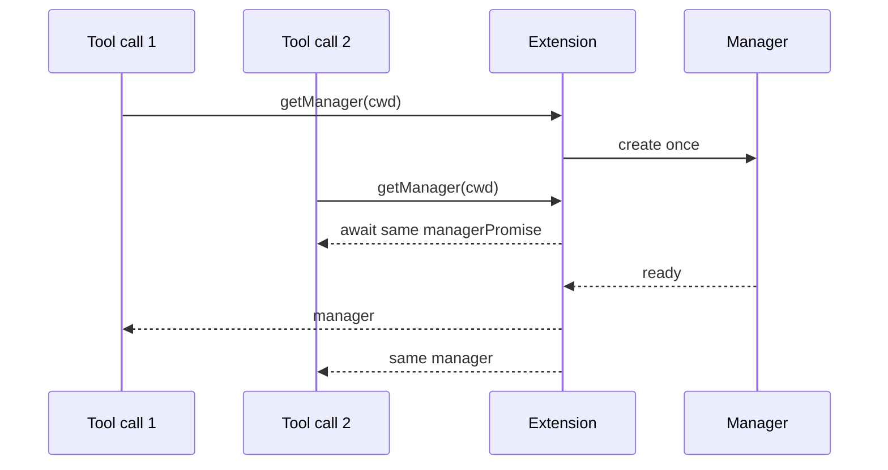

不要在 shutdown 中无限等待子进程；设置协议 shutdown 超时，随后终止进程树并移除 listener/timer。

## 10. UI 是状态投影，不是状态源

本仓库 Request、Plan、Goal 展示了三种模式：

- Request：一个串行 `RequestCoordinator`，把并发 dialog 排成 promise tail，处理 abort/timeout；
- Plan：审批 overlay + step widget + keyed footer status；
- Goal：根据持久状态重建 footer，active turn 中刷新耗时。


若 reload 后 UI 消失但安全策略仍正确，只是显示 bug；若安全策略依赖 widget 是否存在，则架构已经反了。

### UI 共存规则

- status/widget 使用稳定且唯一的 key；
- 包装共享 UI method 时，只在 shutdown 恢复仍由自己拥有的 wrapper；
- dialog 串行化，不能让两个 overlay 同时争焦点；
- 组件 render 不做 I/O，处理窄终端和超长文本；
- dispose 时移除 signal listener、timer 和 keyboard handler；
- headless 模式提供结构化替代，不静默 no-op。

## 11. Project trust 与真正安全边界

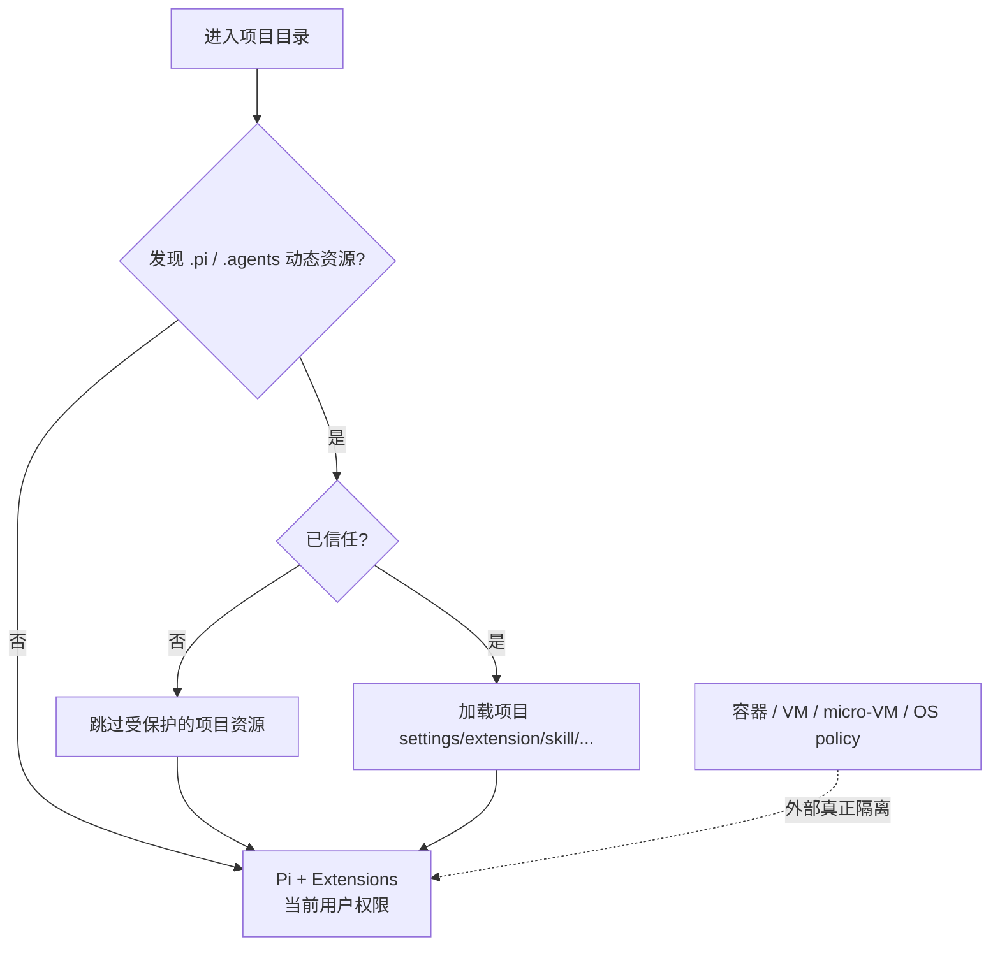

Project trust 保护“未知仓库在启动时自动加载代码/配置”，不限制模型随后调用已启用工具。`AGENTS.md` / `CLAUDE.md` 上下文默认仍可加载，仓库文本中的 prompt injection 也是本地 Agent 风险。

Extension 作者至少要保证：

- 文件路径先相对 `ctx.cwd` 解析，权限边界同时检查 canonical realpath；
- 命令使用 executable + args，不拼未转义 shell；
- 网络工具做协议、DNS、私网地址和每次 redirect 的 SSRF 检查；
- secret 不进入 prompt、tool content、details、日志或错误；
- 无 UI 时危险动作 fail closed；
- 真正不可信工作放在外部 sandbox，最小化挂载、凭据和网络。

## 12. 八个本仓库扩展如何对应控制面

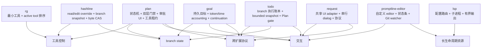

| 扩展 | 最值得学习的设计点 | 容易抄错的地方 |
| --- | --- | --- |
| RG | 基于当前 active set 重排，不重建全局集合 | 把 `grep` 永久删除而不尊重其他扩展 |
| Plan | planning/blocked/approval/executing 状态机与 tool gate | 只靠 prompt 声称“只读” |
| Goal | `agent_settled` continuation 与空转保护 | 在 `agent_end` 重入新 run |
| LSP | lazy manager、cwd 路由、取消/超时/清理 | factory 启进程或无限返回 diagnostics |
| Hashline | branch provenance、seen-line guard、完整 byte CAS 与共享 mutation queue | 把短 hash、模糊恢复或普通行号误当成可靠写入前置条件 |
| Request | UI method 适配、串行协调、headless 语义 | 并发 overlay、shutdown 恢复他人 wrapper |
| Todo | 稳定 ID、纯 reducer、mixed-carrier branch replay 与单一活动项 | 用 prompt 代替状态机、复制 Plan steps 或把项目文件当事实源 |
| Promptline Editor | 用 host theme/status/footer data 组合 editor，并监视 linked-worktree `HEAD` | 硬编码 palette、覆盖 footer 状态源或忘记关闭 watcher |

## 13. Extension 的主要 Tradeoff

| 选择 | 好处 | 成本/风险 | 缓解方式 |
| --- | --- | --- | --- |
| 进程内执行 | 低延迟、API 完整、开发快 | 无隔离、可崩主进程 | 审计来源、外部 sandbox、边界捕错 |
| 有序 Hook 链 | 可组合变换 | 加载顺序影响语义 | 小改动、幂等、明确所有权 |
| 共享 active tools/UI | 动态工作流 | 多扩展写冲突 | Set 合并、租约、唯一 key、共存测试 |
| Custom journal | branch-aware 恢复 | 版本/replay 复杂 | unknown decoder、纯 transition |
| Event bus | 独立 package 松耦合 | 无编译期跨包保证 | 版本 channel、payload 校验、契约测试 |
| 懒启动外部资源 | 启动快、按需付费 | 首次调用延迟、并发竞态 | promise 去重、状态机、timeout |
| 自定义 UI | 体验可深度产品化 | TUI/headless 分叉 | UI 仅投影、通用 fallback |

## 14. 本篇结论

Extension API 的本质是一个**进程内 Harness 控制平面**。它强大的原因，恰好也是危险和难组合的原因：它不隔离工具、上下文、会话、UI 或系统权限。

可靠扩展应遵守四个不变量：

1. factory 只注册，资源随 session/调用懒启动并有界关闭；
2. 状态写入 versioned branch journal，内存与 UI 都由 replay 重建；
3. 引导与强制分开：active tools/prompt 做引导，runtime gate 做保证；
4. 共享面不覆盖全局：工具用 merge/lease，事件用版本协议，UI 用唯一所有权。

下一步不再解释 API，而是看社区怎样利用这些边界构建 MCP、浏览器、sub-agent、完整工作流和新的 Agent 产品。

## 参考资料

- [Pi Extensions](https://github.com/earendil-works/pi/blob/main/packages/coding-agent/docs/extensions.md)
- [Pi Packages](https://github.com/earendil-works/pi/blob/main/packages/coding-agent/docs/packages.md)
- [Pi Security](https://github.com/earendil-works/pi/blob/main/packages/coding-agent/docs/security.md)
- [本仓库 Pi 插件开发参考](../pi-extension-development.md)
- [本仓库 Plan README](../../plan/README.md)
- [本仓库 Goal README](../../goal/README.md)
- [本仓库 LSP README](../../lsp/README.md)
- [本仓库 Hashline README](../../hashline/README.md)
- [本仓库 Request README](../../request/README.md)
- [本仓库 Todo README](../../todo/README.md)
- [本仓库 Promptline Editor README](../../promptline-editor/README.md)
- [跨扩展通用协议](09-cross-extension-protocols.md)
- [上一篇：上下文、会话与记忆](03-context-and-sessions.md) · [下一篇：社区生态与衍生 Agent](05-ecosystem-and-agents.md)
