# 05 · 社区生态与衍生 Agent：刻意留白怎样变成实验场

> 本篇回答：社区主要在补哪些能力；MCP、Web、LSP、sub-agent、审批 UI 的实现为何不同；基于 Pi 构建完整 Agent 时，什么时候继续做 Extension，什么时候直接使用 Agent Core、跨语言移植，什么时候内化上游实现。

## 1. 生态不是附属商店，而是设计的一部分

Pi 当前默认不内置 MCP、plan mode、sub-agent 和权限弹窗。若核心同时提供足够强的 extension/SDK，这些留白会形成并行实验：

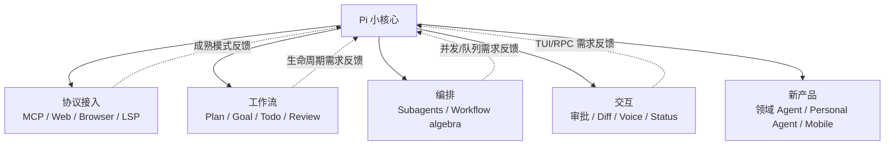

截至 2026-07-24，[Pi Package Catalog](https://pi.dev/packages) 搜索快照约有 5,350 个 package、累计约 1,880 万下载。数量证明的是扩展面被广泛使用，不代表每个 package 都安全、兼容或值得安装。Catalog 自己也明确警告：package 可执行代码并影响 Agent 行为，安装前应审查源码。

[设计解读] 对 Pi 而言，生态的价值不只是“更多工具”，而是让互相冲突的设计假设同时存活：

- MCP 工具应该全量直出，还是一个 proxy 按需发现？
- Sub-agent 应是简单委派，还是显式可验证的工作流代数？
- Plan 应只是 Markdown，还是强制只读状态机？
- 权限应每次询问，按策略自动通过，还是交给外部 sandbox？

核心若过早选定一个答案，其他路线就必须 fork。

## 2. 生态地图：按“补哪种空白”分类

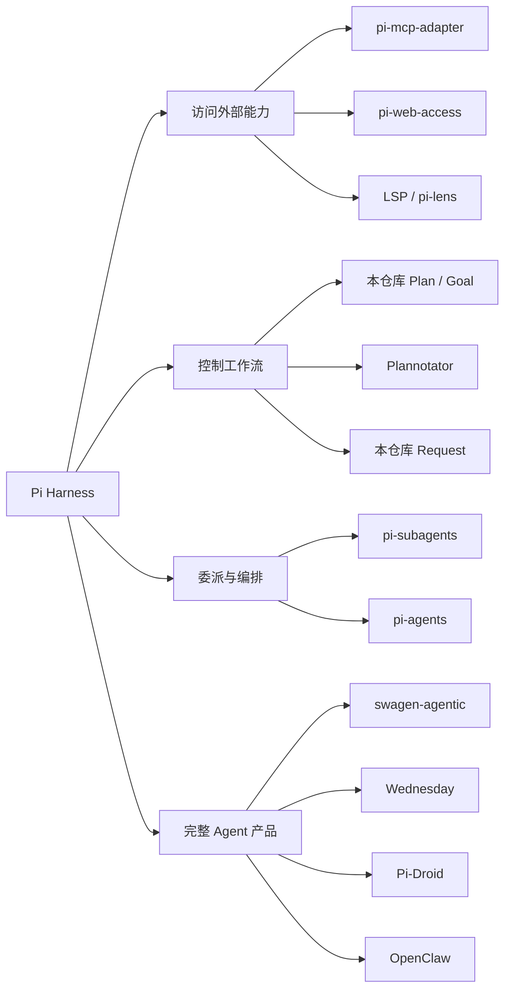

| 类别 | 代表项目 | 主要复用面 | 新增的核心责任 |
| --- | --- | --- | --- |
| 协议桥 | pi-mcp-adapter | Extension tool、生命周期、UI | server discovery、transport、OAuth、output guard |
| Web 研究 | pi-web-access | Tool + Skill + TUI | Provider fallback、内容提取、SSRF、缓存/大结果 |
| 代码智能 | 本仓库 LSP、pi-lens | Tool/event/子进程 | Server 路由、diagnostics、AST/formatter/index |
| 人机审批 | Plan、Request、Plannotator | Hook、command、UI | 状态机、review artifact、浏览器交互 |
| 多 Agent | pi-subagents、pi-agents | Tool/RPC/session/process | child 隔离、并发、预算、工作流值语义 |
| 领域 Agent | swagen-agentic | `pi-ai` + Agent Core | 领域工具、存储、缓存、bot、审计 |
| 新终端产品 | Wednesday | `pi-ai` + Agent Core | memory、dashboard、approval、sandbox |
| 平台移植 | Pi-Droid | 架构/协议思想 | Kotlin Provider、Android permission/UI/service |
| 大型产品内化 | OpenClaw | 适配 Pi 实现 + pi-tui | Gateway、多 channel、多 agent、sandbox、daemon |


### 2.1 源码级比较框架：不要只数工具

一个项目“提供了多少工具”几乎不能解释其设计。更有用的读法，是沿一次真实副作用追踪六个责任点：

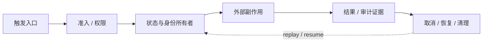

| 责任点 | 源码中要找什么 | 缺失时的典型故障 |
| --- | --- | --- |
| 触发入口 | Tool、command、Hook、HTTP、scheduler | 同一操作从不同入口绕过约束 |
| 准入 | schema、phase、permission、policy、artifact version | prompt 说“不要做”却仍可执行 |
| 状态所有者 | session id、run id、journal、queue key | reload/branch 后出现幽灵状态 |
| 副作用边界 | canonical path、network guard、worktree、sandbox | symlink/SSRF/宿主凭据越界 |
| 证据 | 有界 `content`、结构化 `details`、artifact、audit | 模型说成功但系统无法核对 |
| 恢复与清理 | AbortSignal、generation、finally、shutdown | 过期初始化覆盖新状态、进程泄漏 |

把后续案例放进这个框架，会看到复杂度并不与 Tool 数量成正比：

| 项目 | 关键状态所有者 | 最重的边界责任 | 最容易被低估的成本 |
| --- | --- | --- | --- |
| pi-mcp-adapter | server config generation + client registry | 外部 transport/OAuth/输出 | 过期异步初始化与 schema 漂移 |
| pi-web-access | request/provider/cache state | URL、DNS、redirect、凭据 | fallback 改变结果语义 |
| pi-lens | runtime coordinator + project/server identity | 编辑后的自动反馈链 | 背景开销、误报和 shutdown |
| Plannotator | browser review session + review id | artifact、浏览器、本地服务 | 批准对象的版本绑定 |
| pi-subagents / pi-agents | child run 或 workflow AST | 并发、预算、取消、隔离 | “完成”与结果合并不是一回事 |

这也是本文比较 Extension 与完整 Agent 的统一尺度：**谁拥有这六项责任，谁就是实际 Harness。**

## 3. 案例一：MCP 不是“要不要”，而是“怎样支付上下文成本”

[pi-mcp-adapter](https://github.com/nicobailon/pi-mcp-adapter) 的动机直接回应 Pi 的反 MCP 默认：MCP 生态有大量现成数据库、浏览器和 API server，但全量暴露其 tool schema 可能在尚未调用前就消耗数万 token。

### 它的选择：一个 proxy tool + 延迟发现

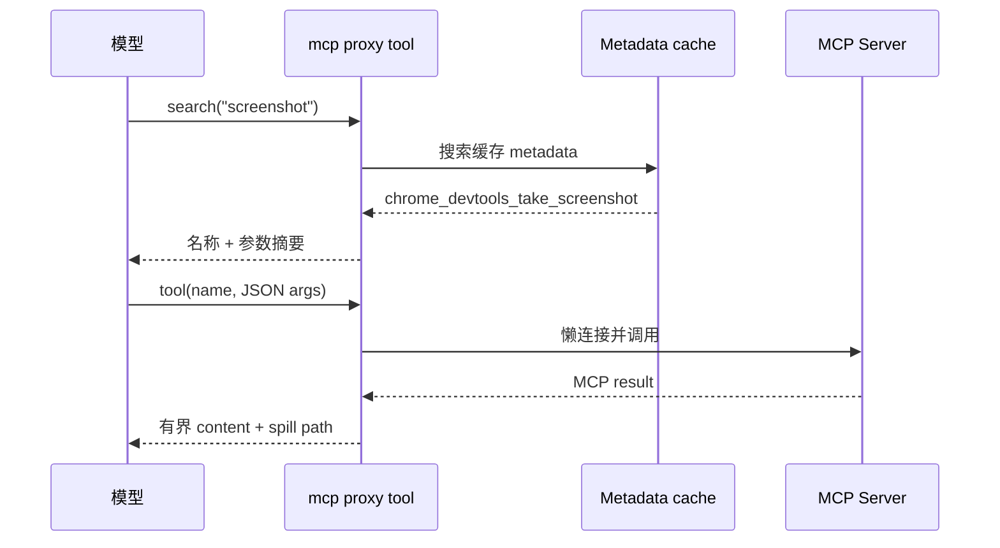

Catalog 2026-07-24 快照：v2.11.0，约 157.6K 月下载。项目说明的核心取舍：

| 方案 | Prompt 成本 | 调用步数 | 可发现性 | 运行时复杂度 |
| --- | ---: | ---: | --- | --- |
| 全量 direct tools | 高，所有 schema 常驻 | 1 | 模型直接看见 | 较低 |
| 单 proxy tool | 约一个小 schema | 通常 2（发现 + 调用） | 需要先搜索 | 较高 |
| 选择性 direct tools | 中 | 1 | 热门工具直接可见 | 需配置/缓存 |

它还把 server 分为 lazy、eager、keep-alive；metadata 缓存使未连接时仍可搜索；大文本默认限制 50 KiB/2,000 行，完整内容落 private temp file；大 `details.mcpResult` 也单独限长。

### 源码里的三个关键不变量

| 源码落点 | 观察到的机制 | 设计意义 |
| --- | --- | --- |
| [`index.ts`](https://github.com/nicobailon/pi-mcp-adapter/blob/main/index.ts) | 初始化带 generation；新一代配置出现后，旧异步结果不能接管当前 client 状态 | reload/config change 不会被“迟到的成功”反向覆盖 |
| [`metadata-cache.ts`](https://github.com/nicobailon/pi-mcp-adapter/blob/main/metadata-cache.ts) | tool metadata 与 live transport 分离 | server 未连接时仍可发现能力，但必须接受缓存新鲜度问题 |
| [`mcp-output-guard.ts`](https://github.com/nicobailon/pi-mcp-adapter/blob/main/mcp-output-guard.ts) | 模型可见文本按 byte + line 截断；原始 `details.mcpResult` 另设 16 KiB 上限并可单独落盘 | 限制 `content` 不能顺便限制机器侧 JSON，两个通道必须各自设预算 |

generation 解决的是一个很常见、但 demo 很难暴露的竞态：

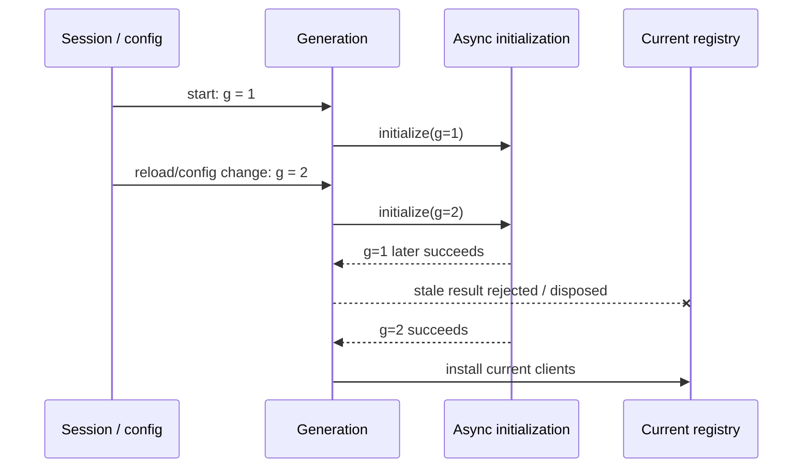

生活化类比：两位维修员先后被派去换门锁；第一位晚到，不能因为手里也有一把新锁，就把第二位已经安装且登记的新锁拆掉。generation 就是工单版本。

### 设计价值

- 证明“不内置 MCP”不等于拒绝 MCP，而是允许上下文优化方案独立演化；
- proxy 是典型 progressive disclosure：先目录，再 schema，再调用；
- transport、OAuth、elicitation 和 server lifecycle 留在桥接层，不污染 Agent Core。

### 新风险

- 两步调用增加延迟和模型失败点；
- 缓存 metadata 可能与 server 当前版本漂移；
- MCP server 仍是外部代码/网络权限边界；
- spill 文件可能含敏感结果，必须考虑权限和清理；
- MCP sampling/elicitation 会形成 server → Agent/用户的反向调用，需防递归和无 UI 自动批准。

## 4. 案例二：Web Access 展示“一个工具背后其实是一个产品”

[pi-web-access](https://github.com/nicobailon/pi-web-access) 在 2026-07-24 Catalog 为 v0.13.0、约 134.9K 月下载。它同时是 extension + skill，提供 Web 搜索、内容提取、GitHub clone、PDF、YouTube/本地视频理解，并组合多个 Provider fallback。

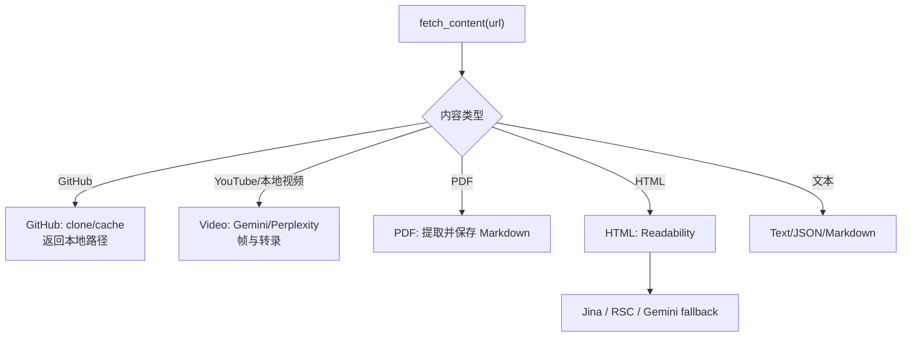

### 为什么 extension 与 skill 同时存在

- Extension 负责网络、fallback、缓存、TUI curator 和 tool result；
- bundled `librarian` skill 负责“如何做源码研究”的按需方法论。

把研究方法全部写进 tool description 会使每次请求变大；把网络和凭据处理写进 skill 又无法强制安全边界。这是资源分层的典型案例。

### 值得借鉴

- GitHub URL clone 成本地仓库，让现有 read/search 工具继续工作，而不是把 HTML 当源码；
- 搜索结果先保存，模型用 response id 按需读取完整内容；
- 人工 curator 允许用户筛选来源后再注入会话；
- 多 Provider fallback 提升可用性，但应让来源与降级路径可观察。

### Tradeoff

“Something always works”式 fallback 对体验很好，却可能改变结果语义：搜索 Provider、AI 摘要和网页提取不是等价实现。可靠研究必须在输出中保留实际来源/Provider，并优先读取官方原文。网络能力还引入 SSRF、redirect、私网 DNS、浏览器 cookie 和内容 prompt injection 风险。

### 安全边界在源码中的形状

[`ssrf-protection.ts`](https://github.com/nicobailon/pi-web-access/blob/main/ssrf-protection.ts) 没有只做字符串黑名单，而是：

1. 只接受 HTTP/HTTPS；
2. 拒绝 localhost，并解析 hostname 的**全部**地址；
3. 对 IPv4、IPv6、IPv4-mapped IPv6 分别拒绝 loopback、private、link-local 和 reserved 范围；
4. 使用 manual redirect，每次根据新 `Location` 重新执行完整校验；
5. 允许显式 CIDR 例外，但非法配置直接报错，不静默退化为宽泛放行。

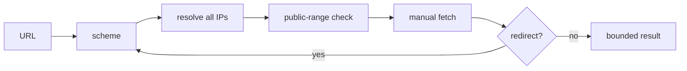

[设计解读] 这仍不是网络沙箱：实现先验证 hostname，再让普通 `fetch` 建连，底层可能再次解析 DNS。面对严格的 DNS rebinding 威胁，还需让“已验证的 IP”与“实际连接的 IP”一致。安全设计应精确说明做到哪一层，不能把“有 SSRF helper”等同于“网络已隔离”。

## 5. 案例三：LSP 与 Lens——从被动工具到持续反馈层

本仓库 LSP 采取克制边界：一个 `lsp` tool，按 action 路由 server，结果有界，manager 懒启动；rename/code action 的具体写入策略由工具契约控制。

[pi-lens](https://github.com/apmantza/pi-lens) 则向完整“代码质量感知层”扩展。Catalog 2026-07-24 快照 v3.8.71、约 34.3K 月下载，包含：

- LSP diagnostics/navigation；
- write/edit 后的 linter、type-check、scanner 和安全 autofix；
- ast-grep/tree-sitter 结构规则；
- always-warm symbol index 与 discovery funnel；
- 影响级联 diagnostics、triage、HTML dependency map 和后台扫描。

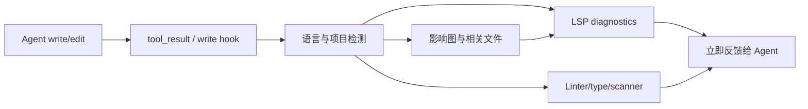

两个方案不是“简单版和高级版”的单向升级：

| 取向 | 优点 | 成本 |
| --- | --- | --- |
| 显式 LSP tool | 可预测、按需、低背景开销 | 模型必须记得调用，反馈可能晚 |
| 每次编辑自动反馈 | 更早发现错误、形成闭环 | 写入延迟、误报、工具安装与配置复杂 |

[设计解读] Pi 的 Hook 允许把“Agent 是否主动检查”升级为运行时保障；是否值得支付持续成本，取决于项目规模、语言服务稳定性和误报治理。

### Lens 为什么已经接近一个反馈控制器

[`pi-lens/index.ts`](https://github.com/apmantza/pi-lens/blob/master/index.ts) 不只注册查询工具；它把 `session_start`、写入后的 `tool_result`、`turn_end`、`agent_end` 与 `session_shutdown` 接到长期 `RuntimeCoordinator`。于是系统从“模型偶尔调用诊断工具”变成闭环：

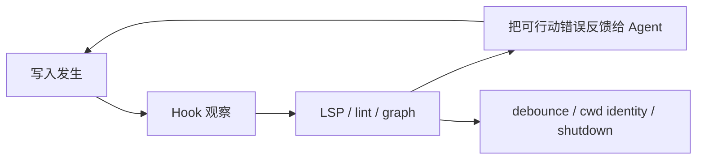

闭环的收益是早反馈；代价是每次编辑都可能触发后台工作。此类扩展的主风险不在诊断算法，而在 controller 是否能去重、取消旧 run、识别 cwd/config 变化、限制输出，并在 shutdown 时释放 server/index/timer。工具越“自动”，生命周期测试越重要。

## 6. 案例四：Plan/Request/Plannotator——审批不是一个 Yes/No

本仓库 Plan 把审批建模为：

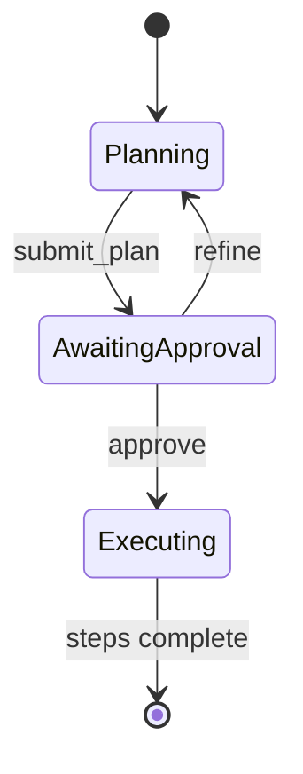

它在 planning 期间做工具集合限制 + runtime gate，候选计划写不可变 artifact；Request 负责串行问题、Other、Review、abort/timeout；Goal 再把长程目标与 Plan 状态协调。

[Plannotator](https://github.com/backnotprop/plannotator) 选择外部浏览器 review surface：计划、Markdown、HTML 和 diff 可逐行标注，反馈再回到 Agent；还支持多个 Agent Harness。

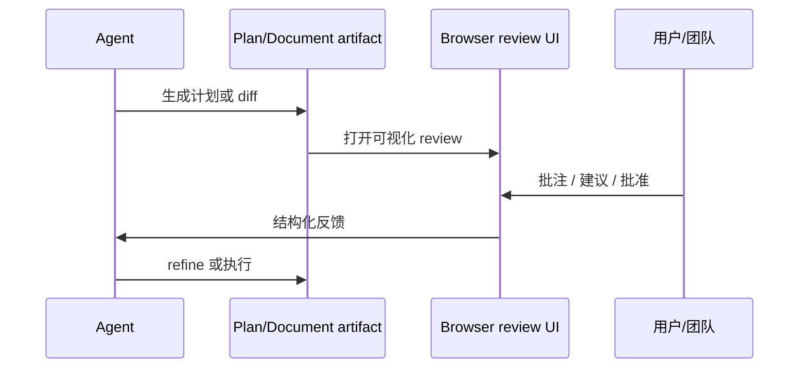

### 为什么图形审批有价值

长计划用 TUI 单选框很难定位；浏览器适合 side-by-side diff、inline comment 和团队共享。外部 UI 把“审批”从一个布尔值提升为有位置和上下文的 review 数据。

### Tradeoff

- 需要浏览器/本地服务和跨进程生命周期；
- artifact 与源码同时变化会有竞态；
- 分享链接可能涉及敏感计划/diff；
- 浏览器批准必须绑定具体 artifact hash/version，否则批准后被替换会产生 TOCTOU；
- UI 反馈仍要转成 session 中可恢复的状态，不能只存在网页。

### 浏览器审批的源码边界

[`plannotator-browser.ts`](https://github.com/backnotprop/plannotator/blob/main/apps/pi-extension/plannotator-browser.ts) 展示了外部 review surface 至少要补的控制面：

- `ctx.hasUI` 为 false 时明确拒绝，而不是把缺少界面解释为批准；
- 每次计划 review 返回 `reviewId`，decision promise 只创建一次，成功、停止或异常都会关闭 server；
- PR review 会校验来自平台的 branch/SHA，临时 worktree 使用随机 session 路径并注册 cleanup；
- 本地与远程环境分别处理 browser open 和 URL 展示。

`reviewId` 解决“这是哪次浏览器会话”，但安全关键的批准还需回答“批准的是哪一份内容”。因此执行端应把 decision 与 plan/diff digest、base revision 和 session journal 一起持久化；只收到 `{ approved: true }` 不能证明批准后 artifact 没有变化。

## 7. 案例五：两种多 Agent 哲学

### pi-subagents：面向日常委派

[pi-subagents](https://github.com/nicobailon/pi-subagents) 在 2026-07-24 Catalog 为 v0.35.1、约 124.3K 月下载。它把 child 建模为独立 Pi session，提供 scout、researcher、planner、worker、reviewer、oracle 等 profile，支持 foreground/background、chain、parallel、fleet UI、worktree 和 watchdog。

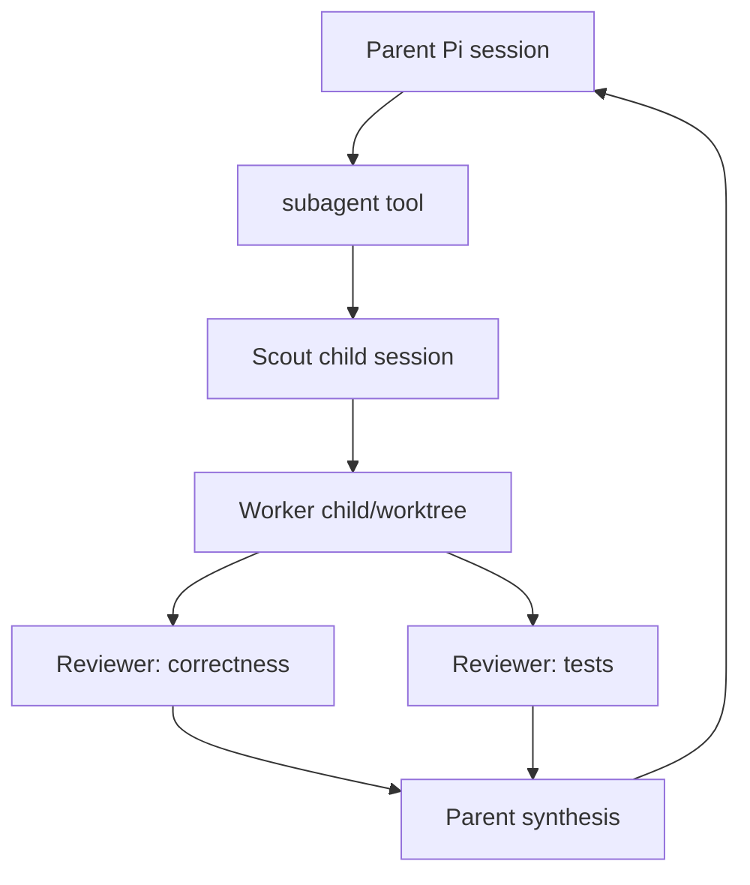

优势是自然语言入口和角色复用；风险是隐式编排、成本扩散、child 权限继承、上下文复制和“多个 Agent 不等于多个独立证据”。它通过预算、模型 scope、日志 artifact、status tree 和可选 watchdog 管理这些问题。

### pi-agents：面向显式工作流代数

[pi-agents](https://github.com/mavam/pi-agents) 是 2026-07-23 发布的新项目（Catalog v0.4.0）。它把 workflow 定义成六种有值节点组成的表达式树：agent、sequence、parallel、map、loop、saved workflow；数据只通过显式引用流动。

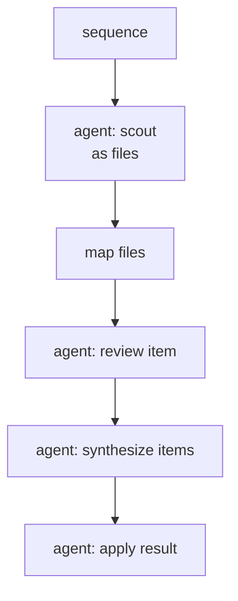

未知引用、作用域错误和 cycle 在 spawn 前验证；任意 subtree 仍是合法 workflow。

### 两种路线的取舍

| 维度 | pi-subagents | pi-agents |
| --- | --- | --- |
| 核心心智模型 | 角色 + 委派/chain/parallel | 有值表达式树 |
| 上手 | 自然语言快 | 需理解 node/reference |
| 数据流 | 工具/工作流约定 | 显式 binding 与 scope |
| 可静态验证 | 中 | 高 |
| 灵活临时任务 | 高 | 高，但 schema 较重 |
| 适合 | 日常第二意见、实现/审查 | 可复用、可审计编排 |

[设计解读] Pi 没内置 sub-agent，使两种互不兼容的哲学都能实现。真正应该进入 Core 的可能不是其中一个 DSL，而是它们共同需要的取消、事件、RPC、tool result、session 和进程边界。

### 源码责任落点：运行一个 child 只是中间步骤

[`pi-subagents/src/extension`](https://github.com/nicobailon/pi-subagents/tree/main/src/extension) 的 composition root 需要同时接线 agent discovery、foreground/background run、status、session Hook 与 shutdown；这说明自然语言 `subagent` Tool 只是入口，真正的产品面是 child lifecycle。另一方面，[`pi-agents` 的 AST](https://github.com/mavam/pi-agents/blob/main/src/model/ast.ts) 和 [`validate.ts`](https://github.com/mavam/pi-agents/blob/main/src/model/validate.ts) 把 node、binding、scope 与 cycle 先变成可验证数据，再允许执行。

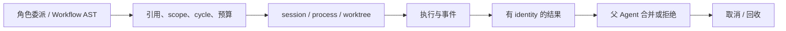

两条路线最终都必须覆盖整条链。`child process exited 0` 只证明进程完成，不证明任务满足验收；`parallel` 也只描述调度，不自动提供独立证据、冲突解决或原子合并。

## 8. 从 Extension 走向完整 Agent 产品

Extension 共享 Pi 的产品边界；完整 Agent 需要自己决定身份、存储、部署、安全和界面。下图是四种深度：

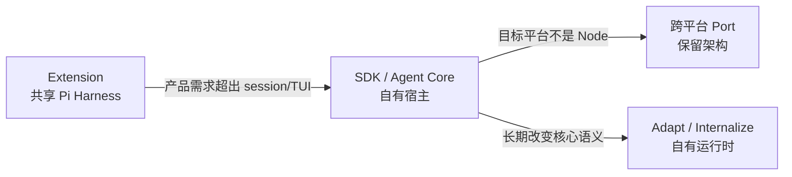

### 8.0 产品化责任账本

| 路线 | 复用的 Pi 层 | 新的主身份 | 自有持久化 | 自有安全边界 | 长期分化成本 |
| --- | --- | --- | --- | --- | --- |
| swagen-agentic | `pi-ai` + `agentLoop` | API 测试生成 run | session/cache/run record | 领域 Tool 与部署凭据 | 跟进 Core 消息/loop 语义 |
| Wednesday | `pi-ai` + `Agent` | 本地个人 Agent/session | Markdown vault、index、session、journal | permission + Docker/workspace | 自有 UI、memory、daemon 生命周期 |
| Pi-Droid | Pi 的 Provider/loop 设计 | Android process/runtime | Kotlin/Android host 决定 | OS permission + confirmation | 手工同步 Provider 与协议 |
| OpenClaw | 适配的 Pi 机制 + `pi-tui` | Gateway channel/session/agent | 自有 session、compaction、maintenance | tool policy + Host/Docker/SSH | 维护完整 embedded runner |

选择路线时，不要问“能不能继续写 Extension”，而要问：run identity、恢复点和安全策略是否仍由 Pi session 定义。若答案是否定的，Extension 只是把真正宿主藏起来。

### 8.1 swagen-agentic：领域 Harness

[swagen-agentic](https://github.com/rjoydip/swagen-agentic) 直接使用 `pi-ai` + `pi-agent-core`，让模型围绕 OpenAPI 规范调用 17 个领域工具生成测试。它自己拥有：

- memory/file/Redis session storage；
- spec/codebase cache；
- REST/GraphQL/gRPC/SOAP skill；
- before/after generate Hook；
- CLI、GitHub Action/App、Cloudflare bot；
- MCP server 与审计记录。

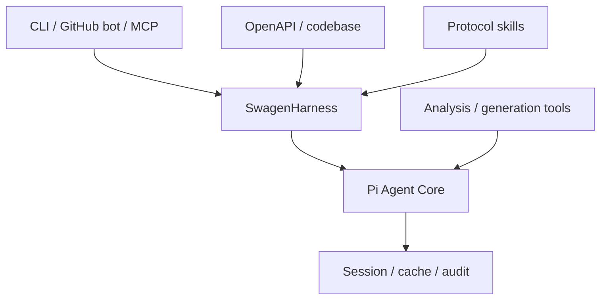

为什么不用 Coding Agent extension？因为产品的主实体不是“一个通用 Coding session 加 API 工具”，而是“可部署、可恢复、可审计的测试生成 run”。领域 Harness 应拥有 session schema、存储和对外 API。

源码中的 [`SwagenHarness`](https://github.com/rjoydip/swagen-agentic/blob/main/src/harness.ts) 直接构造 `AgentContext` 与领域 tools，再调用 `agentLoop()`；它自己加载或创建 session、选择 storage/cache、流式转发 `AgentEvent`，并在结束后保存 message transcript 与 run record。这里的边界非常清楚：Core 提供 turn/tool loop，Swagen 拥有“什么是一场测试生成任务”。

它还显式选择 sequential tool execution，并用 `convertToLlm` 过滤送给 Provider 的消息类型，说明直接使用 Core 会获得控制权，也会接手语义责任。[设计解读] 当前 session 的最终更新发生在 loop 结束后；若产品要求进程崩溃后精确恢复到半个 run，还需要更细粒度的 durable journal，而不能把 event streaming 当持久化。

### 8.2 Wednesday：个人 Agent

[Wednesday](https://github.com/BlusceLabs/Wednesday) 声明基于 Pi Agent Core/Pi AI，替换为 OpenTUI，并增加 durable Markdown memory、SQLite FTS/本地语义检索、authenticated dashboard、scheduler、approval、Docker sandbox 和大量个人工具。

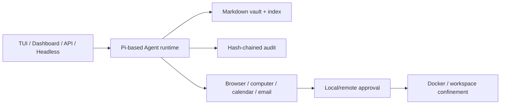

它说明 Agent Core 的分层价值：可复用 Provider/loop，但 memory、身份、审批和 UI 都由新产品定义。项目当前自述为 release candidate，本文只分析架构，不作成熟度背书。

[`WednesdayRuntime`](https://github.com/BlusceLabs/Wednesday/blob/main/src/agent/runtime.ts) 构造 Agent 时把 [`PermissionService`](https://github.com/BlusceLabs/Wednesday/blob/main/src/core/permissions.ts) 接入 `beforeToolCall`；它订阅 token、tool 与 `agent_end` 事件，在 run settle 后做摘要和 session 保存，并用 [`createSerialQueue`](https://github.com/BlusceLabs/Wednesday/blob/main/src/core/queue.ts) 把用户 turn 串行化。也就是说，memory、审计、权限和队列不是 Core 的隐藏功能，而是宿主围绕 Core 建出的产品语义。

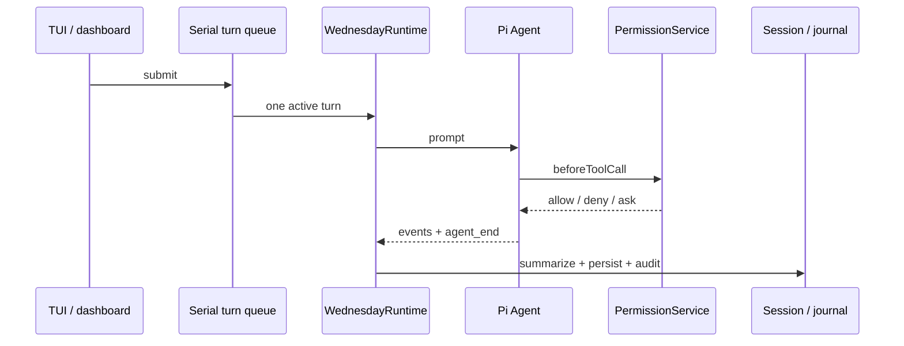

这条链比“换一个 TUI”深得多：远程 dashboard 和 scheduler 一旦能发起 turn，身份、并发和批准都必须由 Wednesday 统一，而不能依赖终端前台恰好存在。

### 8.3 Pi-Droid：移植架构，而不是硬塞 Node runtime

[Pi-Droid](https://github.com/multimail-dev/pi-droid) 将 `pi-ai` Provider 系统和 Agent loop 重写为 Kotlin，接入 Android Calendar、Contacts、Intents、Notifications 与 permission confirmation。

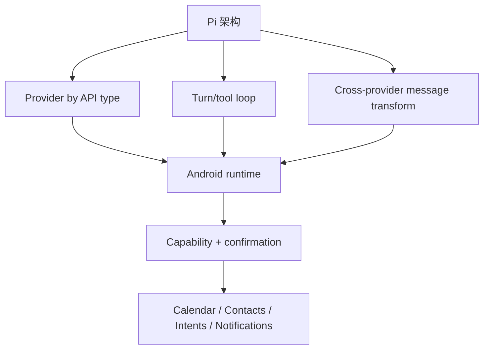

它保留的是设计不变量，而非 TypeScript API：Provider 按 API type 路由、turn/tool loop、消息转换、tool gate；平台特有能力则由 Android permission 和 Compose UI 重写。Tradeoff 是上游协议/模型目录同步变成手工移植成本。

[`PiRuntime.kt`](https://github.com/multimail-dev/pi-droid/blob/main/library/src/main/kotlin/dev/anthropic/pidroid/PiRuntime.kt) 已把这些不变量落成 Android 原生语义：Kotlin coroutine `Job` 表示 active run；运行中再次 `sendPrompt` 进入 follow-up queue；`steer` 使用独立 queue；继续历史前通过 `MessageTransformer` 转成目标 Provider 格式；工具使用 active snapshot，并经过 `ConfirmationGate`；`cancel()` 与 `shutdown()` 显式终止任务和 pending confirmation。

这也暴露移植成本：当前 runtime 是 process singleton，Provider registry、消息兼容和工具协议都要在 Kotlin 侧持续同步。跨语言 port 适合“平台拥有进程且原 runtime 无法自然嵌入”，不适合仅仅为了换 UI。

### 8.4 OpenClaw：产品边界跨过上游抽象后内化

[OpenClaw](https://github.com/openclaw/openclaw) 当前是常驻的多 channel 个人助理 Gateway，包含 channel routing、daemon、multi-agent workspace/session、voice、canvas、browser、cron、node、pairing 与 sandbox。

当前一手证据：

- `THIRD_PARTY_NOTICES.md` 明确说明部分实现适配自 Pi/pi-mono；
- 当前 package 仍直接依赖 `@earendil-works/pi-tui`；
- `src/agents/embedded-agent-runner` 和 `src/agents/harness` 已拥有自己的 run、compaction、session、tool policy、provider、lifecycle 和 hook 实现。

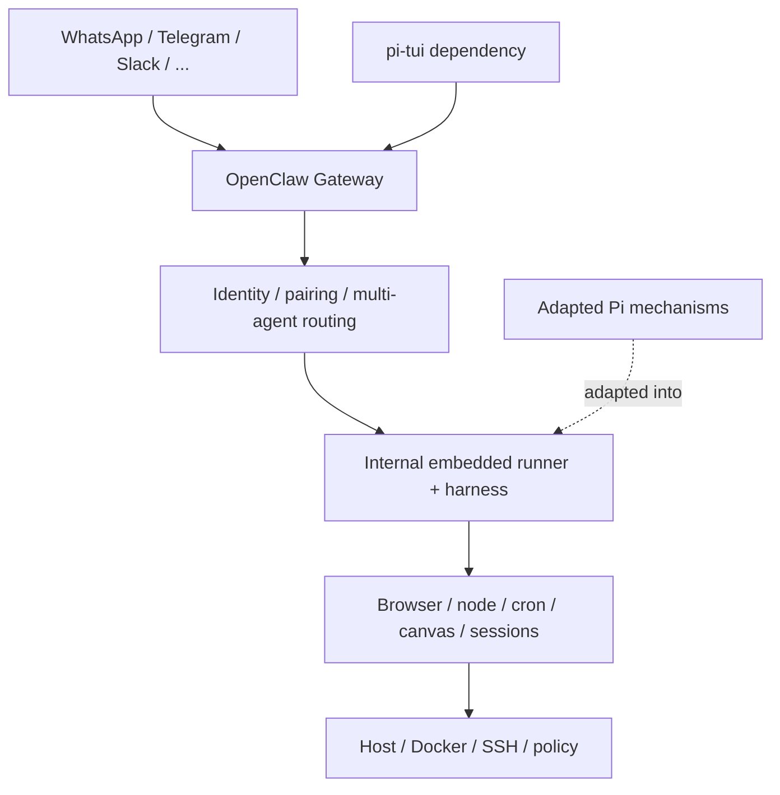

[设计解读] 这是“何时 fork/内化合理”的强例子：当产品需要常驻 Gateway、远程不可信消息、channel identity、配对、多 Agent 路由和分层 sandbox 时，Coding Agent 的本地 session/extension 边界不再是主抽象。继续把一切做成 Pi extension 会让宿主关系倒置。代价则是巨大的自有运行时和跟进上游成本。

[`run-orchestrator.ts`](https://github.com/openclaw/openclaw/blob/main/src/agents/embedded-agent-runner/run-orchestrator.ts) 能看到内化后的责任规模：模型调用前已经要完成 run admission、session target、session/global lane、deferred transcript maintenance、prepared runtime lease、lifecycle generation、workspace/agent identity、plugin Hook 与 model fallback；结束时还要释放 lease、撤销本次 run capability。其 [`sandbox/config.ts`](https://github.com/openclaw/openclaw/blob/main/src/agents/sandbox/config.ts) 又把 Host、Docker、SSH、browser、workspace access 和 tool allow/deny 合成产品策略。

```mermaid
flowchart LR
    PiLoop[Pi-derived loop mechanics]
    Adapter[adapted runner]
    Product[Gateway identity / lanes / sessions]
    Policy[tool policy / sandbox / channels]
    Runtime[OpenClaw-owned runtime]

    PiLoop --> Adapter --> Product --> Policy --> Runtime
```

这不是“代码越来越多所以 fork”，而是责任按产品边界迁移：远程消息进入模型之前，OpenClaw 必须先回答它属于哪个 channel identity、agent、session、lane、workspace 和 capability。Coding Agent extension API 不应替一个 Gateway 回答这些问题。

### 8.5 四个产品案例的共同判据

```mermaid
flowchart TD
    Need[新 Agent 产品] --> Identity{主 run identity 仍是 Pi session?}
    Identity -->|是| Extension[优先 Extension]
    Identity -->|否| Platform{Node/TS runtime 可用?}
    Platform -->|是| Core[Agent Core + 自有 Harness]
    Platform -->|否，平台限制| Port[移植设计不变量]
    Core --> Semantics{核心语义长期分化?}
    Semantics -->|否| Stay[持续复用 Core]
    Semantics -->|是| Internalize[适配 / 内化运行时]
```

最稳的升级顺序是先 Extension，再 Core/SDK，最后才 port 或 internalize；但一旦身份与安全模型已经迁移，就不应为了表面上的“兼容 Pi”让宿主关系倒置。

## 9. 四种构建路线如何选

```mermaid
flowchart TD
    Start[要基于 Pi 做新能力]
    Q1{用户仍在 Pi session 中工作?}
    Q1 -->|是| Q2{只需 prompt/knowledge?}
    Q2 -->|是| Skill[Skill / Prompt]
    Q2 -->|否| Ext[Extension]
    Q1 -->|否| Q3{Node/TS 且 loop 语义适用?}
    Q3 -->|是| Core[pi-ai + Agent Core]
    Q3 -->|否| Q4{主要是平台语言限制?}
    Q4 -->|是| Port[Port 核心不变量]
    Q4 -->|否| Internal[Adapt / fork / own runtime]
```

| 路线 | 保留什么 | 自己负责什么 | 升级成本 |
| --- | --- | --- | --- |
| Extension | 完整 Pi UX/session/resources | 新能力与其状态 | 低到中，受 API 演进影响 |
| SDK/Agent Core | Provider + loop，按需复用 Harness | 产品 UI、存储、身份、部署 | 中 |
| 跨语言 Port | 设计与测试语义 | 全部实现、同步 Provider | 高 |
| Internalize/Fork | 选择性代码/思想 | 整个长期运行时 | 最高 |

判断标准不是代码量，而是**谁拥有主生命周期**：

- Pi 启动你的能力 → extension；
- 你的应用创建/销毁 Pi session → SDK/Core；
- 移动 OS/边缘 runtime 拥有进程 → port；
- Gateway/多租户/远程安全模型拥有一切 → 自有 runtime。

## 10. 社区对 Pi 设计的反向证明

### 10.1 小核心确实促进了分化

同一个空白产生了 proxy MCP 与 direct tools、自然语言 subagent 与 algebra workflow、TUI Plan 与 browser annotation。若核心内置一种方案，其他方案仍能实现，但会一直与默认 prompt/工具竞争。

### 10.2 复杂度没有消失，只被放到最合适的包

- MCP adapter 自己承担 OAuth、缓存、server lifecycle；
- Web Access 自己承担 fallback、SSRF 和内容存储；
- Lens 自己承担 language server/runner/index；
- sub-agent 包自己承担 child process、budget 和 artifact；
- 完整产品自己承担 identity、memory、sandbox 和部署。

### 10.3 扩展生态也暴露了组合上限

```mermaid
flowchart LR
    More[安装更多扩展]
    Context[更多 tool schema/system 注入]
    Shared[更多共享状态竞争]
    Supply[更大供应链面]
    Debug[更难解释加载顺序]

    More --> Context
    More --> Shared
    More --> Supply
    More --> Debug
```

“可安装”不等于“应同时安装”。最佳实践是维护小而有目的的 profile，定期检查 active tools、prompt、Hook 和依赖；对大型工作流包做共存测试，对不可信任务从外部隔离整个 Pi。

## 11. 本篇结论

Pi 生态最重要的观察不是 package 数量，而是**不同能力停在了不同抽象深度**：

- MCP/Web/LSP 适合 Extension，因为它们增强现有 session；
- Plan/Request/Plannotator 增加控制与 review，但仍围绕人的当前任务；
- subagents/workflow 增加编排，需要显式预算、数据流和 child 隔离；
- swagen/Wednesday 拥有领域 session、存储和产品界面，因此直接使用 Agent Core；
- Pi-Droid 因平台边界移植设计；
- OpenClaw 因 Gateway 与安全模型跨过 Coding Harness 边界而内化。

这反过来解释 Pi 的底层设计：**核心提供稳定循环和广阔控制面，生态负责把具体工作流做深；当新产品拥有自己的生命周期时，再从“扩展 Pi”切换为“用 Pi 的部件构建”。**

## 参考资料

- [Pi Package Catalog](https://pi.dev/packages)
- [pi-mcp-adapter](https://github.com/nicobailon/pi-mcp-adapter)
- [pi-web-access](https://github.com/nicobailon/pi-web-access)
- [pi-subagents](https://github.com/nicobailon/pi-subagents)
- [pi-agents](https://github.com/mavam/pi-agents)
- [pi-lens](https://github.com/apmantza/pi-lens)
- [Plannotator](https://github.com/backnotprop/plannotator)
- [swagen-agentic](https://github.com/rjoydip/swagen-agentic)
- [Wednesday](https://github.com/BlusceLabs/Wednesday)
- [Pi-Droid](https://github.com/multimail-dev/pi-droid)
- [OpenClaw](https://github.com/openclaw/openclaw) 与其 [third-party notices](https://github.com/openclaw/openclaw/blob/main/THIRD_PARTY_NOTICES.md)
- [上一篇：扩展系统设计](04-extension-system.md) · [下一篇：扩展可玩性攻略](06-extension-playbook.md)
