# 06 · 扩展可玩性攻略：从一句规则到领域 Agent

> 本篇目标：给出一条可实际执行的探索路线。先用最轻资源验证需求，再逐层升级到 Tool、状态机、UI、跨扩展协议和自有 Agent；每一级都说明“什么时候该停”。

## 1. 第一原则：先决定要改变哪一种行为

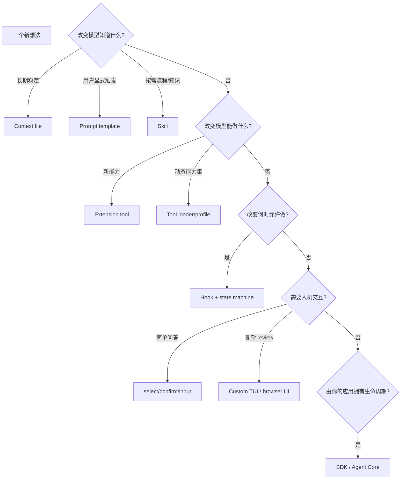

升级的判断标准：**低一级无法保证所需行为**，而不是“写 Extension 更酷”。

- 一条 prompt 能稳定解决，就不要加运行时。
- 一条 prompt 只能“请求模型别写”，但需求是审批前绝不写，就必须加 tool gate。
- 一个 Extension 工具能解决，就不要先搭多 Agent workflow。
- 当你的产品拥有用户、存储、daemon 或远程 API，才从 Extension 走向 SDK/Core。

## 2. 能力阶梯

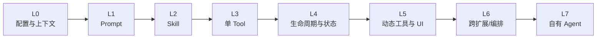

| 级别 | 做一个什么实验 | 学到的核心边界 | 何时停在这里 |
| --- | --- | --- | --- |
| L0 | 项目 `AGENTS.md` + 模型/工具 profile | 上下文主权 | 只是团队规则 |
| L1 | `/review` prompt template | 显式可复用输入 | 只有短流程 |
| L2 | 一个带 reference/script 的 Skill | progressive disclosure | 流程按需、无需 Hook |
| L3 | 注册 `text_stats` tool | schema、result、取消 | 无持久状态 |
| L4 | branch-aware counter/plan | journal、replay、lifecycle | 无复杂 UI/组合 |
| L5 | tool loader 或 review overlay | active tools、TUI/headless | 单包可拥有能力 |
| L6 | Plan ↔ Goal 协议或 sub-agent flow | 协议、预算、共存 | Pi 仍是主产品 |
| L7 | `pi-ai` + Agent Core 领域 Harness | 自有 session/UI/部署 | 你的应用拥有生命周期 |

不要为了“完成路线”走到 L7。多数高价值定制停在 L2–L4，维护成本最低。

## 3. L0：先把默认 Pi 变成你的工作台

### 建立三个小 profile，而不是安装所有东西

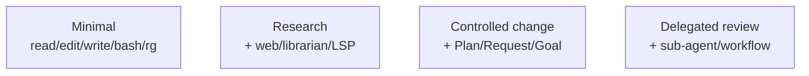

推荐按任务选择：

| Profile | 能力 | 适用任务 | 不应默认加入 |
| --- | --- | --- | --- |
| Minimal | 内置工具 + `rg` | 小改动、日常问答 | MCP 全目录、多 Agent |
| Research | `rg`、LSP、Web、研究 Skill | 架构调查、库源码 | 写入型自动化 |
| Controlled | Plan、Request、Goal、LSP | 大改动、需审批、长任务 | 无关外部 server |
| Delegated | focused child agents | 多视角 review、独立模块 | 简单单文件任务 |

安装越多，tool schema、Hook 顺序、供应链和共享 UI 面越大。Pi 的可玩性来自**可换装**，不是常驻全装备。

### 用 `/tree` 做低成本 A/B 实验

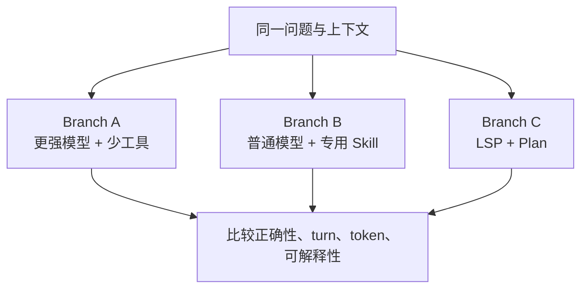

不要只比较最终答案。记录：模型是否选对工具、是否重复读取、压缩前 context 大小、失败能否解释、用户需要几次纠偏。

## 4. L1：Prompt template——把高频开场白变成命令

适合“每次都由用户显式启动”的短工作流：

```markdown
# Review current change

Review the current diff for correctness, regressions, and unnecessary
complexity. Report findings by severity with exact file paths. Do not edit.
```

它比全局 system prompt 好，因为只有 `/review` 时进入上下文；比 extension command 轻，因为不需要运行状态。

### 升级信号

- 需要按任务自动发现 → Skill；
- 需要访问新外部 API → Tool；
- “不要编辑”必须不可绕过 → Extension gate；
- 需要结构化多选/批准 → Request/UI。

## 5. L2：Skill——把知识做成按需工具箱

一个 Skill 最小包含 `SKILL.md`，可附 references、scripts 和 assets：

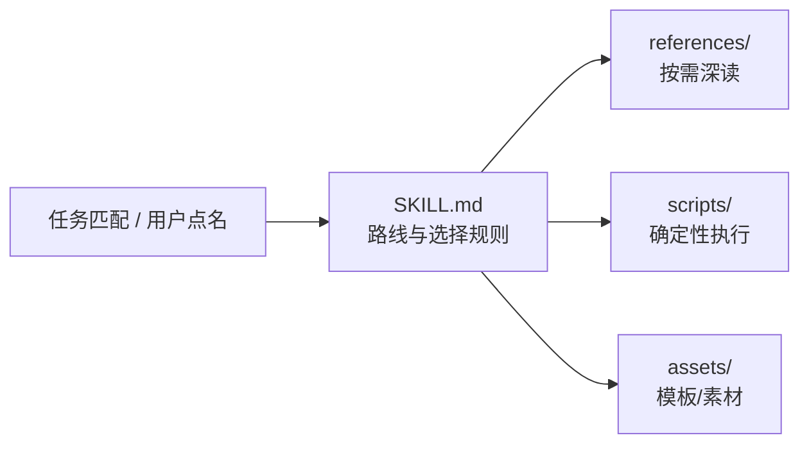

### 好 Skill 的分层

- `SKILL.md`：只放决策路线、必守约束和资源索引；
- references：框架版本、协议细节、大篇案例；
- scripts：重复且确定性的转换/验证；
- assets：不要让模型重新创造的模板。

生活化类比：`SKILL.md` 是急救箱盖上的流程图，不是把整本医学教材贴在盖上；某种伤情出现后再取对应说明和器械。

### 实验建议

把一个长 system prompt 拆成 Skill，比较：

1. 不相关请求的 context token 是否下降；
2. 相关请求能否自动/显式正确触发；
3. reference 是否只在真正需要时读取；
4. script 是否取代了模型反复手写脆弱命令。

## 6. L3：第一个 Extension Tool

### 最小包结构

```text
my-extension/
├── package.json
├── package-lock.json
└── src/
    └── index.ts
```

`package.json` 基线：

```json
{
  "name": "my-pi-extension",
  "version": "0.1.0",
  "private": true,
  "type": "module",
  "keywords": ["pi-package"],
  "pi": { "extensions": ["./src/index.ts"] },
  "peerDependencies": {
    "@earendil-works/pi-ai": ">=0.81.0",
    "@earendil-works/pi-coding-agent": ">=0.81.0",
    "typebox": ">=1.0.0"
  },
  "engines": { "node": ">=22.19.0" }
}
```

本地类型检查再把 host packages、TypeScript、tsx、`@types/node` 放入 `devDependencies`；不要把第二份 Pi host runtime 捆进普通 `dependencies`。

### 一个无文件权限陷阱的可运行工具

```ts
import { Type } from "typebox";
import type { ExtensionAPI } from "@earendil-works/pi-coding-agent";

export default function textStatsExtension(pi: ExtensionAPI): void {
  pi.registerTool({
    name: "text_stats",
    label: "Text Stats",
    description: "Count lines, words, and Unicode code points in supplied text",
    promptSnippet: "text_stats: count lines, words, and characters in text",
    parameters: Type.Object({
      text: Type.String({ description: "Text to measure" }),
    }),
    async execute(_toolCallId, params, signal) {
      if (signal?.aborted) throw new Error("Operation aborted");

      const lines = params.text.length === 0 ? 0 : params.text.split(/\r?\n/).length;
      const words = params.text.trim() === "" ? 0 : params.text.trim().split(/\s+/u).length;
      const codePoints = [...params.text].length;

      return {
        content: [{
          type: "text",
          text: `lines=${lines}, words=${words}, codePoints=${codePoints}`,
        }],
        details: { lines, words, codePoints },
      };
    },
  });
}
```

这个例子刻意把职责分开：

- TypeBox schema 让 Provider 与 runtime 都知道参数；
- `content` 是模型可行动摘要；
- `details` 是结构化结果；
- abort 是一等输入；
- 没有用 UI，也没有把纯计算做成后台资源。

有限字符串枚举使用 `StringEnum` from `@earendil-works/pi-ai`，不要用 `Type.Union(Type.Literal(...))`；后者与 Google tool schema 不兼容。

### 本地加载

开发时把 package 根目录链接到全局 extension 目录，然后 `/reload`：

```bash
mkdir -p "$HOME/.pi/agent/extensions"
ln -sfn "$PWD/my-extension" "$HOME/.pi/agent/extensions/my-extension"
```

也可用 CLI `-e` 临时加载，或完成 package 后 `pi install npm:...` / `pi install git:...`。

### 什么时候继续升级

- tool 结果需要跨 reload/branch 恢复 → L4 journal；
- 首次调用要启动 server → L4 resource lifecycle；
- 工具非常多 → L5 loader；
- 需要 review/选项 → L5 UI。

## 7. L4：加入 branch-aware 状态

先定义纯状态与严格 decoder，再接 Pi：

```ts
type State = { count: number };
type Journal = {
  version: 1;
  action: "set" | "clear";
  state: State | null;
};

const STATE_TYPE = "example-counter-v1";

function decodeJournal(value: unknown): Journal | undefined {
  if (!value || typeof value !== "object") return undefined;
  const data = value as Record<string, unknown>;
  if (data.version !== 1) return undefined;
  if (data.action !== "set" && data.action !== "clear") return undefined;
  if (data.state !== null) {
    if (!data.state || typeof data.state !== "object") return undefined;
    const count = (data.state as Record<string, unknown>).count;
    if (!Number.isSafeInteger(count) || (count as number) < 0) return undefined;
  }
  return data as Journal;
}
```

Composition root：

```ts
export default function counterExtension(pi: ExtensionAPI): void {
  let state: State | undefined;

  function restore(ctx: ExtensionContext): void {
    state = undefined;
    for (const entry of ctx.sessionManager.getBranch()) {
      if (entry.type !== "custom" || entry.customType !== STATE_TYPE) continue;
      const journal = decodeJournal(entry.data);
      if (!journal) continue;
      state = journal.action === "clear" ? undefined : journal.state ?? undefined;
    }
    ctx.ui.setStatus("example-counter", state ? `Count ${state.count}` : undefined);
  }

  function persist(ctx: ExtensionContext, next: State | undefined): void {
    state = next;
    pi.appendEntry<Journal>(STATE_TYPE, {
      version: 1,
      action: next ? "set" : "clear",
      state: next ?? null,
    });
    ctx.ui.setStatus("example-counter", next ? `Count ${next.count}` : undefined);
  }

  pi.on("session_start", (_event, ctx) => restore(ctx));
  pi.on("session_tree", (_event, ctx) => restore(ctx));
  pi.on("session_shutdown", (_event, ctx) => {
    ctx.ui.setStatus("example-counter", undefined);
  });

  // registerTool / registerCommand 调用 persist(...)
}
```

`ExtensionContext` 的实际 import 与你的包版本保持一致。重点不是复制代码，而是四条不变量：

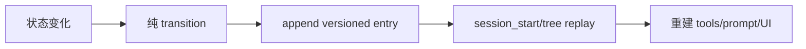

不要把 UI footer、模块变量或“session 文件最后一行”当作事实源。

## 8. L4 的另一条支线：懒启动外部资源

适合 LSP、MCP、database、browser：

```ts
let resource: Resource | undefined;
let starting: Promise<Resource> | undefined;

async function getResource(ctx: ExtensionContext): Promise<Resource> {
  if (resource?.cwd === ctx.cwd) return resource;
  if (starting) return starting;

  starting = (async () => {
    const previous = resource;
    resource = undefined;
    if (previous) await previous.close();
    resource = await Resource.start(ctx.cwd, ctx.isProjectTrusted());
    return resource;
  })().finally(() => {
    starting = undefined;
  });

  return starting;
}

pi.on("session_shutdown", async () => {
  const current = resource;
  resource = undefined;
  starting = undefined;
  await current?.close();
});
```

加上实际工程所需的启动失败清理、timeout、AbortSignal、stderr 处理和进程树终止。`starting` 的作用是把并发首次调用合并成一个初始化。

## 9. L5：大量工具用 progressive disclosure

错误做法：注册并启用 80 个低频工具。正确结构：全部注册，但默认只激活 loader/search。

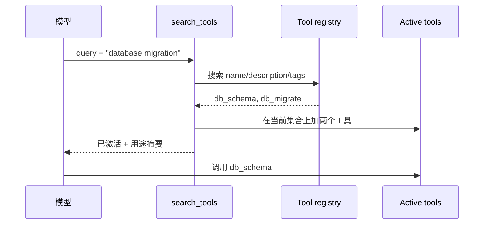

规则：

1. 每个真实工具仍 `registerTool`，可在 `getAllTools()` 发现；
2. loader 保持 active，领域工具初始 inactive；
3. 激活是 additive：基于 `getActiveTools()` 加入，不在同一调用删除他人工具；
4. 返回激活了什么及原因；
5. 对 metadata 建索引，不把所有完整 schema塞进 loader result；
6. 工具 profile 切换需要租约/所有权，不可盲写旧 snapshot。

这个模式既适合 MCP，也适合大型企业 API、数据平台和设备控制。

## 10. L5：UI 从简单选择开始

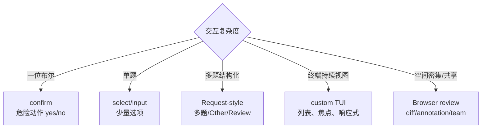

实践顺序：先实现 headless 语义，再加漂亮 UI。

| 环境 | 危险动作 | 可选配置 | 只读状态 |
| --- | --- | --- | --- |
| TUI | 弹窗审批 | 选择器 | widget/status |
| RPC with UI | 通用 dialog | 宿主表单 | 事件投影 |
| Print/JSON | 安全拒绝或显式 flag | 配置默认 | 结构化输出 |

不要让 `ctx.ui.confirm()` 在无 UI 中的缺省行为成为授权逻辑。

## 11. L6：跨扩展协议

当两个能力可以独立安装，却需要协作时使用事件总线：

```ts
import type { ExtensionAPI, ExtensionContext } from "@earendil-works/pi-coding-agent";

const CHANNEL = "acme:review-state:v1";

type ReviewSignal = {
  version: 1;
  sessionId: string;
  phase: "idle" | "reviewing" | "approved";
};

const REVIEW_PHASES = new Set<ReviewSignal["phase"]>([
  "idle",
  "reviewing",
  "approved",
]);

function parseSignal(value: unknown): ReviewSignal | undefined {
  if (!value || typeof value !== "object") return undefined;
  const data = value as Record<string, unknown>;
  if (data.version !== 1 || typeof data.sessionId !== "string") return undefined;
  if (typeof data.phase !== "string") return undefined;
  if (!REVIEW_PHASES.has(data.phase as ReviewSignal["phase"])) return undefined;

  return {
    version: 1,
    sessionId: data.sessionId,
    phase: data.phase as ReviewSignal["phase"],
  };
}

export function registerReviewProtocol(
  pi: ExtensionAPI,
  applySignal: (signal: ReviewSignal) => void,
): { emit(ctx: ExtensionContext, phase: ReviewSignal["phase"]): void } {
  const unsubscribe = pi.events.on(CHANNEL, (value) => {
    const signal = parseSignal(value);
    if (signal) applySignal(signal);
  });

  pi.on("session_shutdown", () => unsubscribe());

  return {
    emit(ctx, phase) {
      pi.events.emit(CHANNEL, {
        version: 1,
        sessionId: ctx.sessionManager.getSessionId(),
        phase,
      } satisfies ReviewSignal);
    },
  };
}
```

协议设计检查：

- 名称带版本；
- payload 是 snapshot 而非可变对象；
- 接收方缺失无副作用；
- late subscriber 能在 session start/tree 获得重播；
- 信号绑定 session id，避免跨 session 误用；
- 两端有 coexistence test。

若包必须同步发布且总是同时安装，普通共享 library 可能更简单；不要为了“松耦合”把所有函数调用都改成事件。

## 12. L6：组合玩法配方

### 配方 A：受控大型改动

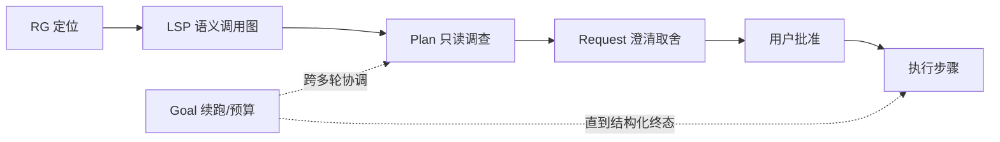

适合：迁移、跨包协议、风险改动。简单 bug 不要开启 Goal；没有真实取舍不要打断用户。

### 配方 B：证据型技术研究

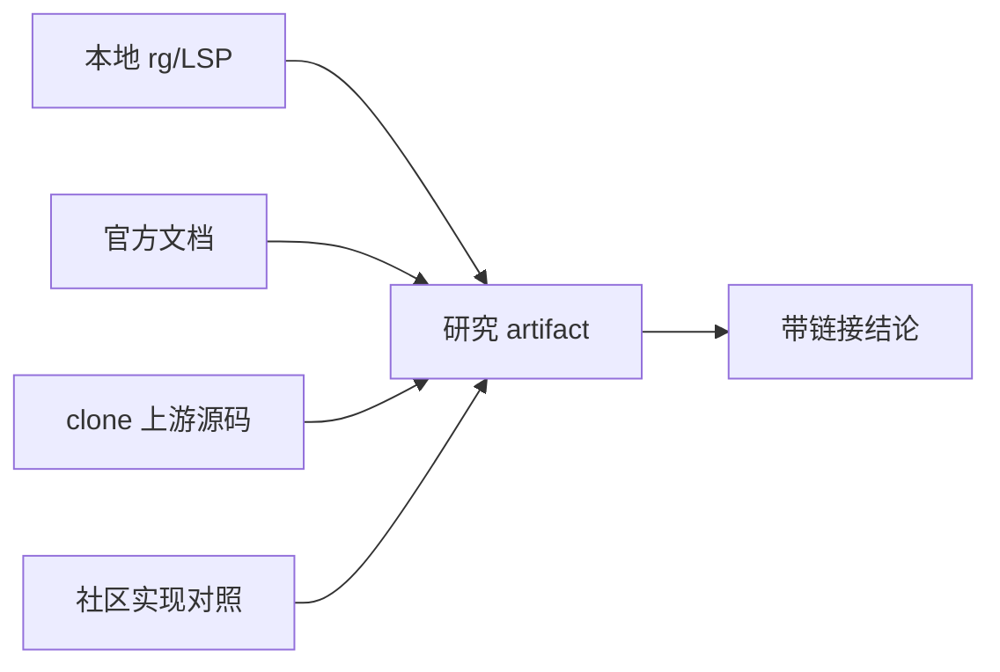

适合：库行为、版本迁移、架构比较。Web Tool 负责获取，Librarian Skill 负责证据方法；不要让搜索摘要取代原文。

### 配方 C：多视角 review

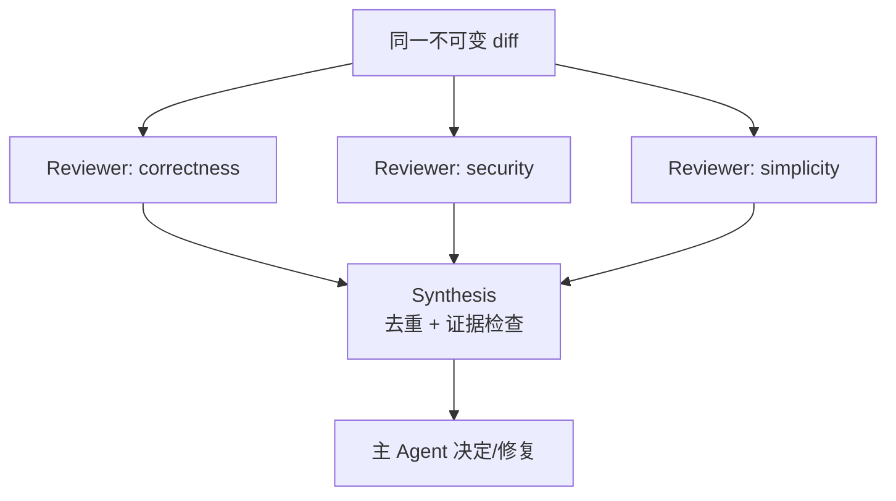

只有审查维度真正独立时才并行；三个 reviewer 用同一宽泛提示通常只是三倍成本。写入工作默认隔离 worktree，合并前验证冲突。

### 配方 D：低上下文 MCP


热工具可 direct，长尾工具保持 proxy。定期检查 metadata cache、server 权限和 spill 文件。

## 13. L7：从 Extension 升级为领域 Agent

升级信号通常至少出现三项：

- 你的系统有自己的用户/身份和认证；
- run 不再等同于 Pi session；
- 需要 Redis/数据库/对象存储等自有持久化；
- 需要 Web/移动/daemon，而 TUI 只是一个客户端；
- 权限和 sandbox 由服务端策略控制；
- 领域事件、审计和队列是主业务；
- Coding Agent 的 context/resource 发现反而成为限制。

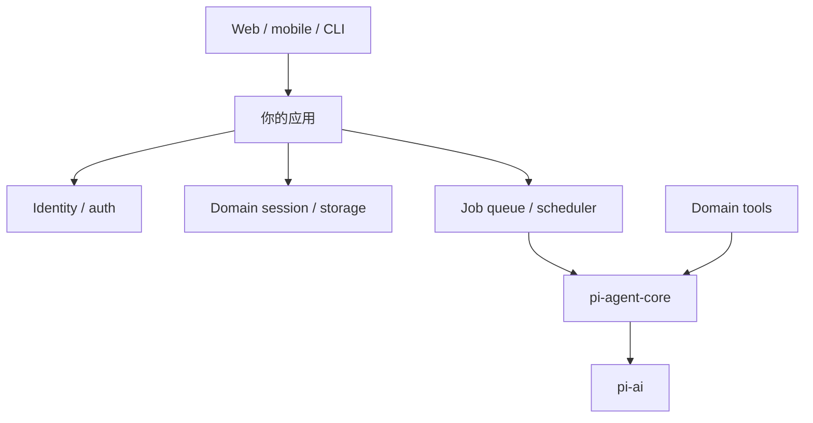

此时先直接使用 Agent Core，而不是复制 loop。只有目标平台或长期产品语义与 package 明显不兼容，才 port/internalize。

四种路线的真实源码责任与演进代价，可对照[上一篇的源码比较框架与产品案例](05-ecosystem-and-agents.md)：Swagen/Wednesday 由 Core 建自有 Harness，Pi-Droid 因平台移植，OpenClaw 因 Gateway 身份与安全模型内化运行时。

## 14. 调试玩法：把“模型玄学”拆成可观察变量

### 四次对照

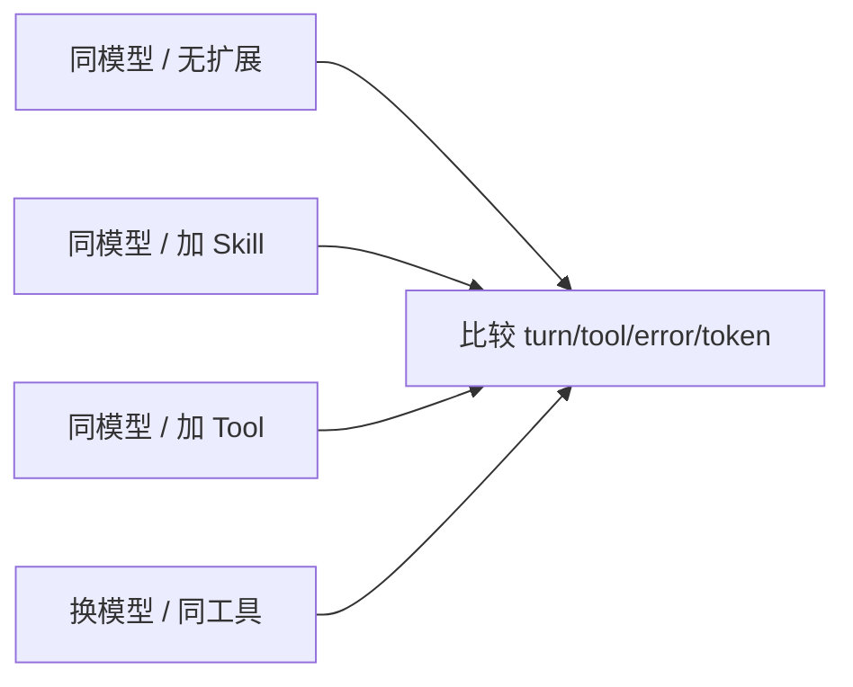

### 观察点

- `before_agent_start`：最终 system prompt 包含哪些资源；
- `context`：每次 Provider 前哪些消息被裁剪；
- `tool_execution_*`：开始、更新、完成顺序；
- `agent_end` 与 `agent_settled`：是否有 retry/compaction/follow-up；
- session tree：custom entry 是否落在正确 branch；
- `getActiveTools()`：扩展切换前后是否误删他人工具；
- JSON/RPC mode：UI 之外的事件与结构化结果是否完整。

低层 Provider payload 调试才使用 `before_provider_request`，并删除日志中的 secret/content；不要把永久调试 Hook 带进正常使用。

## 15. 一个循序实验清单

1. 用 `AGENTS.md` 写一条可验证项目规则，观察它是否稳定生效。
2. 把低频长规则移到 Skill，验证不相关请求不再携带它。
3. 写 `text_stats` Tool，观察 schema、stream event 与 tool result。
4. 为 Tool 加 slash command，区分用户控制面和模型控制面。
5. 加 versioned custom entry，测试 `/reload`、`/tree`、`/fork`。
6. 加一个 lazy resource，测试并发首次调用、abort、cwd 切换、shutdown。
7. 加 active-tool loader，确认不覆盖其他扩展。
8. 加 headless-safe 的选择/审批 UI。
9. 与第二个扩展建立 v1 event protocol，并写 coexistence test。
10. 用 Agent Core 做一个只有 2–3 个领域工具的小程序，比较它与 Extension 的生命周期差异。

每一步只引入一个新边界。若同一步同时加状态、UI、网络、子进程和协议，失败后无法知道是哪层设计错了。

## 16. 本篇结论

Pi 最有趣的玩法不是堆功能，而是用同一个 Harness 做受控实验：

- 用 branch 比较上下文策略；
- 用 Skill 把知识按需装入；
- 用 Tool 把确定性能力交给 runtime；
- 用 journal 把内存状态变成可恢复事实；
- 用 loader 管理上下文成本；
- 用 UI 把关键取舍还给人；
- 用 protocol 组合独立能力；
- 在产品拥有主生命周期时，切到 Agent Core。

停在满足需求的最低层，往往是最耐用的扩展。

## 参考资料

- [Pi Extensions](https://github.com/earendil-works/pi/blob/main/packages/coding-agent/docs/extensions.md)
- [Pi Packages](https://github.com/earendil-works/pi/blob/main/packages/coding-agent/docs/packages.md)
- [Pi SDK](https://github.com/earendil-works/pi/blob/main/packages/coding-agent/docs/sdk.md)
- [官方 extension examples](https://github.com/earendil-works/pi/tree/main/packages/coding-agent/examples/extensions)
- [本仓库开发参考](../pi-extension-development.md)
- [上一篇：社区生态与衍生 Agent](05-ecosystem-and-agents.md) · [下一篇：生产级最佳实践](07-production-checklist.md)
