# 07 · 生产级最佳实践：把自由度收敛成不变量

> 本篇不是风格建议，而是一份设计、实现、评审和发布检查表。目标：扩展在 reload、branch、compaction、并发、取消、无 UI、恶意输入和其他扩展共存时，仍保持同一行为契约。

## 1. 生产扩展的七个不变量

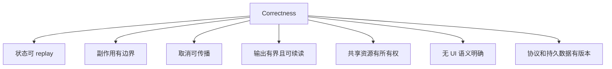

1. **状态可 replay**：当前行为由 active branch 的持久事实重建，不能依赖进程碰巧没重启。
2. **副作用有边界**：schema、runtime gate、canonical path、网络策略和外部 sandbox 分层约束。
3. **取消可传播**：一个 AbortSignal 穿过 Provider、工具、子进程、网络与清理逻辑。
4. **输出有界且可续读**：截断显式、完整结果可定位、`details` 也限长。
5. **共享资源有所有权**：active tools、UI wrapper、status key、进程和事件 listener 不覆盖他人。
6. **无 UI 语义明确**：确认缺失不能静默变批准；核心功能不依赖 TUI 组件存在。
7. **协议和持久数据有版本**：读取 `unknown`，验证后才进入状态机。

## 2. 架构：Composition root 只接线

推荐目录：

```text
src/
├── index.ts          # 生命周期状态、注册、依赖接线
├── state.ts          # 纯状态/transition/decoder
├── tools.ts          # tool 契约与执行适配
├── tool-schema.ts    # TypeBox schema
├── command.ts        # 用户控制面
├── prompts.ts        # 可测试的 prompt 生成
├── protocol.ts       # 版本化跨扩展消息
├── output.ts         # 有界格式化与 details
└── resource.ts       # 外部 client/process lifecycle
```

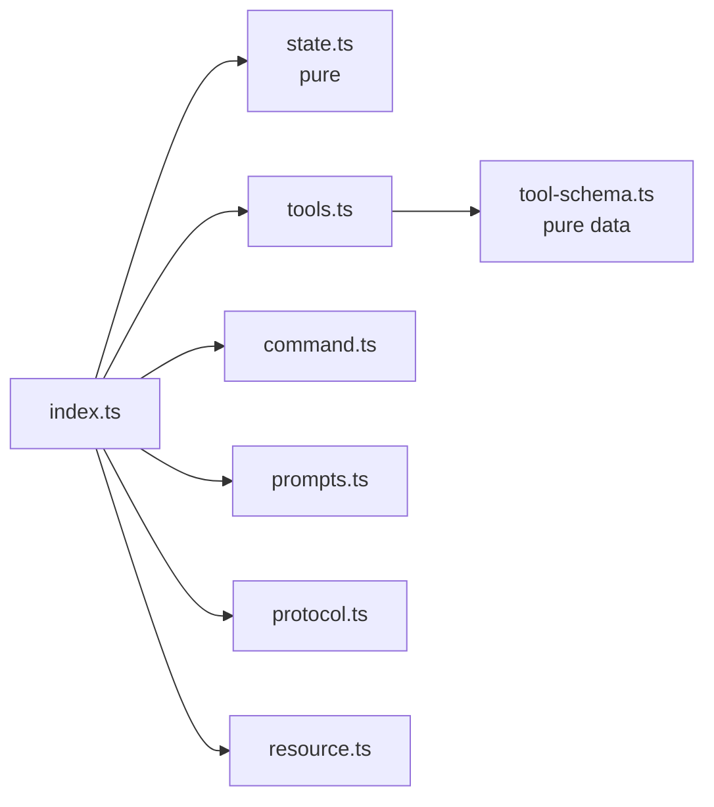

### 检查表

- [ ] `index.ts` 只保存生命周期状态和接线，不堆解析、格式化、协议和业务 transition。
- [ ] 状态 transition 对同一输入确定、无 I/O，可独立测试。
- [ ] Tool/command 最终调用同一领域操作，不维护两套不变量。
- [ ] Prompt 生成是纯函数；所有用户数据先转义或明确包为不可信数据。
- [ ] 长生命周期资源封装在 class/manager，显式 `shutdown()`。
- [ ] 没有为一次小能力引入容器、DI 框架或通用 registry。

### 反模式

| 反模式 | 为什么会坏 | 改法 |
| --- | --- | --- |
| 所有逻辑在 factory 闭包 | 状态、恢复、测试和清理纠缠 | 纯模块 + composition root |
| 用 event bus 替代包内函数调用 | 调用关系不可追踪、类型变弱 | 只在独立 package 边界用协议 |
| 为未来 Provider/存储预造抽象 | 当前无第二实现，接口会猜错 | 先做直接实现，第二个真实实现再抽象 |
| 捕获所有错误后返回“成功” | Pi/模型无法识别失败 | validation/execution `throw Error` |

## 3. Tool 契约：描述、schema、runtime 必须一致

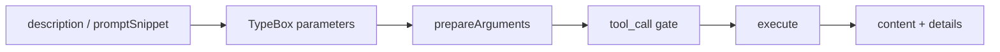

### Schema

- [ ] 参数对象严格、字段有具体 description，有限范围有 minimum/maximum。
- [ ] 字符串枚举使用 `StringEnum`，兼容 Google tool schema。
- [ ] 可选字段只有确实可省略时使用 `Type.Optional`。
- [ ] 不用 `any` 绕过 schema；进入领域层前已验证。
- [ ] 旧 session 的历史参数兼容放在 `prepareArguments`，不污染当前公开 schema。
- [ ] Tool name 稳定、全局唯一、使用可读 namespace；重命名考虑旧 session replay。

### Description

- [ ] 说明“什么时候用”和关键副作用，不写模型已知的宣传文案。
- [ ] 参数语义不与 schema 重复矛盾。
- [ ] 高风险动作明确需要何种前置状态/批准。
- [ ] `promptSnippet` 只放一行发现信息；复杂指南用 `promptGuidelines`/Skill。

### Execute

- [ ] 入口先检查 `signal?.aborted`，长步骤之间继续检查。
- [ ] 失败抛 `Error`，错误文本可行动且不泄密。
- [ ] `onUpdate` 只发有界进度，不重复发送整个累计大输出。
- [ ] 无法安全并行的工具声明 sequential，或在内部按资源排队。
- [ ] `details` JSON 可序列化，不放 live client、Error object、函数或 secret。
- [ ] Tool result 只声称实际观察的事实，不把 fallback 当主路径成功。

## 4. 状态：Event journal + 纯 replay

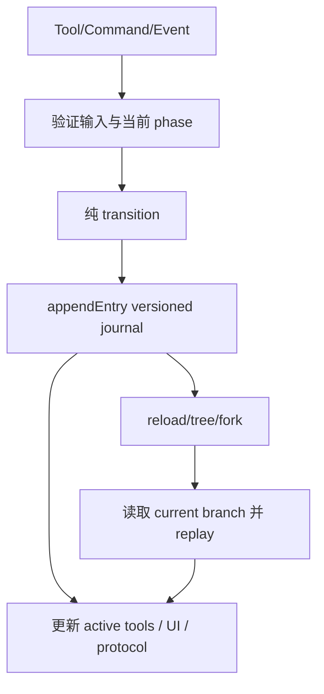

### 持久化数据

- [ ] `customType` 含 owner/能力/version，避免冲突。
- [ ] payload 自带 `version`；decoder 输入为 `unknown`。
- [ ] 未知版本、字段类型错误、非法 enum 不直接类型断言。
- [ ] 明确坏 entry 的策略：忽略并警告、fail closed，或迁移；不要半恢复。
- [ ] Journal entry 保存不可变 snapshot/transition，不引用随后会改变的对象。
- [ ] 清空状态也追加显式 tombstone/action，不能只删内存。

### Branch

- [ ] 恢复使用 `getBranch()`，不是文件最后 entry 或 `getEntries()` 的全局最后值。
- [ ] `session_start` 和 `session_tree` 都重建。
- [ ] fork/resume/new 后不复用旧 session manager、cwd 或资源。
- [ ] 状态注入模型时携带当前 session/phase，避免跨 branch 幽灵约束。
- [ ] Compaction 不被当作 extension state store；重要机器状态由 custom entry 保存。

### 状态机

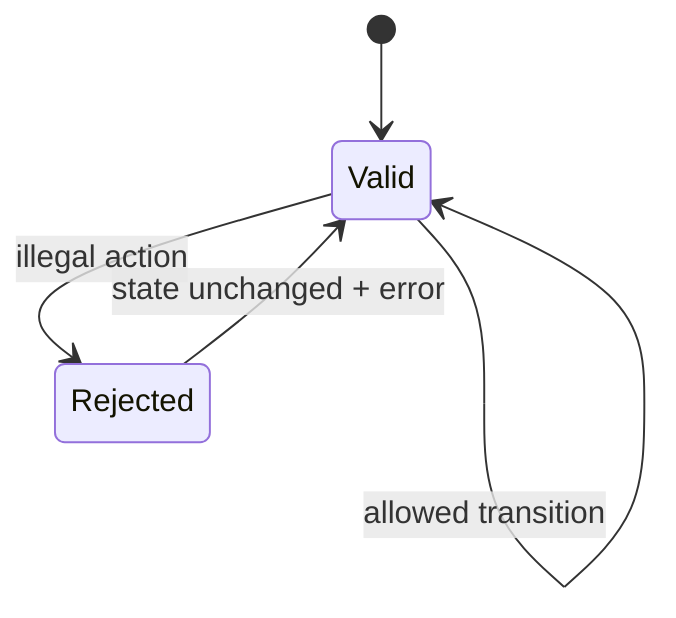

非法 transition 应保持原状态并返回错误；不要“尽量猜”用户想从 planning 跳到 completed。

## 5. 并发：先确定资源所有权，再选 primitive

| 场景 | 推荐 primitive | 原因 |
| --- | --- | --- |
| 两个独立只读 Tool | 并行 | 降低总延迟 |
| 同一文件 read-modify-write | keyed mutation queue | 覆盖整个临界区，不只锁最终 write |
| 首次启动一个 server | shared startup Promise | 合并并发初始化 |
| 多个 UI dialog | promise tail / coordinator | 单焦点、确定顺序 |
| 多个 client shutdown | `Promise.allSettled` + 每项 timeout | 一项失败不阻止其余清理 |
| command 改变 active run 状态 | abort → `waitForIdle()` → mutate | 避免工具/消息竞态 |
| 多 Extension 修改 active tools | Set merge / lease | 保留外部增删 |
| 子 Agent 写不同模块 | isolated worktrees | 副作用隔离，合并显式 |

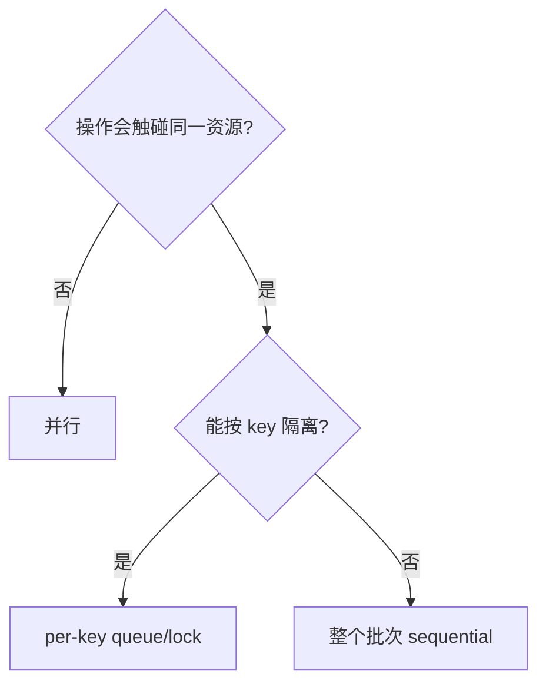

### 关键细节

- [ ] 锁的 key 是 canonical 目标，不是未经解析的用户路径。
- [ ] read-modify-write 的读取也在锁内，否则仍有 lost update。
- [ ] Promise cache 在 resolve/reject 后清理，失败不会永久卡住。
- [ ] 取消时不立即丢掉 child handle；先请求终止，再有界等待/kill process tree。
- [ ] Tool `executionMode` 反映副作用，不为追求速度强行并行。
- [ ] 事件 handler 可重入时有 run/session id 去重，避免自触发无限循环。

## 6. 生命周期与资源清理

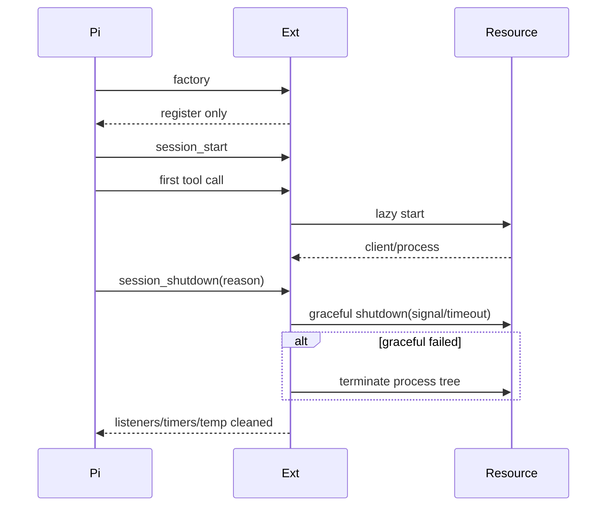

### 检查表

- [ ] Factory 不启动进程、timer、watcher、socket。
- [ ] 资源绑定 cwd/session/config identity；不只检查“对象存在”。
- [ ] 启动失败路径移除 listener、临时文件和半开进程。
- [ ] `session_shutdown` 处理 quit/reload/new/resume/fork。
- [ ] 所有 timer、Abort listener、event subscription 都保存 disposer。
- [ ] UI wrapper 只在仍由自己持有时恢复，不能覆盖后装扩展。
- [ ] 清理有 timeout；shutdown 不无限挂住退出。
- [ ] Temp artifact 有权限、命名、生命周期和 cleanup 策略。

## 7. 输出与上下文：任何外部结果都可能无限大

### 三级输出

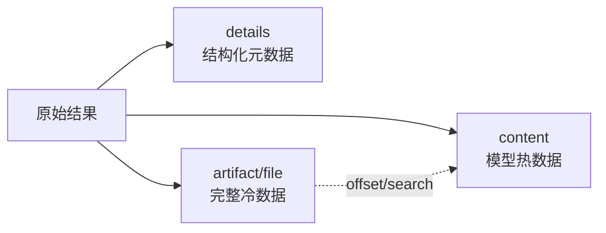

### 检查表

- [ ] 同时设 byte 与 line/item 上限，避免一个超长单行绕过。
- [ ] 截断文本说明 `shown/total`、省略量和继续方法。
- [ ] 完整输出落权限受控位置；路径可由模型后续读取。
- [ ] `details` 也有独立 byte 上限；不要藏一份完整巨型 JSON。
- [ ] 二进制/图片按 Provider 能力处理，不 base64 文本灌进上下文。
- [ ] 日志、stderr 和 Error stack 不默认全部进 tool content。
- [ ] Tool update 采用增量 chunk 或阶段摘要，不反复复制累计 buffer。
- [ ] Compaction summary 不能替代长期精确 artifact。

### 输出准确性

- [ ] fallback 结果标明实际来源与降级。
- [ ] partial failure 使用 `isError`/结构化状态，不能只在 prose 末尾说“部分失败”。
- [ ] 并行结果保留输入 identity，不能依赖完成顺序猜对应关系。
- [ ] 时间、token、cost 与统计值来自实际事件，不从自然语言推断。

## 8. 安全：先画真实信任边界

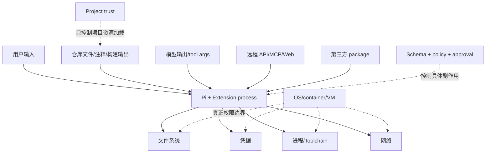

### 8.1 文件系统

- [ ] 用户路径相对 `ctx.cwd` 解析为绝对路径。
- [ ] 权限判断同时检查 lexical path 与 `realpath` canonical path，防 symlink escape。
- [ ] 新文件的 parent directory 也 canonicalize；处理目标尚不存在的情况。
- [ ] 拒绝 NUL、设备路径、意外 home 展开和平台特殊路径。
- [ ] 原子写：同目录临时文件、fsync/rename（按数据重要性）。
- [ ] 私有 artifact 使用限制权限；不要把 secret 写进共享 temp。

### 8.2 命令执行

- [ ] 使用 `pi.exec(executable, args, { cwd, signal, timeout })` 或等价 spawn 参数数组。
- [ ] 不拼接未转义 shell 字符串；确需 shell 时明确标记高风险。
- [ ] 环境变量采用 allowlist，避免把全部 host secret 传给 child。
- [ ] stdout/stderr 有界，进程退出码和 signal 明确。
- [ ] 终止进程树，不只 kill 父 PID。
- [ ] 无 UI 自动化中危险命令需要显式预授权策略，否则拒绝。

### 8.3 网络与 SSRF

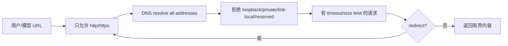

- [ ] 每次 redirect 重新验证，不只检查初始 URL。
- [ ] DNS 返回的所有地址都检查，防 rebinding/混合结果。
- [ ] 连接 IP 与验证 IP 一致，避免验证后再次解析。
- [ ] 限制 response byte、解压后 byte、content type、redirect 次数和 timeout。
- [ ] 凭据/header 不跨 origin redirect 泄漏。
- [ ] 浏览器 cookie 和 OAuth code 视为 secret。

### 8.4 Secret

- [ ] 从环境、OS keychain 或专用配置读取。
- [ ] 不进入 system prompt、Tool `content`、`details`、session entry、artifact、日志和错误。
- [ ] 日志有结构化 redaction，不靠调用者记得删除。
- [ ] 远程/子 Agent 只拿完成任务的最小短期凭据。
- [ ] 测试使用假 token，失败快照不含真实环境。

### 8.5 Project trust 与 Sandbox

- [ ] 理解 project trust 只控制项目动态资源加载。
- [ ] `AGENTS.md` 等仓库文本仍是不可信 prompt data。
- [ ] 第三方 global extension 与当前用户同权限。
- [ ] 不可信仓库/无人值守运行放进容器、VM、micro-VM 或 policy sandbox。
- [ ] 只挂载必要 workspace；写回宿主前 review diff。
- [ ] 不无条件挂载 `~/.pi/agent`、SSH、cloud credentials 和 Docker socket。

## 9. UI 与 Headless：同一状态，两种投影

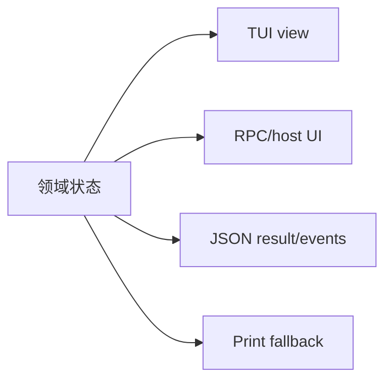

### 检查表

- [ ] `ctx.hasUI` 与 `ctx.mode === "tui"` 分开判断。
- [ ] TUI component 每行不超过 width；窄终端有降级布局。
- [ ] `render()` 无 I/O、无状态 transition、无昂贵解析。
- [ ] Overlay/dialog 可 abort、timeout、dispose；listener 只移除一次。
- [ ] 多 dialog 由 coordinator 串行化。
- [ ] Status/widget key 唯一；session start/tree 后从状态重建。
- [ ] 无 UI 返回结构化错误/使用明确配置默认/安全拒绝。
- [ ] UI 文本不会成为唯一审计记录；批准落 versioned state。
- [ ] Approval 绑定具体 operation/artifact hash，避免批准后内容被替换。

## 10. 扩展共存：共享面都需要协调规则

| 共享面 | 冲突 | 正确策略 |
| --- | --- | --- |
| Tool name | 后注册覆盖/歧义 | namespace、启动诊断、明确所有者 |
| Active tools | snapshot 写回误删他人 | Set merge；暂时接管用 lease |
| System prompt | 顺序覆盖 | 局部、幂等、有标记的链式修改 |
| `context` Hook | 双方裁剪同一消息 | 小范围变换、记录顺序假设、集成测试 |
| Event channel | payload 漂移 | 版本名 + unknown parser |
| UI status/widget | key 冲突 | package 前缀 key |
| UI method wrapper | shutdown 恢复错误 | identity check，only restore what you own |
| 外部进程 | 同服务重复启动 | shared manager/port ownership/lock |
| Temp artifact | 名称/清理冲突 | package namespace + session/run id |

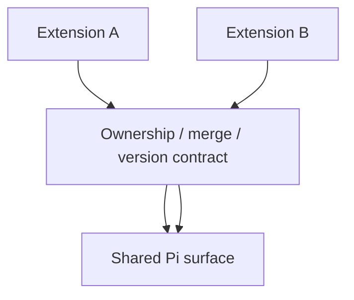

### 加载顺序

- [ ] 若行为依赖顺序，在文档和测试中明确；能消除则消除。
- [ ] Handler 对其他扩展缺失、晚加载、reload 都安全。
- [ ] 不使用跨目录生产 import 强迫两个独立 package 耦合。
- [ ] 协议改变同时更新所有发送方/接收方和 coexistence suite。
- [ ] Extension 卸载后不留下 active tool、listener、widget 或进程。

## 11. Provider 与上下文 Hook：使用最高层可满足需求的 API

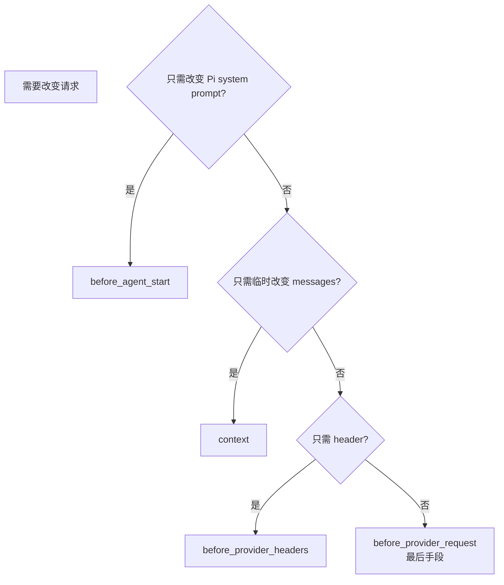

- [ ] Provider payload Hook 不假设所有 Provider 同结构。
- [ ] 改 payload 的扩展记录 provider/api/version 范围。
- [ ] Header 不含可由 Tool/模型回显的 secret。
- [ ] Retry header 语义理解清楚：同一次 Provider retry 可能复用 header。
- [ ] Context Hook 结果不被误认为已持久化。
- [ ] 自定义 AgentMessage 的 `convertToLlm` 有最后消息有效性测试。

## 12. 配置：严格、分层、可解释

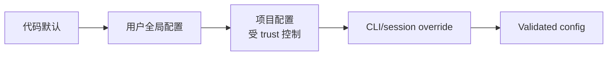

### 检查表

- [ ] 配置 schema、默认值、版本和 precedence 写入 README。
- [ ] 未知字段和非法 enum 报错，不静默拼写纠正。
- [ ] 安全相关缺省 fail closed；便利 fallback 不改变权限。
- [ ] Project 配置只在 `ctx.isProjectTrusted()` 下加载。
- [ ] 路径基于当前 cwd/config file，而不是 process 启动目录猜测。
- [ ] Reload 后重新解析，旧 config object 不跨 session 泄漏。
- [ ] Config error 指明文件、字段和修正方法，不打印 secret value。
- [ ] 环境变量覆盖规则明确；空字符串与 unset 分开。

## 13. 测试：按故障边界组织，不按函数数量组织

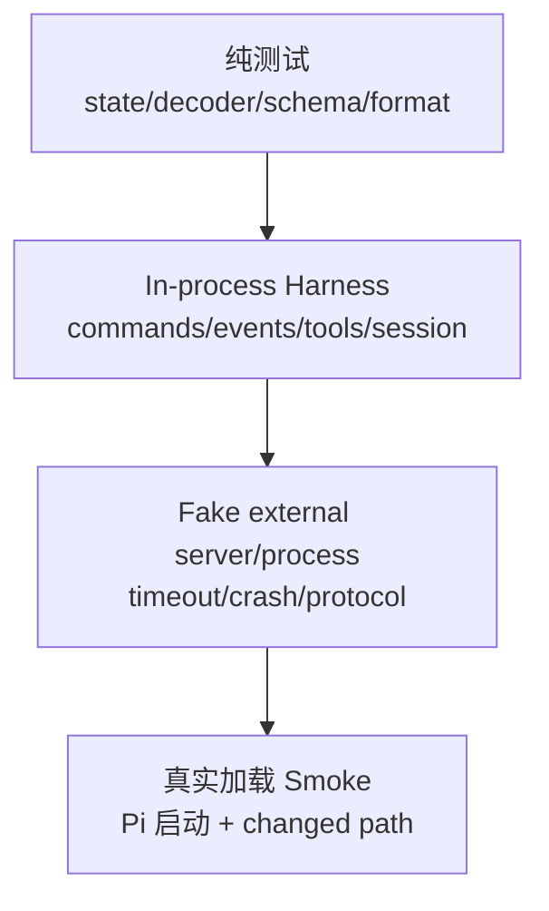

### 13.1 纯契约

- [ ] 所有合法/非法 transition；状态不变量。
- [ ] unknown persisted/config/protocol input 的边界。
- [ ] 输出 truncation 的 byte/line/Unicode/空值边界。
- [ ] 工具集合 lease 的外部 add/remove 组合。
- [ ] prompt 中用户数据的转义与优先级。

### 13.2 生命周期 Harness

- [ ] startup/reload/new/resume/fork/tree/compact/shutdown。
- [ ] Command 与 Tool 对同一操作行为一致。
- [ ] approval 前的 runtime gate 确实阻止副作用。
- [ ] `agent_end` 后 retry/compaction/follow-up 与 `agent_settled` 区别。
- [ ] 无 UI、TUI、RPC/headless fallback。
- [ ] 两个扩展加载顺序、active tools 和协议共存。

### 13.3 外部资源

- [ ] 初始化失败、协议错误、stderr、大输出。
- [ ] request timeout、abort、process crash、idle cleanup。
- [ ] 并发首次调用只创建一个 client。
- [ ] 一台 server 失败不丢其他 server 结果。
- [ ] Shutdown 有界，临时目录在 cleanup hook 删除。

### 13.4 测试质量

- [ ] 每个测试保护可观察契约，并能因一个可信 bug 失败。
- [ ] 不断言源码文本、私有字段顺序或偶然格式。
- [ ] 不使用真实网络、真实 API key、共享 home/session。
- [ ] Temp workspace 隔离且无论成功失败都清理。
- [ ] 时间测试使用 fake clock/事件，不用不稳定 sleep。

## 14. 发布与兼容

### Package

- [ ] `type: "module"`，本地 import 显式 `.ts`（源码直接加载方案）。
- [ ] `pi.extensions` 指向真实入口；发布 `files` allowlist 包含运行所需文件。
- [ ] Host packages 和 TypeBox 是 peer dependencies；本地检查放 devDependencies。
- [ ] 第三方运行时库放 `dependencies`，不能依赖 dev-only module 偶然存在。
- [ ] `keywords: ["pi-package"]`、repository、license、description 准确。
- [ ] Node/Pi engine 与实际使用 API 一致。
- [ ] Lockfile 随依赖更新；不使用浮动危险 install script 而无说明。

### 兼容

- [ ] Tool schema 变化考虑旧 session 中已存 tool call。
- [ ] Custom entry/protocol/config 分别版本化，不共用模糊“v1”。
- [ ] Clean cutover 更新所有调用方；除非真实兼容需求，不留永久 alias/shim。
- [ ] Extension README 同步命令、工具、状态、配置、安装和架构行为。
- [ ] 跨扩展变化更新每个受影响 README。

### 发布验证

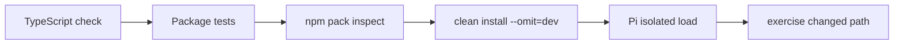

本仓库单包变更至少在该扩展目录运行：

```bash
npm run check
npm test
```

独立加载 smoke：

```bash
pi --no-session -p --extension "$PWD/my-extension" \
  "Reply with exactly: SMOKE_OK"
```

行为变更还要实际触发对应 Tool/Command/Hook；只收到 `SMOKE_OK` 只能证明“能加载”，不能证明功能正确。

## 15. 评审用反模式对照表

| 看见这段设计 | 立即追问 | 更安全的方向 |
| --- | --- | --- |
| “Prompt 告诉模型不要写” | runtime 怎样保证？ | `tool_call` gate + active tools |
| “状态存在全局变量” | reload/tree 后怎样恢复？ | versioned custom journal |
| “返回完整 API JSON” | 上限和敏感字段呢？ | summary + bounded details + artifact |
| “用户会确认” | JSON/print 模式呢？ | headless fail closed / explicit policy |
| “路径 startsWith workspace” | symlink/前缀碰撞呢？ | resolve + relative + realpath |
| “URL 不是 localhost” | DNS/IPv6/redirect 呢？ | address classification every hop |
| “kill(pid)” | child process tree 呢？ | managed process group/tree shutdown |
| “保存 active tools，结束时写回” | 期间其他扩展的变化呢？ | lease reconcile |
| “并行更快” | 是否写同一资源？ | executionMode/queue/worktree |
| “catch 后返回错误文本” | `isError` 是否正确？ | throw `Error` / failed result |
| “UI 里显示已批准” | 持久审批记录在哪里？ | artifact hash + journal transition |
| “Extension 提供沙箱” | 与 Pi 同进程怎么隔离？ | 外部 OS/container boundary |

## 16. Definition of Done

### 功能

- [ ] 用户请求的完整路径可执行，不是 scaffold/stub。
- [ ] Tool、Command、UI 与文档描述一致。
- [ ] 错误、取消、无 UI、reload、branch 路径有明确行为。

### 状态与共存

- [ ] Active branch 可恢复；旧/坏数据有策略。
- [ ] 不覆盖其他 extension 的 tools/UI/listeners。
- [ ] 协议和共享 surface 有所有权与版本。

### 安全

- [ ] 文件、命令、网络、secret 和第三方进程边界已逐项检查。
- [ ] Project trust 未被误称为 sandbox。
- [ ] 不可信执行有外部隔离建议/默认。

### 资源与上下文

- [ ] 所有长资源有 start/reuse/abort/shutdown 路径。
- [ ] content/details/artifact 均有上限和生命周期。
- [ ] Context 注入按需、幂等、无 secret。

### 证据

- [ ] 类型检查通过。
- [ ] 覆盖新可观察契约的测试通过。
- [ ] 实际 changed path smoke test 通过。
- [ ] README 与配置/行为同步。
- [ ] 发布包在无 devDependencies 环境可加载。

## 17. 最后的设计判断

生产级 Pi Extension 的难点从来不是 `registerTool()`。真正决定质量的是：


Pi 选择不替作者固定工作流，因此作者必须把自己的不变量做实。最小核心给了你控制权；可靠状态机、并发边界、输出预算和安全模型，是使用这份控制权必须支付的工程成本。

## 参考资料

- [Pi Extensions](https://github.com/earendil-works/pi/blob/main/packages/coding-agent/docs/extensions.md)
- [Pi Security](https://github.com/earendil-works/pi/blob/main/packages/coding-agent/docs/security.md)
- [Pi Packages](https://github.com/earendil-works/pi/blob/main/packages/coding-agent/docs/packages.md)
- [Pi Compaction](https://github.com/earendil-works/pi/blob/main/packages/coding-agent/docs/compaction.md)
- [本仓库开发参考与检查表](../pi-extension-development.md)
- [本仓库 Repository Guidelines](../../AGENTS.md)
- [上一篇：扩展可玩性攻略](06-extension-playbook.md) · [返回系列导航](README.md)
