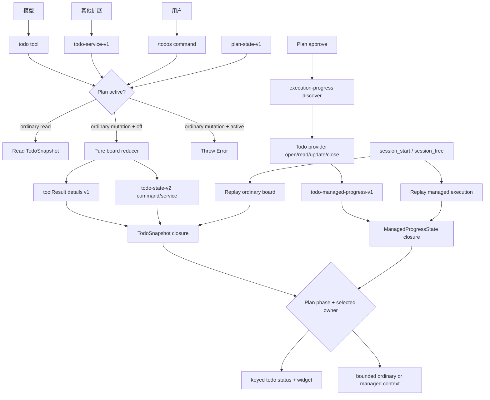
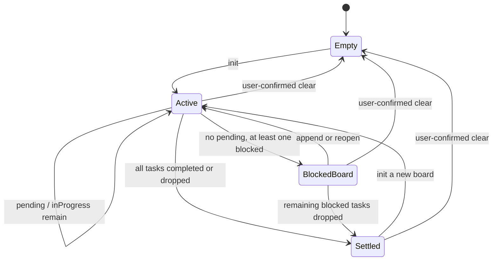

# 08 · Todo 扩展实现：分支可恢复的任务执行账本

> 文档状态：当前实现已验证，包含模型工具/用户命令、Todo service v1、custom journal v2、Plan managed provider v1，以及 Plan blocked phase / journal v3 协作。实现位于 `todo/`，研究与验收更新至 2026-07-25；运行 API 基线为 `@earendil-works/pi-coding-agent 0.81.1`，扩展兼容下限 `>=0.81.0`。第 2–14 节是当前实现合同，第 15–17 节记录测试证据与完成状态；外部产品行为按“参考资料”中的版本或当日源码快照描述。

## 1. 结论先行

仓库中的独立顶层 `todo/` extension package 注册一个全局模型工具 `todo`、一个用户命令 `/todos` 和一个进程内跨扩展 service `pi-extensions:todo-service:v1`。三条入口共享“当前 session branch 上的一张短期执行看板”，用于让 Pi：

1. 在开始非平凡、多步骤工作前记录完整任务分解；
2. 在任务开始、完成、阻塞、放弃和重新打开时立即更新状态；
3. 在 TUI、print、JSON、reload、compaction 和 branch navigation 后看到同一份进度；
4. 不把 TODO 误当成 Plan 审批、Goal 终态判断或项目级 issue tracker。

核心设计取舍：

- 采用 Oh My Pi 的“有序 phase + 单一活动指针”，降低单代理执行时的状态歧义；
- 采用 Claude Code 新 Task tools 的“稳定 ID + 单项增量变更”，不使用整表覆写；
- agent tool 变更以版本化完整快照写入成功的 Pi `toolResult.details`，用户命令与 extension service 变更写入 `todo-state-v2` custom entry；外部 Markdown/数据库不是事实源；
- 模型不能清空或物理删除任务，只能把任务标为 `dropped`；`/todos clear` 由用户确认；
- Plan 活跃时普通 TODO 只读并冻结变更；Plan 批准执行时可把 mutable step status 单向交给 Todo managed provider，普通 board 不参与镜像；
- 当前版本不实现依赖图、父子树、优先级、负责人、截止时间、跨 session 同步或外部 issue 集成。

这是一张执行账本，不是第二个计划审批系统，也不是一个缩小版 Jira。

## 2. 要解决的问题

### 2.1 当前缺口

仓库已有两类长程控制：

- Plan 负责“只读调查、提交方案、用户审批、按已批准步骤执行”；
- Goal 负责“保持完整目标、跨轮自动续跑、直到有证据地完成或真正阻塞”。

它们没有覆盖普通执行中的轻量任务追踪：

- 用户直接给出 3 个修复项，但没有进入 Plan；
- agent 调查后发现实现、测试、文档三个独立工作项；
- compaction 后自然语言历史弱化，agent 忘记尚未完成的子项；
- 用户无法在 TUI 中持续看到当前项、剩余项和阻塞项；
- agent 在最终回答前声称“都完成了”，但没有一个结构化清单可供核对。

Todo 已填补普通执行层：模型可直接使用全局工具，其他扩展可通过版本化 service 操作同一 ordinary board；Plan 仍可在不接管审批的前提下把执行期进度交给独立 managed provider。

### 2.2 产品目标

当前实现（service v1、journal v2）满足以下行为合同：

| 编号 | 目标 | 可观察验收 |
| --- | --- | --- |
| G1 | 完整记录拆分结果 | 在 §5.3 全部硬上限内，用户给出的 N 个明确事项至少对应 N 个任务；可新增拆分项但不可静默合并、抽样或遗漏。超过任一上限时整批拒绝并明确报告，不截取子集伪装成功 |
| G2 | 状态及时 | 开始工作前任务进入 `inProgress`；完成、阻塞、放弃后同一轮立即写入对应状态 |
| G3 | 单一当前工作 | 正常单代理执行全局最多一个 `inProgress`；切换任务会把旧活动项退回 `pending` |
| G4 | 完成可信 | runtime 只接受当前 `inProgress` 项；prompt 要求先取得当前验证证据，且不从命令退出码自动推断完成。业务是否真实完成仍由 agent/Goal 的独立审计判断 |
| G5 | 分支可恢复 | reload、resume、fork/tree 切换后由当前 branch journal 恢复，不读取另一分支的最新状态 |
| G6 | 抗 compaction | TODO 事实保存在结构化 tool result details/custom entry，并在每轮按需重注入，不依赖压缩摘要记住清单 |
| G7 | 输出有界 | state/details 超限时在提交前原子拒绝；tool `content`、system prompt 和 widget 有硬上限、遗漏计数与精确续读路径 |
| G8 | 多扩展共存 | 不覆盖 Plan/Goal 的 status/widget/tool 集合；Plan 执行期只有一个 mutable progress owner，Todo managed ledger 与普通 board 不双写 |
| G9 | 无 UI 可用 | print/JSON/RPC 中 tool 仍完整工作；需要用户确认的清空操作在无 UI 时安全拒绝 |
| G10 | 可纠错 | 错误完成、需求恢复或阻塞解除后可显式 `reopen`，而不是修改历史或伪造新任务 |
| G11 | 全局可复用 | active-tool schema 让模型感知 `todo`；同一 Pi 进程中的任意扩展可经 Todo service v1 调用相同操作引擎，且不能绕过 session、Plan、校验、取消或持久化门禁 |

### 2.3 非目标

v1 明确不做：

- 项目级、跨 session 或多人共享 backlog；
- GitHub Issues、Linear、Jira、日历、通知服务同步；
- deadline、估时、priority、label、assignee、任意 metadata；
- parent/child task tree、DAG prerequisite、自动调度；
- 多个主代理任务同时 `inProgress`；
- 根据文件修改、命令退出码或测试结果自动推断完成；
- 自动完成 Goal、自动批准 Plan、自动把 Plan steps 镜像成 TODO；
- 把 `.pi/todos/*.md`、`TODO.md` 或 SQLite 作为 branch 状态的唯一事实源；
- 长期审计报表。Session journal 已保留历史，当前看板只维护当前投影。

如果需求是团队 backlog，应接外部 issue tracker；如果需求要先审批，应使用 Plan；如果需要持续自动推进到终态，应再启用 Goal。

## 3. 外部实现调研与取舍

### 3.1 对比矩阵

| 实现 | 已观察模型 | 值得采用 | 不直接采用 |
| --- | --- | --- | --- |
| Oh My Pi `17.0.9` | 单个 `todo` 工具；`init/start/done/drop/rm/append/view`；phase 分组；状态 `pending/in_progress/completed/abandoned`；最多一个活动项并自动推进；当前主线已继续加入 `blocked/unblock` | phase、有序任务、单一活动指针、原子失败、即时更新规则、显式 blocker 的后续演进 | 发布版以完整任务文本作主键导致重命名脆弱；模型可 `rm` 全表 |
| Pi 官方 `todo.ts` 示例 | `add/toggle/list/clear`；布尔完成态；每次成功调用在 tool result details 携带完整快照；`session_start/session_tree` 按 branch 回放；`/todos` 自定义 UI | tool details 是 agent 变更天然的 branch-local 持久化载体；恢复与 UI 都可从同一快照投影 | 教学示例允许模型 clear/toggle，且没有严格 decoder、状态语义、原子批处理与 payload 上限 |
| Claude Code `>=2.1.142` | 从整表 `TodoWrite` 迁移到 `TaskCreate/TaskUpdate/TaskGet/TaskList`；稳定 task ID；增量 patch；支持 description、activeForm、依赖、owner、metadata | 稳定 ID、创建与更新分离、读回当前状态、增量变更 | v1 不需要 owner、metadata 和依赖图；多个工具会增加 Pi 工具面，故保留一个 `todo` 工具和显式 op |
| OpenCode 当前 `todowrite` | 每次事务性替换 session 的完整有序数组；字段为 content/status/priority；发布 `todo.updated` | 整体写入必须原子、UI 更新事件清晰、状态按 session 隔离 | 整表覆写随列表增长浪费上下文，并有 stale snapshot 覆盖新状态的风险；priority 不属于本需求 |
| OpenAI Codex 当前 plan notification | 每个 step 只有 `step + pending/inProgress/completed`，按 turn/thread 发布完整 plan 与 explanation | 极简进度视图、状态命名与本仓库 Plan 一致 | 它是 plan 通知协议，不足以单独证明 branch persistence、纠错和用户控制面 |
| `kirang89/pi-todo` | `add/start/complete/list/clear`；widget；custom entry；system prompt | 最小模型可快速落地，证明 Pi widget + journal 路径可行 | 缺少严格 decoder、取消/放弃/阻塞、输出上限；模型可无保护清空 |
| `miyu4u/pi-extensions-todo` | `TODO/DOING/DONE`；parentId、dependsOn、batch actions；Markdown store；周期 reminder；branch snapshot | 依赖循环/未完成 prerequisite 必须校验；模型提醒应有节制 | tree/DAG/Markdown 双存储把执行清单升级为项目管理系统，并引入 branch 与文件状态冲突 |
| `@juicesharp/rpiv-todo 2.1.0` | 数字 ID；`pending/in_progress/completed/deleted`；patch、tombstone、blockedBy、overlay；从最后 tool details replay | 稳定 ID、tombstone、纯 reducer、循环检测、前景 session UI 隔离 | 当前 decoder 只做较浅 shape 检查；“仅 prompt 要求单活动项”不够；任意 metadata 扩大持久化边界 |

### 3.2 由调研得出的设计判断

1. **增量变更优于整表覆写。** 创建、完成或阻塞一个任务时，只让模型指出该任务 ID；runtime 基于最新内存状态计算候选快照。这样不会要求模型回传它可能已经忘记的完整列表。
2. **稳定 ID 优于任务文本主键。** 文本可以编辑，重复语义也可能出现在不同 phase；单调数字 ID 更短、不会因措辞变化失联。
3. **单一活动项应由状态机强制，而不是只写在 prompt。** Prompt 会漂移，decoder 和 reducer 才能守住恢复后的不变量。
4. **“删除”应是业务状态，不应由模型擦除。** `dropped` 保留用户原始范围与舍弃原因；物理清空属于用户控制面。
5. **完成不能自动推断。** 一个成功命令不等于完整需求完成；tool 只能记录 agent 的显式、有证据判断，Goal 的 completion audit 仍独立生效。
6. **依赖图暂不值得。** 有序 phase 和 `blocked` 已覆盖单代理大多数执行；DAG 会带来循环、级联删除、跨 phase 调度和并行 owner 语义，收益不足以抵消 v1 复杂度。

## 4. 架构与状态所有权

### 4.1 独立 package

`todo/` 保持独立，不把 Todo 放入 `plan/` 或 `goal/`：

- Plan 的状态生命周期受“审批”控制，普通 TODO 不应要求审批；
- Goal 的状态是一个完整终态目标，不应承载任意数量的执行项；
- TODO 可以单独安装，或与任一扩展组合；模型入口使用 Pi 全局 tool namespace，程序入口使用同进程 event bus，不跨进程、workspace 或 session；
- 不建立跨 package production import。Todo service、Plan phase coordination 与 execution-progress provider 都使用独立定义和严格验证的版本化 channel。

### 4.2 数据流



### 4.3 两个互斥投影、两份事实域

- 普通 board 的持久事实源：扫描当前 branch 得到最高有效 `sequence` 的 `TodoSnapshot`；候选来自成功 `todo` tool result details v1、legacy `todo-state-v1` command entry 或当前 `todo-state-v2` command/service entry，同 sequence 必须指向相同 state。
- Managed Plan progress 的持久事实源：`todo-managed-progress-v1` custom entry 中当前 session/execution 的最后一个严格有效 state；它保存 approved step definitions、mutable status、revision 和最后 request ID，不使用普通 board 的 sequence、boardId 或数字 task ID。
- Plan v3 state 只持久化 immutable step definitions 与外部 owner/execution 引用；外部 mutable snapshot 由选中的 provider 持久化。两边不会同时写同一 status。
- 运行时分别保有不可变 `TodoSnapshot` 与 `ManagedProgressState | null`；phase/owner 决定哪一个投影到 `setStatus("todo")`、`setWidget("todo")` 和 `before_agent_start`。
- 普通 board 的 agent tool 由 Pi 持久化成功 `TodoToolDetails.state`；用户命令与 service mutation 在返回成功前由 `pi.appendEntry()` 写 v2 state entry。Managed provider 同样先 append 自己的 custom entry，再切换 closure state。
- UI、prompt、renderer 和 service response 都不是独立状态存储；外部文件仍不写入。

两个事实域生命周期正交：managed execution 的 open/close 不创建、修改或清除普通 board；Plan 回到 `off` 后原 board 可原样继续。

## 5. 数据模型

### 5.1 类型

```ts
export type TodoStatus =
  | "pending"
  | "inProgress"
  | "blocked"
  | "completed"
  | "dropped";

export interface TodoTask {
  readonly id: number;
  readonly content: string;
  readonly status: TodoStatus;
  readonly statusDetail?: string;
  readonly createdAt: number;
  readonly updatedAt: number;
  readonly completedAt?: number;
}

export interface TodoPhase {
  readonly name: string;
  readonly tasks: readonly TodoTask[];
}

export interface TodoState {
  readonly version: 1;
  readonly boardId: string;
  readonly revision: number;
  readonly nextTaskId: number;
  readonly phases: readonly TodoPhase[];
  readonly createdAt: number;
  readonly updatedAt: number;
}

export interface TodoSnapshot {
  readonly sequence: number;
  readonly state: TodoState | null;
}

export type TodoMutationAction =
  | "init"
  | "append"
  | "start"
  | "done"
  | "block"
  | "drop"
  | "reopen"
  | "edit"
  | "clear";

export interface TodoStateEntry {
  readonly version: 2;
  readonly sequence: number;
  readonly source: "command" | "service";
  readonly operation: TodoMutationAction;
  readonly state: TodoState | null;
}
```

### 5.2 字段语义

- `sequence`：两类 envelope 共享的 branch 单调提交号；每次真实 mutation 加一，read/no-op 保持不变。它为 mixed tool/custom snapshot 提供显式新旧关系，并让 replay 能检测 stale 或同序冲突；不由模型传入；
- `boardId`：每次 `init` 生成 UUID。新一张看板可重新从 `#1` 编号，同时不会与旧 transcript 的任务混为同一代状态。
- 所有带 `id` 的 op 只寻址当前 `state`；公开输入不接受 `boardId`，旧 board 只能通过 session tree/history 检查。新 board 即使重新出现 `#1`，也不能 reopen/edit 旧代任务；
- `revision`：单个 board 内的 mutation 次数，新 board 从 1 重新开始；用于 UI/RPC，不承担跨 board 排序；`view/get` 不增加。
- `nextTaskId`：当前 board 内单调增加，删除/放弃不复用。
- `phases`：显示与默认推进顺序。Phase 是有序分组，不是强制依赖；显式 `start` 可以选择任意 `pending` 项。
- `statusDetail`：当前状态的短解释。`blocked` 和 `dropped` 必须有；`completed` 可保存结果/验证摘要；`reopen` 可保存重新打开原因。
- `completedAt`：仅 `completed` 状态存在。重新打开时删除。
- `state: null`：`clear` command entry 的合法快照，也可出现在空看板上的只读 tool details；其他 mutation 不能把非空看板变成 `null`。

`statusDetail` 的生命周期由 transition 明确定义：`init/append` 不设置；`start` 和自动 demote/promote 保留已有 detail；`done` 以 `note` 替换（未提供则清除）；`block/drop/reopen` 以必填 `reason` 替换；`edit` 保留。这样 reopen 原因不会在同一次自动推进中丢失，而后续终态仍只展示与当前状态相关的解释。

### 5.3 硬上限

| 常量 | 值 | 理由 |
| --- | ---: | --- |
| `MAX_TODO_PHASES` | 20 | 足够覆盖长任务，同时限制 UI/schema 复杂度 |
| `MAX_TODO_TASKS` | 100 | TODO 是当前执行清单，不是 backlog |
| `MAX_ITEMS_PER_APPEND` | 50 | 防止单次 tool call 膨胀；总数仍受 100 限制 |
| `MAX_PHASE_NAME_CHARS` | 80 | footer/widget 可读 |
| `MAX_TASK_CONTENT_CHARS` | 240 | 任务写“做什么”，长说明应留在计划/文档 |
| `MAX_STATUS_DETAIL_CHARS` | 500 | 足够记录 blocker 或完成证据摘要 |
| `MAX_BOARD_ID_CHARS` | 128 | UUID 与未来版本兼容上限 |
| `MAX_TODO_STATE_BYTES` | 60 KiB | 给 envelope 的 op/counts/changed IDs/truncation 元数据留下余量 |
| `MAX_TODO_ENVELOPE_BYTES` | 64 KiB | command custom entry 与 tool details 各自的最终 JSON 上限 |
| `MAX_MODEL_OUTPUT_BYTES` | 16 KiB | 避免 `view` 把列表长期塞入 context |
| `MAX_MODEL_OUTPUT_LINES` | 200 | 与字节上限先到者为准 |
| `DEFAULT_VIEW_LIMIT` | 20 | 默认一页最多 20 个匹配项 |
| `MAX_VIEW_LIMIT` | 50 | 调用方可缩小/放大页面，但仍受 bytes/lines 硬上限 |
| `MAX_PROMPT_OPEN_TASKS` | 20 | 每轮只注入当前工作集 |
| `MAX_WIDGET_ROWS` | 12 | 不让任务清单淹没输入区 |

字符上限按 JavaScript string length 验证；state、envelope 和模型 output 还必须分别按 UTF-8 bytes 验证。phase/content/reason/note 是单行显示文本：在 trim 前拒绝 `/[\u0000-\u001F\u007F-\u009F\u061C\u200E\u200F\u2028-\u202E\u2066-\u206F]/u`，覆盖换行、tab、ANSI 控制与 bidi formatting。所有整数必须是 non-negative safe integer，任务 ID 从 1 开始。

### 5.4 持久化 decoder 不变量

`decodeTodoState(unknown)` 必须逐项验证，不能用类型断言：

- `version === 1`，TodoState/phase/task 的字段集合、枚举和类型严格正确；
- `boardId` 非空、无首尾空白且在长度上限内；`phases` 非空，每个 phase 的 name 非空唯一且至少有一个 task；
- phase 数、总 task 数、所有字符串长度及编码后 state 的 UTF-8 大小均在上限内；
- phase name、task content 和可选 `statusDetail` 均非空、无首尾空白、无上述 forbidden code point；同一 phase 内按 canonical 文本不重复；
- task ID 为正 safe integer，全 board 唯一；`nextTaskId` 是 safe integer 且严格大于所有已有 ID；
- `revision >= 1`；所有 timestamp 是非负 safe integer；
- 时间满足 `state.createdAt <= task.createdAt <= task.updatedAt <= state.updatedAt`；completedAt 存在时位于 task created/updated 区间；
- 全 board 最多一个 `inProgress`；只要存在 `pending`，就必须恰有一个 `inProgress`；
- `blocked`、`dropped` 必须有非空 `statusDetail`；
- `completed` 必须有 `completedAt`，其他状态不得有；
- 空看板只能表示为 `null`，不能保存空 phase 或 `phases: []` 的活动 state。

恢复时遇到坏 envelope：忽略它，继续保留此前最后一个有效投影，并在 TUI 中每次 restore 最多通知一次。坏数据不能把有效旧状态清空，也不能部分载入。

Decoder 必须逐字段构造 canonical 新对象，不能返回或浅包裹传入对象；成功 state/snapshot 递归 `Object.freeze()`（包括 phase/task arrays）。Reducer 只接收冻结输入并 copy-on-write，outbound details 可安全引用同一冻结 state，无需每次再深拷贝。

`decodeTodoToolDetails(unknown)` 与 `decodeTodoStateEntry(unknown)` 还必须验证：

- tool details 必须满足 `kind === TODO_TOOL_DETAILS_KIND`；v2 state entry 没有 `kind`，由 `todo-state-v2` custom type 标识。两者各自严格验证 `version`、字段集合、op/source/operation 和所有 primitive 类型，不接受未知字段；
- `sequence` 是非负 safe integer；非空 state 的 sequence 至少为 1；
- 内嵌 state 通过上述 decoder，且最终 JSON envelope 不超过 64 KiB；
- tool `boardId/revision` 与 state 精确一致；state 为 null 时两者也必须为 null；
- `counts` 必须由 state 重算后完全一致；`changedTaskIds` 唯一且指向当前 state 中的任务，`get/view` 必须为空；
- truncation 数值非负且满足 output 不大于 total；`page` 当且仅当 `op === "view"` 存在，其 phase/includeClosed/offset/requestedLimit/returned/matched/nextOffset 可从内嵌 state 复算且完全一致；未截断时不伪造 truncation；
- command source 只允许 `clear/reopen`，service source 只允许模型 mutation 集且不允许 `clear`；`clear` 当且仅当 state 为 null，其他 mutation 必须携带非空 state；
- legacy `todo-state-v1` 仅由内部严格 decoder 接受 `clear/reopen`，规范化后参与同一 replay；新提交不再写 v1。

Envelope decoder 只证明单条记录自洽；`sequence` 的单调性和相同 sequence 的 state 一致性由 branch replay 校验。

### 5.5 Managed Plan progress

Managed state 不复用普通 `TodoState`，避免 phase、数字 task ID、`dropped` 和 ordinary auto-promotion 语义泄漏到 Plan：

```ts
interface ManagedProgressState {
  readonly version: 1;
  readonly sessionId: string;
  readonly executionId: string;
  readonly revision: number;
  readonly steps: readonly {
    readonly id: string;
    readonly text: string;
    readonly status: "pending" | "inProgress" | "completed" | "blocked";
  }[];
  readonly lastRequest?: { readonly id: string; readonly stepId: string; readonly status: string };
  readonly createdAt: number;
  readonly updatedAt: number;
}
```

最多 50 steps、step text 500 字符、custom envelope 64 KiB；ID 唯一，顺序与 Plan approved definitions 完全一致，最多一个 `inProgress`。`lastRequest` 使同一 tool-call ID 的相同 update 幂等；同 ID 不同输入必须拒绝。

## 6. 状态机

### 6.1 状态含义

| 状态 | 含义 | 是否仍在范围内 | 是否可执行 |
| --- | --- | --- | --- |
| `pending` | 尚未开始、可被选中 | 是 | 是 |
| `inProgress` | 主 agent 当前正在处理 | 是 | 当前项 |
| `blocked` | 仍需完成，但缺少可由当前执行解决的前提 | 是 | 否，需 `reopen` |
| `completed` | 交付与该项要求的验证均已完成 | 否 | 否，发现回归可 `reopen` |
| `dropped` | 明确退出当前范围，保留原因 | 否 | 否，范围恢复可 `reopen` |

`blocked` 不是“难”或“暂时还没做”；它要求具体外部依赖、用户决定或当前权限缺失。普通排队任务保持 `pending`。

### 6.2 迁移矩阵

| 当前状态 | `start` | `done` | `block` | `drop` | `reopen` | `edit` |
| --- | --- | --- | --- | --- | --- | --- |
| `pending` | 允许 | 拒绝 | 拒绝 | 允许，reason 必填 | 拒绝 | 允许 |
| `inProgress` | 同一项幂等；启动另一项时退回 `pending` | 允许 | 允许，reason 必填 | 允许，reason 必填 | 拒绝 | 允许 |
| `blocked` | 拒绝 | 拒绝 | 拒绝 | 允许，reason 必填 | 允许，reason 必填 | 允许 |
| `completed` | 拒绝 | 拒绝 | 拒绝 | 拒绝 | 允许，reason 必填 | 拒绝 |
| `dropped` | 拒绝 | 拒绝 | 拒绝 | 拒绝 | 允许，reason 必填 | 拒绝 |

所有非法迁移抛出 `Error`，不提交状态快照、不增加 revision/sequence、不刷新为候选 UI。失败 tool result 可由 Pi 正常记录，但其中不能带可恢复的成功 envelope。

### 6.3 自动活动指针

归一化函数 `promoteNextTask()` 是 reducer 的一部分：

1. 若已经恰有一个 `inProgress`，保持不变；
2. 否则从 phase 顺序、task 顺序中选择第一个 `pending`，改为 `inProgress`；
3. 若不存在 `pending`，保持零个 `inProgress`。

触发归一化的操作：

- `init`：自动开始第一项；
- `append`：仅在原 board 没有活动项且新增了 runnable task 时自动开始；
- `done/block/drop`：活动项关闭后自动推进；
- `reopen`：若 board 没有活动项，按全局顺序推进；
- `start`：先把旧活动项退回 `pending`，再显式启动目标，不再二次选择。

因此正常状态只有三种：



`Active`、`BlockedBoard`、`Settled` 是派生 board 状态，不持久化第二份字段：

- `active`：存在 `pending` 或 `inProgress`；
- `blocked`：没有 runnable task，但至少一个 `blocked`；
- `settled`：所有任务均为 `completed` 或 `dropped`；
- `empty`：`state === null`。

### 6.4 初始化与新需求

- 无看板：允许 `init`；
- 当前看板 settled：允许 `init` 新 board，生成新 `boardId`，旧 board 仍保留在 journal 历史中；
- 当前看板 active 或 blocked：拒绝 `init`，新要求必须 `append`，避免静默覆盖未完成事项；
- 任何 `init/append` 导致总数超过 100 都整批失败；容量限制不改变用户原始要求，最终回答必须如实暴露未进入看板的范围。
- 用户提供编号/项目列表时，每个明确事项必须成为独立 task；phase 可以重组，但不得缩减事项数；
- 发现新工作时追加；发现原任务需要拆分时，必须先原子 `append` 全部替代任务，再以明确 reason `drop` 原任务，不能先把唯一 open 项关成 settled 后再追加，也不能直接 edit 成更小范围。

## 7. 模型工具契约

### 7.1 一个 `todo` 工具

使用一个工具而不是 Claude Code 式四个工具：Pi 的工具 schema 本身占 context；`op` 已能形成清晰判别，同时保持安装面小。

公开操作：

```ts
type TodoOperation =
  | "init"
  | "append"
  | "start"
  | "done"
  | "block"
  | "drop"
  | "reopen"
  | "edit"
  | "get"
  | "view";
```

TypeBox 使用单个 `Type.Object` + `StringEnum`，并设置 `additionalProperties: false`。为兼容不同 provider，不依赖复杂 `oneOf`；每个 op 的条件约束由 runtime validator 给出精确错误。OpenAI strict-schema 会要求扁平 object 的全部 property，因此每个 optional property 都是 `Type.Union([实际类型, Type.Null()])`：未被当前 op 使用时传 `null`，避免伪造可被误读的 phase、note 或分页值。

概念 schema：

```ts
const Nullable = <T extends TSchema>(schema: T) =>
  Type.Optional(Type.Union([schema, Type.Null()]));

const TodoParams = Type.Object({
  op: StringEnum([
    "init", "append", "start", "done", "block",
    "drop", "reopen", "edit", "get", "view",
  ] as const),
  list: Nullable(Type.Array(Type.Object({
    phase: Type.String({ minLength: 1, maxLength: 80 }),
    items: Type.Array(Type.String({ minLength: 1, maxLength: 240 }), {
      minItems: 1,
      maxItems: 100,
    }),
  }), { minItems: 1, maxItems: 20 })),
  phase: Nullable(Type.String({ minLength: 1, maxLength: 80 })),
  items: Nullable(Type.Array(
    Type.String({ minLength: 1, maxLength: 240 }),
    { minItems: 1, maxItems: 50 },
  )),
  id: Nullable(Type.Integer({ minimum: 1 })),
  content: Nullable(Type.String({ minLength: 1, maxLength: 240 })),
  reason: Nullable(Type.String({ minLength: 1, maxLength: 500 })),
  note: Nullable(Type.String({ minLength: 1, maxLength: 500 })),
  includeClosed: Nullable(Type.Boolean()),
  offset: Nullable(Type.Integer({ minimum: 0 })),
  limit: Nullable(Type.Integer({ minimum: 1, maximum: 50 })),
}, { additionalProperties: false });
```

注册时必须设置 `executionMode: "sequential"`。TODO 调用读写同一个 closure snapshot；Pi 会按 assistant source order 串行执行含该工具的 sibling calls，避免未来 formatter/hook 加入异步步骤后出现 lost update。状态调用与实际动作仍可出现在同一 assistant message，只是按顺序执行。

### 7.2 操作表

| op | 必填 | 行为 |
| --- | --- | --- |
| `init` | `list` | 在 empty/settled 时创建新 board；原子检查全部 phase/items；第一项自动活动 |
| `append` | `phase`, `items` | 向已有 phase 追加，或按末尾新建 phase；整批先验证再提交 |
| `start` | `id` | 将目标 `pending` 设为活动项；原活动项退回 `pending` |
| `done` | `id`; `note` 可选 | 仅完成当前活动项；自动推进；note 保存简短结果或验证证据 |
| `block` | `id`, `reason` | 仅阻塞当前活动项；自动推进；reason 必须说明具体解阻条件 |
| `drop` | `id`, `reason` | 将未关闭任务退出范围但保留 tombstone；若是活动项则自动推进 |
| `reopen` | `id`, `reason` | 将 blocked/completed/dropped 恢复为 pending；必要时自动活动 |
| `edit` | `id`, `content` | 只允许修正未关闭任务的标题；不改变状态 |
| `get` | `id` | 只读返回单项完整状态，不改变 revision/sequence |
| `view` | 无；`phase/includeClosed/offset/limit` 可选 | 按过滤后的 board 顺序分页；默认隐藏 completed/dropped 详情但给出计数 |

Runtime 按 op 精确校验必填字段与实际读取字段：`init=list`；`append=phase+items`；`start/get=id`；`done=id+note?`；`block/drop/reopen=id+reason`；`edit=id+content`；`view=phase?+includeClosed?+offset?+limit?`。当前 op 的必填字段不能缺失或为 `null`；`done.note === null` 表示省略，`view` 的四个 optional query 字段为 `null` 时采用默认值。TypeBox 仍拒绝 schema 未声明字段；对属于其他 op 的已声明字段，runtime 不读取，也不让其进入 state/output/error，并继续忽略旧 provider 产生的非 null filler。Trim 后为空、unsafe integer、未知 phase/id 和越界页参数仍抛出精确 `Error`。

`clear` 不在模型 schema 中。模型不能为了让最终回答好看而擦掉 open/blocked 项。

### 7.3 静态 promptGuidelines

工具注册应明确包含以下语义，而不是依赖仓库全局 prompt：

`pi.registerTool()` 把 active `todo` 的 schema、description、`promptSnippet` 和 `promptGuidelines` 暴露给模型；description/snippet 必须明确这是全局 branch-local execution ledger。Todo 自身不调用 `setActiveTools()`，避免与其他扩展争用集合；Plan 等安全 lease 可以在受限阶段暂时隐藏它，并负责恢复进入 lease 前的工具集。

- 仅在 3 个以上独立步骤、用户明确列表、非平凡多阶段工作或用户要求 TODO 时创建；单步和纯问答跳过；
- 用户给出的每个事项必须逐项保留，不能概括成更少 task；超过 task 数、字符串或 UTF-8 payload 任一硬上限时明确报告容量并建议拆 session/使用外部 tracker，不能静默截断；
- task content 使用简短、可行动的祈使表达，写“做什么”而不是过程叙述；
- 开始前 `init`，新要求到来时 `append`；
- 状态变化实时写入，不能在最后批量补记；
- 只有实现完整且该项要求的验证通过后才 `done`；
- 未解决错误、失败测试、部分实现保持 `inProgress`，真正缺少外部条件才 `block`；
- 需求取消使用 `drop` 并写 reason，不使用虚假 `completed`；
- 如果发现已完成项有回归，立即 `reopen`；
- Plan 活跃时使用 `update_plan_step`，不创建或更新重复 TODO；
- strict-schema provider 要求全部字段时，当前 op 未使用的字段必须传 `null`；`view` 的 null query 字段使用默认值；
- TODO tool call 不应成为一轮唯一动作；允许时和实际读/改/验证动作放在同一模型响应中，以免追踪本身消耗一轮。

最后一条是效率规则，不是状态安全门禁；host/provider 若串行执行 tool calls，正确状态仍优先于少一次 round trip。

### 7.4 返回契约

```ts
export interface TodoCounts {
  readonly total: number;
  readonly pending: number;
  readonly inProgress: number;
  readonly blocked: number;
  readonly completed: number;
  readonly dropped: number;
}

export const TODO_TOOL_DETAILS_KIND = "pi-extensions:todo-tool-details";

export interface TodoToolDetails {
  readonly kind: typeof TODO_TOOL_DETAILS_KIND;
  readonly version: 1;
  readonly sequence: number;
  readonly op: TodoOperation;
  readonly boardId: string | null;
  readonly revision: number | null;
  readonly changedTaskIds: readonly number[];
  readonly counts: TodoCounts;
  readonly state: TodoState | null;
  readonly page?: {
    readonly phase: string | null;
    readonly includeClosed: boolean;
    readonly offset: number;
    readonly requestedLimit: number;
    readonly returned: number;
    readonly matched: number;
    readonly nextOffset?: number;
  };
  readonly truncation?: {
    readonly truncatedBy: "lines" | "bytes";
    readonly totalLines: number;
    readonly totalBytes: number;
    readonly outputLines: number;
    readonly outputBytes: number;
  };
}
```

成功 `content` 只给模型行动所需内容：


```text
Completed #3: Implement decoder (3/7 complete).
Active: #4 Add branch replay tests.
Blocked: 1. Dropped: 0.
```

`view` 示例：

```text
Todo board 3f1… · revision 8
Progress: 3/7 completed · 1 blocked · 0 dropped

Implementation
→ #4 Add branch replay tests [inProgress]
○ #5 Wire lifecycle restore [pending]
! #2 Confirm host compaction event [blocked: waiting for API evidence]

Closed items hidden: 3. Call todo view with includeClosed:true, or todo get by id.
Page: 3 shown of 3 matched · end
```

`page` 当且仅当 `op === "view"` 存在，并保存规范化后的 `phase`（未过滤为 `null`）和有效 `includeClosed` 值。先按这两个字段过滤，再按稳定 board 顺序应用 `offset/requestedLimit`；`offset` 必须小于等于 `matched`。formatter 逐行计 UTF-8 bytes，绝不切断一行；若 bytes/lines 上限早于 requested limit，`returned` 和 `nextOffset` 以实际输出项数计算。`nextOffset` 当且仅当仍有匹配项时存在，并严格等于 `offset + returned`。

要求：

- 使用官方 `formatSize` 报告大小；formatter 逐行累计 UTF-8 bytes/lines，不能按字符粗切或切断 task 行；
- 未读完时 `content` 给出 `shown/matched` 与下一次精确调用（例如 `todo view offset:20 limit:20`）；跨页看到 `boardId/revision` 变化时从 offset 0 重读，避免 mutation 导致位置漂移；
- state 限制为 60 KiB、最终 details envelope 限制为 64 KiB，因此不创建额外 artifact；用 `phase`、`offset/limit` 和 `get` 精确读取；
- semantic validation、非法迁移、Plan gate、取消均 `throw Error`；不返回伪成功文本；
- `signal.throwIfAborted()` 在计算前和 memory commit/return 紧前各执行一次。

### 7.5 全局 extension service

模型之外的扩展通过同一 Pi 进程的 versioned request/response channel 调用普通 board：

```ts
export const TODO_SERVICE_CHANNEL = "pi-extensions:todo-service:v1";

interface TodoServiceRequest {
  readonly sessionId: string;
  readonly operation: TodoServiceOperation;
  readonly signal?: AbortSignal;
}

interface TodoServiceResult {
  readonly content: string;
  readonly details: TodoToolDetails;
}

interface TodoServiceEnvelope {
  readonly version: 1;
  readonly kind: "request";
  readonly request: TodoServiceRequest;
  accept(): boolean;
  resolve(result: unknown): void;
  reject(error: unknown): void;
}
```

`TodoServiceOperation` 是 §7.2 每个 op 的 tagged object union，支持除用户确认专属 `clear` 外的全部模型 op。`requestTodoService()` 对 caller 输入做 snapshot/freeze，通过 `accept()` 确保最多一个 provider，严格解码返回的 bounded content/details，并把同步验证、取消和 emit 错误统一为 rejected promise。没有 receiver 时立即拒绝，不悬挂调用方。通用 envelope 为什么必须同步 accept、与 Request UI/provider discovery/state broadcast 有何区别，详见 [09 · 跨扩展通用协议](09-cross-extension-protocols.md)。

Provider 只接受 active session 的精确 `sessionId`；`session_start/session_tree` 更新目标 branch，`session_shutdown` 清除 context 并注销 listener。请求复用 `executeTodoOperation()`，所以 raw event consumer 也不能绕过未知字段、领域上限、Plan mutation gate、abort checks 或 output/details decoder。`get/view` 只读；真实 mutation 在返回前先 append `todo-state-v2`，append 失败不更新 closure/UI。Service response 不是第三份事实源。

“全局”只覆盖同一 Pi 进程的 tool namespace/event bus；不跨进程、workspace 或 session。同仓库 extension 独立定义协议，禁止通过 production relative import 耦合 package；导出的 helper/types 供显式 package dependency 和协议测试使用。

## 8. 用户控制面与 UI

### 8.1 `/todos` 命令

| 命令 | 行为 |
| --- | --- |
| `/todos` 或 `/todos status` | TUI 打开 component；RPC 用 bounded notification；print/JSON 无可靠 UI 输出，抛出明确错误且不改变状态，调用方应通过 agent `todo view` 的 tool result 读取 |
| `/todos show` | 显示 widget；偏好仅进程内，不属于 branch 状态 |
| `/todos hide` | 隐藏 widget，footer 仍保留 |
| `/todos toggle` | 切换 widget |
| `/todos clear` | 中止并等待当前 agent idle；TUI/RPC 确认后写 `clear`；无 UI 安全拒绝 |
| `/todos reopen <id> <reason>` | 用户纠正错误关闭；所有 mode 均可执行，中止并等待 idle 后走同一 reducer；有 UI 时通知结果 |

当前版本不提供另一套自由格式用户 CRUD。用户可通过自然语言要求 agent 追加、阻塞或放弃；`reopen` 与 `clear` 被单独暴露，是因为它们用于纠正 agent 状态和保护用户控制权。

`ctx.mode === "tui"` 才能打开 component；RPC 需同时满足 `ctx.hasUI`。`show/hide/toggle` 在 print/JSON 中抛出 “TUI/RPC required” 且不改变偏好；`clear/reopen` 的 parser 不依赖 renderer。只有 destructive `clear` 必须有可交互 UI 并 fail closed；显式、非破坏性的 `reopen` 可在 headless command 路径提交，无 UI 时省略通知。RPC 只有在 host 确实提供可交互 confirm 时才能执行 `clear`，不能把缺省布尔值当批准。空看板上的 `clear` 是 no-op：不询问、不写 entry、不增加 sequence。

所有 mutation command、service 与 tool 复用同一领域 transition；不能在 adapter 中复制状态规则。用户 command 与 Goal/Plan command 一致，先 abort，再等待 agent settled/idle，避免用户命令与流式 tool call 争用同一 state。

### 8.2 Footer

使用独立 key `todo`：

- active：`Todo 3/7 · #4 Add branch replay tests`，颜色 `accent`；
- blocked board：`Todo 3/7 · 2 blocked`，颜色 `warning`；
- settled：`Todo 6/7 · settled · 1 dropped`；全完成且无 dropped 用 `success`；
- empty：清除 status。
- future-version barrier：`Todo unavailable · newer state vN`，颜色 `error`；不显示旧进度。
- managed Plan owner：`Todo · Plan 1/4 · step-2 Implement`；完成/阻塞计数使用同一 semantic `accent`/`success`/`warning`，不显示普通 board 计数。

分母始终是当前 board 累计记录过的 task 总数（包括 append 与 dropped tombstone），`dropped` 单列，不伪装成 completed。

### 8.3 Widget

使用 `setWidget("todo", componentFactory)`，由 factory 的 `render(width)` 接收宿主当前宽度，最多返回 12 行：

1. heading：phase、完成计数、blocked/dropped 计数；
2. 当前 `inProgress`；
3. 按 board 顺序的 pending；
4. blocked 项及截断 reason；
5. `… N more` 汇总。

Managed 模式仍使用同一个 `todo` component factory：heading 为 `Todo · Plan · completed/total`，按“当前 inProgress → pending → blocked”显示 Plan step ID 与文本，不列 completed；最多 12 行。Plan 同时移除自己的步骤 widget，因此 UI 只有一个 mutable progress projection。

默认不列 completed/dropped 详情；刚完成项由 tool result 留在 transcript，footer 保留计数。这样不会让长期看板垂直增长。

符号建议：

| 状态 | 符号 | Theme token |
| --- | --- | --- |
| `inProgress` | `→` | `accent` |
| `pending` | `○` | `dim` |
| `blocked` | `!` | `warning` |
| `completed` | `✓` | `success` |
| `dropped` | `×` | `muted` 或 `error`，不用高饱和长期占屏 |

不得硬编码 ANSI、RGB 或 hex。Component factory 每次按宿主传入的当前终端宽度截断长行；empty 时移除 widget。Settled board 显示最终状态一次，下一次 `agent_start` 后收起 widget，但 footer 保留到新 board 或 clear。

### 8.4 Tool renderer

- `renderCall`：只从原始参数读取 op、合法数字 ID 与数组长度，显示 `Todo · done #3`/`Todo · init 5 items`；不渲染尚未验证的 phase/content/reason，流式半成品必须容错；
- `renderResult`：只使用成功且已解码的 details，显示一行 change + progress + next active；expanded 时展示本次涉及 phase；失败时显示不含原始输入的 bounded error；
- 不把 renderer 隐藏到空字符串：transcript 需要留下状态变更审计；
- headless 的模型 `content` 与 renderer 完全解耦。

## 9. 持久化、恢复与原子性

### 9.1 Branch 原生快照协议

```ts
export const TODO_STATE_TYPE = "todo-state-v2";
```

每次成功操作都携带一份完整、小型快照，但按调用来源使用 Pi 的两种原生持久化载体：

- agent `todo` 调用返回 v1 `TodoToolDetails`，Pi 将成功结果作为 `toolResult` 写入当前 branch；
- `/todos clear|reopen` 与 Todo service mutation 不产生 tool result，因此通过 `pi.appendEntry(TODO_STATE_TYPE, entry)` 写 v2 `TodoStateEntry`；
- tool/service `get/view` 都返回当前完整快照，不增加 `sequence` 或 board `revision`；service read 不写 custom checkpoint，tool read 由 Pi 正常记录结果；
- restore 继续严格读取 legacy `todo-state-v1` command entry，但新的 custom mutation 只写 v2。

State 受 60 KiB、最终 envelope 受 64 KiB 上限约束。使用 snapshot 而非增量事件，使恢复只需严格 decode 后选择最新 sequence，不要求未来版本重放历史 reducer。Agent tool 不额外写 custom entry，command/service 不伪造 tool result；一次 mutation 始终只有一个持久提交点。

Agent mutation 的同步临界区固定为：

```ts
signal.throwIfAborted();
const transitionResult = transition(currentSnapshot.state, input, now, idFactory);
validateCandidateState(input.op, transitionResult.state); // null 仅允许 clear
const nextSnapshot = transitionResult.effect.kind === "noChange"
  ? currentSnapshot
  : freezeTodoSnapshot({
      sequence: incrementSafeInteger(currentSnapshot.sequence),
      state: transitionResult.state,
    });
const result = buildToolResult(nextSnapshot, transitionResult);
validateEncodedSize(result.details);
signal.throwIfAborted();
currentSnapshot = nextSnapshot;
return result;
```

`executionMode: "sequential"` 是第一层串行化；从读取 snapshot 到赋值/返回之间没有 `await` 是第二层原子性约束。`sequence` 不替代这两层锁定，而是跨 `toolResult` 与 custom entry 的持久提交号：restore 可明确忽略 stale snapshot、接受同序等价 read/no-op，并拒绝同序冲突。`tool_result` observer 只在确认是本工具的成功、可解码 details 后从当前 closure 刷新 UI，并隔离 UI 异常。

Command/service mutation 的提交顺序固定为：

```ts
const transitionResult = transition(currentSnapshot.state, input, now, idFactory);
validateCandidateState(input.op, transitionResult.state); // null 仅允许 clear
const nextSnapshot = freezeTodoSnapshot({
  sequence: incrementSafeInteger(currentSnapshot.sequence),
  state: transitionResult.state,
});
const entry = buildTodoStateEntry(source, input.op, nextSnapshot);
validateEncodedSize(entry);
pi.appendEntry(TODO_STATE_TYPE, entry);
currentSnapshot = nextSnapshot;
safeUpdateUi(ctx);
```

Command 已在进入临界区前 abort 并等待 agent idle；service 要求 active session 并携带自己的 `AbortSignal`。两者都在 `appendEntry` 前不改内存；append 成功后赋值与 service result settlement 是无 `await` 的同步操作。`safeUpdateUi` 隔离持久化后的 renderer/UI 异常，且 listener 在 `requestTodoService()` 返回前完成 settlement，绝不让已提交 mutation 因稍后的取消伪装成失败或回滚 branch state。

### 9.2 Restore

在 `session_start` 和 `session_tree`：

1. 把 TODO closure 重置为 `{ sequence: 0, state: null }`，清除 `restoreBlockedReason`、旧 UI 与本 session 的 Plan 投影；保留按 `sessionId` 索引的最后一条已验证 Plan signal，稍后只重新应用目标 session 的值，foreign-session signal 不能覆盖其 gate；
2. 顺序遍历 `ctx.sessionManager.getBranch()`；
3. 只把 `message.isError === false`、`role === "toolResult"` 且 `toolName === "todo"` 视为成功候选；`isError === true` 静默忽略，缺失或非 boolean 值视为 malformed。随后检查 `message.details.kind`；缺失或不等于 `TODO_TOOL_DETAILS_KIND` 是 foreign。kind 匹配后再分类 `version`；v1 严格解码为 `TodoToolDetails`，v2+ 建立 barrier；
4. 对 `type === "custom"` 且 `customType` 匹配保留命名空间 `todo-state-vN`，先解析 `N`；v1 以 legacy command schema 严格解码，v2 以 `TodoStateEntry` 严格解码，v3+ 建立 barrier，其他 custom type 为 foreign；
5. 每个有效 tool-details v1 或 custom v1/v2 envelope 提取 `{ sequence, state }`：较大 sequence 覆盖当前投影；较小 sequence 作为防御性 stale checkpoint 静默忽略；相同 sequence 仅在 state 结构相等时作为 read/no-op checkpoint 接受，否则视为冲突；
6. malformed/conflict 自有 v1/v2 envelope 跳过并令本次 restore 最多发一条 bounded warning；错误 tool result、foreign entry 和正常 stale checkpoint 静默忽略；
7. branch 任意位置只要出现明确 future version，就设置 `restoreBlockedReason`；它优先于所有 supported snapshot，不能被后续旧 entry 清除；
8. 无 barrier 时恢复最高有效 snapshot；有 barrier 时冻结 tool/command/service 读写、清除 prompt/widget 并显示专用 footer；最后重新应用 `sessionId` 匹配的 Plan signal。

Pi compaction 只改变给模型的历史投影，不删除 branch journal 中的 tool result/custom entry；因此两类快照仍可恢复。`session_compact` 不重放业务状态，只刷新 UI/动态摘要，避免 compaction 后状态视图滞后。真正 branch 改变由 `session_tree` 处理。

Reload 不像 Goal 那样暂停 TODO：TODO 没有自动续跑副作用，原状态安全恢复。

### 9.3 串行化与并发边界

- tool 注册 `executionMode: "sequential"`，同一 assistant message 中两个 TODO 操作按 source order 执行；
- tool 与 service 共用同步 `executeTodoOperation()`；从读取 snapshot、reducer、构造结果到 memory/journal commit 之间没有 `await`，同一 JS event loop 中不会交错 lost update；
- mutation command 先 abort/await idle，不与 agent tool 并行；
- service 请求要求当前 session ID 并传播 `AbortSignal`；provider 在计算前和 commit 紧前检查取消，commit 与 result settlement 同步完成，因此调用返回后的取消不能覆盖已提交成功；
- 每次 mutation 从最新 closure state 计算，不接受模型或 extension caller 传入 sequence、revision 或整表 snapshot；
- `sequence` 是 mixed-carrier 的 branch-wide 提交号；board `revision` 仅用于 UI/RPC 和 board 内审计；两者都不是 caller 维护的 optimistic-lock 参数；
- `view/get` 不改变 sequence、revision 或 state；service read 不写 entry，Pi 仍会按正常工具协议记录 agent tool 的只读 result；
- 多 session/child agent 不是当前共享看板模型。Extension 按当前 Pi session lifecycle 持有一个投影；service 拒绝 session mismatch。未来若 host 在同一 instance 并发承载多个 session，需先引入 `Map<sessionId, TodoSnapshot>`，不能让子 agent 复用主 session 的数字 ID。

### 9.4 取消和失败原子性

以下情况候选状态全部丢弃：

- signal 在 commit point 前已取消；
- schema/op 字段缺失或多余；
- 非法迁移；
- duplicate phase/task；
- task/phase/state 上限溢出；
- sequence/revision/ID 的 safe integer 加一溢出；
- 编码后 state 超过 60 KiB 或 envelope 超过 64 KiB；
- Plan gate 或 service session gate 拒绝；
- command/service custom entry append 抛错。

`append` 和 `init` 必须整批校验，不能部分添加后返回错误。No-op（例如对相同 active task 再次 `start`）返回明确 `No change`，不增加 sequence、revision 或 custom entry；其成功 tool result 仍按 Pi 标准协议进入 branch，作为同 sequence 的等价 checkpoint，避免模型重试循环。

### 9.5 版本、升级与降级

Persistence decoder 返回判别结果，而不是把所有失败混成 `null`：

```ts
type SnapshotDecode =
  | { kind: "valid"; snapshot: TodoSnapshot }
  | { kind: "foreign" }
  | { kind: "malformed"; reason: string }
  | { kind: "unsupported"; version: number };
```

- `toolName === "todo"` 且 `details.kind === TODO_TOOL_DETAILS_KIND`，或 custom type 严格匹配保留命名空间 `todo-state-vN`，才进入本扩展协议分类；tool details 的 kind 缺失/不同及其他 custom type 视为 `foreign` 并静默忽略；不靠 shape 猜测另一实现的数据；
- kind 匹配的 tool details 出现 safe integer `version > 1`，或 custom type 版本 `N > 2`，视为 `unsupported` restore barrier；tool details v1、custom v1/v2 是 supported。kind 匹配但 version 缺失、为 0、负数、非 safe integer 或错误类型，以及 `todo-state-vN` 命名空间中的非法版本串，视为 `malformed` 而不是 foreign；
- barrier 后设置 `restoreBlockedReason`，清除 TODO prompt/widget，footer 显示“Todo unavailable · newer state vN”，所有 tool/command/service op fail closed；用户必须加载兼容版本或切换到没有该 entry 的 branch；
- 当前实现读取 v1/v2，延续最高 sequence，并从首次 command/service mutation 起只追加 v2 envelope；不改写历史、不双写。降级到只支持 v1 的 Todo 时，v2 custom entry 建立 barrier，防止旧代码覆盖新状态。

这不是社区数据迁移器。若未来需要从另一 TODO 实现导入，应设计显式、用户确认、一次性的 importer，并给导入结果分配新 `boardId`；不能在 restore 中靠 shape 猜测。

### 9.6 Managed progress journal

```ts
export const TODO_MANAGED_PROGRESS_TYPE = "todo-managed-progress-v1";
```

- `open` 校验 session、execution、完整 step definitions 与上限，先 append revision 1 的全 pending state，再返回 snapshot；相同 execution 重开必须 definitions 完全相同且不重复 append。
- `update` 校验 owner、step ID/status 和 request ID；相同 request+input 返回当前 snapshot，不增加 revision；request ID 被不同输入复用则失败。新 update 先 append，再更新 closure/投影并返回。
- `read` 只对当前 session/execution 返回完整 `{ executionId, revision, steps[] }`；其他 execution decline。
- `close` 对当前 execution append `{ state: null }`，再清除 managed closure；重复或 foreign close 是 no-op。
- `session_start/session_tree` 在普通 board replay 之外独立扫描 managed custom entries；只恢复当前 session。Invalid record 不部分载入，若它是最后一条则 managed state 为 null 并警告。

Provider `update` 可以 `await` journal append，且没有 ordinary tool 的 sibling-call 并发：Plan 的 `update_plan_step` facade 顺序发起请求，并以 Pi tool-call ID 作为幂等键。Update append 失败时内存不前进，Plan 收到 failed tool call且不得退回本地 owner。Plan terminal 则先 append 自身 v3 tombstone、恢复工具并广播 `off`，再 best-effort `close`；close append 失败只警告，不能回滚已提交终态，残留 managed state 在 `off` 时不投影并可被下一 execution 替换。

## 10. 模型上下文与 compaction

### 10.1 动态注入

`before_agent_start` 按当前 Plan phase 和 managed state 只选择一个投影：

- Plan `off` 且普通 board active/blocked：注入 `<untrusted_todo_state>`，最多 20 个 open/blocked task，当前活动项优先，附 completed/dropped/total 计数；
- Plan `executing` 且 Todo 是 owner：注入 `<untrusted_execution_progress execution_id="..." revision="...">`，最多 20 个未完成 Plan steps，附四状态计数，并明确要求只调用 `update_plan_step`；
- Plan 其他活跃 phase，或执行期由其他 provider 持有：不注入 Todo 内容；
- empty/settled ordinary board 或全 completed managed state：不注入完整列表。

两种投影中的用户/模型文本都先 XML escape；截断时给出明确遗漏数。Projection 不持久化，始终基于传入的 `event.systemPrompt` 追加，保留前序 extension 内容。Plan 的 external-owner prompt 不再复制动态步骤，只有 Todo managed projection提供 mutable status，因此同轮不存在重复清单。

### 10.2 为什么不依赖 compaction summary

压缩摘要可能保留“仍有测试未完成”，却丢失 task ID、精确边界、阻塞原因或用户原始列表。结构化 branch snapshot 保证恢复；动态注入保证模型当前可见。两者缺一不可：

- 只有持久快照：模型看不到 `details/custom entry`；
- 只有自然语言摘要：状态不可严格 replay，branch 切换会漂移；
- 每轮注入完整 100 项：状态可靠但 context 成本失控。

因此采用“小快照持久化 + 当前工作集注入 + 按需 view/get”。

## 11. 与 Plan、Goal、Request 的协作

### 11.1 Plan：单向进度所有权

TODO 独立定义并验证两个协议常量，不从 `plan/` production import：

```ts
export const PLAN_COORDINATION_CHANNEL = "pi-extensions:plan-state:v1";
export const EXECUTION_PROGRESS_CHANNEL = "pi-extensions:execution-progress:v1";
```

Phase channel 保存当前 session 的最后信号并控制普通 board gate。Progress channel 接收同步 `discover` envelope，Todo offer `{ id: "todo", priority: 100, open, read, update, close }`；Plan 在批准时按优先级选择一次，之后用 provider ID + execution ID 固定 owner，不在更新中动态切换。

| Plan phase | 普通 Todo board | Todo managed progress |
| --- | --- | --- |
| `off` | 正常读写、prompt、footer/widget | 应已 close；残留 state 不投影 |
| `planning` | `view/get` 可读，mutation 拒绝；隐藏 prompt/UI | 不创建 |
| `awaitingClarification` | 同上 | 不创建 |
| `awaitingApproval` | 同上 | `open` 可在显式批准事务中创建，但在 phase 变为 executing 前不投影 |
| `blocked` | `view/get` 可读，mutation 拒绝；隐藏 prompt/UI，等待用户补充前提或替代方向 | 不创建 |
| `executing`，Todo 未被选中 | `view/get` 可读，mutation 拒绝；隐藏 prompt/UI | 不创建/不投影 |
| `executing`，Todo 是 owner | `view/get` 可读，mutation 拒绝；普通 state 保持冻结 | provider read/update；投影 managed prompt/footer/widget |

Runtime gate 与 Plan tool lease 是两层独立保护；agent 和 `/todos clear|reopen` mutation 都必须拒绝。`/todos status` 仍只读展示冻结的普通 board；`show/hide/toggle` 的进程内偏好同时控制 managed widget 可见性，但不改变 owner/state。

所有 mutable status 只存在 provider ledger；Plan v3 state 保存 immutable definitions 和 owner reference。Agent 的唯一 API 是 `update_plan_step`，Plan 转发并严格验证完整 snapshot。Plan footer 显示 owner 且关闭本地步骤 widget；Todo 使用自己的 UI key。完成或取消时 Plan 先持久化 terminal tombstone并广播 `off`，Todo 立即恢复普通 board；随后 best-effort `close` append null。Provider read/update unavailable 或返回坏 snapshot 必须显式失败，不能静默创建本地副本；terminal close 失败只警告且残留 state 不投影。

这是已落地的单向所有权转移，不是把 Plan steps 复制到普通 Todo board。若普通 board 有“执行经批准方案”父任务，Plan 退出后 agent 再依据整体结果更新该普通任务。

### 11.2 Goal：目标与执行清单正交

- Goal 决定“整个 objective 是否有证据地完成”；
- TODO 决定“当前拆出的工作项进度”；
- TODO settled 不自动 `update_goal(complete)`；可能有遗漏的验收条件未进入清单；
- Goal complete 不自动 clear TODO；open task 是需要用户看到的不一致；
- Goal 自动 continuation 会收到 TODO 动态摘要，因此能继续下一项；
- 若 Goal 要结束而 TODO 仍 open/blocked，Goal 自己的 completion audit 应阻止无证据完成。

v1 不新增 Goal/TODO event channel。没有真实消费者时，不预造协议。

### 11.3 Request：复用用户确认 UI

`/todos clear` 调用标准 `ctx.ui.confirm()`；Request extension 安装时会通过现有 adapter 使用统一 responsive renderer。TODO 不 import Request，也不要求 Request 必装。无 UI 时拒绝清空，不把默认值当批准。

### 11.4 UI key 和工具集合

- status/widget key 固定为 `todo`；不使用 `plan`、`goal` 或匿名 key；
- TODO 不调用 `setActiveTools()`，因此不需要工具租约；
- session shutdown 清除自己拥有的 status/widget，并 unsubscribe phase listener 与 progress-provider discovery listener；
- 不启动 timer、process、watcher 或网络资源。

## 12. 安全、信任与隐私

TODO 本身不读写项目文件、不执行 shell、不访问网络，主要风险是 prompt/persistence 边界：

- task content、phase、reason 都是用户/模型产生的不可信数据；输入与 decoder 同时拒绝多行/terminal/bidi 控制符，动态 prompt 再做 XML escape 并明确标记为 data；
- 不把 task text 当命令执行，不解析其中路径、URL 或 shell；
- 不允许 arbitrary metadata，避免秘密和无界对象进入 session；
- validation/error 只命名字段和约束，不回显被拒绝的原始文本，并受固定消息上限保护；
- supported v1/v2 malformed envelope 保留较新有效 snapshot；明确的未来版本设置 restore barrier 并冻结 tool/command/service 读写，不猜测迁移或回退到陈旧状态；
- `clear` 需要用户确认；headless 安全拒绝；
- journal 是用户本地 session 的一部分，README 必须说明 task 文本会持久化；不要把凭据写入任务标题或 reason；
- UI renderer 只使用 host `Theme` semantic tokens；无 ANSI/hex/private palette，且只接收已验证的单行 state 文本；
- no-op、错误和 commit point 前的取消不写状态；已提交 service mutation 同步 settle success，防止 transcript/caller 显示失败但 runtime 已前进。

## 13. 已实现文件布局

```text
todo/
├── package.json
├── package-lock.json
├── tsconfig.json
├── README.md
├── src/
│   ├── index.ts          # composition root、ordinary/managed lifecycle、service registration、Plan channels、UI
│   ├── state.ts          # ordinary types、limits、pure transitions、normalizer、strict decoder
│   ├── tool-schema.ts    # TypeBox + StringEnum public schema
│   ├── tools.ts          # model-visible todo adapter、op validation、bounded result
│   ├── service.ts        # global extension-service protocol、exact decode、caller
│   ├── command.ts        # /todos read/toggle/clear/reopen；abort-before-mutate
│   ├── persistence.ts    # ordinary tool details + v1/v2 custom entry active-branch replay
│   ├── progress-provider.ts # Plan provider、managed decoder/journal、prompt/footer/widget
│   ├── prompts.ts        # ordinary static guidelines 与 bounded escaped state prompt
│   ├── output.ts         # ordinary counts、tool text、footer/widget、truncation/details
│   └── protocol.ts       # 独立定义/验证 Plan v1 phase signal
└── test/
    ├── harness.ts
    ├── state.test.ts
    ├── persistence.test.ts
    ├── prompts.test.ts
    ├── output.test.ts
    ├── progress-provider.test.ts
    ├── integration.test.ts
    └── coexistence.test.ts
```

职责边界：

- `index.ts` 只编排 ordinary/managed closure、service 注册、commit adapter、lifecycle 与互斥投影，不实现 ordinary reducer 或 managed wire validation；
- ordinary tool/command/service 通过注入 runtime 调同一 reducer；tool 由成功 tool details 提交，command/service 先 append custom entry 再更新 memory；
- `state.ts` 不 import Pi API，不做 I/O，所有时间和 UUID 由参数注入；
- `persistence.ts` 把 branch entries 当 `unknown`，返回 `{ snapshot, warning, blockedReason }`；
- `service.ts` 只定义 v1 wire contract、exact decoders 和调用 helper，不持有 board，也不绕过 runtime gate；
- `progress-provider.ts` 独立严格解码 managed state 与 provider request/snapshot，不 import `plan/`；
- `output.ts` 同时约束普通 board 的模型文本和 details；`protocol.ts` 只包含 Plan phase contract。

### 13.1 Package 契约

- private package 初始版本 `0.1.0`，ESM、Node `>=22.19.0`；
- `pi.extensions: ["./src/index.ts"]`；
- peer/dev dependencies 仅按实际 import 引入 `@earendil-works/pi-ai`、`pi-coding-agent`、`pi-tui`、`typebox`、TypeScript/tsx/types；
- 无新 runtime dependency；UUID 使用 `node:crypto`；
- local imports 显式 `.ts`，两空格、双引号、分号；
- `npm run check` 与 `npm test` 沿用其他 package。
- `todo` 位于 Pi 的全局 tool namespace，`pi-extensions:todo-service:v1` 位于进程内 event namespace；不得与注册同名 tool 或同名 service provider 的另一 TODO 扩展同时加载。README 和安装 smoke 必须明确这一不兼容组合；历史中无版本的 foreign `todo` details 只忽略、不自动迁移。

### 13.2 仓库级改动

实现已同步以下仓库级入口：

- `.github/workflows/ci.yml` 的七 package matrix 包含 `todo`；
- `scripts/pi-global-links.sh` 与测试把 `todo` 纳入 `make pi-on|off|toggle|status`；
- `AGENTS.md`、`docs/pi-extension-development.md` 与设计索引描述七个 package；
- `todo/README.md` 记录安装、工具 schema、命令、状态、持久化、Plan/Goal/Request 协作和限制；
- `plan/README.md`、`goal/README.md` 与 `request/README.md` 记录各自可观察的 Todo 共存语义；
- 测试使用 Todo 自有 harness；生产代码没有跨 package import。

## 14. 关键实现算法

### 14.1 Reducer 输出

```ts
type TodoTransition = {
  state: TodoState | null;
  changedTaskIds: number[];
  effect:
    | { kind: "initialized" }
    | { kind: "cleared" }
    | { kind: "appended"; ids: number[] }
    | { kind: "statusChanged"; id: number; from: TodoStatus; to: TodoStatus }
    | { kind: "edited"; id: number }
    | { kind: "noChange" };
};
```

Reducer 始终返回新对象，不原地修改当前 state。`changedTaskIds` 包括自动 demote/promote 的项，让 result/UI 能解释一次操作为什么改变多个任务。

`clear` 是唯一可返回 `state: null` 的 transition，且 `changedTaskIds` 为空；其他操作返回非空 state。Tool 的公开 schema 不含 `clear`，但 command、service 与 tool adapter 共享此 reducer，避免三套状态规则漂移。

### 14.2 文本规范化

- phase/content/reason/note：先在原始值上拒绝 forbidden code point，再 trim 首尾；普通内部空格保持用户原文，不擅自折叠或重写命令参数；
- duplicate 比较：canonical Unicode 原文做 locale-independent exact match；不 lower-case，避免大小写敏感标识符被误判；
- tool target 永远用 ID，不通过模糊文本查找；
- 用户命令 ID 用严格十进制正整数 parser，拒绝 `1abc`、浮点和越界。
- transition timestamp 使用 `max(validatedNow, currentState.updatedAt)`，防止系统时钟回拨制造不可恢复状态；新 board 直接使用 validatedNow。

### 14.3 `append` 原子性

1. 验证 board 存在且未 settled；
2. 规范化 phase 和所有 items；
3. 检查调用内重复、目标 phase 内重复、总 task/phase 上限；
4. 预分配连续 ID，但不修改 `nextTaskId`；
5. 构造完整 candidate；
6. 归一化 active pointer；
7. 严格 validate + encoded size；
8. 构造 bounded `TodoToolDetails` 并一次 memory commit；由 host 持久化成功 result，不写重复 custom entry。

任何失败都不消耗 ID。

### 14.4 `done` 的可信边界

Runtime 能强制“只有活动项可完成”和“状态被持久化”，不能证明业务真的完成。因此分层处理：

- runtime：拒绝 pending/blocked 直接 completed；
- prompt：要求先完成该项要求的验证；
- `note`：允许记录简短证据，例如 `npm test passed (42/42)`，但不强制每个微任务制造文本；
- Goal：最终 objective 仍执行独立 completion audit；
- tests：验证状态规则，不写“看见测试字符串才允许 done”这种脆弱策略。

## 15. 测试合同与当前证据

`todo/test/*.test.ts` 把本节列出的合同落实为 59 个通过的 Node tests；其中独立 coexistence suite 覆盖 Plan、Goal、Request、progress ownership 及两种加载顺序。以下清单既是回归范围，也是当前实现的验收映射。

### 15.1 `state.test.ts`

当前测试覆盖：

- empty `init` 分配新 board/连续 ID、自动启动第一项；单 phase 100 项成功，101 项和总数溢出原子失败且不截断；
- active/blocked board 上 `init` 拒绝，settled board 上允许新 board；ID 在新 board 从 1 开始，旧代同 ID 不能被当前 op 命中；
- `append` 新/旧 phase、批量原子失败、重复和所有上限；
- `start` 切换时旧 active 退回 pending，显式跨 phase 可用；
- `done` 仅接受 active，完成后自动推进，最后一项得到 settled；
- `block` reason 必填，自动推进；全部 blocked 得到 blocked board；
- `drop` 保留 tombstone/reason，不计 completed；
- `reopen` 清理 `completedAt` 并按需要推进；
- completed/dropped 不可 edit，非法迁移不改变原对象；
- no-op 不增加 revision/sequence；revision 与 nextTaskId 达到 safe-integer 上限时 mutation 原子失败；
- strict state/envelope decoder 拒绝未知字段、重复 ID/phase、多 active、pending 无 active、非法时间、首尾空白、控制/bidi code point、坏 detail 和超大 payload；
- reducer 对冻结输入保持 immutable；canonical decoder 返回递归冻结的新对象，修改 outbound details 不能改变 runtime snapshot。

### 15.2 `persistence.test.ts`

- tool result details、legacy v1 command entry 与 v2 command/service entry 按 sequence 恢复，branch 文件顺序中的 stale 结果不能覆盖新状态；
- valid v1/v2 command `clear` 恢复 null；agent tool 不重复写 custom entry；service mutation 只写一份 v2 custom entry；
- malformed/conflict envelope（包括缺失或非 boolean `isError` 的伪成功 tool result）被跳过，保留较新 valid snapshot 并产生单 warning；正常 stale、`isError === true` 的 failed result 和 foreign result 静默忽略；
- 人工构造跨 board 的乱序 sequence、同 sequence 等价 read checkpoint 与同 sequence 冲突 state，分别验证 stale ignore、accept 与 reject；
- legacy v1 command entry 被严格迁移；当前 v2 service entry 以 `source/operation` exact decode 并参与同一 sequence；
- fork 到 mutation 前祖先恢复旧状态；回到新 branch 恢复新状态；reload 后 active/blocked/settled 原样恢复；
- compaction entry 不影响 tool/custom snapshot replay；
- foreign kind/unversioned 同名 tool result 与 foreign custom type 静默忽略；本 kind 的 future tool version 或 `todo-state-v3+` 建立 restore barrier，阻止旧 state 回退和后续 tool/command/service 操作。

### 15.3 `prompts.test.ts`

- empty/settled 不注入大清单；
- active/blocked 注入当前项与计数；
- XML 特殊字符完全 escape，任务数据不能闭合标签；
- 超过 20 open tasks 时顺序、active 优先和 truncation notice 正确；
- closed 文本不注入；
- Plan active 时普通清单抑制；Todo 被选为 provider 时由独立 managed projection 注入，普通 prompt 不参与；
- 组合使用传入 `event.systemPrompt`，不丢其他扩展内容。

### 15.4 `output.test.ts`

- 五种状态计数、board 派生状态和 dropped 分母语义；
- footer active/blocked/settled/empty；
- widget 显示当前 phase，按 active → pending → blocked 排序，行数不超过 12、长文本截断并使用 semantic token；输入换行、ESC/C1 与 bidi formatting 控制符在进入 renderer 前已被拒绝；
- tool content 变更项、自动推进项和下一步正确；
- UTF-8 byte/line 双上限、完整行边界与 truncation details；
- `view` phase/includeClosed filter、查询元数据自洽校验、offset/limit 分页、bytes 提前截页、revision 漂移提示与 `get`。

### 15.5 `progress-provider.test.ts`

- `open` 建立全 pending、冻结且有 revision 的 snapshot；普通 board 状态不参与；
- update 强制单 active、未知 ID 失败、相同 request 幂等、同 ID 异参拒绝；
- read/close、custom entry replay、XML escape、malformed latest fail closed；state/step/request/journal envelope 的未知字段被 exact decoder 拒绝；
- 所有 commit 都先于 memory projection，close 写 null tombstone。

### 15.6 `integration.test.ts` 与 `coexistence.test.ts`

通过 in-process Pi harness 覆盖：

- 工具、命令、全局 service、schema、description、promptGuidelines 注册；
- tool mutation 在成功 details 中提交快照且不写重复 custom entry；semantic error 以 failed tool call 暴露；
- service caller 与模型 tool 观察同一 board；mutation/noChange/read 返回 exact response，restart 后由 v2 custom entry 恢复；invalid、pre-commit aborted、Plan-frozen request 不提交，future-version barrier fail closed；
- service mutation 的 journal、memory 与 result 同步 settle；调用返回后立即 abort 仍得到已提交 success，不会误报失败诱发重试；sequence 溢出和 command/service append 失败也不改变状态；
- future-version barrier 清除 prompt/widget、保留专用 footer 错误，并令 tool/command/service 全部 fail closed；
- `/todos clear` 有确认、取消、headless fail-closed；`/todos reopen` 的 headless 明确路径；mutation command 先 abort/idle 并在 memory commit 前 append custom entry；
- `session_start`、`session_tree`、reload、shutdown 的恢复与 UI/service 清理；per-session Plan signal cache 保证 foreign signal 后 restore 仍保持当前 session gate；
- Plan/Todo 两种加载顺序；所有活跃 phase 的 ordinary mutation 均被拒绝；批准后 Todo 被选为 owner、Plan widget 让位、managed prompt/UI 唯一；三次 `update_plan_step` 后自动 close 并恢复原 ordinary board；cancel 同样清理 managed ledger；reload 恢复外部 owner/revision，provider 缺失时 update fail closed 且不回退本地；
- Goal 与 TODO 同时注入时两段 prompt 都保留；TODO settled 不改变 Goal；
- Request 安装/未安装时 confirm 都遵守同一语义；
- Todo 不调用 `setActiveTools()`，不覆盖其他 status/widget key。

### 15.7 真实 Pi lifecycle smoke

2026-07-24 已在隔离环境执行：

```bash
cd todo
npm run check
npm test

cd ..
pi --no-session -p --mode json --thinking off \
  --no-extensions --no-context-files --no-skills --no-prompt-templates \
  --extension "$PWD/todo" --tools read,todo \
  "Create exactly three Todo items, one for inspecting todo/package.json and two for reporting its name and private flag. Use the Todo tool to initialize every item, inspect todo/package.json with read, complete each item with concise evidence, call todo view, and reply with exactly REAL_TODO_SERVICE_OK only after the board is settled."
```

验收读取 JSON 事件而不是只匹配最终口令，已观察到：

1. Todo extension 成功加载并注册工具；
2. `init` 成功提交 sequence 1 和三个逐项任务；
3. 真实 `read` 调用完成 manifest 检查；
4. 三次 `done` 分别提交 sequence 2、3、4；
5. `view` 返回三项 completed、0 open/blocked/dropped 的 settled board，事件流无 `isError: true`，模型只输出 `REAL_TODO_SERVICE_OK`。

另执行一轮未在用户请求中点名 `todo` 的三事项 smoke，只要求“遵循所有可用工具的 usage guidance 并维护结构化进度”。模型仅凭 active-tool metadata 主动调用 `todo init`、逐项 `done`，最终 3/3 settled 并只输出 `GLOBAL_TODO_AWARE_OK`；证明全局感知不依赖仓库 context file 或用户显式指定工具。

响应式 TUI、RPC/print/JSON 分支、clear confirm、reload/tree/compaction replay、分页、future-version barrier、Plan gate 与 managed provider ownership 由 real extension harness 驱动，而不是对 source text 做断言；两种加载顺序的批准→更新→完成以及 cancel 都已在 package suite 执行。上面的真实 Pi isolated smoke 覆盖普通 Todo lifecycle；涉及终端输入或 renderer 的改动仍应在真实 Pi TUI 中补做窄屏、滚动、取消和 `/reload` 人工 smoke。

## 16. 实施记录

| 阶段 | 状态 | 落地与退出证据 |
| --- | --- | --- |
| A · 纯领域层 | 完成 | package/tsconfig/lockfile、状态类型、硬上限、transition、严格 decoder 与 immutable/atomic 单元测试已落地。 |
| B · Tool + branch persistence | 完成 | TypeBox nullable strict-provider schema、runtime op validation、有界 output/details、tool/custom mixed-carrier replay 与 no-UI lifecycle harness 已落地。 |
| C · Prompt + UI + command | 完成 | 有界 XML-escaped context、footer/widget/renderer、响应式 `/todos` 看板、确认与 headless 路径已落地。 |
| D · 共存与发布面 | 完成 | 全局 service v1、journal v2 迁移、Plan phase gate + execution-progress provider、managed persistence/UI、Goal/Request coexistence、README/设计文档、全局链接和 CI matrix 已落地；Todo package suite 与 ordinary Todo real lifecycle smoke 通过。 |

实现采用一次 clean cutover，没有兼容 alias、旧格式双写、外部文件事实源或预留 stub。

## 17. Definition of Done（已满足）

### 功能

- [x] `todo/` 是可独立安装 package，tool 与 `/todos` 行为和本文一致；
- [x] 上限内的用户明确列表逐项保留，超限整批拒绝并显式报告；append 不覆盖 open board；
- [x] 五状态迁移、单一活动项、自动推进、reopen 和 dropped tombstone 均生效；
- [x] 模型无法 clear，用户 clear 需要确认；
- [x] tool/command/service/headless/TUI 都有定义明确的路径。

### 持久化与上下文

- [x] 每次成功 agent 操作的 `TodoToolDetails`，或用户/service mutation 的 `todo-state-v2` entry，都含完整 bounded snapshot；tool sequential 执行，restore 以 branch-wide sequence 处理 tool details、legacy v1 和 current v2 mixed-carrier stale/conflict；
- [x] reload/tree/fork/compaction 后按 active branch 恢复；service mutation restart 后不丢失；
- [x] `todo-managed-progress-v1` 在 Plan owner lifecycle 内独立恢复、幂等更新；terminal `off` 恢复 ordinary board，close 成功清理 ledger、失败残留不投影且可由下一 execution 替换；
- [x] malformed v1/v2 数据不崩溃、不部分恢复、不清掉较新有效状态；future version 建立 barrier，绝不回退后继续写旧格式；
- [x] prompt 注入有界、XML escaped，只包含当前工作集；
- [x] content/details/widget/service response 都满足硬上限；超长单 phase 可按 offset/limit 无遗漏续读，revision 变化可检测。

### 共存

- [x] Plan 活跃时 ordinary Todo mutation runtime fail closed；Todo 被选为 owner 时只有 managed prompt/widget，Plan 不保留重复步骤投影；
- [x] Plan complete/cancel 后原 Todo state 立即可继续；managed close 成功清理，cleanup 失败不回滚 Plan 终态；
- [x] Goal 与 Todo 不互相伪造完成；
- [x] Request 有无均保持 confirm 语义；
- [x] Todo 不覆盖 active tools、其他 UI key 或事件 listener。
- [x] 全局 service 复用模型可见 board、Plan freeze、validation、AbortSignal、atomic commit 与 restore barrier；不建立第二状态源。

### 工程证据

- [x] `todo/npm run check` 与 59 个 package tests 通过；`plan/npm run check` 与 66 个 package tests 通过；
- [x] Plan/Goal/Request coexistence suite 覆盖双加载顺序、各 Plan phase、provider selection、exact decoding、managed update/reload/restore/close、provider outage 与 terminal cleanup failure；Todo integration suite 覆盖 service/tool 同 board、v2 persistence/restart、validation、abort、Plan gate 与 future-version barrier；
- [x] CI matrix 和全局链接管理器包含 Todo；
- [x] 真实 Pi + OpenAI strict-schema isolated JSON lifecycle 完成 init → read → 三次 done → nullable 全字段 view → settled；5 次 Todo tool execution 均成功、未使用字段实际为 `null`、最终 counts 为 3 completed / 0 open / 0 blocked / 0 dropped，模型只输出 `REAL_TODO_SERVICE_OK`；第二轮未点名 `todo`，模型仅凭 tool metadata 主动建立并完成三项 board，输出 `GLOBAL_TODO_AWARE_OK`；TUI/reload/branch/compact/Plan gate 由 extension harness 验证；
- [x] `todo/README.md`、相关扩展 README、`AGENTS.md`、设计文档和开发命令同步；
- [x] 没有 stub、Todo 占位注释、兼容 alias、外部文件事实源或未验证的自动完成逻辑。

## 18. 被否决的替代方案

| 方案 | 否决原因 |
| --- | --- |
| 直接复用 Plan steps | 普通 TODO 不应要求审批；Plan 结束会退出，无法承载随执行发现的新事项 |
| TODO 同步复制 Plan steps | 两个可写状态源必然漂移；需要单向所有权转移而不是镜像 |
| 整表 `TodoWrite` | 模型必须回传旧状态；大列表浪费 context，容易 stale overwrite |
| 任务文本作 ID | rename、同名任务和模型轻微改写会失联 |
| 每项一个 UUID | 对模型和 UI 太长；boardId 已隔离代际，短数字 ID 更稳定经济 |
| 默认允许多个 `inProgress` | 单主代理无法诚实表达同时执行；未来 subagent owner 模型应独立设计 |
| 自动从 tool/test 推断 completed | 一个命令成功不是需求完成；会制造假阳性 |
| 模型可 remove/clear | 擦除用户范围和未完成证据，破坏审计与最终核对 |
| Markdown board 为主存储 | 工作区副作用、merge 冲突、fork/tree 与文件 HEAD 不一致 |
| v1 加 parent/dependency/owner/priority | 把轻量执行账本变成调度系统，增加大量无当前验收价值的不变量 |
| 周期性 reminder message | 会污染 session/context；每轮有界 system projection 已覆盖 compaction |
| TODO settled 自动完成 Goal | 清单可能不完整，Goal objective 才是终态合同 |

## 19. 参考资料

本仓库：

- [Pi 插件开发参考与最佳实践](../pi-extension-development.md)
- [Todo README](../../todo/README.md)
- [上下文、会话与记忆](03-context-and-sessions.md)
- [扩展系统设计](04-extension-system.md)
- [生产级最佳实践](07-production-checklist.md)
- [跨扩展通用协议](09-cross-extension-protocols.md)
- [Plan README](../../plan/README.md)
- [Goal README](../../goal/README.md)
- [Request README](../../request/README.md)

官方与主流 coding agent：

- [Pi Extensions](https://github.com/earendil-works/pi/blob/main/packages/coding-agent/docs/extensions.md)
- [Pi 官方 `todo.ts` 示例](https://github.com/earendil-works/pi/blob/main/packages/coding-agent/examples/extensions/todo.ts)
- [Oh My Pi 当前 `todo.ts`](https://github.com/can1357/oh-my-pi/blob/main/packages/coding-agent/src/tools/todo.ts)；发布行为比较依据 npm 包 [`@oh-my-pi/pi-coding-agent@17.0.9`](https://www.npmjs.com/package/@oh-my-pi/pi-coding-agent/v/17.0.9)
- [Claude Code Todo Lists](https://code.claude.com/docs/en/agent-sdk/todo-tracking.md)
- [Claude Code Tools reference](https://code.claude.com/docs/en/tools-reference.md)
- [OpenCode tools: `todowrite`](https://opencode.ai/docs/tools/#todowrite)
- [OpenCode `SessionTodo` schema](https://github.com/anomalyco/opencode/blob/dev/packages/schema/src/session-todo.ts)
- [OpenCode `todowrite` input](https://github.com/anomalyco/opencode/blob/dev/packages/opencode/src/tool/todo.ts) 与 [transactional session replacement](https://github.com/anomalyco/opencode/blob/dev/packages/opencode/src/session/todo.ts)
- [OpenAI Codex `TurnPlanUpdatedNotification`](https://github.com/openai/codex/blob/main/codex-rs/app-server-protocol/schema/json/v2/TurnPlanUpdatedNotification.json)

Pi 社区案例：

- [`kirang89/pi-todo`](https://github.com/kirang89/pi-todo)
- [`miyu4u/pi-extensions-todo`](https://github.com/miyu4u/pi-extensions-todo)
- [`@juicesharp/rpiv-todo@2.1.0`](https://www.npmjs.com/package/@juicesharp/rpiv-todo/v/2.1.0) 与 [该发布版 `todo.ts`](https://unpkg.com/@juicesharp/rpiv-todo@2.1.0/todo.ts)

> 最终设计判断：可靠 TODO 的关键不是多几个状态图标，而是让“用户原始范围、当前活动项、未完成项、阻塞原因和完成声明”在模型上下文、session branch、UI 与失败路径中始终指向同一份受约束状态。
