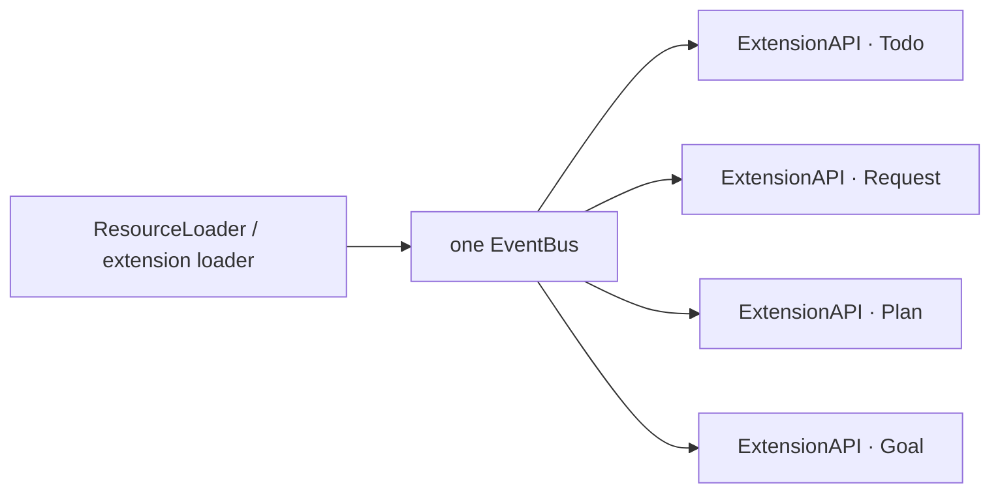
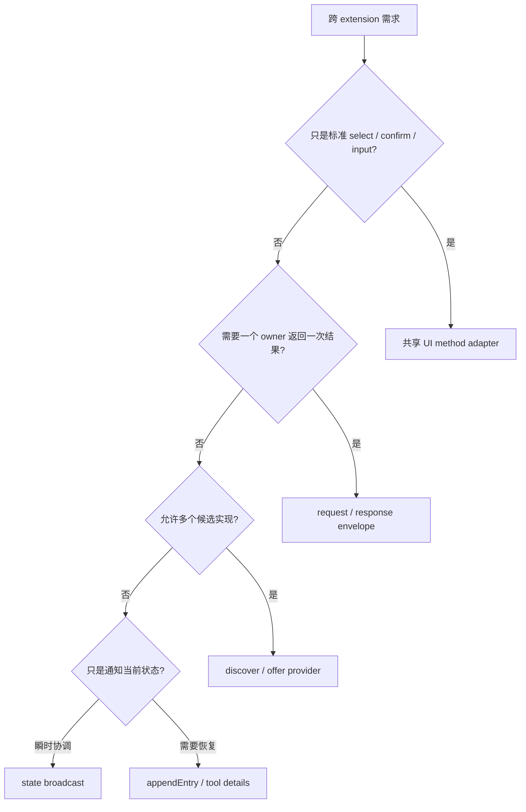
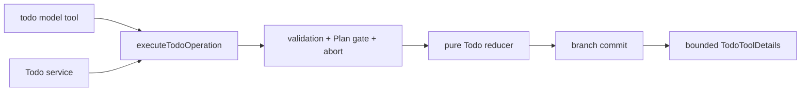
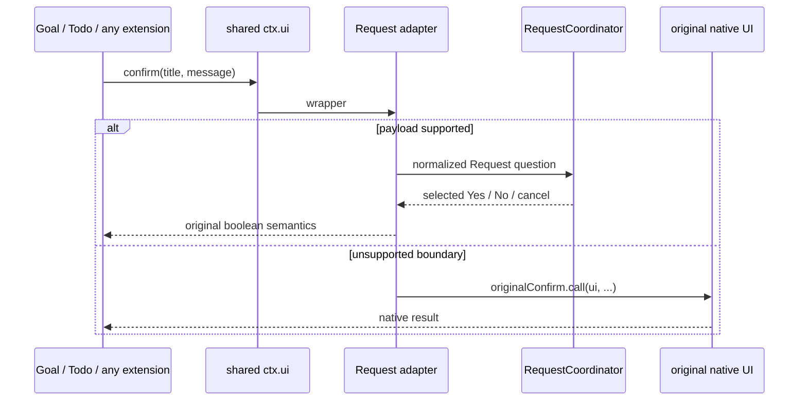
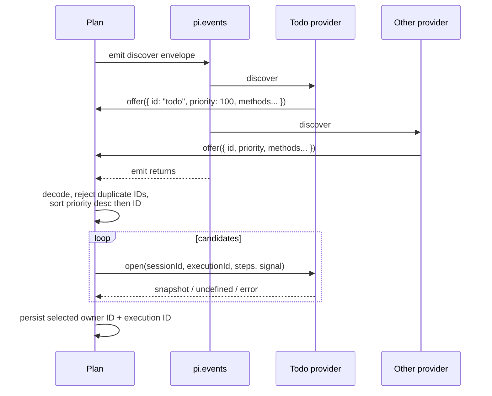
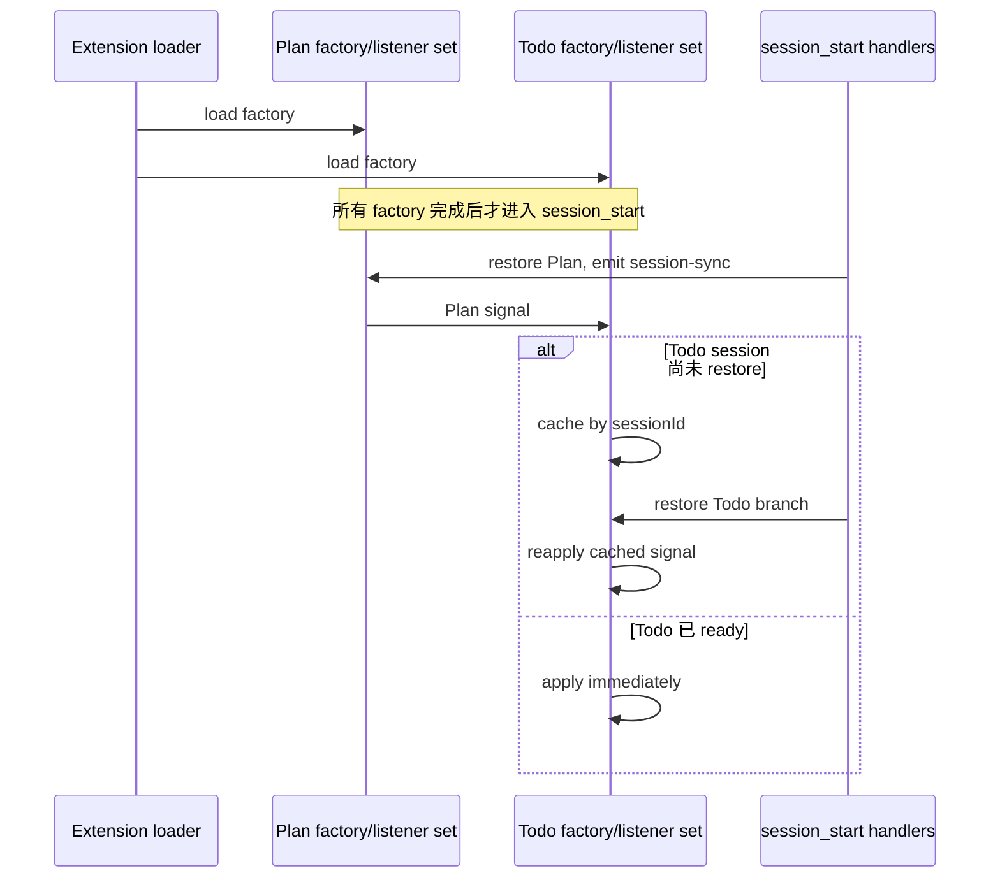

# 09 · 跨扩展通用协议：事件总线上的调用、发现与感知

> 本篇回答：Todo、Request 为什么能向任意 extension 提供通用调用面；其他插件并未 production import 它们时，怎样发现能力、选择 provider、等待异步结果并在 reload/session 切换后保持正确；`pi.events` 的底层同步语义又给协议设计带来哪些硬约束。实现基线为本仓库当前 Todo service v1、Request UI v1、execution-progress v1 和 Plan coordination v1。

## 1. 结论先行

所谓“其他插件无缝感知”，在本仓库中不是反射、目录扫描或依赖注入容器，而是四种不同机制：

| 感知对象 | 实际机制 | 调用方是否知道提供者 | 当前实例 |
| --- | --- | --- | --- |
| 模型感知一个工具 | active tool 的 schema、description、`promptSnippet`、`promptGuidelines` 进入模型边界 | 模型知道工具名，不知道 extension 实现 | `todo`、`ask` |
| Extension 调用一个通用能力 | 共享 `pi.events` 上的版本化 request/response envelope | 知道 channel/wire contract，不依赖实现包 | Todo service、Request UI channel |
| 消费者从多个实现中选 provider | 同步 `discover` + `offer(provider)`，随后直接调用 provider 方法 | 只持久化选中的 provider ID | Plan execution progress |
| Extension 被动感知状态变化 | 单向广播 immutable snapshot，接收方校验、按 session 缓存和投影 | 知道状态协议，不调用发送者内部对象 | Plan → Goal/Todo |

Request 还提供第五种、对调用方最透明的接入：它包装 session 共享的 `ctx.ui.select/confirm/input`。其他 extension 继续调用 Pi 标准 UI API，就自动得到 Request renderer；这不是 event request，也不是调用方“发现了 Request”，而是共享方法入口被兼容 adapter 拦截。

因此先记住五个边界：

1. `pi.events` 是**同一 Pi 进程内**的共享 EventBus，不跨进程、workspace 或远程 client。
2. EventBus 只做 channel fan-out；请求、仲裁、取消、超时、返回值和版本兼容都由 extension 自己在 envelope 上实现。
3. Bus 不保存事件、不会 replay，也不会等待异步 listener；需要恢复的状态必须写 session journal，需要异步返回值必须用 `resolve/reject` 回调。
4. “不做 production cross-import”只消除了包级耦合，不会自动产生类型安全。独立 decoder 与 coexistence tests 才是 wire contract。
5. Event payload 可以携带函数和 `AbortSignal`，正因为它是同进程共享内存；这套协议不能原样升级成网络 RPC。

## 2. Pi 底层到底共享了什么

Pi 为一次 extension runtime 创建一个 EventBus，并把**同一个对象**放进每个 `ExtensionAPI.events`：



0.81.1 的实现非常薄：`createEventBus()` 内部建立 Node.js `EventEmitter`；`emit(channel, data)` 直接调用 `emitter.emit()`；`on(channel, handler)` 注册一个捕获异常的 wrapper，并返回 `off()` unsubscribe；runtime teardown 还能 `clear()` 全部 listener。

概念上等价于：

```ts
function createEventBus() {
  const emitter = new EventEmitter();
  return {
    emit: (channel: string, data: unknown) => emitter.emit(channel, data),
    on: (channel: string, handler: (data: unknown) => void) => {
      const safeHandler = async (data: unknown) => {
        try {
          await handler(data);
        } catch (error) {
          console.error(`Event handler error (${channel}):`, error);
        }
      };
      emitter.on(channel, safeHandler);
      return () => emitter.off(channel, safeHandler);
    },
  };
}
```

这里有三个决定整个协议形状的事实。

### 2.1 `emit()` 同步遍历 listener，但不等待异步完成

Node `EventEmitter.emit()` 会在当前 call stack 中按注册顺序调用 listener。Pi 的 safe wrapper 虽然是 `async`，EventEmitter 不会 await 它返回的 Promise。

所以：

- `accept()`、`offer()` 这类“我已接收/我可提供”的握手必须在 listener 的同步前半段调用；
- 真正的 dialog、journal append 或 provider I/O 可以随后异步完成，再走 envelope 的 `resolve/reject`；
- 若 listener 先 `await` 再 `accept()`，caller 会在 `emit()` 返回时误判为“没有 receiver”；
- listener 抛错不会自然变成 caller 的同步异常，协议必须显式调用 `reject(error)`。

本仓库的 channel listener 都是同步 wrapper：先校验 envelope、同步 `accept/offer`，再启动异步 handler。

### 2.2 Bus 没有请求语义

官方 API 只有：

```ts
interface EventBus {
  emit(channel: string, data: unknown): void;
  on(channel: string, handler: (data: unknown) => void): () => void;
}
```

它没有：

- request ID；
- response Promise；
- provider registry；
- listener priority；
- timeout/backpressure；
- schema negotiation；
- durable replay。

Todo、Request 和 Plan progress 中看到的这些能力，都是各协议在 payload 上自行构造的。

### 2.3 这是高能力、低隔离的进程内协议

Payload 不需要 JSON serialize，可以直接携带：

- `accept/resolve/reject/offer` 函数；
- provider 的 `open/read/update/close` 方法；
- `AbortSignal`；
- frozen object reference。

好处是无需第二套 transport、低延迟、容易组合。代价是发送方和接收方同属一个故障域与权限域：恶意 extension 可以伪造 channel、保留对象引用或永不 settle。`structuredClone()`、`Object.freeze()` 与 decoder 是协作防御，不是安全沙箱。

## 3. 四种协议形状怎样选



| 模式 | 基数 | 返回方式 | 缺失实现 | 是否持久 | 代表 channel |
| --- | --- | --- | --- | --- | --- |
| UI adapter | 一个共享 method slot，可被链式包装 | 原方法 Promise | 自动使用原生 UI | 否 | 无 channel |
| Request/response | 多 listener 中恰好一个接受 | envelope `resolve/reject` | caller 立即 reject | 否；业务方另行持久化 | `todo-service:v1`、`request-ui:v1` |
| Provider discovery | 零到多个 offer，consumer 选择 | 直接调用 provider methods | open 阶段可 fallback | owner/state 由业务方持久化 | `execution-progress:v1` |
| State broadcast | 一个 sender 到零到多个 consumer | 无 response | sender 不受影响 | Bus 不持久；sender journal + lifecycle 重发 | `plan-state:v1` |

不要为了“统一”把四者压成一个万能 registry。它们的 owner 数量、失败语义和生命周期不同；过度统一会把业务差异藏进 optional 字段和隐式约定。

## 4. 单接收者 request/response：把 EventBus 提升成进程内 RPC

### 4.1 通用 envelope

Todo 的 shape 最完整：

```ts
interface ServiceEnvelope<Request> {
  readonly version: 1;
  readonly kind: "request";
  readonly request: Request;
  accept(): boolean;
  resolve(result: unknown): void;
  reject(error: unknown): void;
}
```

Caller 自己创建 Promise，把 resolver 放进 envelope：

```ts
const { promise, resolve, reject } = Promise.withResolvers<Result>();
let accepted = false;
let settled = false;

const envelope = {
  version: 1,
  kind: "request",
  request,
  accept() {
    if (accepted || settled) return false;
    accepted = true;
    return true;
  },
  resolve(value: unknown) {
    if (settled) return;
    settled = true;
    resolve(decodeResult(value));
  },
  reject(error: unknown) {
    if (settled) return;
    settled = true;
    reject(error);
  },
};

events.emit(CHANNEL, envelope);
if (!accepted && !settled) envelope.reject(new Error("provider unavailable"));
return promise;
```

Provider listener 的关键是先同步接受：

```ts
events.on(CHANNEL, (value: unknown) => {
  if (!isEnvelope(value) || !value.accept()) return;
  try {
    void Promise.resolve(handle(value.request)).then(value.resolve, value.reject);
  } catch (error) {
    value.reject(error);
  }
});
```

### 4.2 完整时序

```mermaid
sequenceDiagram
    participant C as Caller extension
    participant B as pi.events / EventEmitter
    participant P1 as Provider listener 1
    participant P2 as Provider listener 2
    participant D as Domain handler

    C->>C: validate + freeze request<br/>create Promise/envelope
    C->>B: emit(channel, envelope)
    B->>P1: synchronous listener call
    P1->>C: accept()
    C-->>P1: true
    P1->>D: start handler
    B->>P2: synchronous listener call
    P2->>C: accept()
    C-->>P2: false
    B-->>C: emit returns; accepted=true
    D-->>P1: async result / error
    P1->>C: resolve(result) / reject(error)
    C->>C: decode + settle once + cleanup
```

`accept()` 同时解决两个问题：

1. caller 在 `emit()` 返回时知道是否有兼容 receiver，不需要猜 listener count；
2. 多个 listener 监听同一 channel 时，只有第一个成功接受者能执行业务并 settle。

但它不是完整 service registry：谁先接受由 listener 注册顺序决定，没有 provider ID 冲突诊断。Todo/Request 都把重复 service provider 视为不受支持的安装组合；需要多实现竞争时应使用 §7 的 discovery，而不是依赖加载顺序。

### 4.3 Settlement 必须是一次性的

Caller 维护 `settled`，使这些竞态只能有一个赢家：

- provider resolve 与 abort 同时发生；
- provider 重复 resolve；
- handler 同步 throw 后又异步 reject；
- emit 失败与 missing-provider fallback；
- session shutdown abort 当前请求。

Generic 协议还应给“已接受但 provider 永不 settle”设置 timeout 或可取消 signal。`accept()` 只证明某 listener 声称接管，不证明它一定正确完成。

## 5. Todo service：持久状态能力为什么比普通 UI 请求更严格

### 5.1 对外面

`todo/src/service.ts` 定义并由 `todo/src/index.ts` 重导出：

```text
pi-extensions:todo-service:v1
```

请求包含：

- 当前 `sessionId`；
- `init/append/start/done/block/drop/reopen/edit/get/view` tagged operation；
- 可选 `AbortSignal`。

它故意不提供 `clear`。清空属于需要用户确认的控制面，不能因另一个 extension 能发 event 就绕过 `/todos clear` 的确认合同。

### 5.2 Caller 边界

`requestTodoService()` 在 emit 前完成：

1. `sessionId` 非空、trimmed、长度有界；
2. pre-abort 检查；
3. operation 必须可 `structuredClone()`；
4. clone 后递归冻结当前数组/对象层级，避免 provider 工作期间 caller 改写 request；
5. 安装一次性 abort listener；
6. 创建带 `version/kind/accept/resolve/reject` 的 envelope。

返回时再次把 receiver 视为不可信边界：

- result 只能有 `content/details`；
- content 必须是字符串且不超过模型输出 byte 上限；
- details 走 `decodeTodoToolDetails()`；
- details 中的 `op` 必须与请求一致；
- decoded result 冻结后才交给 caller。

这保证“某 listener 接受了 Todo channel”不等于它能伪造任意成功结果。

### 5.3 Provider 复用同一领域执行器

`todo/src/index.ts` 注册 service handler 后只做 session gate，再调用与模型工具相同的 `executeTodoOperation()`：



Service mutation 的 commit 顺序是：

```text
validate → compute candidate → append todo-state-v2 → update closure/UI → resolve caller
```

因此：

- append 失败时 caller 收到 reject，内存/UI 不前进；
- pre-commit abort 不写状态；
- commit 与 result settlement 位于同一同步临界区，commit 后才发生的 abort 不能把成功伪装成失败；
- `get/view` 只读，不写 custom checkpoint；
- Plan 活跃时 ordinary mutation 与模型 tool 一样 fail closed。

Service response 不是第三份事实源。权威状态仍是当前 branch 的 tool details 与 `todo-state-v2` entry。

### 5.4 “感知当前 Todo”实际是 session gate

Todo 的 listener 在 extension factory 阶段就注册，但那时可能还没有 active session。`session_start/session_tree` 完成 branch replay 后才设置 `currentContext/sessionId`。所以 receiver 有四种可观察状态：

| 状态 | `accept()` | 最终结果 |
| --- | --- | --- |
| Todo extension 未加载 | 无 listener 接受 | caller 立即 reject “not loaded or not ready” |
| listener 已注册、session 未 ready | listener 接受 | handler reject “not ready for an active session” |
| active session ID 匹配 | listener 接受 | 执行 operation |
| active session ID 不匹配 | listener 接受 | handler reject “targets a different session” |

也就是说，service 不会扫描“现在有哪些 Todo 实例”，而是向能力 channel 发一次探测；receiver 用当前 session identity 决定是否服务。

## 6. Request：高级 channel 与透明 native adapter 是两条路

### 6.1 高级 Request UI channel

`request/src/protocol.ts` 暴露：

```text
pi-extensions:request-ui:v1
```

它与 Todo 使用同一个 accept/resolve/reject 模式，但 payload 更贴近领域：`questions` 和可选 dialog `options` 直接位于 envelope 顶层。适合 choice/text、多题、description、preview、multi、Other 等 Pi 原生 dialog 无法完整表达的能力。

`RequestCoordinator` 在真正打开 UI 前执行 `normalizeRequestQuestions()`，强制题数、ID、文本、选项、重复 label、recommended index 与 16 KiB payload 上限。所有来源——模型 `ask`、native adapter、外部 channel——最后都进入同一个 promise tail：

```ts
const run = tail.then(() => openDialog());
tail = run.then(() => undefined, () => undefined);
return run;
```

这样多个 extension 同时请求用户时只会串行显示，不会让 overlay 争夺焦点。

当前 v1 与 Todo 的风险配置不同：

| 边界 | Todo service | Request UI channel |
| --- | --- | --- |
| 业务副作用 | 可改变 branch 状态 | 只返回短生命周期用户答案 |
| Caller input | clone + freeze + session ID | 传 questions/options，由 coordinator 规范化 |
| Envelope decoder | exact keys + `version/kind/request` | 验证 version、questions 和 callbacks，允许额外字段 |
| Result decoder | exact bounded `TodoToolDetails` + op match | 当前直接接受 `RequestDialogResult` |
| Persistence | mutation append journal | 不持久化答案 |
| Cancellation | caller signal + commit race contract | request signal/timeout + session signal + component disposal |

这不是说 UI result 可以随意信任；而是当前唯一正式 provider 就是同包 coordinator，且结果不直接提交其他 extension 的状态。调用方仍必须把用户答案作为输入重新校验。若未来允许多个独立 Request provider 或把结果直接用于高风险 mutation，协议应补 exact result decoder 与 caller-side snapshot/freeze。

### 6.2 Native adapter：调用方根本不需要知道 Request 存在

Goal 和 Todo 只调用标准 API：

```ts
await ctx.ui.confirm(title, message, options);
```

Request 在 TUI `session_start` 取得 session 共享的 `ExtensionUIContext`，保存原方法并安装 wrapper：



它“无缝”的原因是共享方法入口，而不是 channel discovery：

- `select` 仍返回原 option string 或 `undefined`；
- `confirm` 仍返回 boolean；
- `input` 仍保留空字符串/空格并以 `undefined` 表示取消；
- 不支持的空选项、未 trim option 或越界 payload 回退原方法；
- timeout 与 signal 继续传递。

Shutdown/session replacement 时，Request：

1. abort session controller，取消当前和排队 dialog；
2. 清空 current UI；
3. 恢复原方法，但只在 `ui.confirm === ownWrapper` 等 identity check 成立时恢复；
4. unsubscribe public channel。

Identity check 很关键：若另一个 extension 在 Request 之后又包装了 `confirm`，Request shutdown 不能把后来者的 wrapper 覆盖回旧方法。

## 7. Provider discovery：多个实现怎样被 Plan 感知和确定性选择

Request/response 只允许第一个 listener 接受；Plan progress 需要允许多个实现竞争，所以使用：

```ts
interface ProgressDiscoveryEnvelope {
  readonly version: 1;
  readonly kind: "discover";
  offer(provider: unknown): void;
}
```

Provider 在 factory 阶段订阅 channel；收到 `discover` 后同步 `offer()`：

```ts
events.on(EXECUTION_PROGRESS_CHANNEL, (value) => {
  if (isDiscoverEnvelope(value)) value.offer(provider);
});
```

Consumer 每次需要能力时主动 discover：



`plan/src/progress.ts` 的选择规则：

1. provider ID 必须有界、trimmed；priority 是 safe integer；四个 method 都存在；
2. 重复 ID 不采用“最后一个赢”，而是移除该 ID 并标记冲突；
3. 候选按 priority 降序、ID 升序排序，与 listener load order 解耦；
4. `open()` 返回 `undefined` 表示 decline，throw 记录 failure，合法 snapshot 才取得 ownership；
5. 没有 provider 时，Plan 在**首次批准**可使用本地 progress；
6. 一旦 external owner 被持久化，后续 `read/update/close` 只寻找该 ID；provider 缺失或坏 snapshot 显式失败，不静默切换 owner 或创建本地副本。

Provider object 携带真实函数 reference，因此 discover 只适用于同进程、同信任域。若改成 worker/daemon/远程插件，必须把 method call 变成可序列化 RPC，并新增 request ID、transport timeout、disconnect 和重连语义。

## 8. State broadcast：为什么 Plan、Goal、Todo 能跨加载顺序同步

Plan phase 使用：

```text
pi-extensions:plan-state:v1
```

它不是 request，没有 `accept()`，也不期待 response。Plan 在持久 phase transition 和 branch restore 后 emit：

```ts
{
  version: 1,
  sessionId,
  phase,
  readOnly,
  awaitingApproval,
  willTriggerTurn,
  reason,
}
```

Goal 与 Todo 各自在本包复制 wire type、把 payload 当 `unknown` 解码、过滤 foreign session，再决定工具、continuation 和 UI gate。Todo 使用 exact-key decoder；Goal 当前 parser 校验 version/session/phase，并为部分可选/非法字段采用安全默认。两者都不把收到的对象当自己的 durable state。

### 8.1 EventBus 不 replay，恢复靠发送者重发与接收者缓存

加载顺序之所以可工作，不是 EventBus 有 retained message，而是 extension lifecycle 与缓存共同保证：



反向加载时，Todo 先建立 `sessionId`，随后 Plan emit，信号直接应用。`session_tree` 重复同一套 restore/reconcile。Reload 会销毁旧 extension instance、重新执行全部 factory，再进入 `session_start`。

这里有一个通用规则：**广播协议若表示当前状态，发送者必须在 lifecycle restore 后重发权威 snapshot；接收者若可能早于自己的 session restore 收到消息，必须按 session identity 缓存后 reconcile。**

不要依赖“之前肯定广播过”。EventBus 不保存过去。

## 9. 生命周期：listener ready 与业务 ready 是两回事

| 阶段 | 应做什么 | 不应做什么 |
| --- | --- | --- |
| extension factory | 注册 channel listener、tool、command；构造无资源 provider object | 启动 dialog、持有 session ctx、写 journal |
| `session_start` | restore branch；设置 current session/UI；安装 session-scoped adapter；重发或 reconcile snapshot | 假设旧 closure/context 仍有效 |
| 正常调用 | 校验 session、signal、payload；执行业务；显式 settle | 等待未来某个 provider 自动出现 |
| `session_tree` | 替换 branch 投影；按 current session 重算 gate | 把另一 branch 的缓存当当前状态 |
| `session_shutdown` | abort pending；恢复自己拥有的 wrapper；unsubscribe；清空 ctx | 留下 listener、timer、UI wrapper 或未 settle Promise |

Request 和 Todo 都选择“missing/not-ready 立即失败”，而不是把请求挂到某个 future `session_start`。这让调用方能明确 fallback，也避免 reload 时旧请求落到新 session。

## 10. 错误、取消与提交边界

| 问题 | 协议层正确处理 |
| --- | --- |
| 无 receiver | `emit()` 返回后 `accepted === false`，立即 reject |
| 多 receiver | 单 owner 用 `accept()`；多 provider 用 ID + priority discovery |
| Receiver 同步 throw | listener catch 后 `reject(error)`；不依赖 EventBus 传播 |
| Receiver 异步失败 | Promise rejection 转发到 envelope `reject` |
| Caller abort | pre-check + once listener + settle cleanup |
| Abort 与成功竞态 | 单次 `settled` gate；明确 commit point 谁赢 |
| 已接受但永不返回 | timeout 或 caller AbortSignal；不能只信 accept |
| Session 切换 | sessionId gate + session abort controller |
| Invalid result | caller-side exact decoder、byte/item 上限、request/result correlation |
| Mutation 持久化失败 | journal 成功前不改 closure；失败 reject |
| Future protocol version | 不 accept/明确 unsupported；不能按旧 shape 猜测 |

Todo 特别证明了一条重要顺序：

```text
validate → calculate → persist → memory/UI commit → resolve
```

Request 没有业务 journal，因此它的 commit point 是用户在 component 中提交结果；session abort 会关闭当前及排队 dialog。调用 Request 的业务 extension 仍应在收到答案后执行自己的 validate → persist → memory commit，不能把“用户点了 Yes”本身当持久状态。

## 11. Wire contract：独立 package 为什么复制类型

本仓库刻意不让 `goal/` production import `plan/src/protocol.ts`，也不让 `todo/` import `request/`：

- 每个 package 可独立安装；
- 不假设仓库根目录依赖解析；
- 缺失可选 extension 时仍能运行；
- 一方重构内部文件不会成为另一方 runtime dependency。

代价是编译器无法证明两份协议一致。因此需要三层替代约束：

1. **Channel/version**：`pi-extensions:<capability>:vN`；breaking change 新开版本，不在同名 channel 猜 shape。
2. **Runtime decoder**：接收 `unknown`，验证 discriminant、exact keys、上限、session identity 与返回值关联。
3. **Coexistence tests**：用真实两包加载顺序执行请求、缺失、invalid、abort、reload 和 owner outage。

若消费者明确愿意依赖 provider package，也可 import 公开 helper/type；Todo 与 Request 都从 `src/index.ts` 导出 caller helper。但仓库内独立 extension 仍优先复制最小 wire contract，避免把可选能力变成硬依赖。

### 当前协议严格度并不完全相同

| 协议 | 当前输入校验 | 当前输出校验 |
| --- | --- | --- |
| Todo service | exact envelope/request keys；clone/freeze operation；领域 executor 再校验 op | exact result、bounded content、strict details、op correlation |
| Request UI | envelope required shape；questions 在 coordinator 规范化 | 当前直接 settle coordinator result |
| Progress discovery | provider ID/priority/methods；duplicate ID barrier | 每次 snapshot exact decode，并绑定 approved definitions/execution ID |
| Plan broadcast | sender typed snapshot；Todo exact decoder；Goal required-field parser | 无 response |

这张表用于解释风险边界，不代表应盲目把所有协议写成同一严格度。凡是结果会驱动持久 mutation、权限或 owner transfer，优先采用 Todo/progress 级别的双向 exact validation。

## 12. 测试怎样证明“无缝”不是偶然

最低测试矩阵：

| 维度 | 必测路径 |
| --- | --- |
| 加载顺序 | consumer-first、provider-first |
| Provider 存在性 | absent、not-ready、shutdown 后 unregister |
| 仲裁 | 一个接受、多个 listener、duplicate provider ID |
| Wire 数据 | extra field、wrong version/kind、oversize、wrong session、bad result |
| 异步 | sync resolve、async resolve/reject、pre-abort、mid-flight abort、timeout |
| 原子性 | persist failure 不更新 closure；commit 后 abort 不反转成功 |
| Lifecycle | startup、reload、tree、shutdown、foreign session signal |
| 降级 | native UI fallback、首次 progress local fallback、selected owner outage fail closed |
| 资源 | adapter identity restore、listener unsubscribe、pending dialog disposal |

当前证据落点：

- `request/test/external-fixture.ts`：不 import Request production code，按 literal wire envelope 调用 channel；
- `request/test/integration.test.ts`：external channel、native adapters、serialization、abort/timeout、headless、shutdown；
- `todo/test/integration.test.ts`：tool/service 同一 board、v2 persistence、session isolation、Plan gate、同步 settlement；
- `plan/test/progress.test.ts`：provider decode、priority、duplicate ID、decline/failure、abort；
- `plan/test/coexistence.test.ts` 与 `todo/test/coexistence.test.ts`：双加载顺序、Plan/Goal/Todo phase 与 owner lifecycle；
- `todo/test/progress-provider.test.ts`：managed journal、idempotent request ID、read/update/close 和 invalid replay。

只有单包 unit test 不能证明跨扩展合同。至少需要一个 consumer 按自己复制的 wire type 调真实 provider。

## 13. 新通用能力的设计模板

### 13.1 先回答十个问题

1. 这是一次请求、多个 provider 发现，还是状态广播？
2. Provider 是零/一/多个？重复实现如何处理？
3. Channel scope 是 process、session、workspace 还是 execution？
4. `emit()` 返回时必须同步知道什么？
5. 哪些工作可以异步，怎样 resolve/reject？
6. Caller 和 receiver 各自校验哪些 unknown 数据？
7. Abort、timeout、shutdown 谁拥有，commit point 在哪里？
8. 结果是否驱动持久状态；若是，先 journal 还是先 response？
9. Event 丢失后如何恢复；是否要 lifecycle re-emit/cache？
10. 缺失、重复、旧版、未来版与 owner outage 各自 fail open 还是 fail closed？

### 13.2 推荐 channel 命名

```text
pi-extensions:<capability>:v<wire-version>
```

Owner 不一定写入 channel。Todo service 由 Todo 拥有，所以 capability 名本身含 todo；execution-progress 则刻意不绑定 provider，允许 Todo 及未来实现共同 offer。

### 13.3 推荐最小文件边界

```text
src/
├── protocol.ts   # channel、wire type、unknown decoder、caller helper
├── state.ts      # 领域 transition，不知道 EventBus
├── index.ts      # listener/lifecycle/commit 接线
└── test/
    ├── protocol.test.ts
    └── coexistence.test.ts
```

不要把 reducer、UI renderer 和 journal parser 塞进 listener。Listener 只应完成：decode → synchronous handshake → 调用领域 adapter → settle。

## 14. 什么时候不要用 `pi.events`

以下场景应换边界：

- 同一 package 内模块调用：直接函数/显式依赖，比 event bus 更可追踪、更有类型；
- 需要跨进程、worker、daemon 或远程 host：使用 RPC/IPC/HTTP/MCP，并定义可序列化 schema；
- 需要 durable queue 或事件 replay：写 session journal/外部 store，EventBus 只做即时通知；
- 不可信第三方插件：Pi extension 与 EventBus 无隔离，需进程/容器边界；
- 多租户 service registry：当前 bus 没有 identity、capability lease、健康检查或权限模型；
- 只是让模型调用能力：注册 active tool，别让模型间接构造 extension event。

## 15. 本篇结论

Todo、Request 和 Plan 的跨扩展组合建立在一个很小的宿主原语上：**每个 ExtensionAPI 共享同一个进程内 EventBus**。可靠性并不来自 EventBus 自身，而来自协议补上的结构：

- request/response 用同步 `accept()` 和异步 `resolve/reject()`；
- provider discovery 用同步 `offer()`、确定性排序和持久 owner；
- state broadcast 用 session identity、lifecycle 重发和 receiver reconcile；
- transparent UI integration 用共享 method wrapper、fallback 和 identity-safe restore；
- durable behavior 仍由 branch journal、strict decoder 和原子 commit 保证。

“无缝”只描述调用体验。底层并没有魔法：调用方要么经过一个被包装的共享入口，要么显式遵守版本化 channel；receiver 必须在正确生命周期注册、同步完成握手、严格校验 unknown 数据，并在缺失、取消、重复和 reload 时给出可测试的确定语义。

## 参考资料

本仓库：

- [扩展系统设计](04-extension-system.md)
- [生产级最佳实践](07-production-checklist.md)
- [Todo 扩展实现](08-todo-extension-design.md)
- [Todo README](../../todo/README.md)
- [Request README](../../request/README.md)
- [Plan README](../../plan/README.md)
- [Goal README](../../goal/README.md)
- `todo/src/service.ts`
- `request/src/protocol.ts`、`request/src/adapters.ts`、`request/src/dialog.ts`
- `plan/src/progress.ts`、`plan/src/protocol.ts`
- `todo/src/progress-provider.ts`、`todo/src/protocol.ts`
- `goal/src/protocol.ts`

Pi 官方：

- [Extensions：`pi.events`](https://github.com/earendil-works/pi/blob/main/packages/coding-agent/docs/extensions.md#pievents)
- [Inter-extension event bus example](https://github.com/earendil-works/pi/blob/main/packages/coding-agent/examples/extensions/event-bus.ts)
- [TUI components](https://github.com/earendil-works/pi/blob/main/packages/coding-agent/docs/tui.md)

[上一篇：Todo 扩展实现](08-todo-extension-design.md) · [下一篇：AST-Grep 扩展设计](10-ast-grep-extension-design.md)
