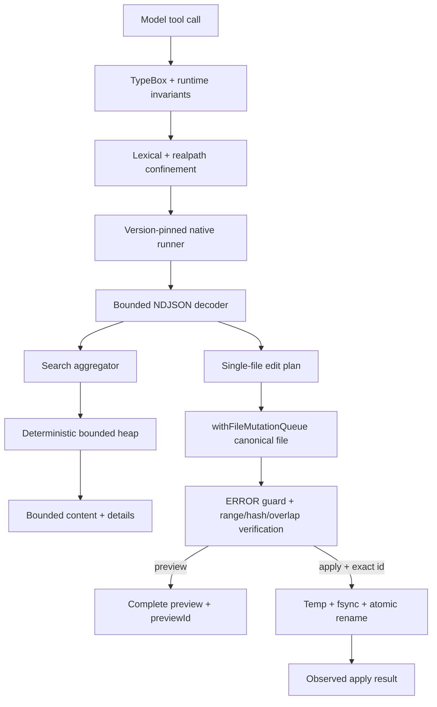
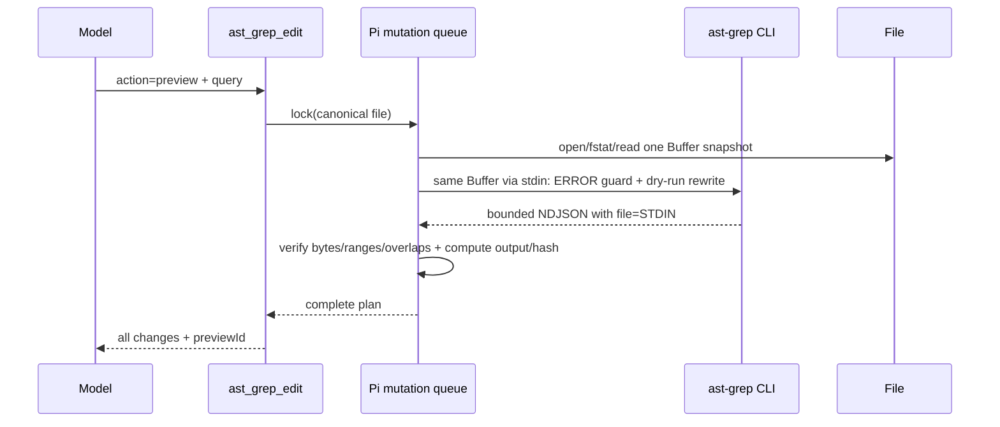
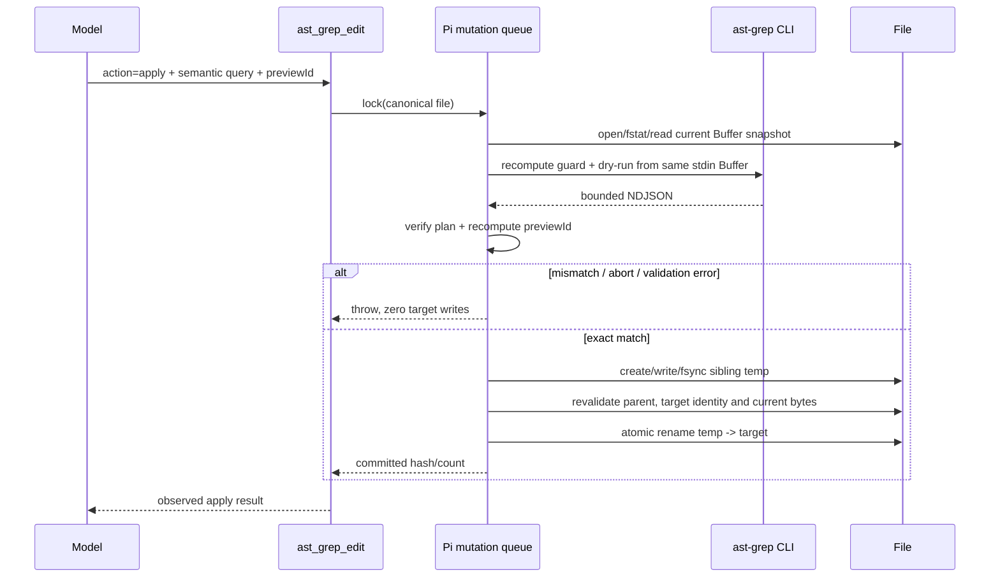

# 10 · AST-Grep 扩展设计：可取消、可审计的结构化搜索与单文件改写

> 文档状态：生产实现已落地并处于发布证据审查；研究、实现与 Review 基线为 2026-07-26。Pi 运行基线为 `@earendil-works/pi-coding-agent 0.81.1`、兼容下限 `>=0.81.0`；ast-grep 协议基线固定为官方 CLI `0.45.0`。Oh My Pi 参考快照为 `17.1.3`、commit `667111575ebba136dadfd6989379e7f67e0d40d9`。本文的“必须”仍是实现验收合同；§21 checkbox 区分已由当前 suite/本机 smoke 建立的证据与仍待 hosted native CI 运行确认的发布证据。

## 1. 结论先行

新增独立顶层 `ast-grep/` extension package，向 Pi 注册两个全局工具：

- `ast_grep_search`：只读结构化搜索；一次调用只使用一种语言和一个AST pattern，可在一个工作区内文件或目录上扫描；
- `ast_grep_edit`：结构化单文件改写；强制执行`preview → apply`，`apply`必须携带由同一查询和同一文件内容生成的`previewId`。

核心设计取舍：

1. **采用固定版本的官方 ast-grep CLI 平台二进制，不采用 `@ast-grep/napi`。** CLI 提供完整内置语言、官方 metavariable rewrite、`.gitignore`/hidden-file 扫描和 NDJSON；NAPI 当前只内置 HTML/CSS/JavaScript/TypeScript/TSX，`findInFiles` 没有 `AbortSignal`，JavaScript `replace()` 也不会替换 metavariable。
2. **不调用系统 `sg`/`ast-grep`。** 扩展从精确锁定的 optional platform package 解析绝对二进制路径，首用时校验 `ast-grep --version`；PATH 中的同名程序不能接管执行。
3. **搜索使用 `--json=stream` 和有界 max-heap。** stdout 按 NDJSON 流式解码，完整扫描只保留当前页所需的最小结果集；stderr、单条记录、模型 `content` 和 session `details` 分别限流。
4. **CLI永不直接写工作区。** `ast_grep_edit`在`withFileMutationQueue(canonicalPath)`内先读取一个受身份校验的Buffer snapshot，再把同一Buffer经stdin交给CLI计算replacement；扩展校验byte range、比较preview hash，并以同目录临时文件+atomic rename提交。
5. **v1改写只允许一个现有regular file。** 这是明确的安全边界：文件内可有多次replacement，但不宣称不存在的“跨文件原子事务”。批量codemod由`ast_grep_search`找出文件后逐文件preview/apply。
6. **preview 必须完整可审阅。** 如果全部 before/after 无法进入固定 preview 预算，整次 preview 失败且不签发 `previewId`；不能用“省略了大部分变化”换取可应用 token。
7. **无持久业务状态、无 UI 审批、无项目配置。** Preview hash 是 stale-write 防护，不是权限凭证。需要人工批准时使用本仓库 Plan；需要真正隔离时使用容器/VM，而不是把 extension dialog 误称为 sandbox。

最终形态是一组窄工具，不是第二套 ast-grep 配置系统，也不是一个通用 codemod 平台。

## 2. 问题、目标与非目标

### 2.1 当前缺口

`rg` 解决文本匹配，`lsp` 解决语言服务器理解的 symbol/reference/diagnostic，但以下查询仍缺少可靠表达：

- 找到所有 `console.log($$$ARGS)`，不命中注释和字符串；
- 找到特定调用、声明、导入或嵌套语法形状；
- 用 metavariable 保留原参数，只替换调用结构；
- 在改写前证明“当前文件仍是刚才预览的版本”；
- 对多个同构节点执行同一结构化变换，而不依赖脆弱的文本行号。

文本搜索不能替代 AST 搜索；LSP rename/code action 也不覆盖任意 syntax pattern。该能力需要新的模型工具，Extension 是最轻的正确边界。

### 2.2 产品目标

| 编号 | 目标 | 可观察验收 |
| --- | --- | --- |
| G1 | 结构匹配准确 | pattern 由指定语言解析；注释/字符串不会因文本相同而误命中；range 与 metavariable 来自 ast-grep JSON |
| G2 | 搜索结果确定 | 不依赖 Rust worker 完成顺序；按规范化 path、byte start/end 排序，`offset/limit` 结果稳定 |
| G3 | 内存与上下文有界 | stdout 流式消费；retained match、NDJSON record、stderr、content、details 都有独立硬上限 |
| G4 | 取消与teardown真实传播 | 每个operation保存唯一absolute monotonic deadline；每个await后、spawn/progress/final-result前及sync commit内关键点都直接比较`now() >= deadline`并传播AbortSignal；本extension的`session_shutdown` handler获得控制后立即abort完整operation并有界等待5秒；deadline/abort在`renameSync`调用前被观察则零目标写入，已经开始的不可中断rename按真实commit报告 |
| G5 | 写入无 lost update | apply 时 source bytes、查询、CLI 版本或 rewrite 与 preview 任一不一致，`previewId` 校验失败且零写入；完全恢复为相同 bytes 时 token 仍有效 |
| G6 | 文件提交不撕裂 | 计算和验证全部在 mutation queue 内；最终写使用同目录临时文件和 atomic rename |
| G7 | 路径边界 fail closed | lexical/canonical path、file identity 与 parent identity 必须位于 `ctx.cwd` 且在关键 await 后复核；静态或已观察到的 symlink/namespace escape、目录 edit、CLI 伪造输出均拒绝；portable Node 无法消除的主动 TOCTOU 单独披露 |
| G8 | 预览可审阅 | 签发 token 前，全部 before/after 均进入有界 preview；超预算整次拒绝，不静默省略 |
| G9 | 多扩展共存 | Plan planning可使用`ast_grep_search`，但继续阻止`ast_grep_edit`；成功apply后LSP同步该文件 |
| G10 | 可发布 | native package 精确锁定；支持平台做 clean-install、真实 binary、真实 Pi load 和 changed-path smoke |

### 2.3 v1 非目标

v1 明确不做：

- 多文件一次性 apply 或跨文件事务；
- 多 pattern、多 rewrite 的有序 rule pipeline；
- YAML rule、utility rule、transform、fix config 或 `sgconfig.yml`；
- custom tree-sitter dynamic library；
- `--follow`、`--no-ignore`、扫描工作区外路径；
- 自动 formatter、import organizer、LSP code action 或 type-aware rewrite；
- AST 缓存、常驻 daemon、watcher 或索引；
- search snapshot/session cursor；分页期间文件变化后不保证无重复/遗漏；
- 把 preview hash 当作用户批准、签名、capability 或安全沙箱；
- 在不支持的平台静默回退到 PATH、shell、NAPI 或文本替换。

多文件 codemod 只有在定义 durable journal、提交/回滚语义、crash recovery 和跨文件测试后才能单独设计；不能把循环 `writeFile()` 包装成“atomic batch”。

## 3. 外部实现调研与取舍

### 3.1 能力对比

| 方案 | 已观察能力 | 生产问题 | 结论 |
| --- | --- | --- | --- |
| `@ast-grep/napi 0.45.0` | `parse/parseAsync/findInFiles`、`SgNode.findAll/replace/commitEdits`；NAPI 进程内调用 | 只内置 HTML/CSS/JS/TS/TSX；其他语言需 experimental dynamic registration，且每进程只能注册一次；`findInFiles` 无取消参数；`replace()` 不做 metavariable substitution | 不采用 |
| `@ast-grep/cli 0.45.0` umbrella | 完整 `run` 语言/扫描/rewrite；platform optional packages；postinstall 复制 binary | postinstall、wrapper、PATH/bin 解析增加供应链与运行歧义；普通 `pi.exec` 会把 stdout/stderr 全量累积 | 不直接依赖 umbrella；直接依赖 platform packages并流式 spawn |
| 官方 platform binary | 单一 native process；`--json=stream`；官方 pattern/rewrite/ignore/glob 语义 | 平台矩阵有限；JSON 是外部协议；child 本身仍可能消耗大量 CPU/RSS | 采用；精确版本、严格 decoder、timeout/threads/scope 限制 |
| Oh My Pi `17.1.3` | TypeScript `ast_grep` + 自有 Rust `pi-ast`/N-API；确定排序、offset/limit、parse error、metadata、取消；native edit dry-run 与上限 | 是宿主内建能力，不是可移植 Pi extension；依赖数十种 grammar、自有任务取消和文件扫描层；native apply 直接写盘，不能替代 Pi mutation queue | 借鉴算法与输出纪律，不复制宿主私有 API |
| 直接执行系统 `sg` | 安装简单、语言完整 | PATH hijack、版本漂移、`sg` 名称冲突、不同机器行为不同 | 禁止 |

### 3.2 从 Oh My Pi 采用的机制

固定快照中值得采用：

- 搜索结果按 path/range 做确定性排序；
- 只保留 `offset + limit + 1` 个最小结果，而不是把全量 match 留在 JS；
- 返回 total、limit reached 和可续读信息；
- pattern、strictness、selector 在入口显式建模；
- rewrite 先计算全部 edit，拒绝 divergent overlap；
- dry-run 是默认安全路径；
- parse error、取消和输出截断不是普通“无匹配”；
- renderer 使用结构化 details，不反向解析给模型的文本。

不直接采用：

- 自建 Rust crate 和 N-API binding；
- OMP 的 internal URL、hashline snapshot、ToolSession、Arktype、TUI helper；
- mixed-language 一次 scan/edit；
- native 层直接 `std::fs::write()` 多文件；
- 依赖 OMP 进程内 cancellation token 或自有 file snapshot store。

### 3.3 选择 CLI 而不是 NAPI 的决定

决定基于四个硬约束：

1. **语言合同。** 用户需要 ast-grep，而不是只支持前端五种 grammar 的子集；CLI `run --lang` 直接覆盖官方 built-in language 表。
2. **rewrite 合同。** CLI `--rewrite` 会执行官方 metavariable substitution，并在 JSON 中给出 `replacement` 和 `replacementOffsets`；NAPI `replace()` 明确不替换 metavariable，扩展自造 substitution 会产生第二套语义。
3. **扫描合同。** CLI 已实现 hidden、`.gitignore`、`.ignore`、parent/global/exclude 与 gitignore-style `--globs`；自行 walker 会制造另一套 ignore 规则。
4. **隔离与取消。** native child 可在 timeout/abort 时终止；NAPI worker 没有每请求取消接口，reload 后仍可能继续占用进程资源。

代价是一个体积可观的单平台 native binary、受限平台矩阵和一个需要严格验证的 NDJSON 协议。相比自建 grammar/runtime，这个代价更可审计；发布验收记录实际 tarball/install size，不在设计阶段写死会随平台变化的估算值。

## 4. 生产不变量

实现必须同时保持以下不变量：

1. **一个调用一种语言、一个 pattern、一个 scope。** 不自动猜 mixed-language query。
2. **CLI 只读工作区。** argv 永不包含 `--update-all` 或 `--interactive`。
3. **搜索成功必须完整扫描。** timeout、abort、malformed NDJSON、child crash 都是失败，不把已读部分伪装成完整结果。
4. **改写成功必须来自同一 source snapshot。** CLI 的 ERROR-node guard与rewrite都读取扩展已经 hash 的同一 Buffer；每个 byte range 再对该 Buffer 验证；apply 在 queue 内重算 fingerprint，并在 rename 前复核当前 target bytes与身份。
5. **apply 的线性化点是 atomic rename。** rename 前取消则零目标写入；rename 已开始后必须等待其完成，并按实际提交结果返回。
6. **所有输入、child output、失败消息和持久化 details 都有硬上限。** 没有“内部数据不进模型所以可无限大”的例外。
7. **canonical path 不是 capability。** 它只作为 mutation queue key；实现还必须持有/比较初始 file与parent identity，并在关键边界重新 `realpath/lstat/read`。主动 namespace swap 的最后微小竞态只能由 `openat/renameat` 或 OS sandbox消除。
8. **每次 CLI 都显式加载 package-owned empty config。** 不允许从 cwd/parents 自动发现 `sgconfig.yml`、custom language、language injection 或 project glob。
9. **无 fallback 成功。** binary 缺失、版本错误、不支持平台、无法判断 libc 均明确失败。
10. **preview 完整或不存在。** 只要有一处 change 未完整进入 preview 预算，就不返回可 apply 的 ID。

## 5. Package 与模块边界

### 5.1 独立 package

建议目录：

```text
ast-grep/
├── package.json
├── package-lock.json
├── tsconfig.json
├── README.md
├── assets/
│   └── empty-sgconfig.yml # 精确12 ASCII bytes `ruleDirs: []`，无BOM/EOL；所有CLI调用强制使用
├── src/
│   ├── index.ts          # registerTool、runner/artifact-free lifecycle 接线
│   ├── schema.ts         # TypeBox schemas、StringEnum、public limits
│   ├── languages.ts      # canonical language allowlist
│   ├── binary.ts         # platform package/binary resolution + version handshake
│   ├── runner.ts         # child lifecycle、NDJSON/stderr、timeout/abort/progress
│   ├── scheduler.ts      # session级native child/worker/等待队列硬上限
│   ├── operations.ts     # 完整 tool operation ownership + shutdown barrier
│   ├── protocol.ts       # unknown -> AstGrepMatch exact decoder
│   ├── paths.ts          # lexical/canonical workspace confinement
│   ├── filenames.ts      # lossless directory-record path验证 + bounded raw-name scan
│   ├── heap.ts           # bounded deterministic top-k
│   ├── search.ts         # read-only domain operation
│   ├── edit.ts           # preview/apply domain operation
│   ├── edits.ts          # range verification、overlap、Buffer apply、preview hash
│   ├── atomic-write.ts   # bounded synchronous temp/fsync/rename commit island
│   ├── output.ts         # bounded model/details projection + sanitization
│   └── renderer.ts       # pure host-theme TUI projection
└── test/
    ├── binary.test.ts
    ├── runner.test.ts
    ├── protocol.test.ts
    ├── paths.test.ts
    ├── filenames.test.ts
    ├── search.test.ts
    ├── edit.test.ts
    ├── output.test.ts
    ├── integration.test.ts
    └── fake-ast-grep.mjs
```

Manifest沿用仓库独立private extension合同，并固定为：

```json
{
  "name": "pi-ast-grep-dev",
  "version": "0.1.0",
  "private": true,
  "type": "module",
  "keywords": ["pi-package"],
  "files": ["src", "assets", "README.md"],
  "pi": { "extensions": ["./src/index.ts"] },
  "scripts": {
    "check": "tsc --noEmit",
    "test": "node --import tsx --test test/*.test.ts"
  },
  "peerDependencies": {
    "@earendil-works/pi-ai": ">=0.81.0",
    "@earendil-works/pi-coding-agent": ">=0.81.0",
    "@earendil-works/pi-tui": ">=0.81.0",
    "typebox": ">=1.0.0"
  },
  "engines": { "node": ">=22.19.0" }
}
```

`devDependencies`与现有packages同代：三项Pi host包`^0.81.0`、`typebox ^1.0.0`、`@types/node ^22.0.0`、`tsx ^4.20.0`、`typescript ^5.9.0`；§6的native包只进入`optionalDependencies`，不进入普通`dependencies`。`tsconfig.json`复用strict NodeNext/noEmit约定并覆盖`src/**/*.ts`与`test/**/*.ts`。`private: true`表示仓库内安装/链接，不宣称npm registry发布；`npm pack`只验证真实安装内容与asset完整性。

`index.ts` 只完成：

- 注册低碰撞、package-scoped的`ast_grep_search`和`ast_grep_edit`；factory阶段只允许registration，不能调用尚未bind的`pi.getAllTools()`做伪原子冲突检查；
- 构造一个 session-scoped `OperationTracker` 和 `AstGrepRunner`；
- 注册两个tool；每个调用建立`visiblePromise`与`workSettlement`：Pi等待前者，tracker持有后者直到queue callback/child/cleanup真正settle；
- 本extension的`session_shutdown` handler一获得控制就先关闭新调用并abort所有operation/child，再以5秒barrier等待settle；最终同步commit不能与该handler交错，deadline后的已取消异步read/queue只允许退出、不得写入；
- factory 不启动 child、timer、scan 或 version check。

不需要 `state.ts`、custom entry 或 `session_start/session_tree` replay：preview ID 是由调用输入和当前文件内容重算的纯摘要，extension 不拥有 branch-local mutable state。

### 5.2 数据流



## 6. Binary 供应链与平台合同

### 6.1 依赖模型

不依赖带 postinstall 的 `@ast-grep/cli` umbrella。`package.json` 直接声明精确版本 optional dependencies：

```json
{
  "optionalDependencies": {
    "@ast-grep/cli-darwin-arm64": "0.45.0",
    "@ast-grep/cli-darwin-x64": "0.45.0",
    "@ast-grep/cli-linux-arm64-gnu": "0.45.0",
    "@ast-grep/cli-linux-x64-gnu": "0.45.0",
    "@ast-grep/cli-win32-x64-msvc": "0.45.0"
  }
}
```

npm 按 package 的 `os`/`cpu`/`libc` 只安装当前平台包。这样：

- 不需要执行 umbrella postinstall；
- 不调用 PATH；
- package-lock 固定每个平台 tarball integrity；
- unsupported/`--omit=optional` 安装可完成，但首次工具调用明确报告 binary 缺失。

### 6.2 Trusted empty config

ast-grep `0.45.0` 会从 cwd 向上自动发现 `sgconfig.yml/sgconfig.yaml`，`run` 之前的 project setup 还能注册 `customLanguages.libraryPath`。因此“只调用 `run`”并不等于“不加载项目配置”。Package 必须发布内容语义如下的 `assets/empty-sgconfig.yml`：

```yaml
ruleDirs: []
```

Asset 的规范bytes必须精确为12个ASCII bytes `ruleDirs: []`，无BOM、无尾随空格、无行终止符；这样Git checkout的LF/CRLF策略不会改变hash。每次 `run` 都在subcommand之后传两个独立argv token：`"--config", absoluteAssetPath`。固定0.45.0的`--config=<path>`形式会误处理值内的`=`，而package安装路径可以合法包含该字符；split-token形式已用等号路径真实验证。固定版本的default-run detection又会在pattern/kind存在且第一个参数是option时把顶层参数误按`RunArg`解析，因此config不能移到`run`之前。Version handshake使用顶层`["--config", absoluteAssetPath, "--version"]`。Asset 的package path、regular-file identity和规范bytes SHA-256在startup handshake校验；workspace内同名配置永不读取。

### 6.3 Resolver

`binary.ts` 使用 `createRequire(import.meta.url).resolve("<platform-package>/package.json")` 获取 package root，再拼接 `ast-grep` 或 `ast-grep.exe`。映射只接受：

| `process.platform` | `process.arch` | 条件 | package |
| --- | --- | --- | --- |
| `darwin` | `arm64` | — | `@ast-grep/cli-darwin-arm64` |
| `darwin` | `x64` | — | `@ast-grep/cli-darwin-x64` |
| `linux` | `arm64` | glibc | `@ast-grep/cli-linux-arm64-gnu` |
| `linux` | `x64` | glibc | `@ast-grep/cli-linux-x64-gnu` |
| `win32` | `x64` | — | `@ast-grep/cli-win32-x64-msvc` |

v1只接受表中五个tuple；虽然upstream还发布其他platform package，resolver也必须拒绝未进入native CI的tuple。每个accepted tuple都要在相同OS/arch/libc的runner上跑§17.7全部真实binary smoke；缺少native runner就先减少support table，不能用cross-install或“同一OS另一arch通过”代替。

Linux 从 `process.report.getReport().header.glibcVersionRuntime` 验证 glibc。无法证明是 glibc时拒绝；不把“检测失败”猜成兼容。

### 6.4 首用握手

首次工具调用共享一个 startup Promise：

1. resolve platform package、absolute binary与trusted config asset，并canonicalize各自package root；
2. 对binary/config执行`lstat`，必须是各自canonical package root内的regular non-symlink file；记录`dev/ino/size/mode`，Unix binary必须可执行，config bytes必须精确为发布时固定内容；
3. 以2秒timeout运行argv `["--config", trustedConfigPath, "--version"]`；
4. stdout必须精确解析为期望版本`0.45.0`；
5. 成功缓存`{ path, version, binaryIdentity, configPath, configIdentity, configSha256 }`；失败清理Promise，后续调用可在修复安装后重试。

Startup cache不是永久信任：每个version以外的child在spawn前都重新`lstat` binary/config并比较identity，重读小型config并比较SHA-256，随后检查combined signal；变化即失败且不spawn。Check与OS真正open/exec间仍存在同用户TOCTOU，但能修改package文件的主体也能修改extension代码；该边界不被包装成恶意本地用户sandbox。

Shared startup由runner/session而非首个caller拥有，使用独立2秒controller并安装rejection sink。每个caller只以自己的operation signal/deadline做abortable wait；一个caller取消不终止其他caller共享的handshake，`session_shutdown`则终止并等待它。

不接受“兼容的新版本”，因为 JSON decoder、rewrite offset 和 exit-code 测试都绑定固定版本。升级流程是：更新所有 platform pins与 lockfile → 跑协议/真实 smoke → 再修改期望版本。

## 7. 语言、pattern 与扫描语义

### 7.1 Canonical language allowlist

公开 schema 只暴露一个 canonical value，避免 alias 造成 token 不一致：

```text
bash, c, cpp, csharp, css, dart, elixir, go, haskell, hcl,
html, java, javascript, json, kotlin, lua, markdown, nix, php,
python, ruby, rust, scala, solidity, swift, typescript, tsx, yaml
```

该列表来自 ast-grep `0.45.0` built-in language reference。CLI 升级时必须重新核对；实现不接受任意字符串。

一次调用只能指定一种语言。`.ts` 与 `.tsx` 不合并，JavaScript 与 TypeScript 不自动互试。Pattern 编译失败直接失败，不能用另一个语言“试试看”后返回成功。

### 7.2 Pattern 语义

工具说明必须包含以下最小规则：

- `$NAME` 匹配并捕获一个 named AST node；名称使用大写字母、数字、下划线；
- `$_` 匹配但不捕获；
- `$$VAR` 可捕获 unnamed node；
- `$$$NAME` 匹配零个或多个 node；
- 同名 capture 重复出现要求结构相同；
- pattern 必须能由目标语言解析；不完整 fragment 使用 `selector` + 足够上下文；
- pattern 和 rewrite 是 argv data，不是 shell，但仍受长度、NUL 与输出预算约束。

### 7.3 Ignore、glob 与 symlink

扩展有两种明确输入模式：

- directory scope：让CLI walker扫描，跳过hidden files/directories，并按upstream ignore规则处理`.ignore`、parent/global ignore和repository exclude；`.gitignore`只有在发现Git repository时生效；不传`--follow`；
- exact file scope（search与全部edit）：扩展先做 workspace/size/UTF-8 gate，再将该 Buffer写入 CLI stdin；因此精确文件不受extension或ignore规则过滤，且由用户指定的 language解析整个Buffer，不做HTML injection或path-based language推断。

Directory search 的 `globs` 逐项映射为 `--globs=<value>`；语义为 gitignore-style，`!` 表示exclude，后匹配者覆盖先匹配者。v1不暴露 `--no-ignore`。CLI argv始终携带 trusted empty config，`sgconfig.yml`、rule directories、project language globs、injections和custom language libraries均不读取。Exact-file结果中的 child `file` 必须是固定 sentinel `STDIN`，随后由扩展映射回已经验证的canonical target；其他值是protocol error。

## 8. Tool 公共契约

### 8.1 全局硬上限

| 项 | 默认 | public maximum / hard maximum |
| --- | ---: | ---: |
| pattern UTF-8 | — | 4 KiB |
| rewrite UTF-8 | — | 8 KiB |
| selector UTF-8 | — | 256 bytes |
| path 字符 | `.`（仅 search） | 4096 |
| directory result path | — | 4096 chars、64 components |
| lossless-name cache | — | 256 directory stamps / operation |
| raw directory entries scanned | — | 1,000,000 / operation；stream buffer 32 |
| globs | 0 | 16 项，每项 256 chars |
| constructed command | — | UTF-8 24 KiB；worst-case Windows quoted upper bound 24K UTF-16 units（binary + argv + separators/NUL） |
| bounded environment | inherited allowlist | 每value UTF-8/UTF-16≤4 KiB；完整block UTF-8/UTF-16≤16 KiB |
| search limit | 20 | 50 |
| search offset | 0 | 1000 |
| timeout | search 30s / edit 20s | 120s |
| active native children | `min(2, availableParallelism)` | 2 / session |
| active work settlements | 0 | 8 / session |
| native waiters | 0 | 8 / session |
| worker threads / child | `max(1, floor(min(4, availableParallelism) / childCapacity))` | aggregate ≤ 4，非模型参数 |
| exact-file search source | — | 8 MiB |
| NDJSON 单条 | — | 1 MiB |
| stderr internal tail | — | 64 KiB |
| exposed failure message | — | 24 KiB、200 lines |
| retained match text | — | 4 KiB / 40 lines |
| metavariable projection | — | 32 entries、4 KiB/match |
| model success content | — | 48 KiB、1000 lines |
| serialized details | — | 48 KiB |
| edit source file | — | 3,000,000 bytes |
| edit replacements | 20 | 50 |
| edit 全量 before + after | — | 32 KiB |
| 单个 replacement | — | 16 KiB |

Byte限制按UTF-8 `Buffer.byteLength`计算，不能用JavaScript`.length`代替。所有public、decoded与保留env string先要求`String.prototype.isWellFormed()`并拒绝NUL，避免编码静默变成U+FFFD。构造完整argv后，以`2 * codeUnits + 2`/token加binary、separator和终止NUL计算libuv/Windows quoting的保守上界；超过24K UTF-16 units即在所有平台拒绝，不能只把raw arguments限制为16K后假设quote无扩张。另要求binary+argv UTF-8≤24 KiB；同一保守合同让Windows `CreateProcessW`在32,767限制下保留明确余量。

### 8.2 `ast_grep_search`

参数：

```ts
interface AstGrepInput {
  pattern: string;
  language: SupportedLanguage;
  path?: string;             // existing file or directory, default "."
  globs?: string[];          // ordered include/exclude patterns
  selector?: string;
  strictness?: "cst" | "smart" | "ast" | "relaxed" | "signature" | "template";
  limit?: number;            // 1..50
  offset?: number;           // 0..1000
  timeoutMs?: number;        // 1000..120000
}
```

Schema 用 `Type.Object(..., { additionalProperties: false })`、`Type.Integer` 和 `StringEnum`，明确拒绝未知字段。Runtime 额外检查：

- pattern trim后非空，但传给CLI的原字符串不被trim/rewrite；pattern、selector、path与每个glob均须well-formed且拒绝NUL；
- path另拒绝`~` expansion或URL scheme；
- selector trim 后非空；缺省 strictness在执行前规范化为固定 `smart` 并显式传给 CLI；
- exact-file search拒绝 globs，先检查 regular file、8 MiB与fatal UTF-8；directory search才使用 ordered globs；
- `offset + limit + 1` 不超过 retained hard cap；
- binary/config/user args全部构造后再检查双 argv aggregate cap。

Tool metadata：

- `name: "ast_grep_search"`；
- `executionMode: "parallel"`；
- `promptSnippet`: “AST-aware structural search for one language”；
- guideline 明确“syntax shape 才用；文本查找仍用 rg；先缩小 path；一次一种语言”。

成功 details：

```ts
interface AstGrepDetailsV1 {
  version: 1;
  kind: "search";
  language: SupportedLanguage;
  scope: string;                  // cwd-relative, never absolute
  totalMatches: number;
  totalOverflow: boolean;
  offset: number;
  returnedMatches: number;        // 实际进入 content/details 的数量
  nextOffset?: number;
  resultLimited: boolean;
  cliVersion: "0.45.0";
  matches: AstMatchSummary[];      // 同样受 48 KiB details cap
}
```

`resultLimited = totalOverflow || totalMatches > offset + returnedMatches`。仅当`resultLimited`且`returnedMatches > 0`时设置`nextOffset = offset + returnedMatches`；若byte/line formatter在schema `limit`前停止，下一页从实际显示数继续，不能跳过未显示match。

Exit code `1` 且 stdout 空表示成功的零匹配；exit code `0` 必须至少解出一条 match；其他 code、signal、timeout、protocol error 均 throw `Error`。

### 8.3 `ast_grep_edit`

参数：

```ts
interface AstEditInput {
  action: "preview" | "apply";
  path: string;                    // required existing regular file
  language: SupportedLanguage;
  pattern: string;
  rewrite: string;                 // empty string means delete
  selector?: string;
  strictness?: "cst" | "smart" | "ast" | "relaxed" | "signature" | "template";
  maxReplacements?: number;        // 1..50, default 20
  timeoutMs?: number;              // 1000..120000
  previewId?: string;              // apply only: 64 lower-case hex chars
}
```

Runtime discriminant rules：

- `preview` 若携带 `previewId` 则拒绝，避免调用者误以为 token 被使用；
- `apply` 若缺少合法 `previewId` 则拒绝；
- path 必须是工作区内一个 existing regular file，directory/glob/URL 均拒绝；hard-linked target（`nlink !== 1`）拒绝；
- rewrite允许空字符串，不trim；pattern/rewrite/selector/path都须well-formed、拒绝NUL并服从独立及aggregate argv cap；
- 缺省 strictness规范化为 `smart`，缺省 maxReplacements规范化为20；timeout不是semantic fingerprint字段；
- 一次只有一个 pattern/rewrite；CLI 只做 stdin dry-run JSON，任何 action都不传 `-U`/`-i`。

Tool metadata：

- `name: "ast_grep_edit"`；
- `executionMode: "sequential"`；
- description 明确会修改一个文件、必须先 preview；
- guideline 明确 previewId绑定canonical path、规范化后的semantic query与source bytes；apply可改变timeout，但其他semantic参数必须相同；失败后重新preview，不重试旧ID。

Preview 成功 details：

```ts
interface AstEditPreviewDetailsV1 {
  version: 1;
  kind: "edit-preview";
  path: string;
  replacements: number;
  previewId?: string;       // zero/no-op 时省略
  sourceSha256: string;
  cliVersion: "0.45.0";
  edits: EditSummary[];
}

```

`EditSummary` 固定包含match range、实际replacement range、完整sanitize后的`before`与`after`；其中`before`是`replacementOffsets`覆盖的bytes。固定v1要求replacement range与match range相等；`lines`/`charCount`可显示match之外的尾随标点，但preview不得把它误报为删除。全部summaries必须同时进入content与details预算，否则preview整次失败。

Apply 成功 details：

```ts
interface AstEditApplyDetailsV1 {
  version: 1;
  kind: "edit-apply";
  path: string;
  replacements: number;
  previewId: string;
  beforeSha256: string;
  afterSha256: string;
  cliVersion: "0.45.0";
}
```

Progress与final result使用同一个`ToolDefinition<TParams, TDetails>`泛型，不能用未建模的裸对象绕过类型：

```ts
interface AstGrepProgressDetailsV1 {
  version: 1;
  kind: "progress";
  operation: "search" | "edit-preview" | "edit-apply";
  phase: "waiting-file" | "waiting-native" | "guard" | "query" | "formatting";
  scope: string;             // sanitized cwd-relative display path
  processedRecords: number;  // saturated safe integer
}

type AstGrepSearchToolDetails = AstGrepDetailsV1 | AstGrepProgressDetailsV1;
type AstGrepEditToolDetails =
  | AstEditPreviewDetailsV1
  | AstEditApplyDetailsV1
  | AstGrepProgressDetailsV1;
```

Progress projection自身限制为1 KiB/20 lines，不含match/source/stderr；commit island内不发送progress。

零匹配、全部replacement与原bytes相同，或多个有效replacement合成后的完整output仍与source byte-identical，都是成功no-op但不签发previewId；apply不能以no-op伪装写入成功或无谓替换inode。

### 8.4 为什么不用 `confirm: true`

模型可自行设置 boolean，因此它不是用户批准。Preview/apply 是 stale-write 和可审阅性协议，不承担 authorization。Plan 已提供真实的只读调查和用户审批状态机：

- Plan planning/approval/blocked允许`ast_grep_search`；
- `ast_grep_edit`不在Plan read-only allowlist，因而即使其他扩展重新激活也被`tool_call` gate阻止；
- Plan executing 恢复原工具后才可 preview/apply。

无 UI 模式不需要伪确认，也不会隐式批准一个 dialog；行为与 TUI 完全相同。

## 9. 路径与信任边界

### 9.1 输入 path

`resolveWorkspaceTarget(raw, cwd, expectedKind)` 固定顺序：

1. 拒绝空、非well-formed UTF-16、NUL、URL、`~` expansion、平台设备路径和无法无损表示的filesystem path；
2. 相对 path基于 `ctx.cwd`，绝对 path保留用于检查；
3. lexical `resolve` 后用 `relative(cwd, candidate)` 检查前缀碰撞/`..`；
4. `realpath(cwd)` 与 `realpath(candidate)` 后再做canonical containment；
5. `lstat/stat({ bigint: true })` 记录target与parent的type、`dev`、`ino`、`nlink`、mode；edit要求regular file且`nlink === 1`；
6. 返回canonical absolute path作为mutation queue key、cwd-relative POSIX display path与identity snapshot。

Queue callback内在读取前、创建temp前和rename前都重新检查canonical containment与identity。支持`O_NOFOLLOW`的平台用`open(O_RDONLY | O_NOFOLLOW)`；不支持该flag的平台用`O_RDONLY`后立即`FileHandle.stat`并比较identity。读取必须走fd-based bounded helper：fstat size先服从3/8 MiB cap，只分配该上限内Buffer，循环读满observed size后再探测1 byte；short read、额外byte或post-read identity/size变化均关闭handle并拒绝，禁止“stat后`readFile`”的无界增长窗口。工作区root只允许directory search。Portable Node pathname API仍有check之后的namespace-swap微小窗口，§19.3将其作为残余风险，不声称绝对symlink capability安全。

Directory search不进入单文件queue，但必须记录canonical cwd与scope identity：startup handshake后、spawn前立即复核一次，child结束后再复核一次；任一变化使整次搜索失败。它只能检测已观察到的swap，check/spawn/scan之间的主动namespace竞态仍属于§19.3残余风险。

### 9.2 CLI 返回 file

NDJSON 的 `file` 是不可信 external output。固定0.45.0的`json_print.rs`还会对directory path调用Rust `Path::to_string_lossy()`；因此仅对返回字符串做`realpath`并不能证明它来自同名字节：POSIX非法UTF-8名和真实包含U+FFFD的名字可投影为同一JSON path。

- directory search先要求非空cwd-relative native path，拒绝absolute、NUL、`.`/`..` escape、超过4096 chars或64 components；record必须在词法上位于传给CLI的精确native relative scope下，安全剥离该scope前缀后得到非空suffix；只有suffix进入`LosslessDirectoryValidator`，display仍保留cwd-relative path；
- validator从已经完成canonical containment/identity验证的request scope开始逐个处理suffix。POSIX与Windows都用`opendir(parent, { encoding: "buffer", bufferSize: 32 })`流式取得raw name，并用fatal UTF-8 decoder验证；`@types/node`若未暴露该runtime overload，只允许在`openRawDirectory`边界做局部cast，且每个`Dirent.name`都必须runtime断言为Buffer。POSIX非法UTF-8直接拒绝；Windows的libuv以WTF-8保留unpaired UTF-16 surrogate，该序列不是合法UTF-8，因此同一fatal decoder会在发生U+FFFD投影碰撞前拒绝。当前parent只要出现一个无法无损表示的entry，整次搜索即失败；当前组件还必须与一个raw-byte/code-unit exact entry对应，不能把lossy twin当成目标；
- 每个parent在raw scan前后读取bigint `dev/ino/size/mtimeNs/ctimeNs`，任一变化立即失败，不循环重试。验证成功只缓存该clean stamp；LRU最多256项，命中前重读并精确比较stamp。每operation累计最多扫描1,000,000个raw entries，超过即resource failure；不保留目录entry数组；
- raw目录handle、abort listener和read promise都归OperationRecord所有；扫描仍是NDJSON单消费者链的一部分，每次await/entry后执行同一个deadline/abort guard，fatal/limit时关闭handle、终止并drain child，不能把异步path工作散射成无界Promise；
- lossless验证与containment必须逐组件交替执行，不能等整条路径结束：当前canonical parent完成full raw scan并找到exact component后，先对该child执行`lstat`并拒绝symlink/junction；若还有后续组件，child必须是directory，且在任何`opendir(child)`之前完成`realpath`、workspace/request-scope containment与identity记录；最后组件必须是可canonicalize的regular file并再次满足containment。已删除、stamp/identity变化或越界使整次失败，不返回部分成功，也绝不为伪造的`symlink-out/secret.ts`先枚举outside parent再报错。active rename/remove发生在CLI emit与逐组件检查之间仍属于§19.3公开的namespace TOCTOU，不能由缺少raw path identity的固定协议完全消除；
- exact-file search/edit只接受字面 sentinel `STDIN`，结果path由扩展映射为已验证target，child不能选择文件；
- machine details 中的 canonical cwd-relative path 统一 `/` separator且不输出absolute path；模型最终content必须显示完整JSON string literal，使反斜杠、引号、换行和terminal controls可逆且不可注入。若literal无法完整进入最终单项预算则整次失败，不输出不可操作的省略path。TUI与transient progress使用相同JSON-style escaping的固定上限projection，过长时明确显示`...`且不得作为machine path。含不支持名称的稳定目录给出actionable failure，不静默跳过、不返回可能错配的match。

### 9.3 项目内容与 terminal control

源码、path、metavariable 和 stderr 都是不可信文本。`output.ts`：

- 源码片段、metavariable、stderr与错误projection保留 `\n` 和必要的 `\t`；
- 将ESC、NUL、DEL、其余C0/C1，以及Unicode bidi formatting/isolate controls（LRM/RLM/ALM、U+202A–U+202E、U+2066–U+2069）显示为显式转义文本；
- 最终v1 machine details中的`scope`/`path`保留经过strict protocol decode、lossless filesystem验证、workspace containment和长度上限的原始well-formed NUL-free值；模型最终content使用完整JSON string literal，TUI/progress使用bounded JSON-style escaped projection。其他自由文本details只保存sanitize/cap后的projection；
- renderer 不接收 raw ANSI；
- error先把已知canonical cwd、home、binary path、config path与temp path前缀替换为稳定标签，再sanitize/cap；不回显完整环境、argv、absolute home或child stack。

Extension 与用户同权限。上述规则拒绝静态与已经观察到的越界或替换；不阻止同用户外部进程在最后一次check后竞争，也不构成恶意仓库的OS sandbox。需要抵抗主动namespace攻击时必须使用container/VM或未来基于native `openat/renameat` 的helper。

## 10. Native runner 设计

### 10.1 Session级native scheduler

`AstGrepRunner`拥有一个FIFO `NativeScheduler`，而不是让`executionMode: "parallel"`无界放大进程数。`childCapacity = min(2, max(1, availableParallelism()))`；每个normal child的`workerThreads = max(1, floor(min(4, availableParallelism()) / childCapacity))`，故session内active ast-grep worker threads总数不超过4。Version handshake也必须先取得permit；search持有一个permit到child streams/close全部settle，edit在同一个permit内顺序完成guard与rewrite两个child，finally幂等release。

等待队列最多8项，且每个waiter仍占用OperationTracker总量8的work slot；超过任一cap即同步拒绝为resource error。`acquire(combinedSignal, monotonicDeadline)`可取消：abort/timeout/closing会从FIFO中O(1)摘除waiter并reject，不能留下日后启动的幽灵任务；permit release跳过已settled waiter。Queue等待属于§10.5的同一operation预算。`session_shutdown`先close scheduler并拒绝全部waiters，再终止active children。测试以远大于capacity的并发calls证明active child≤2、aggregate `--threads`≤4、operation/waiter caps、FIFO、abort removal和shutdown零late spawn。

### 10.2 安全 argv

只用 `spawn(binaryAbsolutePath, args, { cwd: canonicalCwd, shell: false, stdio: [stdinBytes ? "pipe" : "ignore", "pipe", "pipe"], env: boundedEnv })`。`execute`只使用其形参`signal`，不以`ctx.signal`偷换生命周期。用户可控的pattern/rewrite/glob采用单token等号形式，避免以`-`开头的值被重新解释；trusted config例外，必须用两个token以保留path内的`=`：

```text
run
--config <absolute trusted asset> # 两个token；固定0.45.0必须位于run之后
--pattern=<exact pattern>         # 普通search/rewrite模式
--lang=<canonical language>
--strictness=<normalized value>  # 只与pattern一起传
--selector=<value>               # optional，只与pattern一起传
--globs=<value>                  # repeated, directory search only
--rewrite=<exact rewrite>        # edit only，包括空字符串
--json=stream
--color=never
--threads=<derived 1..4>
[--stdin | -- <native cwd-relative directory scope>]
```
ERROR-node guard使用独立argv builder：`run`, `--config`, assetPath, `--kind=ERROR`, `--lang=...`, `--json=stream`, `--color=never`, `--threads=...`, `--stdin`；不得附带会与kind冲突的strictness/selector/rewrite。Exact-file source以bounded Buffer写入stdin，处理backpressure、early-exit `EPIPE`和abort后destroy；directory scope不打开stdin。Path传给CLI使用平台native separator，只有display/details统一为POSIX。

不经shell、不拼command string。`boundedEnv`从host环境只复制平台运行和ignore discovery需要的allowlist：`HOME`、`USERPROFILE`、`XDG_CONFIG_HOME`、`APPDATA`、`LOCALAPPDATA`、`SYSTEMROOT`、`WINDIR`、`TMPDIR`、`TMP`、`TEMP`、`LANG`、`LC_ALL`、`LC_CTYPE`，并设置`NO_COLOR=1`；不传`PATH`、`LD_*`、`DYLD_*`或其余任意变量。每个保留值必须well-formed、无NUL且UTF-8/UTF-16均≤4 KiB，包含key、`=`、separator与终止NUL的完整block两种度量均≤16 KiB；超限明确失败，不静默改变ignore/locale语义。支持tuple的clean-env、最小Windows env与oversized-env真实spawn测试验证该列表及cap。

### 10.3 NDJSON decoder

Runner不把stdout拼成一个string，也不在`data`事件里fan-out async callbacks。它用单一async iterator拉取stdout，状态机维护一个最大1 MiB的当前行Buffer：

1. chunk 到达时按 byte 查找 `0x0a`；
2. 完整行去掉可选 CR，空行拒绝；
3. 单行超 cap 立即请求 child 终止并抛协议错误；
4. `JSON.parse` 后把 `unknown` 交给 exact decoder；
5. exact decoder同步产出一条record；runner随后`await`该record的path gate、normalize/hash与heap consumer，完成后才继续解析同chunk或拉下一chunk；因此最多一个async record在途，Readable/OS pipe提供反压；stderr由独立bounded drain并发消费；
6. EOF 若有非空残行仍解析；
7. child 完成后才结算调用。

Decoder 必须验证：

- `text/file/language/lines/charCount` required shape与raw byte上限；
- 所有required/optional string、metavariable key/value递归要求well-formed UTF-16；fake child输出escaped lone surrogate是protocol error；
- `range.byteOffset.start/end` 是safe non-negative integer且start ≤ end；line/column/leading/trailing同样是safe non-negative integer；
- decoder由调用方显式指定`"search" | "error-guard" | "rewrite"`模式：rewrite要求`replacement`与`replacementOffsets`存在；search/error-guard要求二者不存在；
- `single/multi/transformed`转为按category、metavariable name、range排序的immutable arrays；renderer/details不得依赖JSON object insertion order；
- `metaVariables.single/multi/transformed` shape、key与projection上限；
- requested language与result `PascalCase` language的显式canonical mapping一致；
- exact-file的`file`精确为 `STDIN`；directory结果通过§9.2 path gate；
- extra upstream fields可忽略，但不能替代required fields。

固定版本仍要 strict decode：native crash、供应链污染和协议回归都不能流入工作区写入逻辑。

### 10.4 stderr、exit 与 failure

stderr使用UTF-8 tail ring buffer，内部最多64 KiB，同时记录总bytes与是否截断。暴露前先sanitize，再按独立24 KiB/200-line预算截断，并为错误类别、exit/signal和省略提示预留空间；最终 `Error.message` 而不是raw tail服从该cap。

| 状态 | 语义 |
| --- | --- |
| code 0 + ≥1 valid record | 成功 |
| code 1 + 0 record | 搜索/preview零匹配成功 |
| code 0 + 0 record | protocol error；不能猜成零匹配 |
| code 1 + record | protocol error；固定版本不应出现 |
| code >1 | pattern/CLI/IO failure；throw |
| signal/timeout/abort | throw distinct actionable Error |
| malformed/oversized record | terminate child，throw protocol Error |

Runner维护一次性internal stop reason。`error-guard`首条validated ERROR record和`rewrite`第`maxReplacements + 1`条record分别设置`guard-hit`/`replacement-limit`，随后走同一terminate→drain/discard→close结算路径；预期的自发signal/exit映射回对应domain rejection，不误报child crash。External abort/timeout一旦先被观察则保持其分类。Search不得早停，因为成功合同要求完整扫描。

### 10.5 取消、timeout 与 shutdown

Runner维护active children，但extension生命周期由更外层 `OperationTracker` 持有：

- 每个execute在第一次await前同步复制并验证`ctx.cwd`等调用期primitive，不在后台闭包保留`ctx`/UI；同时注册extension-owned `AbortController`与OperationRecord。Record保存注入的monotonic `now`、唯一`deadline = startedAt + timeoutMs`、first terminal cause和committed flag；已有8个未settle work时新调用同步resource failure。`workSettlement`拥有queue callback、raw目录handle、child和cleanup，创建时立即安装rejection sink；返回给Pi的`visiblePromise`在work与abort/deadline wakeup之间race，closing后新operation立即失败；
- timer只是唤醒机制，不是deadline真相。统一`throwIfCancelledOrExpired(record)`先保持已记录的first cause，否则在`now() >= deadline`时原子记录timeout并abort extension-owned controller，再处理external abort。每个await continuation后、每条NDJSON/raw-name entry间、scheduler acquire/native spawn前、progress/final-result发布前都同步调用；fake clock可直接推进deadline而不依赖libuv timer是否已获得控制；
- abort/timeout只发起一次child/目录handle终止；child先 `SIGTERM`，1秒后若exit尚未观察到再force kill，kill timer `unref()`；
- 固定0.45.0执行路径不经shell也不启动helper process，parallel walker使用进程内threads；因此终止该PID同时终止其native workers。升级审查若发现subprocess必须改为受管process-group/tree，不能继续沿用单PID假设；
- child promise只在spawn/error、stdin、stdout、stderr与close全部settle后完成；fatal decode/limit后继续drain/discard pipes直至child退出，不能提前释放queue；
- work settlement从validation、queue等待、CLI、raw-name/read/hash跟踪到finally；visiblePromise提前失败不会释放所有权。Final write是同一work内的同步commit island，child Set只是其中一个资源；
- 本extension的`session_shutdown` handler一获得event-loop控制就原子标记closing、记录shutdown cause、abort全部operation并请求runner停止children；以unref的5秒deadline等待所有work settlements与runner，重复调用幂等。Deadline后仍未settle的work已有rejection sink，且只能释放late queue/read资源，不能再spawn、progress或commit；
- apply把同一Record传入commit helper；helper第一行、sync snapshot完成后、temp fsync完成后以及`renameSync`紧邻入口都执行deadline/abort guard。因此handler要么在rename前运行并得到零目标写入，要么只能在rename已开始/返回后观察真实commit；不存在“本handler已返回，旧实例稍后rename”的路径。当前锁定的Pi 0.81.1在quit/reload发起点不先abort active tool且串行await extension handlers；排在本extension之前的慢handler造成的不可观察延迟见§19.3，不能被表述为“用户发起shutdown后零写入”。

`onUpdate`只在phase/计数变化时构造完整`AgentToolResult<AstGrepProgressDetailsV1>`，先调用统一guard，再以同一monotonic clock最多每500ms一次；不是裸对象，也不为heartbeat另起常驻timer。取消/到期后停止，progress content/details各自≤1 KiB/20 lines且不携带累计match/source文本。

## 11. `ast_grep_search`搜索算法

### 11.1 执行步骤

1. 同步snapshot调用期cwd、完成schema/runtime validation并注册含absolute monotonic deadline的operation；
2. resolve canonical cwd/scope；
3. lazy binary/config/version handshake；
4. exact file在canonical mutation queue内读取bounded UTF-8 snapshot并走stdin；directory构造只读walker argv；
5. 流式解码每个match并验证sentinel或result path/scope；directory record先经bounded lossless raw-name逐组件验证再canonicalize，exact-file还要求byte range位于stdin snapshot内且`buffer[range]`精确解码为JSON `text`；directory模式不虚构跨并发文件的source snapshot验证；
6. normalize bounded projection；按固定field顺序和length-prefixed UTF-8逐段`hash.update`完整accepted logical payload（meta先规范排序，extra fields不参与），得到deterministic SHA-256 tie-breaker后释放raw object，不再拼一份大JSON；
7. `totalMatches`按CLI record饱和计数，超过 `Number.MAX_SAFE_INTEGER` 设置overflow；
8. 以 `(path, byteStart, byteEnd, startLine, startColumn, payloadSha256)` 为key插入max-heap，capacity为 `offset + limit + 1`；
9. child正常完成并通过deadline/abort guard后把heap排升序，slice offset；
10. formatter按content/details双预算依次加入结果，再次guard；
11. 返回实际shown count、exact/lower-bound total与`nextOffset`；apply成功则由commit helper在同一同步栈内标记committed并返回预构造结果，不在rename后再await。

Search不做全流dedupe或conflict检测：任意乱序流中同时做到exact全流去重与 $O(offset+limit)$ memory不可能。上游若发出重复record，`totalMatches`和分页把它们作为独立match；payload hash只提供同range冲突时的确定tie-break。Edit的record上限为51，仍可在收齐的有界集合内精确dedupe/拒绝冲突。

### 11.2 有界 heap

若 candidate 比 heap 当前最大 key 更小，则替换 root；否则丢弃 candidate 的 preview text。内存复杂度为：

$$O((offset + limit) \times retainedMatchCap)$$

而不是 $O(totalMatches)$。Hard maximum为1051条retained records；每条normalize后text+meta受cap，不保留raw `lines`，只保留固定payload hash。

### 11.3 分页语义

`offset` 是当前扫描结果排序后的逻辑 offset，不是 durable cursor。任何文件增删改都可能让后续页发生位移。输出必须明确：

- 未修改 workspace 时可用 `nextOffset` 继续；
- apply/write/外部变更后从 offset 0 重跑；
- 若需要稳定全量审计，应在隔离的 immutable worktree 中执行。

结果达到 `limit` 是正常分页，不创建全量 artifact。每个 match 的精确源码由 path/range 指向，可用 `read` 续读；工具不会把整个仓库匹配内容复制到 session 临时文件。

### 11.4 “无匹配”边界

Pattern编译错误是child failure，不是零匹配。Search不会为scope额外跑ERROR-node guard；malformed source可能影响exhaustive结论，零匹配内容必须写明“pattern成功执行，但未证明所有source parse-valid”。Edit的guard也只检测CLI可匹配的显式 `ERROR` nodes，不能检测所有Tree-sitter `MISSING` recovery；它是defense-in-depth，不是parse-valid证明。

## 12. `ast_grep_edit` Preview/Apply协议

### 12.1 为什么只编辑单文件

Pi 的 `withFileMutationQueue` 是 per-file serialization。单文件内可以做到：

- 整个 read-compute-verify-write 都持有同一 canonical key；
- 所有 edit 先验证，最终一次 atomic rename；
- 任一计算/范围/preview mismatch 发生时零写入；
- crash 不会留下半个目标文件。

多文件无法靠多次 rename 获得真正 atomic commit。v1 不做 rollback journal、backup recovery 或 misleading “all-or-none”；这是范围控制，不是未完成实现。

### 12.2 共同 plan 计算

`computeEditPlan(input, canonicalFile, signal)` 的全部步骤在mutation queue内执行：

1. 重新检查workspace containment、target/parent identity、regular file、`nlink === 1`与3,000,000-byte上限；
2. 平台支持时以`open(O_RDONLY | O_NOFOLLOW)`打开target；否则用`O_RDONLY`后立即fstat。两者都要求handle identity匹配；用§9.1 bounded helper从同一handle读取Buffer并以fatal UTF-8 decoder验证，不做BOM或line-ending规范化；
3. 将该Buffer经stdin交给 `ast-grep run --kind=ERROR`；若出现显式ERROR record则拒绝。该guard已知会漏掉某些MISSING recovery，不宣称source parse-valid；
4. 将完全相同的Buffer经stdin交给pattern + rewrite dry-run；raw protocol records固定最多保留50，第51条立即终止并拒绝，资源边界不依赖用户`maxReplacements`；
5. 每条record必须来自sentinel `STDIN`；match range与`replacementOffsets`分别验证为safe、非负、source内的半开UTF-8 byte range，且rewrite模式强制`start < end`。零宽match/replacement会使同点insertion与相邻replacement顺序歧义，v1 fail closed；空`replacement`仍合法删除非空range；
6. `buffer[matchRange]`必须精确等于JSON `text`；固定0.45.0 public `run --rewrite`路径把`Rule`交给fixer，plain fixer的`replacementOffsets`必须与match range精确相等。任何短于、长于或平移的range都是protocol drift并fail closed；
7. 所有dedupe、同范围冲突、nested/partial overlap和apply仍以实际`replacementOffsets`为准；当前固定合同要求它与match range相等，使未来协议变化不会被静默接受；
8. 按replacement start升序形成canonical edits，过滤actual before bytes与after bytes相同的per-edit no-op；
9. 检查单replacement 16 KiB、总before+after 32 KiB，canonical edits绝对不超过50；
10. 从canonical edits构造完整output；若output与source byte-identical，则把effective edits/summaries归一化为空，避免多个局部变化互相抵消后仍签token或替换inode；
11. 对归一化后的effective edits检查不超过用户`maxReplacements`；
12. 计算source/output SHA-256与preview fingerprint；
13. 生成包含全部edit的content和details；任一不能完整进入48 KiB/1000-line预算则拒绝且不返回ID。

固定50条raw record cap负责CPU/内存边界；`maxReplacements`只约束dedupe、per-edit no-op和net-no-op归一化后的effective edits。重复record可以dedupe，互相抵消的net no-op可以返回零改动，但第51条raw record始终fail closed。

Node string index不用于source slicing；ast-grep offsets是UTF-8 byte offsets，所有验证和apply都在原始Buffer上执行。CLI、hash和preview看到的是同一个snapshot，避免“CLI扫描旧版本、扩展却给新版本签token”。

固定CLI源码中`range`表示matched AST node，`replacementOffsets`来自`Fixer::get_replaced_range`。虽然direct `Pattern` matcher可通过`get_match_len`缩短range，但public `run`把`Rule`传给fixer，而`Rule`未覆盖该方法；因此固定0.45.0 plain `--rewrite`合同是两者精确相等。Decoder以此作为版本漂移tripwire，不把另一条内部源码路径误当成公开CLI行为。

### 12.3 Preview ID

Canonical payload：

```ts
interface PreviewFingerprintV1 {
  protocol: "pi-extensions:ast-edit-preview:v1";
  cliVersion: "0.45.0";
  workspace: string;       // canonical absolute cwd, only hashed, never returned
  path: string;            // canonical cwd-relative POSIX path
  language: SupportedLanguage;
  pattern: string;
  rewrite: string;
  selector: string | null;
  strictness: Strictness;
  maxReplacements: number;
  sourceSha256: string;
  edits: Array<{
    replacementStart: number;
    replacementEnd: number;
    replacementSha256: string;
  }>;
}
```

字段按固定顺序编码为 UTF-8 canonical JSON，再 SHA-256 输出 64 位 lower-case hex。Globs 不存在，因为 edit 只接 exact file。Workspace 参与 hash 可阻止同 token 跨 workspace 复用，但 absolute path 不进入 content/details。

Preview ID：

- 不是 secret，不需要 HMAC；
- 不是审批，不赋予额外权限；
- 不存 Map、不写 custom entry、不依赖 reload 前内存；
- apply重算，因此resume/reload后仍可工作，只要canonical path、规范化semantic query、CLI/config与source bytes完全相同；
- action、previewId和timeout不参与semantic payload；language/pattern/rewrite/selector/strictness/maxReplacements或canonical path任一变化都要求新preview。

### 12.4 Preview 流程



Preview 是 read-only工作区操作，但仍进入 mutation queue，避免与 Pi `edit`/`write` 在扫描和 hash 之间并发。它不会写临时 preview artifact；超预算要求缩小 pattern或改用普通 edit。

### 12.5 Apply 流程



Apply不能复用preview时保存的output；它必须重读source并让CLI从该snapshot重算。这样extension reload不产生ghost plan，source bytes不同也不会使用旧offsets。完全改回相同bytes时token继续有效，这是content-addressed fingerprint的预期语义。

### 12.6 Atomic write

`atomic-write.ts`导出`commitEditSync(plan, target, operation, rename?, hooks?)`。这是有意限定的同步critical section：source最多3,000,000 bytes，全部actual before+after合计最多32 KiB（单个actual replacement最多16 KiB，raw/effective records最多50），因此output最多3,032,768 bytes；8 KiB rewrite template本身不能约束metavariable展开后的actual replacement。helper只在单文件`apply`、全部async CLI/validation完成后执行。`operation`携带唯一deadline、monotonic clock、first cause和committed flag；helper内部禁止Promise、callback和`await`，但同步检查不是只看尚可能未被timer置位的signal：

1. 第一行调用`throwIfCancelledOrExpired(operation)`；随后用sync `realpath/lstat/open/fstat`再次检查canonical parent/target identity、`nlink === 1`与mode，以同步版bounded fd helper读取并确认source不超过3,000,000 bytes，SHA-256必须仍等于plan source；完成后再次guard；
2. 在canonical target同目录以`0o600`、`O_CREAT | O_EXCL | O_RDWR`和不可预测的`.<basename>.pi-ast-grep-<uuid>.tmp`执行`openSync`；temp fd一直保持到同步`finally`，用于pathname/fd identity与全量bytes复核；
3. `writeFileSync`完整output，`fchmodSync`只复制原`mode & 0o777`基础rwx bits，明确不复制setuid/setgid/sticky，随后`fsyncSync`但不关闭temp fd；初始`0o600`避免写入期间短暂world-readable；完成后guard，到期则只删除temp；
4. 用sync APIs再次检查parent/target identity与source hash；变化则在同步finally中`unlinkSync` temp并零目标写入失败；完成后再次guard；
5. 在相邻语句中执行最后一次guard与`renameSync(temp, target)`；正常返回时rename是linearization point。若rename抛错，则同步读取target全长：仍为旧bytes时按零写入失败；只有target同时精确等于预期output且inode就是已验证的prepared temp inode时，才证明rename实际完成并继续；相同output落在其他inode、其他bytes、目录、过大或不可读状态一律失败并要求人工检查。随后立即原子设置`operation.committed = true`并撤销deadline wakeup，再复核installed regular-file/nlink、temp inode identity、全长bytes与output SHA-256；之后的abort/deadline不能把已证实提交改报失败；
6. 已证实提交后best-effort同步打开并`fsyncSync` parent directory；平台不支持或调用失败时忽略，不把已提交成功改成失败；
7. synchronous `finally`关闭仍打开fd并删除仍存在temp；helper返回前不遗留extension-owned handle；
8. 不创建backup；hard links已拒绝。Portable Node只承诺基础rwx bits，owner、special mode bits、ACL与xattr可能变化，README必须公开。

若`renameSync`抛错，不能只凭异常猜测是否提交；上述全量byte与prepared temp inode比较给出“旧bytes”“本次temp已安装”或“其他/状态不确定”的证据。Final guard能阻止deadline已到但timer callback尚未运行的commit，也能捕获sync pre-commit工作跨过deadline；不可中断的`renameSync`若在deadline前通过紧邻guard并开始、返回时已经过期，仍按真实commit成功报告，不能伪报timeout或回滚。上述同步island牺牲短暂event-loop响应性来消除reload后的ghost commit；本地常规filesystem与严格输入/输出上界是支持合同，病态/network/FUSE syscall阻塞风险见§19.3。

多次revalidation能检测测试可注入的namespace swap，但pathname check与rename之间仍有无法消除的TOCTOU。主动对手可由另一OS进程交换parent directory并使temp/rename解析到别处；portable Node没有dirfd-relative`openat/renameat`。无人值守或恶意仓库必须在隔离worktree/container内运行并用VCS review；未来若要求抵抗该竞态，需native helper而不是更多`realpath()`。

## 13. 输出与 TUI

### 13.1 模型 content

Search 示例：

```text
23 matches; showing 1-20 in "src" (typescript)

"src/a.ts"
12:4-12:18  foo(bar)
  A=bar

...

More results: call ast_grep_search with offset 20. Pagination is not snapshot-isolated.
```

Edit preview 示例：

```text
Preview ready: 3 replacements in "src/a.ts"
previewId: 4f...9c

12:4-12:12
- foo(bar)
+ qux(bar)

...

Apply with action="apply", the same semantic arguments, and this previewId; timeout may differ.
```

Apply 示例：

```text
Applied 3 structural replacements to "src/a.ts".
before sha256: ...
after sha256: ...
```

错误通过bounded wrapper throw进入failed tool result。No match是普通成功；stale preview、显式ERROR guard、overlap、limit、timeout是失败。Guard不等于完整parse validation。

最终search/preview/apply details中的path/scope是raw canonical relative machine value；模型最终content使用完整JSON literal，progress和TUI只显示bounded JSON-style escaped projection。Machine consumer不得把任何显示projection当作文件名。

### 13.2 双预算 formatter

Formatter逐项预算：

- `content`: 48 KiB 与 1000 lines，先到者为准；
- `details`: JSON.stringify 后 48 KiB；
- 每个 search snippet: 4 KiB/40 lines；
- 每个 meta projection: 32 entries/4 KiB；
- preview 不允许截断；search 允许减少本页 shown count并返回精确 nextOffset。

不要调用通用 truncator 后再猜哪些 match 被截断；formatter 在加入每个完整 logical item 前计算预算。

Formatter先预留header/footer/omission提示；单item caps必须保证至少一条normalized match能同时进入content与details。若存在match却连首条都无法加入，返回output-contract failure而不是`returnedMatches: 0`成功，避免`nextOffset`不前进的无限分页。

### 13.3 Renderer

`renderCall`/`renderResult`只消费args + discriminated details union；`kind: "progress"`与各final kind穷尽处理，unknown/undefined details走bounded host fallback：

- collapsed：tool title、language、scope、match/replacement count、limit/stale/error；
- expanded：结构化 match/edit list；
- 只用 host `Theme` 的 `toolTitle`、`toolOutput`、`accent`、`muted`、`success`、`warning`、`error`；
- 每行按 width 截断，窄终端不产生负宽度；
- render 无 I/O、无 hash、无 JSON parse、无状态变更；
- 不从 model-facing content 反向解析 file/range。

TUI、RPC、JSON、print 的领域结果一致；只有呈现不同。

## 14. 生命周期、状态与并发

### 14.1 无 branch state

Extension 不 append entry。Session 中自然持久化的 tool call/result只用于历史审计：

- search details 是当时结果的有界快照；
- preview details 保存 previewId 和 source hash；
- apply 不信任历史 details，始终重算；
- branch 切换不恢复 in-memory plan，因为没有 plan Map。

因此无需 `session_start/session_tree` restore。旧 session 中 tool schema 改变时才使用 `prepareArguments` 做明确迁移；v1 不预造 compatibility shim。

### 14.2 并发与operation ownership

- `ast_grep_search`: `parallel`；directory calls各自运行child；exact-file snapshot读取也进入canonical per-file queue，与内置edit/write串行；
- `ast_grep_edit`: `sequential`，preview/apply的identity/read、两个CLI与hash都在canonical queue callback内；apply的final temp/fsync/rename使用无await同步commit island；
- abort/timeout可让visiblePromise及时失败，但不取消tracker对workSettlement的所有权；mutation queue callback即使晚到也先检查signal、零I/O释放slot；每个await后再检查，commit开始后同event-loop teardown不能交错；
- binary startup用shared Promise去重；失败清空后可重试；
- `OperationTracker`按work settlement而非visible result移除record；runner只持有child；shutdown同时abort二者并以5秒deadline等待，late settle已有rejection sink；
- `executionMode: sequential`只约束同一Agent turn；file mutation queue与内置edit/write共享进程级key；外部进程/其他Pi process不受该锁约束。

## 15. 跨扩展与仓库集成

实现该 package 时必须同时完成以下 clean cutover：

### 15.1 Plan

- `plan/src/tool-policy.ts`把`ast_grep_search`加入`READ_ONLY_PLAN_TOOLS`；
- 不加入`ast_grep_edit`；未知写工具本来就fail closed；
- `plan/README.md`工具表加入`ast_grep_search`；
- `plan/test/tool-policy.test.ts` 与 coexistence suite覆盖两个工具、两种加载顺序和各 phase。

### 15.2 LSP

当前 LSP 只观察成功的内置 `edit`/`write`。实现时扩展 `lsp/src/index.ts` 的 `tool_result` observer：

- 仅接受`toolName === "ast_grep_edit"`、`isError === false`；
- exact decode `AstEditApplyDetailsV1`；只同步 `kind === "edit-apply"`；
- path 再通过 LSP workspace resolver；preview/no-op 不 sync；
- decoder在 LSP package 内独立定义，不能 production cross-import；
- observer是best-effort side effect：decode/path/sync失败均在LSP内部catch并释放资源，不能反转已经committed的`ast_grep_edit`结果或让`tool_result`事件链失败；测试注入sync rejection；
- 更新 `lsp/README.md` 与同步测试。

### 15.3 Repository surfaces

新增第八个 extension 时同步：

- root `AGENTS.md` overview、目录表、开发命令与 smoke loop；
- Makefile/global-link script 的 managed extension list与行为测试；
- `.github/workflows/ci.yml` package matrix；
- `docs/pi-extension-development.md` package列表和命令；
- `ast-grep/README.md` 安装、平台、工具 schema、限制、Plan/LSP 集成、故障恢复；
- 不创建跨 package source import或 root workspace。

## 16. 错误分类与可行动消息

| 类别 | 示例 | Tool 行为 | 消息必须包含 |
| --- | --- | --- | --- |
| 输入 | 空 pattern、非法 enum、preview缺 ID | throw | 字段和合法范围 |
| 路径 | outside cwd、symlink escape、edit directory | throw | display path 与边界；不泄露 home |
| 平台 | musl、unsupported arch、optional binary缺失 | throw | platform/arch、重装 optional dependencies方法 |
| 版本 | binary不是 0.45.0 | throw | expected/observed version |
| Query | pattern compile/selector错误 | throw | capped sanitized CLI diagnostic |
| Protocol | malformed JSON、超大record、错误path | terminate + throw | “incompatible/corrupt ast-grep output”，不是 no match |
| Resource | timeout、abort、spawn error | terminate + throw | scope、timeout、是否取消 |
| Edit safety | 显式ERROR node、actual-range overlap/mismatch、preview太大 | throw，零目标写入 | 精确原因和缩小方法 |
| Stale | previewId mismatch | throw，零目标写入 | 重新preview；不建议重试旧ID |
| Commit | temp/write/fsync/rename失败 | throw | target display path与重新观察到的target hash/status；不无证据保证旧target |

错误不得建议 `--no-ignore`、`--follow`、system CLI fallback 或跳过 hash gate。

## 17. 测试与故障注入

### 17.1 Pure contract tests

`schema/languages/protocol/output/edits` 覆盖：

- 每个合法enum、unknown field、整数边界、独立字段cap、quoted-command/UTF-8 aggregate、env per-value/block上限、lone surrogate、空rewrite和normalized defaults；
- search/edit `ToolDefinition` details union与progress discriminant穷尽；progress content/details 1 KiB/20-line boundary且不含source；
- official JSON的`charCount`、single/multi/transformed meta、PascalCase language与STDIN sentinel；
- missing/NaN/fraction/negative/overflow/out-of-source match和replacement range；exact-file range/text与snapshot不一致；
- extra fields容忍、required field缺失拒绝；
- ANSI/C0/C1/DEL/bidi-control/path sanitization，以及64 KiB control-heavy stderr在最终24 KiB/200-line failure cap内；
- deterministic comparator/heap retain；meta key/object order变化不改变normalized projection/hash；同range不同payload按hash稳定排序，identical duplicate作为两条计数而非无界去重；
- Unicode byte offset与UTF-16 index差异；match外尾随标点由`charCount`呈现且不进入相等的match/replacement range；伪造短/长/平移replacement range拒绝；
- identical per-edit no-op、多个distinct replacements合成后的net no-op、adjacent、nested、partial/divergent actual-edit overlap；零宽rewrite range以及同起点insertion/replacement歧义拒绝；
- canonical preview JSON字段顺序稳定；semantic字段变化hash变化，action/previewId/timeout变化hash不变；
- content/details byte+line boundary，search nextOffset不跳项；首item不可容纳时失败而非零进度成功；preview超预算不签ID。

### 17.2 Path security tests

临时 workspace 覆盖：

- 相对/绝对inside path、canonical alias与输入non-UTF-8/lone-surrogate rejection；Linux必须用真实raw-byte非法名+真实U+FFFD twin复现固定CLI碰撞并证明整次fail closed；Windows必须用含WTF-8编码unpaired surrogate的raw `Buffer` path和真实U+FFFD twin，证明raw目录流保留原始code unit并被fatal decoder拒绝；若accepted Windows runner无法建立并无损枚举该fixture，v1在Windows fail closed拒绝directory mode而不是只靠mock通过。Darwin在filesystem拒绝非法byte时记录真实拒绝证据，Linux hosted fixture继续作为POSIX发布门；
- `workspace-other` prefix collision与`../` lexical escape；
- static file/directory symlink指向outside、broken symlink、URL、`~`、directory-as-edit；
- hard-linked edit target拒绝；
- 在async read/CLI边界及sync commit入口hook前替换target或parent为outside symlink，证明已观察变化被identity revalidation拒绝；commit内部另以OS级并发swap验证残余竞态不被虚假标成已消除；
- directory scope在startup后/spawn前及child运行中替换cwd/scope identity，前置或后置复核必须让整次失败；CLI返回absolute/`..`/deleted/out-of-scope path、exact-file返回非`STDIN` sentinel同样失败；伪造`symlink-out/secret.ts`必须在outside目录`opendir`前由逐组件lstat/containment拒绝，并以注入的outside-enumeration trap证明零越界读；
- lossless validator逐组件验证、exact-name要求、pre/post directory stamp变化、LRU 256、64-component、1,000,000-entry边界；超大目录通过`opendir`流式读取且不调用会先分配全目录的`readdir`；abort/timeout/shutdown关闭handle并settle listener/read promise；
- target在fstat后并发truncate/grow及持续append；async/sync bounded fd reader只分配cap内Buffer，short/extra byte与post-read identity变化均拒绝，不调用无界`readFile`；
- Windows drive/UNC/device path与identity分支在对应CI runner验证；测试名称不得声称消除了最后一次check后的active TOCTOU。

### 17.3 Runner fake-process tests

`fake-ast-grep.mjs` 可配置 stdout chunks、stderr、exit、hang 和 signal handling：

- NDJSON在任意byte/UTF-8 boundary切块；多record同chunk、EOF无newline、空行、malformed JSON；
- 1 MiB line边界与超限kill；fatal后drain/discard，pipe不会deadlock；
- stdin backpressure、early child exit/EPIPE、mid-write abort；
- stderr ring保留tail并报告omitted bytes；sanitize扩张后final Error仍服从24 KiB/200 lines；
- exit matrix 0/1/>1/signal与spawn/stream error的single settlement；
- internal `guard-hit`/`replacement-limit`早停只设置一次，terminate后drain并映射为domain rejection；与external abort/timeout竞态分类确定且所有路径single settlement；
- pre-abort、mid-stream abort、timeout、SIGTERM ignore后force kill；
- version mismatch、startup并发只检查一次、失败后可重试；binary/config symlink或root escape拒绝；startup后tamper identity/config bytes使下一次调用在spawn前失败；
- scheduler在并发search/edit/version handshake下active child≤2、aggregate threads≤4、active work≤8、pending native≤8且FIFO；queued abort/deadline O(1)摘除，visible timeout不提前释放work slot，shutdown拒绝waiters且release后不late spawn；edit的guard/rewrite持同一permit；
- argv含最坏尾随backslash/quote、长binary/config path时quoted upper bound≤24K才spawn；allowlisted env的单值/aggregate边界、NUL/lone surrogate/超限均在spawn前失败且错误不回显value；
- progress使用完整typed `AgentToolResult`、只在状态变化时按monotonic 500ms节流、abort后停止，且不创建独立heartbeat timer；
- fake clock故意不运行deadline timer callback，在deadline后释放最后一个await；search/edit不得spawn、progress、发布final preview或进入commit；
- child在deadline前close后用同步hook把clock推进越界，commit第一行/各sync阶段/rename紧邻guard均须阻止temp或清理temp并保持target不变；另测rename在deadline前已通过final guard并开始时只报告真实commit；
- fake child持续flood valid directory records，同时阻塞首条async realpath consumer；断言outstanding consumer恒为1、stdout受反压、stderr仍被drain，释放后结果正确且内存不随record数增长；

时间用 fake clock/事件，不用脆弱 sleep。

### 17.4 Search behavior tests

真实固定 binary + temp workspace覆盖：

- 注释/字符串不命中、single/multi metavariable、same capture、selector、每种strictness；
- representative languages至少TS/TSX/Python/Rust/Go/JSON/YAML；28项完整allowlist（含Dart/Markdown）逐项真实compile smoke；
- directory mode在真实Git repository fixture覆盖`.gitignore`/repository exclude，在非repo fixture验证`.gitignore`不被夸大；同时覆盖`.ignore`、hidden、ordered include/exclude globs与默认不follow symlink；
- exact-file mode覆盖ignored/unknown-extension file经STDIN按显式language解析、8 MiB/fatal UTF-8 gate和与内置write的mutation queue排序；
- worker输出乱序仍确定排序；同range conflicting payload与identical duplicates的计数/分页合同；
- offset/limit、formatter缩页、workspace变化后的非snapshot行为；
- 零匹配code 1；compile error不是零匹配；
- 10万fake matches时retained对象不超过capacity，JS RSS不随total线性增长。

### 17.5 Edit behavior tests

必须保护的可观察 contract：

- preview生成完整match/edit ranges、before/after与ID；apply同semantic args成功，timeout可不同；
- metavariable与contextual `selector` rewrite由真实CLI产生；`foo();`/pattern `foo()`保留match外分号，所有fixture的replacementOffsets与match range精确相等；
- CLI guard与rewrite读取同一Buffer snapshot；已知ERROR sample被拒绝，已知MISSING-recovery sample不被误称为已检测；
- preview后内置edit/write改变bytes，旧ID apply失败且新内容保留；完全恢复相同bytes时可apply；
- pattern/rewrite/language/selector/strictness/maxReplacements/canonical path变化旧ID失败；同target symlink alias不制造第二种fingerprint；
- reload式重建extension后相同source/query仍可apply；
- exact-file match text mismatch、zero-width/out-of-source replacement range、actual-range overlap、超replacement/preview/source cap全为零写入；
- fatal UTF-8、BOM、CRLF、空rewrite、executable rwx保留、setuid/setgid/sticky丢弃、hardlink、no-op；
- 同file并发built-in edit与`ast_grep_edit`由mutation queue排序，无lost update；
- abort或monotonic deadline在rename调用前被任一guard观察均为零目标写入；timer callback延迟、最后Promise在deadline后释放和sync pre-commit跨deadline均覆盖。commit island的rename已开始后同event-loop timeout/abort/shutdown只能在其返回后观察实际成功；
- sync open/write/fchmod/fsync/close/revalidate/rename/directory-fsync故障检查实际target hash并清理temp，不笼统假定状态；
- apply成功只产生一次target替换和正确before/after hash；owner/ACL/xattr限制有平台测试与README证据。

### 17.6 Cross-extension tests

- Plan先/后加载ast-grep；planning/approval/blocked只暴露并允许`ast_grep_search`，拦截`ast_grep_edit`；executing恢复二者；
- LSP 只在成功 `edit-apply` sync，preview/no-op/error/malformed details不 sync；
- extension shutdown不覆盖其他 active tools、status、UI 或 listener。
- factory harness将所有action methods设为throw，证明加载阶段只做register；工具名不覆盖仓库现有surface。

### 17.7 Native install与 Pi smoke

表中每个accepted OS/arch/libc tuple都必须在native runner至少运行：

1. `npm ci`；
2. `npm run check && npm test`，并设置`PI_AST_GREP_EXPECT_TUPLE`；测试必须证明runner实际tuple与声明一致、resolver加载该tuple的pinned package且`ast-grep --version`握手成功；
3. 同一测试进程通过真实native runner覆盖workspace失败custom-language `sgconfig`隔离、directory与exact-file search、`edit preview → apply`、完整支持语言表，以及该平台适用的lossless filename门。

全部五个native tuple成功后，再在一个Linux x64 hosted runner运行一次`npm run release-smoke`：

4. `npm pack --dry-run --json`检查source/assets allowlist且不打包test；
5. 生成tarball并安装到clean temp package，`npm install --omit=dev --ignore-scripts`后加载，不允许依赖devDependencies；
6. 先以已安装包驱动确定性的host级`search → preview → stale rejection → apply`，再运行真实`pi --no-session --print --offline ...`工具序列并验证目标文件从旧调用变为新调用；不得以只输出`SMOKE_OK`代替changed-path行为。

Linux musl和unsupported architecture是负向 install/load测试：package可被发现，但工具返回清晰 platform error；README 不宣称支持。

## 18. 实现顺序与阶段门

### 阶段 A：Package 与 runner

交付：package/lock/tsconfig、trusted config asset、language/platform mapping、binary/config handshake、operation tracker、stream runner、strict JSON decoder。

通过门：fake runner/operation故障矩阵 + 当前平台真实version/config-isolation/stdin-one-match smoke。未通过前不实现写入。

### 阶段B：只读`ast_grep_search`

交付：lexical/canonical path gate、lossless raw-name validator、heap、pagination、bounded output/details、renderer。

通过门：真实多语言/ignore/glob/large-stream smoke，Plan尚不修改。

### 阶段C：单文件`ast_grep_edit`

交付：ERROR-node defense-in-depth guard、真实replacement range validation、preview fingerprint、atomic write、完整preview预算。

通过门：真实preview/apply/stale/punctuation/Unicode/abort/namespace-revalidation/rename-failure smoke；证明合同声称的失败路径零目标写入，不把MISSING recovery或最终TOCTOU包装成已解决。

### 阶段 D：共存与产品面

交付：Plan allowlist、LSP sync、README、root links/CI/docs、TUI renderer。

通过门：双加载顺序 coexistence、affected package checks、全局 link test、isolated Pi load。

### 阶段 E：发布

交付：private manifest/type/engines/Pi entry/files allowlist、multi-OS native matrix、lockfile integrity与clean production install。

通过门：所有 Definition of Done逐项有当前证据。任何阶段都不得留下 stub、fallback、TODO或“后续再补安全检查”。

## 19. 严格设计 Review

### 19.1 Review 结论

本设计按 [07 · 生产级最佳实践](07-production-checklist.md) 的工具契约、并发、生命周期、输出、安全、无UI、共存、测试与发布清单自审，并接受独立的 Pi 并发/安全审查及 ast-grep 固定版本事实核对。结论：**v1 单文件 edit 实现已完成，独立 Review 发现的 P0/P1 实现缺陷已关闭；本地 check/test/packed Pi smoke 与 hosted 五 tuple native matrix 共同构成发布门。** §19.3仍披露不可由 Node path API 消除的最终 active TOCTOU；hosted matrix 未实际成功运行前，对应 §21 发布项保持 pending，不以 workflow 配置冒充运行证据。

### 19.2 已发现并关闭的问题

| 严重级别 | 初始问题 | 风险 | 最终处理 |
| --- | --- | --- | --- |
| P0 | factory调用`pi.getAllTools()`预检名称 | Pi bind前action methods必定抛错，extension无法加载；registry也不提供原子名称reservation | 改为低碰撞`ast_grep_search`/`ast_grep_edit`；factory只register；同名第三方共载限制公开 |
| P0 | 直接使用 CLI `-U` | 绕过Pi mutation queue；preview/apply间stale；CLI自行多文件写 | 永不传`-U/-i`；CLI只计算，扩展在queue内提交 |
| P0 | 多文件apply宣称atomic | 第N个rename失败时前N-1已写；crash recovery无定义 | v1只允许一个regular file；batch transaction列为非目标 |
| P0 | preview token依赖内存Map | reload/branch后ghost或丢失；跨workspace误用 | token由semantic query + canonical workspace + source + actual edits纯重算 |
| P0 | CLI扫描bytes与签名bytes不同 | 外部写入可让旧AST offsets绑定新source | queue内先读取一个identity-checked Buffer；guard/rewrite都走同一stdin snapshot；rename前再验current bytes |
| P1 | NAPI作为默认后端 | 仅五种内置语言、无per-request file-scan取消、rewrite substitution需自造 | 选择固定CLI platform binary |
| P1 | 使用PATH `sg` | 命令劫持、版本漂移、名称冲突 | optional platform package absolute binary + exact version handshake |
| P1 | `pi.exec`缓冲全量JSON | 大仓库使JS内存随stdout线性增长 | direct spawn + bounded NDJSON + top-k heap |
| P1 | `parallel` search各自启动4-thread child且queue前work无cap | 一个tool batch可把native CPU/RSS、heap/Buffer与mutation callbacks乘以调用数，单child cap不构成session cap | OperationTracker work≤8；FIFO NativeScheduler active child≤2、aggregate workers≤4、waiters≤8；等待可取消且计入deadline |
| P1 | 假定`run`不读project config | 固定CLI会向上发现sgconfig并注册custom dynamic language | 发布并hash校验`ruleDirs: []` asset；每次run在正确位置显式传split-token config；恶意workspace config真实负测 |
| P1 | shutdown只跟踪active child | child结束后的queue/read/hash仍可越过teardown，async rename还可能在reload后幽灵提交 | OperationRecord分离Pi可见promise与work settlement；tracker持续持有后者；write收敛为无await同步commit island |
| P1 | shutdown/timeout无期限等待queue `allSettled` | hung queue永久阻止tool result或reload；直接race又会丢失后台所有权 | visiblePromise按deadline失败，tracker保有late work/rejection sink；shutdown另有5秒barrier，晚到callback零I/O释放queue |
| P1 | 最终commit门只检查`signal.throwIfAborted()` | deadline已过但libuv timer尚未运行，Promise microtask或sync pre-commit仍可rename，违反timeout零写入 | OperationRecord保存唯一absolute monotonic deadline；每个await/spawn/progress/final前及commit helper多点直接比较`now() >= deadline`；延迟timer与sync跨界故障注入 |
| P1 | 信任CLI directory `file`字符串 | 固定0.45.0用`Path::to_string_lossy()`；POSIX非法UTF-8名可与真实U+FFFD名碰撞并把match归错文件 | bounded `opendir` raw-name逐组件验证；任何invalid sibling整次fail closed；directory stamp/LRU/entry cap和invalid+twin fixture |
| P1 | raw-name scan后才做整条路径containment | 恶意child可返回`symlink-out/secret.ts`，使validator先枚举workspace外目录再最终拒绝 | raw exact-match与lstat/realpath/containment逐组件交替；拒绝symlink/junction，未经验证的child永不进入`opendir`；outside-enumeration trap负测 |
| P1 | `stat.size`检查后调用`readFile` | 外部writer在check后持续扩容，绕过3/8 MiB cap并造成无界分配或错误snapshot | async/sync fd-based bounded reader；固定分配、exact-length read、1-byte growth probe、post-read fstat |
| P1 | 把用户发起quit/reload等同于本handler已abort | 当前锁定的Pi 0.81.1串行await handlers且最后才`agent.abort()`；前置慢handler期间active edit仍可能commit | 保证线性化点收窄为本handler获得控制；真实slow-handler测试；README要求严格场景先abort/wait tool，再quit/reload |
| P1 | 放宽`replacementOffsets`为match前缀 | direct `Pattern` fixer源码路径可能缩短尾随anonymous punctuation，但public `run`实际传`Rule`；宽松decoder会接受固定协议之外的write range | 固定0.45.0真实CLI与`run.rs`/`Rule` matcher调用链双重核对；v1要求offsets精确等于match range，升级时重审 |
| P1 | preview截断后仍可apply | 用户/模型未看到全部变化 | change/output超预算整次拒绝，不签previewId |
| P1 | pattern/rewrite/paths按raw UTF-16大上限进argv，env不设cap | Windows quoting最坏近2×并越过CreateProcess限制；巨大HOME/locale使environment block失败或资源失控 | binary+argv worst-case quoted bound≤24K units且UTF-8≤24 KiB；env value≤4 KiB/block≤16 KiB；对抗性真实spawn |
| P1 | overlap依赖upstream | nested/divergent actual edits产生顺序歧义 | 有界edit集合内identical dedupe；其余actual-range overlap fail closed |
| P1 | 允许零宽rewrite range参与普通overlap排序 | insertion与同起点非空replacement在tail-to-head apply时顺序歧义，preview可能不等于commit | v1要求rewrite实际range `start < end`；空replacement仍支持删除；零宽fixture fail closed |
| P1 | 新写工具绕过Plan | planning阶段修改workspace | 只把`ast_grep_search`加入Plan allowlist；`ast_grep_edit`继续被tool_call gate阻止 |
| P1 | apply后LSP持有旧document | diagnostics/reference基于stale text | LSP exact-decode成功apply details并sync path |
| P1 | atomic temp 创建后把当前 parent 重新当作 expected，且 rename 未绑定已验证 temp inode | parent/workspace namespace swap可被重新基线化；同用户替换 sibling temp可提交非预览 bytes | post-temp stamp只在原始 workspace/parent `dev+ino`仍相同时接受；temp fd保持打开，rename前对fd与pathname identity、长度和SHA-256复核，rename后再验 installed inode/bytes才返回成功 |
| P1 | NDJSON/stderr byte cap由大量小 `Buffer` wrapper组成，且Windows optional package未写入lock node | payload虽有界但JS heap可放大；accepted Windows tuple在`npm ci`后不可解析 | stdout固定1 MiB line buffer、stderr固定64 KiB circular buffer；Windows x64 registry integrity进入lockfile，五tuple分立native matrix |
| P1 | 只过滤逐条`before === after`，不检查合成output，且在net collapse前应用`maxReplacements` | 多个distinct edit可互相抵消并恢复原source，却仍签previewId、替换相同内容的新inode；`maxReplacements: 1`还会把两条相消record误报超限；source/output hash相等使rename异常观察产生歧义 | raw protocol records独立硬限50；构造完整output后与source做byte equality，相同则effective edits/summaries归零；随后才检查用户`maxReplacements`，不签ID且apply拒绝；distinct max=1 net-no-op回归；rename异常仍优先用output+prepared-temp inode证明真实commit |
| P1 | `renameSync`抛错一律报告apply失败 | filesystem/injected wrapper可在rename已完成后抛错；盲目重试会基于错误状态行动 | 异常后全量读取target；仅当bytes/output hash与prepared temp inode identity同时匹配才mark committed并继续正常installed验证；旧bytes和其他/不确定状态失败；throw-after-rename回归 |
| P1 | post-commit复核沿用3,000,000-byte source reader | 合法rewrite可让output超过source cap，真实成功写入会在验证阶段被误报失败 | source读取保留3,000,000 cap；installed output按`plan.output.length`精确有界读取并核对全量bytes/hash；3,000,001-byte output回归 |
| P1 | directory CLI `file`只按basename验证 | 固定CLI实际返回含request scope的完整cwd-relative path；正常子目录搜索会误报corrupt，伪造scope也可能映射错误 | 先严格解析完整record path并要求component-wise scope前缀，再只把suffix交给lossless逐组件validator；正常/伪造nested scope回归 |
| P1 | 为防terminal control而覆写machine details path | LSP无法定位含换行、反斜杠、引号或ESC的合法文件；display escape与filesystem identity混为一层 | 最终details保留strictly decoded、bounded、contained raw canonical relative path；模型最终content显示完整JSON literal且无法完整容纳时整次失败；progress/TUI只显示明确可截断的bounded JSON-style projection |
| P1 | LSP用用户`@mention` resolver解析外部machine path | 合法根文件`@sample.ts`被错误改写为`sample.ts`，`..foo.ts`也被错误traversal前缀判断拒绝 | user file输入与literal machine path使用分离resolver；统一`relative()` containment；严格v1 apply sync走literal resolver并有边界名回归 |
| P2 | global link manager help仍声明seven extensions且漏列ast-grep | 安装/运维文档与真实managed资源不一致 | usage改为eight并列出ast-grep；help回归逐项匹配八个extension |
| P2 | decoder拒绝固定required shape之外的全部upstream字段 | ast-grep兼容添加非语义字段会把合法固定版本输出误报corrupt，与forward-compatible合同冲突 | required known fields仍严格类型/范围校验，known mode冲突拒绝；未知非语义字段忽略并有nested fixture |
| P2 | preview用`sanitized !== raw`判断截断，search model projection直接使用raw scope | CRLF中的`\r`被安全转义后误判为preview不完整；path control可注入模型/TUI，若反过来覆写details又破坏machine identity | 仅依据sanitizer `truncated` flag拒绝preview；path在machine details保持raw bounded value，模型最终content使用完整JSON literal，progress/TUI使用bounded escaped projection；其他自由文本details保存sanitized projection |
| P2 | renderer直接断言`details` union | forged/malformed extension result可让TUI读取任意shape或显示raw control | renderer逐层runtime guard version/kind/count/range/array，unknown走同样bounded sanitizer fallback；progress和before/after同样处理 |
| P2 | 把`kind=ERROR`称为完整parse check | Tree-sitter MISSING recovery可不产生可匹配ERROR node | 收窄为defense-in-depth guard；已知hit/miss都做真实测试并公开 |
| P2 | 64 KiB stderr直接throw | failed tool result越过48 KiB/1000-line输出合同，control escaping还会膨胀 | internal ring与exposed Error分离；最终24 KiB/200-line cap |
| P2 | 全流dedupe同时承诺O(k) memory | 被heap淘汰的key无法在流尾精确识别 | search不dedupe，duplicates计数；bounded payload hash只作确定tie-break |
| P2 | 一次realpath被称为绝对symlink安全 | parent namespace可在check后交换，portable Node没有dirfd API | identity/revalidation缩小窗口并公开残余TOCTOU；主动对手要求sandbox/native helper |
| P2 | built-in language表漏Dart/Markdown | schema与“完整built-in”声明不一致 | 28项canonical allowlist与逐项真实smoke |
| P2 | CLI parallel输出顺序不稳定 | 分页/测试漂移 | bounded heap按path/range/payload hash确定排序 |
| P2 | 原始source/diagnostic/path含control | TUI注入、路径不可逆和machine consumer错配 | source/diagnostic/content/error统一sanitize；模型path content用lossless JSON literal，progress/TUI用bounded escaped projection，machine details保留raw bounded path；renderer只用Theme并strict decode |
| P2 | umbrella package postinstall | wrapper与install script扩大供应链/运行歧义 | 直接optional platform packages，不依赖postinstall |
| P2 | trusted config依赖checkout换行 | CRLF转换会改变固定hash并让Windows开发链接自拒绝 | asset规范为无BOM/EOL的12 ASCII bytes；固定CLI已真实加载该形态 |
| P1 | 五tuple CI只跑通用suite；POSIX invalid-byte与U+FFFD fixture使用不同前缀，Windows无unpaired-surrogate twin | workflow即使全绿也不能证明lossy filename collision合同，可能错误勾选发布DoD | fixture改为相同`collision-*` lossy twin；Linux hosted tuple无法创建raw fixture即失败；Windows创建真实unpaired-surrogate/U+FFFD twin；matrix tuple注入测试并核对实际OS/arch、package-local native binary及固定版本 |
| P1 | Windows native job执行以无扩展名shebang文本模拟binary的POSIX fault suite | `CreateProcess`在`shell:false`下不能执行该fixture，五tuple matrix必然红；若改用`.cmd`又会污染产品的shell-free合同 | 五组依赖fake executable的故障注入仅在Windows明确skip并说明原因；Darwin/Linux继续强制执行；Windows仍必须通过真实package-local `.exe` handshake、全部integration/28-language测试和UTF-16 lossy twin，未引入`.cmd`、shell或产品fallback |
| P1 | `runner.test`另有七组child测试复用POSIX shebang fake executable | Windows同样无法启动，若全部skip则丢失stream/backpressure/abort/shutdown的跨平台回归 | fake脚本写为cwd内固定`run`文件并以真实`process.execPath`作为executable，恰好消费runner固定首参且保持`shell:false`；Windows/Linux/macOS均执行，shutdown断言区分Windows立即`SIGTERM`终止与POSIX忽略后`SIGKILL`升级 |
| P1 | Windows validator用UTF-8 string目录流后检查`isWellFormed()`，测试又用string path写入unpaired surrogate | Node写string path时以`REPLACE_INVALID_UTF8`把孤立代理项变成U+FFFD；libuv虽从NTFS输出WTF-8，V8 `NewFromUtf8`的lossy decoder仍会在string目录流把它变成U+FFFD。因此validator看不到原始异常，fixture也只会覆写U+FFFD twin，Windows CI无法证明碰撞防护 | 全平台改用`encoding: "buffer"`取得raw entry并交给fatal UTF-8 decoder；Windows libuv的WTF-8孤立代理序列在投影前被拒绝。Windows fixture用raw `Buffer`内`ED A0 80`建立U+D800文件名，并在`finally`以同一路径删除；hosted Windows必须真实通过 |

### 19.3 接受但必须公开的残余风险

| 风险 | 为什么无法在 Extension 内完全消除 | 缓解/文档要求 |
| --- | --- | --- |
| 主动parent/target/raw-name namespace swap | portable Node `realpath/lstat/opendir/rename(path)`不是稳定dirfd capability；CLI record不携带raw path bytes/identity，invalid entry可在emit与validator之间移除；最后check后仍有TOCTOU | raw-name full-parent scan、directory stamp与多次identity revalidation只保证稳定/已观察变化fail closed；主动对手使用container/VM，强保证需携带raw identity的native helper和`openat/renameat` |
| Pathological/network/FUSE filesystem | durable fsync/rename不是portable、可取消、有deadline的事务；sync commit可能阻塞event loop | 正式支持合同限定常规local filesystem；source≤3,000,000 bytes且aggregate actual before+after≤32 KiB，所以output≤3,032,768 bytes，raw/effective records≤50；README警告，异常/不可信挂载使用隔离环境或不用本tool |
| 同用户外部进程写target | Pi queue只协调同进程文件工具，不是OS lock | snapshot/hash/recheck缩小窗口；VCS review；不可信/无人值守用隔离worktree |
| Abrupt process/power loss | controlled shutdown可等待cleanup，但SIGKILL/power loss不能执行finally；atomic rename也不保留所有metadata | target保持old-or-new visibility；可能残留`0o600` sibling temp；README给出识别/人工清理方法 |
| owner、special mode、ACL、xattr变化 | portable Node atomic replacement创建新inode；只安全复制`mode & 0o777`基础rwx bits | setuid/setgid/sticky明确丢弃，hard link拒绝；平台测试与README披露；有强metadata要求时不用本tool |
| ERROR-node guard不完整 | CLI没有root `has_error`协议；MISSING recovery可能无ERROR record | 不宣称parse-valid；完整preview、range/source hash仍是写入主安全边界 |
| Native child CPU/RSS | bounded stdout与session scheduler仍不能约束Rust单child的每文件match collection或OS memory | work≤8、active child≤2、aggregate threads≤4、native waiters≤8、source/path/glob与timeout≤120s；硬RSS/CPU quota交给container/OS |
| CLI JSON未来变化 | 外部协议不由extension控制 | exact version pin + strict decoder +真实升级suite；不宽松猜测 |
| 宿主shutdown dispatch延迟 | 当前锁定的Pi 0.81.1在quit/reload发起时不先abort active tool，且按extension加载顺序串行await handlers；本extension在自身handler前无可观察信号 | 安全保证从本handler获得控制开始；此前完成的commit按真实成功处理；严格操作先Ctrl-C/abort并等待tool settle再quit/reload；推动宿主增加broadcast pre-shutdown/先行abort |
| Linux musl/表外arch不支持 | v1只接受有官方binary且能完成native CI的五个tuple；不把仅有published artifact冒充已验证支持 | resolver fail closed并准确列平台；新增tuple必须先加入optional pin、native CI与全部real smoke |
| v1不能一次批改多文件 | 有意拒绝伪事务 | 搜索后逐文件apply；若需求增长，单独设计journal/rollback协议 |
| 后加载extension注册同名tool | Pi全局registry没有原子reservation且采用后注册覆盖；factory阶段不能调用`getAllTools()` | 使用package-scoped低碰撞名称；README禁止共载同名provider，并用`/tools`/source metadata诊断；不反向覆盖其他extension |

这些风险不隐藏在“生产级”标签后；README、tool description和发布说明必须与本文一致。

### 19.4 固定版本复现实验

研究阶段实际执行npm发布的`@ast-grep/cli 0.45.0`并观察：

- `--version`输出`ast-grep 0.45.0`；
- `run --config <empty> --pattern=... --rewrite=... --stdin`对`const x = foo(1)`输出逐行JSON，`file`为`STDIN`、`language`为`TypeScript`，并包含match range、`charCount`、`replacement`、`replacementOffsets`和metavariables；
- `--rewrite=`合法产生空replacement，可表达delete；
- `cst/smart/ast/relaxed/signature/template`六种strictness对同一TypeScript pattern均返回code 0与一条record；
- 固定版本必须把global `--config`放在`run`之后；放在subcommand之前且argv含pattern/kind时会进入default-run解析并报unexpected argument；
- 在含无效workspace `sgconfig.yml`的同一cwd中，不传`--config`返回code 8；以split tokens传trusted empty config后，同一pattern/stdin返回code 0与预期match，证明显式config隔离project discovery；
- 当trusted config位于`/tmp/ast-grep=config-evidence/...`时，`--config=<path>`返回code 6/no such file，`"--config", path`返回code 0；version handshake的split-token形式也输出`ast-grep 0.45.0`；
- trusted config规范为无BOM/EOL的12 bytes `ruleDirs: []`时，固定CLI成功加载并对malformed TypeScript fixture输出预期NDJSON，证明无需checkout-sensitive尾随换行；
- directory scan携带外置trusted config时仍按scan cwd发现ignore：同一fixture未初始化Git时`.gitignore`不排除文件，`git init`后只返回visible file；
- `foo();`配合pattern `foo()`与rewrite `bar()`时，match range和`replacementOffsets`都为`0..5`，`charCount.trailing=1`且分号保留；固定public `run`合同不走direct `Pattern` fixer的短range路径；
- TypeScript `const x = ;`会被`--kind=ERROR`命中，而`const x = (1 + 2;`返回code 1/空stdout，直接证明guard不能代表完整parse validation。

这些实验验证外部协议选择，不替代实现完成后的package tests与Pi smoke。

## 20. 被否决的替代方案

| 方案 | 否决原因 |
| --- | --- |
| `@ast-grep/napi` + 自写walker | 重做语言包注册、ignore、取消、rewrite substitution和并发；形成第二套ast-grep |
| 自动选择NAPI或CLI | 同一工具在不同机器有两套语言/错误/性能语义，无法可靠复现 |
| PATH优先、package fallback | 环境漂移和劫持；version handshake不能补救错误binary先执行 |
| 调 `ast-grep -U` 后观察结果 | 写入已经发生，无法进入Pi queue或做stale校验 |
| `action="apply", confirm=true` | model boolean不是用户授权，也不解决stale source |
| TUI confirm而headless直接apply | 模式间安全语义分叉；headless缺UI不能等于批准 |
| preview保存在in-memory Map | reload/resume/fork失效，需额外session ownership/TTL/replay |
| preview完整output放details | session无限膨胀；大source可能含secret；48KiB合同被绕过 |
| preview截断 + artifact +仍可apply | runtime无法证明artifact被审阅；v1宁可要求缩小范围 |
| 多文件嵌套mutation queue +循环rename | 只解决锁顺序，不解决中途IO失败和process crash的全局atomicity |
| edit自动formatter | 产生pattern之外副作用，preview hash和责任边界变复杂 |
| 加载project YAML rule/custom grammar | 不可信仓库可扩大动态库/配置执行面；v1只需inline pattern |
| 把`ast_grep_search`替换`rg` | 文本与结构搜索用途不同；替换会降低简单搜索效率和可预测性 |
| 自动根据extension推断language | `.h`、`.js/.jsx`、TS/TSX和fragment有歧义；一次显式language更可靠 |


## 21. Definition of Done

当前证据：Darwin arm64 本机八个package的`npm run check && npm test`全部通过；ast-grep最新为92 pass、1个因Darwin拒绝invalid-byte filename而按能力证据skip，并以`PI_AST_GREP_EXPECT_TUPLE=darwin-arm64`证实matrix声明、实际runner与package-local `0.45.0` binary一致；`npm run release-smoke`完成pack、clean `--omit=dev`安装与真实Pi search/stale-apply/apply。下列仅保留两个hosted发布门未勾选：跨平台raw filename composite，以及五个accepted tuple的真实native runner；合并/发布前必须由`.github/workflows/ci.yml`全部通过。

### 功能

- [x] `ast_grep_search`的所有公开参数、分页、ignore/glob、结果和错误与本文一致；
- [x] `ast_grep_edit`完成真实preview → apply → stale rejection，且只触碰一个明确文件；
- [x] pattern metavariable rewrite由固定官方CLI验证，不是mock语义；
- [x] TUI/RPC/JSON/print使用同一领域结果。

### 安全与正确性

- [ ] lexical/canonical gate、lossless raw-name逐组件验证、逐组件pre-opendir containment、identity revalidation、directory child output与STDIN sentinel对稳定/已观察escape或lossy collision全部fail closed且零outside enumeration；Linux/Windows invalid+U+FFFD twin有真实平台fixture，Darwin有真实filesystem能力证据，最终active TOCTOU不被虚假标记已解决；
- [x] 每次CLI都使用hash-checked、无BOM/EOL的12-byte trusted config；永不收到`-U/-i/--follow/--no-ignore`，workspace sgconfig不能注册custom language；
- [x] 所有exact-file async/sync读取均由fd-based cap约束；并发truncate/grow fixture证明零无界分配和零写入；
- [x] apply全部snapshot-read、guard/rewrite、actual-range verify、temp/rename/cleanup在canonical mutation queue内；
- [x] ERROR-node hit、zero-width/actual-range overlap/mismatch、stale、abort、deadline已在rename调用前到期、write failure均有零目标写入证据；timer callback延迟和sync pre-commit跨deadline有fake-clock反例，已开始的不可中断rename只按真实commit报告；MISSING recovery限制有反例测试；
- [x] preview完整展示全部actual changes；超预算无previewId；
- [x] success content、details、control text、stderr/error、quoted argv与bounded env/native streams全部有硬上限；
- [x] directory record的async path/raw-name gate严格单消费者反压；cache/entry/depth硬上限与flood fixture证明outstanding work及内存不随records或目录entries线性增长；
- [x] session并发flood下active work≤8、native child≤2、aggregate threads≤4、native waiters≤8；唯一monotonic deadline在每个await后及spawn/progress/final/commit关键点直接检查，visible timeout不释放work slot，abort/timeout/shutdown移除waiters且零late spawn；

### 生命周期与共存

- [x] search/edit ToolDefinition details unions覆盖progress与全部final kind；renderer穷尽discriminant并安全处理undefined/unknown；
- [x] factory只调用registration methods且不启动资源；startup Promise、full work tracker、child、stdin/streams、listener、timer、5秒shutdown deadline、late-settle no-commit与sync commit linearization均有故障注入；slow前置shutdown handler测试明确区分“宿主发起”与“本handler获得控制”；
- [x] 正常barrier settle后无extension-owned I/O/temp/listener/timer；deadline路径证明late queue/read只释放资源且不会spawn、progress、commit或产生unhandled rejection；
- [x] Plan在所有non-executing active phase允许`ast_grep_search`、阻止`ast_grep_edit`；
- [x] LSP只同步成功apply；两种加载顺序、reload和shutdown不覆盖其他extension surface。

### 发布证据

- [ ] resolver表中五个accepted OS/arch/libc tuple逐一完成native runner真实binary smoke；POSIX raw-buffer与Windows code-unit目录枚举合同在对应runner做真实fixture，无法证明的tuple拒绝directory mode；
- [x] package-lock锁定全部optional package integrity；
- [x] `npm pack`和clean `--omit=dev`安装后可加载并执行；
- [x] root CI、link manager、AGENTS、开发文档和所有受影响README同步；
- [x] isolated Pi实际调用搜索和改写成功；
- [x] 没有stub、TODO、PATH/NAPI/text fallback或未披露平台限制。

## 22. 参考资料

本仓库：

- [Pi 插件开发参考与最佳实践](../pi-extension-development.md)
- [扩展系统设计](04-extension-system.md)
- [社区生态与衍生 Agent](05-ecosystem-and-agents.md)
- [扩展可玩性攻略](06-extension-playbook.md)
- [生产级最佳实践](07-production-checklist.md)
- [跨扩展通用协议](09-cross-extension-protocols.md)
- [RG 实现](../../rg/src/index.ts)
- [LSP workspace confinement](../../lsp/src/roots.ts)
- [Plan read-only tool policy](../../plan/src/tool-policy.ts)

ast-grep当前官方说明（mutable，仅作背景）：

- [CLI `run` reference](https://ast-grep.github.io/reference/cli/run.html)
- [JSON/NDJSON output](https://ast-grep.github.io/guide/tools/json.html)
- [Pattern syntax](https://ast-grep.github.io/guide/pattern-syntax.html)
- [Rule object与contextual pattern](https://ast-grep.github.io/reference/rule.html)
- [Built-in languages](https://ast-grep.github.io/reference/languages.html)
- [JavaScript API与NAPI限制](https://ast-grep.github.io/guide/api-usage/js-api.html)

ast-grep `0.45.0` 规范性证据（固定commit `5d439d9bb92d5ba9e7dba8343348c4597e7a1fbc`）：

- [npm registry metadata与gitHead](https://registry.npmjs.org/@ast-grep/cli/0.45.0)
- [versioned umbrella package metadata](https://unpkg.com/@ast-grep/cli@0.45.0/package.json)
- [CLI entry/default-run/config setup](https://github.com/ast-grep/ast-grep/blob/5d439d9bb92d5ba9e7dba8343348c4597e7a1fbc/crates/cli/src/lib.rs)
- [`run` matcher/rewrite/exit flow](https://github.com/ast-grep/ast-grep/blob/5d439d9bb92d5ba9e7dba8343348c4597e7a1fbc/crates/cli/src/run.rs)
- [input/ignore/glob/thread args](https://github.com/ast-grep/ast-grep/blob/5d439d9bb92d5ba9e7dba8343348c4597e7a1fbc/crates/cli/src/utils/args.rs)
- [sgconfig discovery与custom language registration](https://github.com/ast-grep/ast-grep/blob/5d439d9bb92d5ba9e7dba8343348c4597e7a1fbc/crates/cli/src/config.rs)
- [28项built-in languages与aliases](https://github.com/ast-grep/ast-grep/blob/5d439d9bb92d5ba9e7dba8343348c4597e7a1fbc/crates/language/src/lib.rs)
- [JSON/NDJSON fields、lossy `file`与replacementOffsets](https://github.com/ast-grep/ast-grep/blob/5d439d9bb92d5ba9e7dba8343348c4597e7a1fbc/crates/cli/src/print/json_print.rs)
- [matcher replacement length default](https://github.com/ast-grep/ast-grep/blob/5d439d9bb92d5ba9e7dba8343348c4597e7a1fbc/crates/core/src/matcher.rs)、[public `Rule` matcher](https://github.com/ast-grep/ast-grep/blob/5d439d9bb92d5ba9e7dba8343348c4597e7a1fbc/crates/config/src/rule/mod.rs) 与 [fixer actual range](https://github.com/ast-grep/ast-grep/blob/5d439d9bb92d5ba9e7dba8343348c4597e7a1fbc/crates/config/src/fixer.rs)
- [NAPI file scan signature](https://github.com/ast-grep/ast-grep/blob/5d439d9bb92d5ba9e7dba8343348c4597e7a1fbc/crates/napi/src/find_files.rs)


跨平台runtime与hosted CI证据（mutable，仅用于解释平台fixture与runner选择）：

- [libuv Windows filesystem采用WTF-8以保留unpaired surrogate](https://github.com/libuv/libuv/pull/2970)
- [Node.js Windows filename WTF-8回归修复](https://github.com/nodejs/node/pull/51976)
- [GitHub-hosted runner当前image与YAML label表](https://github.com/actions/runner-images#available-images)
- [GitHub Actions `matrix` context](https://docs.github.com/en/actions/reference/contexts-reference#matrix-context)

Oh My Pi 固定参考快照：

- [`ast_grep` TypeScript tool](https://github.com/can1357/oh-my-pi/blob/667111575ebba136dadfd6989379e7f67e0d40d9/packages/coding-agent/src/tools/ast-grep.ts)
- [`pi-ast` shared operations](https://github.com/can1357/oh-my-pi/blob/667111575ebba136dadfd6989379e7f67e0d40d9/crates/pi-ast/src/ops.rs)
- [`pi-natives` AST search/edit](https://github.com/can1357/oh-my-pi/blob/667111575ebba136dadfd6989379e7f67e0d40d9/crates/pi-natives/src/ast.rs)

[上一篇：跨扩展通用协议](09-cross-extension-protocols.md) · [返回系列导航](README.md)

> 最终设计判断：结构化搜索的难点不是调用parser，结构化编辑的难点也不是生成replacement；生产可靠性来自固定执行引擎、trusted config、受限路径/argv/输出、完整operation生命周期、byte-accurate actual-range验证，以及在同一文件队列内把“预览过的语义”绑定到“真正提交的bytes”。
