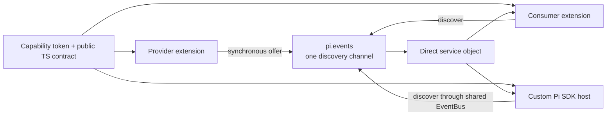
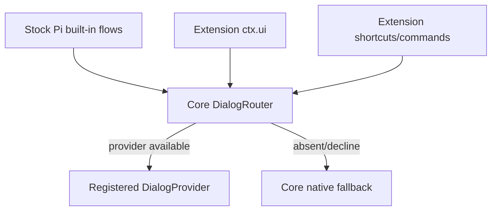

# 10 · 通用能力注册调研：让扩展与宿主复用同一服务入口

> 文档状态：**硬依赖直接组合已在 Plan → Request/Todo 落地；通用 capability registry 仍仅是调研建议**。研究基线为 2026-07-26、本仓库实际安装的 `@earendil-works/pi-coding-agent 0.81.1`，并核对了当日 Pi 官方文档、本地安装包源码、本仓库 Request/Todo/Plan 协议和相关上游议题。本文讨论的是进程内扩展组合；跨进程能力另走 MCP、IPC 或 HTTP。

## 1. 结论先行

Pi 0.81.1 没有正式的 extension service/capability registry，也没有供 extension 安全调用其他已注册工具的 API。现有正式入口只有三类：

- `pi.registerTool()`：把能力暴露给模型；
- `pi.getAllTools()`：只返回工具元数据，不返回 `execute`；
- `pi.events`：扩展间共享的无类型、无请求语义 EventBus。

因此，“安装一个通用插件后，未来插件和 Pi 系统自动、快速、丝滑地调用它”必须先区分依赖关系和调用方：

| 调用方 | 正确入口 | 0.81.1 是否可做 |
| --- | --- | --- |
| LLM | `registerTool()`；工具很多时使用 dynamic tool loading | 可以，官方支持 |
| 硬依赖的 extension A → B | A 在 package manifest 声明 B，并直接调用 B 的公共 `installB(pi)`/service API | 可以；不使用 EventBus RPC |
| 可选组合的 extension | 通用 capability discovery SDK；发现后直接调用类型化 service object | 可以，建立在一条共享 `pi.events` discovery channel 上 |
| 使用 Pi SDK 的自定义宿主 | 向 `DefaultResourceLoader` 传入共享 EventBus，再使用同一 capability SDK | 可以，官方支持外部持有 EventBus |
| stock Pi 内置流程 | 核心 capability registry + 明确的 host facade/provider 接入点 | 不可以只靠第三方 extension 完成，需要上游改造 |
| 外部进程或其他产品 | MCP、IPC、HTTP 或其他可序列化 RPC | 可以，但不属于 extension EventBus |

本文建议采用三层路线：

1. **硬依赖直接组合。** 如果 A 没有 B 就不能工作，A 必须显式依赖 B package；B 导出幂等 installer 与 service API，B 独立加载和 A 组合加载走同一入口。
2. **可选能力使用 discovery。** 一条通用能力发现 channel + 直接 service object；channel 只做一次发现，不再为每个 capability/method 重写 request ID、reply channel、timeout 和仲裁。
3. **长期提升到 Pi 核心。** 核心 `CapabilityRegistry` 负责注册来源、版本、重复 provider、lease 和 reload 清理；stock Pi 的标准 facade 在明确语义点消费 capability。

这不是把所有跨扩展协议压成一个“万能 RPC”。硬依赖由 package manager 和直接 API 表达；可选组合才经过 discovery；Request、provider discovery、state broadcast 和持久 journal 的业务语义仍然不同，公共层只收敛重复的**能力注册与发现 plumbing**。

## 2. 问题定义

### 2.1 目标

一个通用扩展提供能力后，希望达到：

- 后续 extension 不需要为每项能力复制一套 channel envelope；
- consumer 能判断 provider 是否存在，并得到稳定、类型化调用面；
- provider 和 consumer 的加载顺序不决定最终语义；
- reload、session replacement 和 shutdown 后没有悬空 service；
- 多 provider、版本冲突、取消和 owner outage 有确定行为；
- 自定义 Pi SDK 宿主可以使用同一入口；
- 若能力被提升为 Pi 标准 facade，stock Pi 内置流程和未来 extension 都能自动继承实现。

### 2.2 非目标

本文不尝试：

- 让 Pi 核心自动理解任意未知 capability 的业务语义；
- 给任意 extension 暴露其他工具的裸 `execute`；
- 用 TypeScript 泛型替代运行时校验；
- 把 EventBus 变成跨进程或不可信租户 RPC；
- 用 registry 代替 session journal、durable queue 或 state replay；
- 把 Plan/Goal workflow 互斥 query、Request dialog、Todo mutation 和 Plan→Todo handoff 合并成一个可选字段众多的统一 envelope。

## 3. 当前 Pi 的真实边界

### 3.1 `ExtensionAPI` 没有 service API

0.81.1 的 `ExtensionAPI` 暴露：

- lifecycle/event handler 注册；
- tool、command、shortcut、flag、renderer、provider 注册；
- message、entry、session、model、thinking 和 active tools 操作；
- `pi.events`。

它没有：

```ts
registerService(...)
getService(...)
registerCapability(...)
getCapability(...)
callTool(...)
getToolExecutor(...)
getLoadedExtensions(...)
```

`getAllTools()` 返回 `name`、`description`、`parameters`、`promptGuidelines` 和 `sourceInfo`，故意不返回工具执行函数。`AgentSession` 内部虽然持有完整 definition，但这不是 extension 间组合入口。

### 3.2 EventBus 很小，而且 discovery 可以同步完成

官方 `EventBus` 只有：

```ts
interface EventBus {
  emit(channel: string, data: unknown): void;
  on(channel: string, handler: (data: unknown) => void): () => void;
}
```

0.81.1 内部使用 Node.js `EventEmitter`：`emit()` 同步进入每个 listener；Pi 的 safe wrapper 会捕获异步错误，但不会让 emitter 等待 listener Promise。

本次调研用当前安装包执行了同步 discovery 实验：provider 在 listener 同步前半段 `offer()`，随后才 `await`。观察结果：

```text
before-emit -> provider-enter -> offered -> after-emit:pong
             -> provider-after-await -> after-tick
```

结论：

- `offer()`、`accept()` 必须发生在 listener 第一个 `await` 之前；
- caller 可以在 `emit()` 返回后立即获得 offered service object；
- 真正的异步 service method 随后直接返回 Promise；
- discovery helper 不能期待异步 listener 在未来才 offer。

### 3.3 已落地的 hard dependency 与仍重复的兼容 plumbing

| 实现 | 当前入口 | 已收敛内容 | 保留的领域逻辑 |
| --- | --- | --- | --- |
| Plan → Request | `pi-request-ui-dev` package + `installRequest(pi)` | manifest bundle/load order、installer 去重、typed dialog API | choice mapping、Plan state/journal、headless编号回复 |
| Plan → Todo | `pi-todo-dev` package + `installTodo(pi)` | manifest bundle/load order、installer 去重、typed managed API | board gate、managed journal、snapshot decoder、owner fail-closed |
| Independent Request/Todo consumer | `request-ui:v1` / `todo-service:v1` | 无；保持 compatibility envelope | normalization、abort、shutdown、strict result decoder |

这次 cutover 证明 EventBus 不应表达硬依赖。可选 capability 的通用 discovery 仍可能减少未来独立扩展重复的 presence/discovery plumbing，但不替代领域状态机。

### 3.4 Request native adapter 只实现了“部分透明”

Request 在 `session_start` 后修改收到的某个 `ExtensionUIContext` 对象：

```ts
ui.select = unifiedSelect;
ui.confirm = unifiedConfirm;
ui.input = unifiedInput;
```

因此，同一 session context 上继续调用 `ctx.ui.select/confirm/input` 的 Goal 等 extension 不需要知道 Request 存在，就会获得统一 renderer。

但这不是系统级替换：

- InteractiveMode 可以创建新的 `ExtensionUIContext` 对象；
- shortcut handler 等路径可能得到新对象；
- stock Pi 内置流程会直接调用 `InteractiveMode.showExtensionConfirm()`、`showExtensionSelector()` 等内部方法；
- 修改一个 context object 的字段不会改写上述宿主内部调用。

所以 native adapter 是很好的兼容层，却不能单独实现“Pi 系统本身也自动使用 Request”。系统级透明需要核心共享的 `DialogRouter`/`DialogProvider` 接入点。

## 4. 必须区分的五种能力面

| 能力面 | 谁调用 | 契约重点 | 正确机制 |
| --- | --- | --- | --- |
| Model tool | LLM | JSON schema、模型上下文、tool lifecycle | `registerTool()` |
| In-process service | Extension 或 SDK host | 类型化方法、presence、version、lease | capability registry/discovery |
| Broadcast event | 零到多个观察者 | immutable snapshot、session identity、reconcile | `pi.events` 单向广播 |
| Host facade/provider | stock Pi 与 extension | 标准语义、默认 fallback、统一路由 | ��心 provider slot，例如 DialogProvider |
| Remote capability | 其他进程/机器 | 序列化、认证、网络错误、协议兼容 | MCP/IPC/HTTP |

一项能力可以同时暴露多个面。例如 Request 可以：

- 注册 `ask` tool 给模型；
- 提供 `pi.ui.request@1` service 给 extension；
- 实现核心 DialogProvider 给 stock Pi；
- 若要被外部产品调用，再单独暴露 MCP/IPC。

这些入口共享领域实现，但不能共享同一种 transport 假装没有边界差异。

## 5. 候选方案比较

### 5.1 每项能力继续定义独立 channel

优点：

- 完全使用官方 API；
- 每项协议可精确表达自己的失败与版本语义；
- 不新增公共运行时依赖。

缺点：

- 每个 service 重复 presence、settlement、abort、conflict 和 lifecycle；
- consumer 复制 wire type 后没有编译期同步保证；
- provider discovery 与 request/response 的基础设施继续分叉；
- 自定义宿主也要知道每一条 channel。

适用：单向广播、少量稳定协议，或尚未出现重复前。

### 5.2 一条通用 RPC channel：`call({ service, method, args })`

优点：看起来只有一条 channel。

问题：

- `method: string` 与 `args: unknown` 把类型问题推到运行时；
- request ID、timeout、result/error envelope 仍存在，只是藏进 broker；
- direct object、live subscription 和同步 query 被迫序列化成 RPC 风格；
- 容易形成权限、重入、backpressure 和万能 dispatcher；
- 每项业务的 commit point 与返回校验被公共层模糊化。

结论：不采用。

### 5.3 暴露 `getToolExecutor()` 或 `callTool()`

优点：已注册工具似乎天然就是公共能力目录。

问题：

- 工具 schema 面向模型，不等于 extension service API；
- consumer 未必知道另一个 extension 的状态不变量；
- 裸 `execute` 可能绕过 argument preparation、schema validation、`tool_call` gate、tool lifecycle、`tool_result`、journal 与 renderer；
- 生命周期完整的 `callTool()` 会把 agent loop 的一部分复制到新的可重入调用面；
- active/inactive tools、并行 sibling、递归 tool call 和权限 hook 的语义会变复杂。

上游维护者对这条路线已有明确保留或拒绝意见，见 §11。

结论：不把 tool execution 当作通用 service composition。

### 5.4 Dynamic import + module singleton

直接 import provider package 可获得完整类型，适合明确依赖关系。但 Pi 0.81.1 为每个 extension 创建独立 jiti，且 `moduleCache: false`；不同 extension 不能依赖普通 module-scoped singleton 是同一个实例。

可以再用 `globalThis[Symbol.for(...)]` 保存实例，但会引入：

- 多个 EventBus/ResourceLoader 共处一进程时的 scope 冲突；
- reload 后旧 closure 悬空；
- owner 覆盖与卸载 CAS；
- 测试间全局污染；
- package resolution 与 optional peer dependency 管理。

结论：可作为特定 provider package 的兼容手段，不是首选平台层。

### 5.5 Extension factory 返回公共 exports

VS Code 等平台允许 extension activation 返回 public API。Pi 当前 `ExtensionFactory` 类型为：

```ts
type ExtensionFactory = (pi: ExtensionAPI) => void | Promise<void>;
```

loader 会 await factory，但忽略返回值。若改成 exports，还需要稳定 extension identity、presence API、reload invalidation 和 provider replacement 语义；consumer 也会直接耦合实现 package，而不是 capability contract。

结论：适合“UI companion 强依赖 core extension”一类明确依赖，不如 capability token 适合可替换通用能力。

### 5.6 MCP

MCP 已解决跨进程 tools/list 与 tools/call，适合让 Pi、其他 agent 或外部系统共享可序列化工具能力。

它不适合替代进程内 service：

- 不能自然传递 `AgentSession`、callback、AbortSignal 或 live object；
- 有额外连接、序列化、认证和错误面；
- extension 内部调用仍需 MCP client；
- stock Pi 是否使用某项语义仍需明确接入。

结论：作为外部边界保留，不承担 extension DI。

### 5.7 一条 discovery channel + 直接 service object

优点：

- 完全基于现有 `pi.events`；
- channel 只做同步 presence/discovery；
- 后续调用是直接、类型化函数，不需要每次 RPC；
- service object 可以包含方法、subscription 和 live reference；
- EventBus 自然隔离不同 ResourceLoader/runtime；
- 自定义 SDK host 可以持有相同 EventBus；
- provider unsubscribe 后下一次 discovery 自然不可见。

代价：

- 仍需一个公共 SDK/contract package；
- direct object 是同进程高信任边界；
- stock Pi core 不会自动消费未知 service；
- runtime type validation 与 lifecycle 仍需明确设计。

结论：0.81.1 上的推荐过渡方案。

### 5.8 核心 `CapabilityRegistry`

优点：

- 不再借 EventBus 模拟 registry；
- core 可附加 `sourceInfo`、owner lease、reload cleanup；
- extension、AgentSession 和 SDK host 可共享同一 registry；
- stock Pi 的标准 facade 可以直接消费；
- 冲突与 introspection 成为宿主契约。

代价：需要上游接受 API 与生命周期设计。

结论：长期目标；过渡 SDK 应尽量让未来迁移只替换 discovery backend。

## 6. 推荐过渡架构



唯一 bootstrap channel：

```text
pi-extensions:capabilities:v1
```

它只接受 discovery，不承载普通 method call：

```ts
interface CapabilityDiscoverEnvelope {
  readonly version: 1;
  readonly kind: "discover";
  readonly key: string;
  offer(candidate: unknown): void;
}
```

Provider listener 必须同步 offer：

```ts
events.on(CAPABILITY_CHANNEL, (value: unknown) => {
  if (!isDiscoverEnvelope(value)) return;
  if (value.key !== token.key) return;
  value.offer(providerRecord);
});
```

Consumer 在 `emit()` 返回后校验、去重、选择，然后直接持有 service API：

```ts
const providers = discoverCapabilities(pi.events, REQUEST_UI);
const request = requireSingleProvider(providers);
await request.api.request(questions, { signal });
```

公共层负责：

- key/version/cardinality；
- provider record decoder；
- duplicate provider ID；
- single/multi provider projection；
- lifetime/lease；
- presence error；
- bounded diagnostic metadata。

领域层继续负责：

- input/result runtime decoder；
- session/execution identity；
- timeout 与 cancellation 的业务含义；
- journal、commit point 和原子状态转换；
- provider priority、fallback 与 owner transfer；
- UI、renderer 和 prompt。

这正是与 09 文档“不要万能 registry”不冲突的边界：**统一 discovery plumbing，不统一领域状态机。**

## 7. 建议的公共 API

### 7.1 Token 不依赖对象身份

Pi 的 jiti 加载语义意味着不同 extension 可能获得公共包的不同模块实例。因此 token object 只提供 TypeScript 关联，运行时必须按稳定字符串匹配：

```ts
declare const CAPABILITY_TYPE: unique symbol;

export interface CapabilityToken<T> {
  readonly key: string;
  readonly cardinality: "single" | "multi";
  readonly [CAPABILITY_TYPE]?: T;
}

export function defineCapability<T>(
  key: string,
  options?: { cardinality?: "single" | "multi" },
): CapabilityToken<T>;
```

推荐 key：

```text
<namespace>.<capability>@<major>
```

示例：

```text
pi.ui.request@1
pi.todo.board@1
pi.execution.progress@1
```

### 7.2 Provider record

```ts
export interface CapabilityProvider<T> {
  readonly providerId: string;
  readonly api: T;
  readonly lifetime: AbortSignal;
  readonly priority?: number;
  readonly metadata?: Readonly<Record<string, string>>;
}
```

规则：

- `providerId` 在同一 key 内稳定、非空、有长度上限；
- `lifetime` 在 provider shutdown/reload 时 abort；
- metadata 只放短小、无敏感信息、可显示的诊断字段；
- API object 不进入 session journal，不做 JSON serialize；
- `priority` 只在 token/领域合同明确允许时使用，single service 默认不按加载顺序选 winner。

### 7.3 Provider 入口

```ts
const REQUEST_UI = defineCapability<RequestUI>("pi.ui.request@1");

const registration = provideCapability(pi, REQUEST_UI, {
  providerId: "request",
  lifetime: sessionAbortController.signal,
  api: {
    request: (questions, options) =>
      coordinator.request(requireCurrentUI(), questions, options),
  },
});

pi.on("session_shutdown", () => registration.dispose());
```

`provideCapability()` 应在 factory 阶段注册同步 listener；service method 自己检查 session readiness。这样 consumer 在 `session_start` 调用时不依赖 extension load order。

### 7.4 Consumer 入口

```ts
const provider = requireCapability(pi.events, REQUEST_UI);
provider.lifetime.throwIfAborted();

const result = await provider.api.request(questions, {
  signal: AbortSignal.any([signal, provider.lifetime]),
});
```

推荐同时提供：

```ts
findCapability(...)       // absent -> undefined
requireCapability(...)    // absent/duplicate -> throw
findCapabilities(...)     // multi -> stable readonly list
```

不要提供动态字符串 method dispatcher：

```ts
// 不推荐
callCapability("pi.ui.request@1", "request", unknownArgs);
```

### 7.5 过渡 SDK 不应是 broker extension

公共 SDK 只是两侧 import 的小型库：

- provider 和 consumer 直接使用同一个 EventBus；
- 不要求第三个 extension 必须先加载；
- 没有中央 mutable singleton；
- 没有 daemon、timer 或额外 persistence；
- SDK 自身不拥有业务 service。

本仓库不是 npm workspace，现有顶层 package 也不允许随意建立相对路径 production import。若实施，必须二选一：

1. 把 capability SDK 作为独立、可安装的 runtime package，由各 extension 的 `dependencies`/`peerDependencies` 正式声明；或
2. 先推动 Pi 核心 API，避免仓库引入新的共享 production package。

不能使用 `../../capability/src/index.ts` 一类仓库布局偶然可解析、安装后会失效的依赖。

### 7.6 A 硬依赖 B：直接组合，不做 EventBus RPC

如果 A 在缺少 B 时无法正确工作，`findCapability()` 后静默降级并不符合依赖语义。正确形态是：

```text
@scope/pi-b
├── public API / installB(pi)
├── B domain runtime
└── default extension entry -> installB(pi)

@scope/pi-a
├── dependency: @scope/pi-b ^1
└── default extension entry -> installB(pi) -> registerA(pi, bService)
```

B 的 package 同时保留独立 extension 入口和可组合 API：

```ts
// @scope/pi-b/api
export interface BService {
  read(request: BReadRequest): Promise<BReadResult>;
  mutate(request: BMutationRequest, signal?: AbortSignal): Promise<BMutationResult>;
}

export function installB(pi: ExtensionAPI): BService {
  const existing = findCapability(pi.events, B_SERVICE);
  if (existing) return existing.api;

  const runtime = createBRuntime();
  registerBToolsAndCommands(pi, runtime);
  const registration = provideCapability(pi, B_SERVICE, {
    providerId: "b",
    api: runtime,
    lifetime: runtime.signal,
  });

  pi.on("session_shutdown", () => {
    registration.dispose();
    runtime.dispose();
  });
  return runtime;
}

// @scope/pi-b extension entry
export default function bExtension(pi: ExtensionAPI): void {
  installB(pi);
}
```

A 直接导入并持有类型化 service：

```ts
import { installB } from "@scope/pi-b/api";

export default function aExtension(pi: ExtensionAPI): void {
  const b = installB(pi);
  registerA(pi, { b });
}
```

A 的 manifest 使用真正的 runtime dependency：

```json
{
  "dependencies": {
    "@scope/pi-b": "^1.0.0"
  }
}
```

这个结构解决四个问题：

- 只安装 B：Pi 加载 B 默认 entry，B 正常独立使用；
- 只安装 A：A 的 dependency 提供 B 代码，A 主动 `installB(pi)`，不等待某个 channel listener 恰好存在；
- A、B 都被显式加载：第二次 `installB(pi)` 发现同一 runtime 已安装并直接复用，不重复注册 tool/command；
- A 调 B：普通函数调用，错误、类型、取消和 stack trace 不经过 EventBus request/reply。

`installB()` 的幂等键必须是当前 Pi runtime，而不是普通模块 singleton。0.81.1 的 jiti `moduleCache: false`，A dependency 中的 B 与独立加载的 B 可能是两次模块求值；模块级 `let installed` 或普通 `WeakMap` 不能证明两边共享。推荐顺序：

1. capability SDK 已存在时，以共享 `pi.events` 做一次同步 presence discovery；第一个 installer 注册，后续 installer 直接取得同一 service；
2. capability SDK 尚未落地时，可临时用 `globalThis[Symbol.for("@scope/pi-b:runtime:v1")]` 保存 `WeakMap<EventBus, BRecord>`，以 `pi.events` 为 key；它只负责幂等安装，不承担 method RPC；
3. Pi 核心 registry 可用后，改由核心 lease/sourceInfo 管理，删除 `globalThis` 兼容层。

无论采用哪种 guard，都必须在 shutdown 标记 record disposed/abort lifetime，并使用 identity/CAS 删除；reload 后旧 disposer 不能清掉新 runtime。若 A 要求 B v1，而用户同时加载不兼容的 B v2，应在加载期给出明确版本冲突，不能运行两份同名工具或按加载顺序选一个。

如果 A 只复用 B 的纯算法，却不需要 B 的 tool、UI、session state，应进一步拆出无 Pi 注册副作用的 `@scope/pi-b-core`：A 和 B 都依赖 core，各自创建所需实例。只有确实需要共享 B runtime/state 时，才使用 `installB(pi) -> BService`。

## 8. 正确性与生命周期约束

### 8.1 加载顺序

Provider listener 在 extension factory 中同步注册。Consumer 不应在自己的 factory 中假设所有后续 extension 已加载；推荐：

- 在 `session_start` 后 resolve；或
- 在真正需要调用时 resolve；
- 不在模块顶层缓存 absent 结果。

### 8.2 重复 provider

Single capability：

- 零 provider：`find` 返回 `undefined`，`require` 明确失败；
- 一个 provider：使用；
- 两个不同 provider：明确 ambiguous，不能 first/last wins；
- 重复 `providerId`：整体视为冲突，不能静默去重后继续。

Multi capability：

- 返回稳定排序的 readonly list；
- 排序键由合同定义，例如 priority 降序、provider ID 升序；
- consumer 仍负责 open/decline/failure 策略。

### 8.3 Reload 与 shutdown

Direct service reference 最大风险是旧 closure。最低要求：

- provider 持有 registration lease；
- `session_shutdown` dispose listener 并 abort lifetime；
- consumer 不跨 runtime 缓存 provider；
- 已拿到旧 provider 的调用必须通过 aborted lifetime 失败；
- dispose 使用 identity/CAS，旧实例不能删除 reload 后的新实例；
- pending Promise 由 provider session signal 中止并 settle。

### 8.4 取消与 timeout

Registry 不替业务决定 timeout。Service method 显式接受 `AbortSignal`；consumer 合并：

- caller signal；
- provider lifetime；
- 可选业务 timeout。

Mutation 的 commit point 仍由领域层定义。Todo 类 mutation 必须保持：

```text
validate → calculate → persist → memory/UI commit → resolve
```

Registry 不能把 commit 后取消误报成失败，也不能在调用方 timeout 后回滚已经持久化的事实。

### 8.5 类型与运行时校验

`CapabilityToken<T>` 只让正常 TypeScript consumer 得到提示，不证明第三方 offer 真的实现 `T`。生产实现至少校验：

- exact provider record keys；
- key/version；
- provider ID；
- required method 是 function；
- lifetime 是 `AbortSignal`；
- metadata/诊断大小上限。

每个 service 继续校验自己的 input/result。尤其是会驱动持久 mutation、权限判断或 owner transfer 的结果，不能只做 `as Result`。

### 8.6 信任边界

Capability API 可以携带函数、callback、session object 和 subscription，正因为两侧处于同一进程和权限域。它不是 sandbox：

- consumer 可以滥用 service；
- provider 可以返回恶意对象或永不 settle；
- registry 不提供多租户 isolation；
- secret、credential 和高风险 capability 仍需独立权限设计。

需要不可信隔离时，改用进程/容器边界和可序列化协议。

## 9. “系统本身调用”需要什么

### 9.1 自定义 Pi SDK 宿主现在就能做

官方 SDK 允许外部创建 EventBus，并传给 `DefaultResourceLoader`：

```ts
const eventBus = createEventBus();
const loader = new DefaultResourceLoader({ eventBus });
await loader.reload();

const { session } = await createAgentSession({ resourceLoader: loader });
const request = requireCapability(eventBus, REQUEST_UI);
```

因此，自定义宿主与 extension 可以共享同一 capability discovery。宿主必须在 extension 加载、session 初始化和 provider ready 后调用。

### 9.2 Stock Pi 不会自动理解任意 capability

这是语义边界，不只是缺一张 Map。即使核心能列出 `pi.foo.bar@1`，它也不知道：

- 何时调用；
- 参数来自哪里；
- 失败是否 fallback；
- 返回值如何影响 UI/session/model；
- 是否需要权限、持久化或重试。

所以 stock Pi 自动使用通用扩展需要两件事同时成立：

1. 核心有统一 capability registry；
2. 核心在一个已知语义点定义并消费标准 facade/provider contract。

### 9.3 Request 对应的核心接入点

建议引入统一 DialogRouter：

```ts
interface DialogProviderV1 {
  select(request: SelectRequest): Promise<string | undefined>;
  confirm(request: ConfirmRequest): Promise<boolean>;
  input(request: InputRequest): Promise<string | undefined>;
  request(request: QuestionnaireRequest): Promise<QuestionnaireResult>;
}
```

路由关系：



这样未来 extension 只调用标准 `ctx.ui`，stock Pi 也调用同一 router。Request 安装时注册 provider，卸载后自动回退默认实现，不再修改某一个 context object。

核心仍要明确哪些 dialog 允许第三方 provider 接管；project trust、credential、权限等高风险提示可能需要保留不可覆盖的安全 UI。

## 10. 对现有扩展的迁移映射

### 10.1 Request

保留：

- `ask` model tool；
- coordinator、normalizer、renderer、serialization、abort/timeout；
- `ctx.ui.select/confirm/input` adapter，作为 0.81.x 兼容层。

新增：

```text
pi.ui.request@1
```

Service：

```ts
interface RequestUIServiceV1 {
  request(
    questions: readonly RequestQuestion[],
    options?: RequestDialogOptions,
  ): Promise<RequestDialogResult>;
}
```

迁移完全部 consumer 后删除 `pi-extensions:request-ui:v1` 专属 request/reply transport。若 Pi 核心未来提供 DialogProvider，再删除 monkey-patch adapter，改为正式 provider 注册。

### 10.2 Todo

新增：

```text
pi.todo.board@1
```

直接暴露当前 `TodoServiceRequest → TodoServiceResult` service method；保留：

- operation decoder；
- session ID；
- Plan gate；
- persistence 和 atomic commit；
- result/details decoder。

公共 registry 只替代 `accept/resolve/reject` presence plumbing，不触碰 reducer。

### 10.3 Plan → Todo handoff

Plan → Todo 已作为硬依赖落地：Plan manifest 声明并捆绑 Todo，factory 取得 `installTodo(pi)` service；活跃 phase 变化时调用 `syncPlanPhase()`，批准时调用一次 `handoffPlan()`。Handoff 复用普通 Todo `init`/`append` transition 与 `todo-state-v2` journal，成功后 Plan 关闭，agent 只更新普通数字 `#ID`。

这里没有可替换 progress provider、owner transfer、execution ID 或第二套 ledger。若未来真有多个可替换 Todo 实现，registry 可以承载 typed service discovery；它不应重新引入 parallel progress model。

### 10.4 Plan / Goal workflow exclusivity

两个独立 package 继续复制并严格解码：

```text
pi-extensions:exclusive-workflow:v1
```

它是按 session 执行的同步只读 query：启动一方前询问另一方是否 active，不广播 state，也不要求 replay/cache。Registry 若提供 typed presence/service lookup 可以替代这层小型 wire plumbing，但不能替代 Plan 与 Goal 各自的 branch journal。

## 11. 上游现状与方向判断

### 11.1 Typed service registry 提案

[earendil-works/pi#4207](https://github.com/earendil-works/pi/issues/4207) 提议：

```ts
pi.registerService("permissions", service);
const permissions = pi.getService<PermissionsService>("permissions");
```

它列举 permission、subagent、extension presence 和 UI observation 等真实需求。该 issue 在上游大重构期间被 bot 自动关闭，评论明确说未进行评审；因此不能解读为维护者在技术上拒绝 service registry。

本文建议重新提交时不要只给 `Map<string, unknown>`：应同时解决 typed token、sourceInfo、duplicate、lease、reload、SDK host access 和 single/multi cardinality，否则会把关键生命周期继续留给每个 extension。

### 11.2 `getToolExecutor()` 提案

[earendil-works/pi#2420](https://github.com/earendil-works/pi/issues/2420) 希望 extension 直接取得其他工具 executor。维护者指出：调用方通常不知道其他工具的准确输入 shape，也不知道是否破坏其内部状态；若双方可控，应使用 `pi.events`。

这是基于技术边界的明确反对意见。

### 11.3 `callTool()` / Code Mode 提案

[earendil-works/pi#2632](https://github.com/earendil-works/pi/issues/2632) 提议 lifecycle-aware `callTool()`；维护者认为 code mode 可以留在 extension，不应进 core。后续 [#6121](https://github.com/earendil-works/pi/issues/6121) 与 [#6198](https://github.com/earendil-works/pi/issues/6198) 再次提出 extension 执行已注册工具，仍未进入计划。

方向判断：

- “任意执行其他工具”短期上游接受概率低，且不是 service composition 的正确抽象；
- typed capability/service registry 尚未得到实质技术评审，重新提出仍有价值；
- 最有说服力的上游方案应证明 stock Pi/SDK/extension 三方共享 registry 的生命周期收益，而不是只减少几行 event boilerplate。

## 12. 推荐落地顺序

1. A 缺少 B 就不能工作：A manifest 声明 B runtime dependency、`bundledDependencies` 和 resource load order；B 导出无副作用的 public types 与幂等 `installB(pi)`。
2. B standalone entry 与 A 都调用同一个 installer；不得各自注册一套 B tool、command 或 runtime。
3. 用 B-only、A-only、A-first+B、B-first+A 四种加载方式证明只存在一个 B runtime/public surface。
4. A 调用 B 的 service method 只走直接 API；兼容 EventBus channel 仅面向没有 package dependency 的独立 consumer，不能承载 A → B 的必经路径。
5. A 只需要纯算法、不需要共享 B state 时，拆 `b-core`，不要创建进程级 singleton。

完成依赖分流后，只有“B 可选存在/可替换 provider”的路径进入下面 capability registry 阶段。

### 阶段 A：公共合同与原型

1. 明确 `CapabilityToken`、provider record、single/multi 和 lifetime。
2. 用一条 `pi-extensions:capabilities:v1` 实现同步 discover/offer。
3. 先在测试 fixture 中证明 consumer-first/provider-first、duplicate、unload、reload 和 direct async call。
4. 不迁移业务协议，先确认 SDK 不引入全局 singleton 或 package 安装问题。

### 阶段 B：Request 试点

1. Request 发布 `pi.ui.request@1`。
2. 写一个不 import Request 内部实现的 external consumer fixture。
3. 保留旧 channel 与 native adapter，只在迁移窗口双轨。
4. 迁移仓库内明确 consumer；证明缺失 provider、headless、abort、timeout、shutdown 语义不变。
5. 全部 consumer 切换后删除旧 Request channel，不永久保留 alias/shim。

### 阶段 C：Todo 与 workflow query

1. Todo compatibility service 迁移，证明 tool/service 仍复用同一 reducer、journal 和 result decoder。
2. Plan → Todo phase sync/handoff 保持 hard-dependency direct service；除非出现可替换 Todo provider，否则不引入 registry。
3. Plan ↔ Goal exclusivity query 可迁移为 typed presence capability，并证明 active/inactive、foreign session、加载顺序与 teardown 语义不变。
4. 更新每个受影响 extension README 和 coexistence suite。

### 阶段 D：推动 Pi 核心

建议上游 API：

```ts
interface ExtensionAPI {
  registerCapability<T>(
    token: CapabilityToken<T>,
    provider: CapabilityProvider<T>,
  ): Disposable;

  getCapabilities<T>(
    token: CapabilityToken<T>,
  ): readonly CapabilityProvider<T>[];
}
```

核心实现要求：

- registry 位于共享 ExtensionRuntime/ResourceLoader 边界；
- 自动附加真实 `sourceInfo`，不信任 provider 自报来源；
- duplicate 和 cardinality 由核心检查；
- reload/session replacement 自动 invalidation；
- SDK host 可注入或取得同一 registry；
- stock Pi 的 DialogRouter 等标准 facade 显式消费；
- events 继续承担 broadcast，不被 registry 取代。

阶段 D 完成后，过渡 SDK 可把 backend 从 EventBus discovery 换成 core registry，业务 token 与 service contract 保持不变。

## 13. 验证矩阵

### 13.1 公共 registry

| 维度 | 必须验证 |
| --- | --- |
| 加载顺序 | consumer-first、provider-first；consumer 在 session/call time resolve |
| 硬依赖双加载 | B-only、A-only、A-first+B、B-first+A 都只注册一个 B runtime/tool/command；A 始终取得同一 service |
| Presence | absent、ready、not-ready、shutdown 后 absent |
| Single 冲突 | 两 provider、重复 provider ID、不同 major version |
| Multi | stable ordering、provider decline/failure、一个 provider unload |
| 同步边界 | offer 在 `emit()` 返回前完成；先 await 后 offer 不被接受 |
| Lifecycle | startup、reload、new/resume/fork、shutdown、多个 EventBus 同进程 |
| Stale reference | lifetime abort 后旧 service 调用失败；旧 dispose 不影响新 lease |
| Type boundary | malformed record、缺 method、bad signal、oversized metadata |
| Async | direct resolve/reject、pre-abort、mid-flight abort、timeout |
| Isolation | 两个独立 EventBus 的 provider 不互相可见 |

### 13.2 领域回归

| Capability | 必须保持的可观察合同 |
| --- | --- |
| Request | serialization、Other/text/multi、native fallback、headless rejection、abort/timeout |
| Todo | Plan gate、session match、journal-before-commit、commit 后 cancel 不反转 |
| Progress | priority、duplicate ID、owner persistence、snapshot exact decode、outage fail closed |
| DialogProvider | stock core 与 extension 走同一 router；安全 dialog 不被错误接管 |

### 13.3 本次调研原型证据

使用 0.81.1 当前 EventBus 执行“一条 discovery channel + direct service object”原型：

```text
providers=request; result=answered:ship?
duplicateProviders=request,alternate
afterAlternateUnload=request
afterAllUnload=0
```

该原型只证明底层同步发现、直接调用和 unsubscribe 可行；它没有实现本文要求的 production decoder、duplicate fail-closed、lifetime 和 session/reload 测试，不能当成交付实现。

## 14. 决策记录

| 决策 | 结论 | 理由 |
| --- | --- | --- |
| 是否继续每 capability 一套 request/reply channel | 逐步否 | transport boilerplate 已重复，宿主也难统一发现 |
| A 是否硬依赖 B | package dependency + B 的幂等 `installB(pi)` | required dependency 不应依赖 best-effort EventBus RPC/presence |
| 是否做万能 RPC broker | 否 | 丢类型、掩盖领域语义、扩大 dispatcher 风险 |
| 是否直接执行其他 extension tool | 否 | 工具契约与 service 契约不同，生命周期和状态风险高 |
| 是否用 `globalThis` 作为主 registry | 否 | scope、reload、测试污染和 stale closure 风险 |
| 是否用一条 channel 做 capability discovery | 是，作为 0.81.x 过渡 | 使用官方原语，运行时隔离正确，调用后无 RPC 开销 |
| 是否统一所有跨扩展协议 | 否 | broadcast、request、provider、journal 继续分开 |
| 是否推动核心 registry | 是 | stock Pi、SDK host、extension 需要同一生命周期所有权 |
| stock Pi 是否能自动使用任意未知 capability | 否 | 必须有明确 host facade 和业务调用点 |
| Request 是否继续 native adapter | 过渡期是 | 对现有 extension 零改动；核心 DialogProvider 落地后再移除 |
| 跨进程是否复用 capability object | 否 | 使用 MCP/IPC/HTTP 和可序列化 schema |

## 15. 最终判断

“丝滑”不应意味着隐藏边界，而应意味着调用方只面对稳定的标准入口：

- 模型面对 tool；
- 硬依赖 extension 直接面对依赖包公开的 service/installer；
- 可选组合 extension 面对 typed capability；
- stock Pi 面对 core facade/provider；
- 外部系统面对 MCP/RPC。

在 Pi 0.81.1 上应先按依赖语义分流：**A 缺少 B 就不能工作时，使用 package dependency + 幂等 `installB(pi)`，EventBus 最多参与一次同步去重发现，不承担 A → B method RPC；B 可选存在时，再把 `pi.events` 从每项能力的完整 RPC transport 收敛为一条 capability discovery bootstrap，发现后直接调用有版本、可取消、带 lease 的 service object。**

它能消除 Request/Todo compatibility service 与 workflow presence query 重复的注册 plumbing，但不会替代领域 decoder、状态机、journal 或 handoff 原子性。若最终要让 stock Pi 内置流程自动采用这些通用扩展，仍必须把 capability registry 和对应 facade 提升进 Pi 核心；第三方 extension 无法通过修改某个 context object，让宿主自动理解任意新语义。

## 参考资料

Pi 官方：

- [Extensions 文档](https://github.com/earendil-works/pi/blob/main/packages/coding-agent/docs/extensions.md)
- [Extension `pi.events`](https://github.com/earendil-works/pi/blob/main/packages/coding-agent/docs/extensions.md#pievents)
- [Dynamic Tool Loading](https://github.com/earendil-works/pi/blob/main/packages/coding-agent/docs/extensions.md#dynamic-tool-loading)
- [SDK：共享 EventBus](https://github.com/earendil-works/pi/blob/main/packages/coding-agent/docs/sdk.md#extensions)
- [Inter-extension event bus example](https://github.com/earendil-works/pi/blob/main/packages/coding-agent/examples/extensions/event-bus.ts)

上游议题：

- [#4207 · Typed cross-extension service calls](https://github.com/earendil-works/pi/issues/4207)
- [#2420 · `getToolExecutor()`](https://github.com/earendil-works/pi/issues/2420)
- [#2632 · Lifecycle-aware `callTool()`](https://github.com/earendil-works/pi/issues/2632)
- [#4072 · Expose loaded extensions list](https://github.com/earendil-works/pi/issues/4072)
- [#6121 · Allow extensions to execute registered tools](https://github.com/earendil-works/pi/issues/6121)
- [#6198 · Code Mode extension support](https://github.com/earendil-works/pi/issues/6198)

本仓库：

- [跨扩展通用协议](09-cross-extension-protocols.md)
- [扩展系统设计](04-extension-system.md)
- [生产级最佳实践](07-production-checklist.md)
- [Request README](../../request/README.md)
- [Todo README](../../todo/README.md)
- [Plan README](../../plan/README.md)
- `request/src/protocol.ts`、`request/src/adapters.ts`、`request/src/index.ts`
- `todo/src/service.ts`
- `plan/src/workflow-mode.ts`、`goal/src/workflow-mode.ts`
- `@earendil-works/pi-coding-agent 0.81.1` 本地安装包中的 `extensions/types.d.ts`、`extensions/loader.js`、`event-bus.js` 与 `interactive-mode.js`

[上一篇：跨扩展通用协议](09-cross-extension-protocols.md) · [下一篇：Hashline 扩展设计与实现](11-hashline-extension-design.md)
