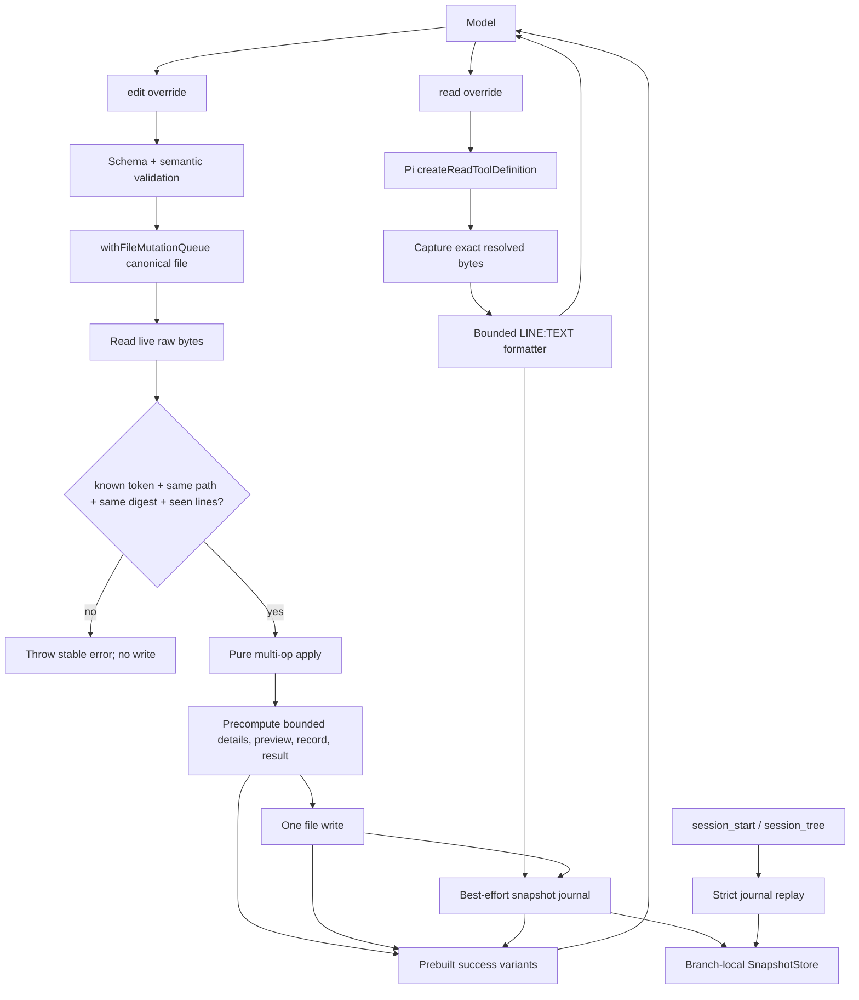
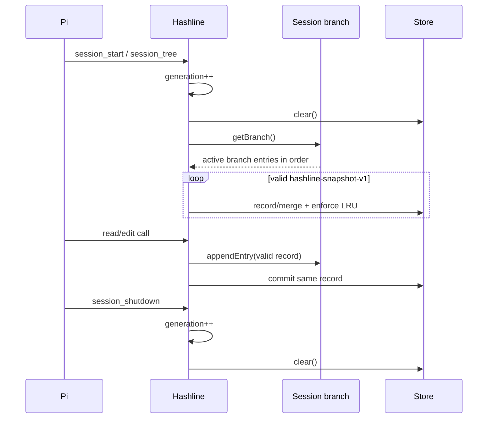

# 10 · Hashline 扩展设计：用可重放快照约束精确行编辑

> 文档状态：**Hashline v1 已实现并完成生产级严格代码审查**。顶层 `hashline/` package 的运行 API 基线为本仓库锁定的 `@earendil-works/pi-coding-agent 0.81.1`，兼容下限为 `>=0.81.0`。调研、设计、实现与审查更新至 2026-07-26；发布门禁证据见 §13、§15.4 与 §17。Oh My Pi 依据提交 `ba7db9943d0f58499b24c1f6bd64722580f772a5`，`pi-hashline-edit` 依据 `0.8.3` / 提交 `667111575ebba136dadfd6989379e7f67e0d40d9`。

## 1. 结论先行

Hashline v1 是一个独立顶层 Pi extension package，同时覆盖内建 `read` 与 `edit` 两个同名工具：

- `read` 保持原参数和图片能力，对可安全编辑的 UTF-8 文本增加文件快照令牌与 `LINE:TEXT` 行号；
- `edit` 改为窄的结构化行编辑协议，单次只修改一个已有文件，多个操作全部引用同一份原始快照；
- 快照令牌是原始文件字节的完整 SHA-256，而不是 2 字符行哈希或 4 位十六进制文件哈希；
- 令牌只有在当前 session branch 的版本化 journal 中被记录、且绑定到同一 canonical path 时才有效；仅仅“算出了相同哈希”不构成来源证明；
- edit 在同一文件 mutation queue 内重新读取并校验完整字节，任何 stale、未知、跨路径或未见行引用都在写入前原子拒绝；
- v1 不自动重定位 stale anchor、不做三方 merge、不猜路径、不修补 payload、不解析语法块；失败后的唯一恢复路径是精确范围 `read`；
- 成功结果保持 Pi 内建 `EditToolDetails` 的 `diff`、`patch`、`firstChangedLine` 形状，使内建 renderer、LSP 扩展和 session 行为继续工作；
- snapshot 元数据写入 branch-local custom entry，不塞入内建 tool `details`，reload、resume、fork 和 `/tree` 后按当前 branch 重放。

一句话定义：**Hashline 是一次带“我确实看过这版文件这些行”证明的 compare-and-set 行编辑，不是模糊 patch 引擎。**

## 2. 要解决的问题

### 2.1 现有 edit 的真实失败面

Pi 0.81.1 的内建 `edit` 已经比单次字符串替换更强：一个调用可提交多个互不重叠的 `oldText → newText`，所有匹配都相对原文件计算，并通过 `withFileMutationQueue()` 序列化同文件写入。Hashline 不应重复解决“如何生成 diff”，而要收紧以下仍存在的定位风险：

| 失败模式 | 内建 exact-text edit 的表现 | Hashline v1 的约束 |
| --- | --- | --- |
| 模型复制了过大的 `oldText`，其中一处空白变化导致失配 | 安全失败，但重试上下文大 | 只传行号、快照与最终行内容 |
| 模型复制了过小且不唯一的 `oldText` | 内建拒绝多匹配 | 行号在被读版本上唯一；整文件快照防漂移 |
| 读取后文件被另一 tool、用户或 formatter 修改 | exact text 可能失配；若目标片段仍相同则可能继续写 | 任意原始字节变化都使整文件快照 stale |
| 多个并行 edit 都从旧内容计算 | 依赖 mutation queue；第二个 exact match 通常失败 | queue 内做完整 CAS；第二个必定 stale |
| 模型凭记忆编辑未展示区域 | 只要 oldText 正确仍可写 | 目标范围必须属于该快照的 `seen` 区间 |
| 模型把 read 的行号前缀复制进新内容 | 可能把前缀写入文件 | prompt 明确禁止；实现只按结构化 `lines[]` 写入且不静默剥离 |
| 行尾、BOM 或 trailing spaces 被忽略 | normalize 后匹配可能不体现全部字节变化 | 快照哈希覆盖原始 bytes；未触碰字节尽量保持不变 |
| stale anchor 被“智能恢复”到错误位置 | 内建无此行为；部分社区实现会恢复 | v1 fail closed，不恢复、不滑动 |

### 2.2 产品目标

| 编号 | 目标 | 可观察验收 |
| --- | --- | --- |
| G1 | 读写版本强绑定 | `edit` 只接受当前 branch journal 中存在、路径匹配的 `h1_…` 快照 |
| G2 | stale 必须无写入 | 从 read 到 edit 之间任意原始字节变化均抛 `E_STALE_SNAPSHOT`，文件保持 edit 调用前状态 |
| G3 | 禁止盲改 | replace/delete 覆盖的每一行都已展示；insert 所在 gap 两侧存在的行都已展示 |
| G4 | 同文件并发无 lost update | 两个引用同一快照的并发 edit 最多一个成功；另一调用在 queue 内重读后拒绝 |
| G5 | 多操作一次提交 | 一个文件内多个不相交操作相对同一原始坐标解析，完成一次内存 apply 和一次 write |
| G6 | branch 可恢复 | reload/resume 后可继续使用当前 branch 中未淘汰的快照；切换到不含该 read 的 branch 后令牌拒绝 |
| G7 | 字节保真 | BOM、未修改行、现有行终止符和 trailing whitespace 不因 hashline 编辑被整体规范化 |
| G8 | Pi 工具兼容 | read details 保持 `ReadToolDetails`；edit details 保持 `EditToolDetails`；输入继续包含顶层 `path` |
| G9 | 输出有界 | read/preview/content/details 遵守 50 KiB、2000 行及插件自己的输入/文件上限，不返回半行 anchor |
| G10 | 模式无关 | TUI、RPC、JSON、print 使用同一核心语义；没有依赖确认框或自定义终端组件的正确性路径 |
| G11 | 失败可行动 | 每个 Hashline 自定义拒绝有稳定错误码、无写入说明和下一次精确 read 建议；内建 read host error 保持 Pi 语义；不返回伪成功 |
| G12 | 可干净回退 | 卸载/取消链接并 `/reload` 后，Pi 原生 `read`/`edit` 自动恢复；工作区无私有 sidecar 文件 |

### 2.3 非目标

v1 明确不做：

- 新建、删除、移动或重命名文件；新文件和完整重写继续使用 `write`；
- 多文件 transaction；单次 edit 只接受一个 `path`；
- stale anchor 自动平移、模糊匹配、三方 merge 或 session-chain replay；
- Tree-sitter/LSP block 解析、AST rewrite 或 formatter；语义重构继续使用 `lsp`/专用工具；
- 覆盖 `grep`、`rg`、`write`、`ls` 或 `find`；grep 命中本身不授予 edit provenance；
- 对图片、二进制、无效 UTF-8、目录、设备文件、FIFO 或超过上限的大文件提供 hashline edit；
- 工作区 sandbox、权限审批、恶意本机进程隔离或 cryptographic authorization；extension 与 Pi 同用户权限运行；
- telemetry、网络、后台 watcher、子进程、数据库或项目内 snapshot sidecar；
- 自动修改模型产生的 payload。检测到风险时拒绝，不“替模型修好”。

## 3. Pi 与外部实现调研

### 3.1 Pi 0.81.1 可依赖的事实

1. Extension 可注册与内建工具同名的 `read`、`edit` 等工具；后注册定义覆盖内建执行，交互模式会显示覆盖警告。
2. 同名覆盖若省略 `renderCall`/`renderResult`，Pi 按 slot 继承内建 renderer；但 prompt metadata 不继承，扩展必须自己提供。
3. 覆盖内建工具必须保持结果与 `details` 形状，否则 renderer 和 session 逻辑可能失效。
4. `createReadToolDefinition()`、`truncateHead()`、`generateDiffString()`、`generateUnifiedPatch()` 与 `withFileMutationQueue()` 均由 `@earendil-works/pi-coding-agent` 公共入口导出。
5. Pi 工具调用默认可并行；内建 `edit`/`write` 已把整个 read-modify-write 放进以 canonical file 为 key 的 mutation queue。
6. `appendEntry()` 保存不进入模型上下文的 extension 状态；branch 相关状态应在 `session_start` 与 `session_tree` 通过 `getBranch()` 重建。
7. 本仓库 `lsp` 在成功的 `edit`/`write` `tool_result` 后读取 `event.input.path` 同步文档，因此 Hashline edit 必须保留工具名 `edit` 与顶层 `path`。

### 3.2 对比矩阵

| 实现 | 已观察设计 | 值得采用 | 不直接采用 |
| --- | --- | --- | --- |
| Pi 内建 read/edit | read 支持 text/image、offset/limit、50 KiB/2000 行截断；edit 支持一文件多 exact replacements、BOM/EOL 处理、统一 mutation queue、标准 diff details | 公共 tool factories、原 schema/renderer/result shape、queue、diff 生成器 | exact-text 仍要求模型复制旧文本；没有“已读版本/已见行”前置条件 |
| Oh My Pi `@oh-my-pi/hashline`（所列提交） | `[path#4HEX]` 整文件标签；`LINE:TEXT`；SWAP/DEL/INS/REM/MV 与 Tree-sitter block DSL；session snapshot history；seen-line guard；stale line remap；路径按 tag 恢复；多 section preflight | 文件级版本绑定优于短行哈希；已见行；先 prepare 后 commit；BOM/EOL、no-op、错误上下文与测试面完整 | 16-bit tag 可碰撞且 live tag 相等时直接信任；自动 stale 恢复、路径回绑、boundary repair、block/file ops 扩大可信核心；DSL parser 复杂；多文件 preflight 不是磁盘 transaction |
| `pi-hashline-edit 0.8.3`（所列提交） | 默认 2 字符（8-bit）三行窗口 line hash，可配 3–4；结构化 replace/append/prepend；snapshot 多版本；stale 时精确三方 merge；atomic rename；图片委托内建 read | 结构化 tool schema、单文件多操作、冲突检测、输出边界、symlink/hardlink 与 no-op 风险被认真处理 | 8-bit 默认 hash 误接受面过大；fuzzy hint/merge 仍可在 stale 后写；read/details 与当前 Pi 基线有漂移；原子 rename 的 inode/metadata 取舍不适合静默继承 |

### 3.3 采纳、延后与拒绝

**采纳：**

- 文件级 snapshot tag，而非每行短 hash；
- read 输出行号，edit 使用原始 1-based 坐标；
- 记录模型实际展示过的行，edit 强制 provenance；
- 单文件多操作先完整验证、再一次 apply/write；
- no-op 作为错误，提示 re-read，而不是成功；
- session 内有界快照历史，并在 branch 切换时重建；
- 新快照随 edit 的有界变更上下文返回，支持附近的下一次修改。

**延后：**

- grep/search 产生快照：需要与本仓库 `rg` 及其他 grep override 设计版本化互操作；
- syntax block：需要额外 parser/native 依赖、语言覆盖与错误恢复合同；
- stale recovery：只有真实 edit telemetry/benchmark 证明 re-read 成本不可接受后，才可单独设计实验模式。

**拒绝：**

- 2–4 字符 hash 作为写入前置条件；
- 未在 branch store 登记但恰好等于 live hash 的“自证明”令牌；
- stale 自动平移或三方 merge；
- 仅凭 tag 猜测另一个路径；
- 自动删除“疑似重复”的 payload 行、补 closing delimiter 或宽化/缩窄范围；
- 多文件调用宣称原子；
- 为了方便而把整个文件 snapshot 持久化到 session。

### 3.4 为什么不用短 hash

若一个不同内容窗口在均匀 `b` bit hash 下被误接受，单次概率近似为：

$$P_{false}=2^{-b}$$

短标签在累计样本中的 birthday collision 近似为：

$$P_{birthday}\approx 1-e^{-k(k-1)/(2\cdot 2^b)}$$

- 8-bit 行标签单次随机误匹配约为 $1/256$；
- 16-bit 文件标签单次随机误匹配约为 $1/65{,}536$；100 个独立状态中的 birthday collision 已约为 7.3%；
- v1 的 `h1_` 后携带完整 256-bit SHA-256 base64url（43 字符），并且仍要求当前 branch store 中存在相同 path/token 记录。

Hashline 不把 SHA-256 当权限凭据。它只是高强度内容前置条件；“来自本 branch 的 read”由 journal lookup 单独证明。

## 4. 模型可见工具合同

### 4.1 `read`：同参数、带 provenance 的文本输出

公开参数直接复用 `createReadToolDefinition(...).parameters`，不加入 `raw` 或插件私有开关：

```ts
interface ReadToolInput {
  path: string;
  offset?: number; // 1-based
  limit?: number;
}
```

对一个可编辑文本的示例结果：

```text
[hashline path="src/greet.ts" snapshot="h1_cKnQSQ2wksWuDYj8LA9oH-v96HoYjAs1bPvlQ23HfFM"]
10:export function greet(name: string) {
11:  return `Hi ${name}`;
12:}

[Showing lines 10-12 of 40. Use offset=13 to continue.]
```

格式规则：

- header 是 display protocol，不作为 edit parser 输入；`path` 使用 JSON string escaping，避免 `#`、`]`、换行或控制字符伪造 header；
- `snapshot` 形状固定为 `^h1_[A-Za-z0-9_-]{43}$`；`h1` 同时版本化哈希与 byte-normalization 规则；
- body 每个完整展示的物理文本行是 `${lineNumber}:${literalLineBody}`；冒号后的空白和内容不改写；
- newline-terminated 文件不暴露 `split("\n")` 产生的虚假尾部 sentinel；空文件为 0 行，并引导使用 `write`；
- notice、错误和 header 不计入 `seen`；只有完整的 `N:…` source row 计入；
- 若第一条 source line 单独超过剩余 byte budget，不输出半行、不记录 seen，提示缩小/改用其他检查方式；
- header 和 notice 的字节预算先保留，body 再用 Pi `truncateHead`；最终 `content` 仍不超过 50 KiB/2000 行；
- 可编辑快照仅对 `MAX_EDITABLE_FILE_BYTES` 内、regular、有效 UTF-8、无 NUL 的文件生成；其他 read 尽量保持内建行为，但不返回 snapshot header。

图片结果由内建 read 原样返回，不产生 token。无效 UTF-8/其他 binary 可继续获得内建只读展示或明确说明，但不能把 lossy-decoded 字符作为可写 snapshot。

### 4.2 `edit`：结构化、单文件、原坐标操作

为避免 custom patch DSL 的 parser/streaming/错误恢复面，v1 使用 TypeBox 可表达、Provider 容易生成的扁平结构。公开 schema 使用 `StringEnum`；runtime 再校验字段组合：

```ts
export const EDIT_OPS = [
  "replace",
  "delete",
  "insert_before",
  "insert_after",
] as const;

export interface HashlineEditOperation {
  op: (typeof EDIT_OPS)[number];
  start: number;        // 1-based original line
  end?: number;         // inclusive; replace/delete only, defaults to start
  lines?: string[];     // replace/insert only; one entry = one logical line
}

export interface HashlineEditInput {
  path: string;
  snapshot: string;
  edits: HashlineEditOperation[];
}
```

字段矩阵：

| `op` | `start` | `end` | `lines` | 语义 |
| --- | --- | --- | --- | --- |
| `replace` | 必填 | 可选，默认 `start` | 必填且至少 1 项 | 用最终行集合替换 inclusive 范围 |
| `delete` | 必填 | 可选，默认 `start` | 必须缺失 | 删除 inclusive 范围 |
| `insert_before` | 必填 | 必须缺失 | 必填且至少 1 项 | 插入到原始 `start` 行前的 gap |
| `insert_after` | 必填 | 必须缺失 | 必填且至少 1 项 | 插入到原始 `start` 行后的 gap |

额外规则：

- `edits` 为 1–100 项；每个行号是安全整数且 `>=1`；
- `lines[]` 每项是一条逻辑行，禁止内含 `\r`、`\n` 或 NUL；空字符串表示一条空白行；
- 总 replacement UTF-8 bytes 不超过 128 KiB，单行不超过 64 KiB；consumed old bytes 与 replacement bytes 合计不超过 128 KiB；
- 所有 range 必须在原文件物理行范围内，`end >= start`；
- 两个 replace/delete range 不得重叠；同一 gap 只能有一个 insertion；replacement 内部 gap 不得再插入；
- `insert_after N` 与 `insert_before N+1` 是同一 gap，必须冲突拒绝；
- 坐标永远相对调用开始时的原文件，绝不按数组顺序增量位移；
- replace 的 `lines` 为空不等于 delete；必须显式使用 `delete`；
- 不接受 extra keys、旧 `oldText/newText`、hashless 调用或模型自造 token。

示例：

```json
{
  "path": "src/greet.ts",
  "snapshot": "h1_cKnQSQ2wksWuDYj8LA9oH-v96HoYjAs1bPvlQ23HfFM",
  "edits": [
    {
      "op": "replace",
      "start": 11,
      "end": 11,
      "lines": ["  return `Hello ${name}`;"]
    },
    {
      "op": "insert_after",
      "start": 12,
      "lines": ["", "export const DEFAULT_NAME = \"world\";"]
    }
  ]
}
```

### 4.3 `edit` 成功结果

模型可见 `content` 只包含事实、follow-up snapshot 和有界 context：

```text
Updated src/greet.ts with 2 hashline edits (+3/-1 lines).
[hashline path="src/greet.ts" snapshot="h1_TUjzv9m7S6ZJwbArYjdOcFLPJ08JEr_ZLMGmw2PU7Y0"]
9:
10:export function greet(name: string) {
11:  return `Hello ${name}`;
12:}
13:
14:export const DEFAULT_NAME = "world";
```

机器/UI details 保持内建形状，不加入 snapshot 私有字段：

```ts
interface EditToolDetails {
  diff: string;
  patch: string;
  firstChangedLine?: number;
}
```

- `diff` 与 `patch` 在 commit 前从候选 before/after text 计算，分别使用 Pi 公共 `generateDiffString()` 与 `generateUnifiedPatch()`；它们只用于展示/记录，绝不反向参与磁盘写入；
- `firstChangedLine` 来自已经验证的原坐标 operation plan；
- 三个字段序列化后的 UTF-8 总量必须不超过 `MAX_EDIT_DETAILS_BYTES`；超限在 write 前抛 `E_TOO_LARGE`，不截成貌似完整的 patch；
- follow-up header 只在 snapshot journal 成功提交且至少展示一条完整新文件行时返回；
- 变更 preview 合并每个 changed span 的前后 2 行，远距离 span 以普通 notice 分隔；只有实际 `N:…` 行进入新 snapshot 的 seen ranges；
- preview 仍受总输出边界；需要编辑未展示位置时再次 `read`。

### 4.4 Prompt metadata

覆盖工具不会继承内建 prompt metadata，因此实现必须显式提供短小合同：

```text
read promptSnippet:
Read files with numbered lines and a branch-local snapshot token for precise edits

edit promptSnippet:
Edit previously read lines only when the file snapshot is still current
```

`promptGuidelines` 至少覆盖：

1. 使用 `edit` 前先用 `read` 获取同一文件的 snapshot 与目标行；
2. 原样复制 snapshot，不猜、不复用另一 path/branch 的 token；
3. 所有 edit 行号引用同一次调用的原文件，不按前序 operation 位移；
4. `lines` 只放最终文件内容，不带 `N:` read prefix；
5. stale/unseen/no-change 后先 re-read，不能扩大范围或改用模糊猜测；
6. 新文件/完整重写使用 `write`；symbol rename/code action 使用 `lsp`。

不再注入一整套 patch grammar，避免长期占用每轮 system prompt。

## 5. 核心不变量与信任边界

### 5.1 不变量

| ID | 不变量 |
| --- | --- |
| H1 | 每个可写 token 确定性携带 canonical base64url `h1_ + SHA-256(raw bytes)` 的完整 256-bit 摘要；不 trim、不 LF-normalize、不忽略 BOM |
| H2 | token 必须在当前 branch replay 得到的 store 中存在；live hash 相同但 store 缺失仍拒绝 |
| H3 | snapshot 绑定 read 时 canonical path；edit 解析后的 canonical path 必须完全相同 |
| H4 | snapshot full digest 必须等于 queue 内刚读取的 live bytes；不接受前缀碰撞或 stale recovery |
| H5 | replace/delete 的每一行、insert gap 的每个现存端点都属于 snapshot seen ranges |
| H6 | 一次请求的所有 operation 相对同一原始 line table；验证失败时零写入 |
| H7 | write 发生前所有 schema、path、snapshot、seen、range、conflict、size、abort 与 no-op 检查均已通过 |
| H8 | edit 入队前固定 canonical target；同一 canonical file 的 read-modify-write 全部位于该 pinned key 的 Pi shared mutation queue 内，获得锁后 authored path 必须仍解析到同一 target |
| H9 | commit 开始前取消意味着零写入；commit 开始后不因 signal 变更把已写成功伪装成未写失败 |
| H10 | journal 失败不能把已经完成的文件写入报告为可安全重试的失败；成功结果改为“已写、无 follow-up token，请 re-read” |
| H11 | read/edit result details 维持内建形状；snapshot 事实只在 versioned custom journal |
| H12 | 恢复、分支切换和淘汰只改变“哪些 token 可用”，绝不自动写工作区文件 |
| H13 | 每个工具调用绑定 runtime generation；旧 generation 不得向新 session branch append journal 或更新 store |
| H14 | 非空输入文件不能经 hashline operation set 变为空 bytes；必须改用显式 `write` |
| H15 | changed bytes 与完整 `EditToolDetails` 在 write 前受硬上限约束；超限时零写入，不截伪 patch |
| H16 | output bytes、新 token、preview、journal record、完整 details 与有/无 token 两种成功结果都在 commit 前构造；write 成功后不得再执行可把成功副作用报告成失败的结果计算 |

### 5.2 威胁模型

| 威胁 | v1 是否覆盖 | 手段 |
| --- | --- | --- |
| 模型行号记错、范围写宽 | 是 | range bounds + seen-line + non-overlap |
| 读取后同一文件变化 | 是（变化先于最终 precondition read） | raw SHA-256 CAS |
| Pi 内建 write/edit 与 Hashline edit 并发 | 是 | shared `withFileMutationQueue` |
| 另一 extension 正确使用同一 queue | 是 | canonical queue key |
| 另一 extension 绕过 queue | 部分 | final live digest 检查；commit 极短窗口仍是残余风险 |
| 用户编辑器在 commit 最后微窗口写同一 inode | 不能在可移植 Node FS 上完全排除 | commit 前复核 metadata/digest；文档明确 residual，不声称 OS transaction |
| symlink 在 read/edit 间或 queue 等待期间改指向 | 是 | 入队前 canonical target binding + pinned queue key + callback 内再次 realpath authored path |
| hardlink 导致未声明的多路径副作用 | 是 | `nlink > 1` 默认拒绝 |
| 恶意同权限进程、恶意 extension | 否 | 需要 OS sandbox，不属于 snapshot protocol |
| SHA-256 主动碰撞 | 不作为实际风险模型 | 完整 256-bit + branch provenance；它不是授权边界 |
| 断电/磁盘故障导致 in-place write 部分完成 | 否 | 与 Pi 内建 writer 相同的 OS 级残余风险；错误必须要求 re-read |

## 6. 架构与代码组织

### 6.1 独立 package

实际目录：

```text
hashline/
├── package.json
├── package-lock.json
├── tsconfig.json
├── README.md
├── src/
│   ├── index.ts              # composition root、生命周期、两个 override 注册
│   ├── runtime.ts            # generation/store/commit 运行时边界
│   ├── errors.ts             # 稳定错误码与取消 gate
│   ├── schemas.ts            # TypeBox edit schema、limits
│   ├── read-tool.ts          # 内建 read adapter、编号与 snapshot record
│   ├── edit-tool.ts          # validate → queue → CAS → apply → write → result
│   ├── snapshots.ts          # immutable runtime projection、LRU、seen intervals
│   ├── persistence.ts        # v1 journal decoder/replay/encoder
│   ├── digest.ts             # raw SHA-256 与 token parsing
│   ├── lines.ts              # byte-faithful physical line scanner/serializer
│   ├── operations.ts         # semantic validation、conflict plan、pure apply
│   ├── paths.ts              # @ normalization、lexical/canonical path、file kind
│   ├── output.ts             # bounded read/result preview、stable errors
│   └── prompts.ts            # description/snippet/guidelines
└── test/
    ├── digest-lines.test.ts
    ├── operations.test.ts
    ├── snapshots.test.ts
    ├── tools.test.ts
    ├── e2e.test.ts
    ├── coexistence.test.ts
    └── harness.ts
```

`src/index.ts` 只负责：

- 持有当前 `SnapshotStore` projection；
- 注册 `read`/`edit`；
- 在 `session_start`/`session_tree` 清空并 replay；
- 在 `session_shutdown` 清空内存；
- 把 `appendEntry`、store getter 与更新回调显式传给工具模块。

没有 DI container、event bus 包内调用、后台 timer、watcher、进程或网络。

### 6.2 数据流



### 6.3 为什么不单独注册 `hashline_edit`

独立工具能避免覆盖警告，却无法保证模型不继续选择内建 `edit`，因而不能默认提供“所有普通 edit 都有 snapshot precondition”的产品合同。Pi 官方明确支持同名 override；v1 选择覆盖并保持兼容 surface。若用户安装另一个 `read`/`edit` override，最后加载者拥有该 slot，不能假装两者自动组合。

## 7. Snapshot 状态与持久化

### 7.1 Token 与记录

```ts
export type SnapshotToken = `h1_${string}`;

export interface SeenRange {
  readonly start: number; // inclusive, >= 1
  readonly end: number;   // inclusive, >= start
}

export interface SnapshotRecord {
  readonly token: SnapshotToken;
  readonly digest: string;       // 43-char base64url SHA-256; equals token suffix
  readonly canonicalPath: string;
  readonly byteLength: number;
  readonly lineCount: number;
  readonly seen: readonly SeenRange[];
  readonly source: "read" | "edit";
}
```

`token = "h1_" + sha256(rawBytes).toString("base64url")`。

关键点：

- 哈希原始 bytes，包括 UTF-8 BOM、CRLF、混合 EOL、trailing spaces 与最终 newline；
- display 只去掉行终止符，不改变 snapshot bytes；
- 相同 path + digest 的重复 read 使用同一 token，seen ranges 做 union；
- store lookup key 是 canonical path + token；相同内容出现在另一文件不共享 provenance；
- journal 不保存原文件内容或行文本，只保存 digest、路径、尺寸与压缩区间。

### 7.2 持久化 envelope

```ts
export interface HashlineSnapshotEntryV1 {
  readonly version: 1;
  readonly kind: "record";
  readonly record: SnapshotRecord;
}

export const HASHLINE_SNAPSHOT_ENTRY =
  "pi-extensions:hashline-snapshot:v1";
```

写入策略：

1. read/edit 先完成读取、格式化和候选 record 构造；
2. 仅当 seen delta 非空且 record 满足全部上限时 append；
3. `pi.appendEntry()` 成功后同步更新内存 store，之后无 `await`；
4. read journal 失败：仍返回读取内容，但省略 snapshot header，并说明本次不可用于 edit；
5. edit 文件已提交后 journal 失败：返回 edit 成功、diff details 与“follow-up token 未保存，请 re-read”；绝不能 throw 成“编辑失败”诱发重复写。

### 7.3 Strict decoder

`decodeHashlineSnapshotEntry(unknown)` 必须验证：

- custom type 与 `version === 1`、`kind === "record"`；
- token/digest pattern、二者相等关系；
- canonical path 是绝对路径、长度有界且无 NUL；
- byteLength/lineCount 是非负安全整数且不超过实现上限；
- source enum；
- seen 最多 128 个输入 range，每个合法且不超过 lineCount；
- normalize 后 ranges 已排序、合并且最多 64 段；
- unknown keys 的策略固定为拒绝该 entry，不做部分恢复。
- 先验证 bounded structure，再序列化已解码 canonical value 做 32 KiB gate；禁止先 `JSON.stringify` 未验证的任意树。

坏 entry 在 replay 时忽略，并在有 UI 时每次 restore 最多通知一次汇总；不能阻止 session 启动，也不能恢复半条 record。

### 7.4 Store 边界

建议常量：

| 常量 | 值 | 理由 |
| --- | ---: | --- |
| `MAX_EDITABLE_FILE_BYTES` | 16 MiB | 限制一次 decode/apply/diff 的内存与 CPU；read 仍可无 token 展示更大文件 |
| `MAX_SNAPSHOT_PATHS` | 128 | 一次 coding session 的活跃编辑文件上限 |
| `MAX_VERSIONS_PER_PATH` | 8 | 支持合理的回看/分支 replay，不鼓励 stale retry |
| `MAX_ACTIVE_SNAPSHOTS` | 512 | 元数据 LRU 总上限；淘汰后明确要求 re-read |
| `MAX_SEEN_RANGES` | 64 | read 通常一段，edit preview 最多若干段 |
| `MAX_PATH_CHARS` | 4096 | 防止恶意 journal/output 放大 |
| `MAX_EDIT_OPERATIONS` | 100 | 单文件一次变更足够且验证复杂度有界 |
| `MAX_EDIT_PAYLOAD_BYTES` | 128 KiB | 限制 tool 参数与候选新内容；Hashline 不是大规模重写工具 |
| `MAX_EDIT_CHANGED_BYTES` | 128 KiB | consumed old bytes + inserted/replacement bytes 的 commit 前上限 |
| `MAX_EDIT_LINE_BYTES` | 64 KiB | 避免单行分配与 provider payload 极端膨胀 |
| `MAX_EDIT_DETAILS_BYTES` | 256 KiB | `diff` + `patch` + `firstChangedLine` 的序列化硬上限 |
| `EDIT_PREVIEW_CONTEXT` | 2 行/侧 | 足够核对局部边界 |
| `MAX_EDIT_PREVIEW_LINES` | 120 | 多处修改的 follow-up 输出有界 |

LRU 只是可用 token projection，不删除 session 历史；被淘汰 token 必须 re-read，不能从 live hash 自行恢复。

### 7.5 Branch lifecycle



- fork 只继承 fork point 之前的 snapshot entries；fork 后 read 仅在新 branch 生效；
- `/tree` 后完整重建，不把旧 closure 与新 branch 混合；
- compaction 不被当作 snapshot store；custom entry 是机器事实；
- store 不跨 session、workspace 或 Pi process 全局共享。

Runtime 维护单调递增的 `generation`。`session_start` 与 `session_tree` 都先递增 generation，再 clear/replay；`session_shutdown` 先递增再 clear。每个 read/edit 调用在开始时捕获 generation，并在每次可能产生持久副作用前复核。若 edit 在 commit 前发现 generation 变化，抛 `E_BRANCH_CHANGED` 且零写入；若 write 已开始才发生变化，则等待 write settle，返回“文件已写、无 follow-up token”，绝不向继任 branch append。read 在 journal 前发现变化时只返回无 token 的读取结果。这样即使测试 harness 人为制造 branch event 与 tool overlap，旧 closure 也不能污染新 branch projection。

## 8. `read` 执行设计

### 8.1 复用内建能力而不是复制整个工具

`createReadToolDefinition(ctx.cwd, { operations })` 继续负责 Pi 的参数 schema、workspace-relative path resolution、图片解码与内建 result/details/renderer。Hashline 注入每次调用私有的 capture operations：

- `access` 委托 Node `fs.promises.access`，保持内建可读性检查；
- `detectImageMimeType` 与 `readFile` 共享一个 capture promise；capture 先固定 canonical target，经 pre-stat、`O_NONBLOCK` open、handle fstat/read/post-stat 和 authored-path retarget 复核，只接受稳定 regular file；
- 内建图片解码和 Hashline 后处理消费同一个 exact Buffer，不再二次打开或读取文件；
- 每次 tool call 的 capture closure 独立，不跨调用共享 mutable bytes/path 状态。

内建执行结束后：

- 支持的图片 magic 一旦命中，无论内建解码成功还是返回损坏图片错误，都原样返回内建结果且不 mint token；
- invalid UTF-8、NUL、hardlink target、空文件或超过 Hashline 上限的 regular file 返回内建结果/有界说明且不 mint token；directory、FIFO、device 和其他 non-regular input 在 non-blocking capture 中明确抛 `E_NOT_EDITABLE`；
- 可编辑文本忽略内建 plain text body，使用 captured exact bytes、同一 offset/limit 与 Pi truncate helper 生成 hashline body；details 仍只有兼容的 `truncation?`。

这种适配使展示 bytes 与 token bytes 来自同一稳定 file handle，同时保留内建 path resolution、图片处理、schema、renderer 与 details shape。

### 8.2 Line scanner

`scanPhysicalLines(text)` 一次线性扫描，识别 `\n`、`\r\n`、单独 `\r`：

```ts
interface PhysicalLine {
  readonly body: string;                // no line terminator
  readonly eol: "\n" | "\r\n" | "\r" | "";
}
```

规则：

- `"a\nb\n"` 是两条 physical lines，不产生第三条空 sentinel；
- `""` 是零行；
- `"\n"` 是一条空行且 `eol="\n"`；
- 行号从 1 开始，与展示和 edit 完全共用该 scanner；
- 只把 bytes 开头的第一个 UTF-8 BOM 作为文件标记移出第一行 body；decoder 使用 `ignoreBOM: true`，因此第二个及后续 BOM 仍是正文并在序列化时保留；
- 不 trim body，不替换 tab，不 Unicode normalize。

### 8.3 Truncation 与 seen

Formatter 先计算 JSON-escaped header 和最长 continuation notice 的实际 UTF-8 bytes，再把剩余预算传给 `truncateHead`。source row 一旦超过剩余 byte budget，整行不输出。

`seen` 直接来自最终返回 content 中实际保留的 source rows，而不是 offset/limit 的理论选择。这样：

- byte truncation 不会授权未显示尾行；
- user limit 只授权该 range；
- header/notice 不会误计；
- renderer 的视觉折行不改变 logical row provenance。

### 8.4 Read 原子顺序

```text
validate args
→ delegate/capture exact bytes
→ classify + strict decode
→ canonicalize captured path
→ scan/select/format/truncate
→ derive seen ranges from final source rows
→ build journal record
→ append journal
→ update store
→ return header + body + compatible details
```

在 append 后不得再做可能失败的异步工作。若 signal 在 append 前已取消，则不写 journal、不返回 token。

## 9. `edit` 执行设计

### 9.1 分层验证

验证分三层，任何层失败都不进入写入：

1. **Schema**：对象、字段类型、enum、array/number/string 上限、additional properties；
2. **Semantic**：op 字段矩阵、range 顺序、payload newline/NUL、总 bytes、gap/range 冲突；
3. **Live preconditions**：existing regular UTF-8 file、canonical path、known token、raw digest、line count、seen coverage。

不能把 TypeBox validation 当唯一防线；runtime validator 直接接受 `unknown` 并生成领域类型。

### 9.2 Seen-line 规则

- `replace A..B` / `delete A..B`：区间内每个物理行都 seen；只检查端点不够，因为内部并发知识可能缺失；
- `insert_before N`：N 必须 seen；若 `N > 1`，N-1 也必须 seen；
- `insert_after N`：N 必须 seen；若 `N < lineCount`，N+1 也必须 seen；
- BOF/EOF 不单设无 anchor op；空文件使用 write；
- 缺失时抛 `E_UNSEEN_LINE`，合并为最小 read 建议，例如 `read path offset=39 limit=5`；错误不回显/授权这些行。

要求 gap 两侧可见，可防止模型在函数结尾、import group 或 Markdown section 边缘盲插。

### 9.3 冲突模型

先把 operation 转为 source spans：

```ts
type SourceSpan =
  | { kind: "consume"; start: number; end: number; opIndex: number }
  | { kind: "insert"; gap: number; opIndex: number };
// gap 0 = before line 1; gap N = after line N / before line N+1
```

拒绝：

- consume ranges 相交；
- 两个 insert 使用同一 gap；
- insert gap 严格位于 consume range 内部；
- operation 通过不同写法表达同一修改边界且顺序会影响结果。

consume range 边界外的 insertion 可保留。验证后按 source position 单向扫描 apply；同一位置不存在两个 operation，因此结果不依赖模型数组顺序。

### 9.4 字节保真的 apply

不把整个文件 normalize 为 LF 后再统一恢复。纯函数操作 `PhysicalLine[]`：

- 未触碰 record 的 body/eol 原样保留；
- replace 新 records 的最后一个 eol 继承被替换区间最后一行的 eol；内部新行使用局部 eol（优先 anchor eol，其次文件首个非空 eol，最后 `\n`）；
- insert_before 的最后新行获得局部 eol，以连接原行；
- insert_after 若 anchor 已有 eol，保留 anchor eol，并让插入末行继承局部/终止 eol；若 anchor 是无终止符的 EOF 行，只为建立新行边界给 anchor 添加局部 eol，插入末行仍无 eol；
- delete 只移除 records，不重写邻近未触碰 body/eol；
- 第一个 BOM 单独保存并恢复，后续 BOM 作为正文保留；valid UTF-8 round-trip 不做 Unicode normalization。

必须以 table tests 固定空文件、单行无 newline、终止 newline、CRLF、CR-only、mixed EOL、首尾插入、删最后一行和 blank line 行为。

若 input bytes 非空而 operation set 生成空 bytes，commit 前抛 `E_WOULD_EMPTY`。这条 guard 防止一个过宽的 `delete` 把文件静默清空；确实要清空文件时使用 `write` 的显式完整内容合同。它不把只含空行或终止符的结果误判为空文件。

### 9.5 No-op

apply 后若 output bytes 与 live input bytes 完全相同：

- 抛 `E_NO_CHANGE`；
- 不 write、不 append snapshot；
- 指出哪些 op 没有产生变化，并要求核对问题是否已解决；
- 不自动删除、扩大或重排 payload，不维护复杂的重复调用计数器。

### 9.6 成功结果与新 snapshot

所有可能失败的结果构造都在 write 前完成：

1. 以候选 output bytes 计算新 `h1_` token；
2. 从 new line table 计算 changed spans，合并 ±2 行 context；
3. 格式化有界 source rows，得到准确 seen ranges；
4. 构造完整 diff/patch、journal record，以及“有 token”和“无 token”两种有界成功结果，并执行全部 size gate；
5. 只有上述步骤全部成功且 generation/signal 最终检查通过，才开始 write。

write 成功后只允许：复核 generation、尝试 append `source:"edit"` record、同步更新 projection，并返回已经构造好的成功结果。generation 已变化、`appendEntry` 抛错或 projection 更新异常都必须被捕获，选择“文件已写、follow-up token 未保存，请 re-read”的预构造结果；不能再运行 diff、hash、preview、serialization 或其他可能把已完成写入变成 tool failure 的计算。只有 journal 与 projection 都成功时才返回带 header 的版本；需要编辑 preview 外部时再次 `read`。

不把旧 snapshot 的 seen ranges 自动映射到新版本。即使大部分文本未变，行号可能因 insert/delete 改变；自动继承会把“模型以前看过”误当成“模型知道当前坐标”。

## 10. 并发、取消与 commit 边界

### 10.1 临界区

```mermaid
sequenceDiagram
    participant E as edit call
    participant Q as Pi file mutation queue
    participant FS
    participant S as SnapshotStore

    E->>E: validate schema + cumulative input budgets
    E->>FS: realpath authored path; pin canonical target
    E->>Q: withFileMutationQueue(pinned canonical path)
    Q-->>E: lock acquired
    E->>FS: re-realpath authored path; reject retarget; stat/open/read live bytes
    E->>S: lookup pinned canonicalPath + token
    E->>E: digest/seen/semantic plan/apply/no-op checks
    E->>E: precompute bounded details/preview/record/result variants
    alt any precondition or preparation fails
      E-->>Q: throw; no write
    else valid
      E->>E: final generation + abort check
      E->>FS: write complete output while queue remains held
      E->>S: append journal + update projection; catch failure
      E-->>Q: return prebuilt success; token only if journaled
    end
```

Queue key 使用入队前固定的 canonical target，而不是可在等待期间变化的 authored symlink。Pi helper 会再次 realpath 该 pinned path；callback 获锁后先确认 authored path 仍解析到同一 target。live read、snapshot lookup、semantic plan、apply 与 write 全在 callback 内，不能只锁最终 write。

### 10.2 取消

- 进入 queue 前、获得 queue 后、每次 await 后、apply 前和 commit 前检查 signal；
- commit 前看到 aborted：抛 `E_ABORTED`，零写入；
- 一旦实际 write 开始，不注册一个会提前 reject 并释放 queue 的 abort listener；必须等待 I/O settle；
- write 成功后即使 signal 随后 aborted，也返回成功，避免模型把已发生副作用当作未发生；
- write 失败可能已产生 OS 级部分写入，错误必须写明“状态未知，请 read，禁止直接重试”。

### 10.3 写入策略

v1 选择与 Pi 内建 edit 相同类别的 **in-place regular-file write**，而不是默认 temp+rename：

- 解析 symlink 到读时绑定的 canonical target，保留 symlink 本身；
- `nlink > 1` 拒绝，避免编辑一个路径却静默改变其他 hardlink；
- in-place 保留 inode、ownership、mode、ACL/xattr 等宿主元数据；
- 在 write 完成前持续持有 mutation queue；
- 不宣称断电原子性。

Temp+rename 虽能改善进程崩溃时的内容原子性，却会替换 inode，并可能丢失 hardlink/ACL/xattr/ownership。除非未来能为所有支持平台建立明确 metadata contract，否则不应为了“atomic”标签静默改变文件语义。

### 10.4 外部 writer 的残余竞态

`withFileMutationQueue` 只协调采用同一 Pi helper 的工具。可在 commit 前再次核对 file handle metadata/digest，缩小用户编辑器或绕过 queue 的 extension 所造成的窗口，但标准 Node filesystem API 没有跨平台 compare-and-swap write。文档和错误信息必须准确表述：

- 保证：在最终 precondition read 之前已经发生的变化会拒绝；Pi 协调写入不会 lost update；
- 不保证：恶意/不协作进程恰在最后校验与 write 之间修改同一 inode，或替换/重定向 authored path 时的线性化 transaction；pinned handle 不会跟随写入新 target，但可能提交到已不再由该 path 指向的旧 inode。

若产品未来要求该保证，应升级到受控 VFS/daemon/OS lock，而不是在 extension 内声称不存在窗口。

## 11. 错误合同

Hashline 自定义的 validation/state/resource/mutation 失败全部 `throw Error`，稳定 code 放在消息首部；内建 `read` 的 path/access/image host errors 保留 Pi 原语义且永不授权 snapshot。任何错误不得包含 secret、整文件或无界行内容。

| Code | 条件 | 文件状态 | 模型下一步 |
| --- | --- | --- | --- |
| `E_BAD_REQUEST` | schema/unknown key/字段组合错误 | 未写 | 按当前 schema 重发 |
| `E_SNAPSHOT_REQUIRED` | 缺失/格式错误 token | 未写 | read 同一文件 |
| `E_SNAPSHOT_UNKNOWN` | token 不在当前 branch/store，可能被淘汰 | 未写 | read 同一文件，勿猜 token |
| `E_BRANCH_CHANGED` | tool 执行期间 runtime generation 变化，且尚未 commit | 未写 | 在当前 branch 重新 read/发起 edit |
| `E_PATH_MISMATCH` | token 绑定 canonical path 与 edit 目标不同 | 未写 | 核对 path 并 read 正确文件 |
| `E_STALE_SNAPSHOT` | live raw SHA-256 与 snapshot 不同 | 未写 | re-read；重新计算全部 operation |
| `E_UNSEEN_LINE` | range/gap 端点未展示 | 未写 | 按建议 offset/limit read |
| `E_RANGE` | 行号越界、反向 range | 未写 | read 当前范围并修正 |
| `E_EDIT_CONFLICT` | ranges/gaps 重叠或顺序歧义 | 未写 | 合并为一个 op 或拆分调用 |
| `E_NO_CHANGE` | output bytes 与 input 相同 | 未写 | 确认改动是否已存在，勿扩大 payload |
| `E_WOULD_EMPTY` | 非空文件将变为空 bytes | 未写 | 需要清空时显式使用 write |
| `E_NOT_EDITABLE` | binary/invalid UTF-8/non-regular/hardlink | 未写 | 使用合适专用工具或人工处理 |
| `E_TOO_LARGE` | file/payload/changed bytes/line/output/details 超限 | 未写 | 缩小编辑；必要时使用受控脚本 |
| `E_ABORTED` | commit 前取消 | 未写 | 仅在仍需要时重新开始 |
| `E_WRITE_FAILED` | commit I/O 失败 | 可能部分写 | 必须先 read；禁止直接重放 |

示例 stale 错误：

```text
[E_STALE_SNAPSHOT] Edit rejected for src/greet.ts: the file bytes changed after snapshot h1_…. No hashline write was attempted. Re-read the file and rebuild every operation from the new line numbers; stale anchors are never relocated automatically.
```

## 12. 安全、兼容与共存

### 12.1 Path

- 去掉模型偶发传入的一个 leading `@`，与 Pi 官方工具提示一致；
- relative path 从调用时 `ctx.cwd` 解析，不从 factory 的 `process.cwd()` 固化；
- snapshot 保存 `realpath` canonical target；edit 入队前固定该 target，以它作为 queue key，并在 callback 获锁后及 commit 前再次核对 authored path；
- 不进行 basename、suffix 或 token-based path recovery；
- 保持 Pi 内建工具允许 absolute path 的能力，不擅自引入 workspace sandbox；
- 只编辑已有 regular file；目录、socket、device、FIFO 拒绝；
- display path 在 cwd 内用相对路径，否则用 absolute path，并做 JSON escaping。

### 12.2 与现有扩展

| 扩展/能力 | 共存合同 |
| --- | --- |
| Plan | 工具名仍是 `read`/`edit`，active-tool lease 无需认识新名字；顶层 `path` 继续可用于门禁 |
| Goal | 无协议耦合；snapshot journal 不注入 Goal prompt，不触发 continuation |
| Todo/Request | 无事件、UI key、active-tool mutation 或 production import 冲突 |
| LSP | 成功 edit 保留 `event.input.path`；标准 `tool_result` 后 LSP 可重新 sync |
| RG | v1 不覆盖 grep/rg；grep 行号没有 snapshot provenance，编辑前必须 read |
| 内建 write | 仍使用同一 mutation queue；write 后旧 hashline snapshot 在下一 edit 时 stale |
| 其他 read/edit override | 同一 slot 无自动 composition；最后加载者获胜，安装文档必须显式列为冲突并提供 `getAllTools()` 诊断步骤 |

需要增加 coexistence test，至少覆盖 Hashline 与 Plan/LSP 两种加载顺序，以及另一个同名 override 时可观察的最后加载规则。不能通过 `setActiveTools()` 抢回定义或覆盖其他 extension 的工具集合。

### 12.3 Renderer 与 headless

- 不实现自定义 renderer；利用 Pi 同名 slot 的内建 renderer inheritance；
- read details 只用 `truncation?`，edit details 严格为 diff/patch/firstChangedLine；
- edit renderCall 若不能从新 schema提前计算 preview，仍应安全显示 path；settled result 通过标准 diff details 展示；
- TUI、RPC、JSON、print 核心行为完全一致；没有 UI 时无需降级或确认；
- 若以后实现 renderer，只能使用 host `Theme` semantic tokens，不硬编码 ANSI/RGB。

### 12.4 数据与隐私

- journal 包含 canonical path 与摘要，属于 session 本地元数据；不包含文件内容；
- tool content 本来就包含用户要求 read 的行，Hashline 不额外回显 unseen/stale 内容；
- 不记录日志、不发送网络、不执行 shell；
- 错误最多显示 authored/display path、短 operation 索引和范围，不内联超长 payload。

### 12.5 配置

v1 不引入 settings/env 配置。安全关键行为——完整 SHA-256、known-token、seen-line、fail-closed recovery——不可关闭。固定上限先通过真实使用验证；若未来配置化，必须有版本化 schema、global/project precedence 与非法值 fail-closed，不能用环境变量偷偷降低 hash 位数。

## 13. 测试与验证

### 13.1 纯单元测试

**`digest-lines.test.ts`（digest）：**

- canonical SHA-256 base64url token pattern、确定性、不同 bytes；
- LF/CRLF、BOM、trailing space、final newline 任一变化均改变 token；
- known-token lookup 与“live digest 相同但 store 未登记”仍拒绝；
- malformed、non-canonical 或 oversized token。

**`digest-lines.test.ts`（physical lines）：**

- empty、single line、with/without final EOL；
- LF、CRLF、CR-only、mixed EOL；
- single/repeated BOM、tabs、astral Unicode、combining characters、trailing whitespace；
- scan → serialize 对未编辑 valid UTF-8 bytes 完全相等；
- insert/replace/delete 的 local EOL 与 final newline matrix。

**`operations.test.ts`**

- 四种 op 的正常边界；
- 1-based range、默认 end、越界/反向；
- 多个 disjoint op 全部按 original coordinates；
- overlapping consume、same gap、inside-range gap；
- `insert_after N` 与 `insert_before N+1` 冲突；
- path 与 payload newline/NUL/surrogate/line/byte/operation 数量上限；共享累计预算必须在逐行 decode 时 fail fast，不访问超限后的元素；
- no-op；
- non-empty input → empty bytes 的 operation set 拒绝；只含空行或终止符的非空结果不误判；
- 确定性随机用例：apply 结果不受 disjoint operation 输入顺序影响。

**`snapshots.test.ts`：**

- same digest seen union 与 range normalization；
- per-path/version/global LRU；
- token eviction 后 unknown；
- strict decoder 对 unknown version/key/type/range/size 的处理，并证明结构拒绝发生在未验证对象序列化之前；
- branch replay、fork point、tree 切换、坏 entry 汇总；
- delayed tool call 跨 `session_tree`/shutdown 时的 generation 隔离；旧调用不能 append 或更新新 store；
- journal 不含源文本。

### 13.2 Tool harness 测试

**Read：**

- 注册同名 `read`，参数与 result details 兼容；
- 一次文件内容读取，token bytes 与展示 bytes 来自同一 capture；
- offset/limit、line/byte truncation、continuation；
- header/notice 加入后仍不越 50 KiB/2000 行；
- 超长首行不输出半 anchor、不授权；
- image passthrough，magic 匹配但解码失败也不 mint token；invalid UTF-8/binary/large file 无 token；directory/FIFO/device 明确拒绝；
- capture/read loop 可取消且 abort 前无 journal；append 失败返回 read 但无 token。

**Edit：**

- 未 read、错误 path、stale bytes、unseen range 均零 write；
- read → edit 正常路径，标准 diff/patch/firstChangedLine；
- 同 snapshot 两个并发 edit：一个成功、一个 stale；
- 与内建 write 并发使用 shared queue；
- 多 op 任一无效时整体零 write；
- abort waiting queue、after read、before commit 均零 write；
- commit 期间 abort 不提前释放 queue、不把成功写报告为失败；
- journal append 失败发生在 write 后：结果明确成功但无新 token；
- 注入 diff/patch/hash/preview/serialization 构造失败：全部发生在 commit 前并证明零 write；write 后 journal/projection 失败只能返回预构造的无 token 成功结果；
- session_tree 与 delayed read/edit 重叠：commit 前 edit 零写入，commit 后 edit 明确成功但不向新 branch mint token，read 只返回无 token 内容；
- write I/O failure 的 unknown-state 错误；
- symlink same target 成功；read 后及 queue 等待期间 retarget 均 path mismatch；hardlink 拒绝；
- file >16 MiB、累计 payload/changed bytes >128 KiB、single line >64 KiB、serialized details >256 KiB 全部在 commit 前尽早拒绝；
- result details 可被内建 renderer 消费。

### 13.3 共存测试

- Plan active tool lease 前后 `read`/`edit` 仍指向 Hashline，不丢其他工具；
- LSP 收到成功 Hashline edit 的 `event.input.path` 并同步；失败 edit 不伪造成功 result；
- RG 存在时不改变 grep/rg 顺序或定义；
- Todo/Goal/Request 的 status、widget、event 不受影响；
- 另一个同名 override 在两个加载顺序下均遵守 Pi 的最后加载规则，并在 README 标为不兼容组合；
- reload 后当前 branch snapshot 恢复；tree 到 sibling 后 token unknown，切回后恢复。

### 13.4 真实 Pi smoke

发布候选必须运行实际工具，而不只跑测试文件：

1. 新建 fixture（用 `write`），`read` 一段，使用返回 token 做 replace + insert，直接读取磁盘确认；
2. read 后从外部修改一个无关字节，edit 必须 stale 且磁盘保持外部版本；
3. 同一 prompt 发两个并行 edit 引用同一 token，观察一个成功、一个失败；
4. `/reload` 后使用 reload 前 token 做允许范围内的 edit；
5. fork/tree 验证 branch isolation；
6. 图片 read 保持附件；
7. 与 Plan + LSP + RG 一起加载，完成一次批准后的编辑与 diagnostics sync；
8. 取消全局链接并 `/reload`，确认内建工具恢复。

### 13.5 Package/仓库门禁

包级与仓库门禁：

```sh
cd hashline
npm ci
npm run check
npm test
```

并更新根 CI matrix、Makefile/link script tests、isolated Pi load smoke：

```sh
pi --no-session -p --extension "$PWD/hashline" "Reply with exactly: SMOKE_OK"
```

行为 smoke 必须额外执行 §13.4；仅返回 `SMOKE_OK` 不能证明 override 正确。

### 13.6 2026-07-26 最终门禁证据

- `hashline` package 的 `npm run check`、`npm test` 通过；七个既有扩展与 Hashline 的全仓 typecheck/test 共 210 项通过；theme validator 与 global-link manager 7 项行为测试通过；
- 真实 Pi 覆盖 `read → multi-edit → disk read`、外部 byte drift 后 stale 零写入、同 token 并行 edit 恰好一个成功、unseen 拒绝后补读恢复、图片附件 passthrough、session reload/branch replay，以及 Plan + LSP + RG 同载编辑；
- 临时 `PI_CODING_AGENT_DIR` 中 8 个扩展与 6 个主题共 14 个 managed links 完成 on/status/off；不加载 Hashline 时，内建 `read` 与 `oldText/newText` edit 恢复；
- `npm pack` allowlist 只包含 README、package manifest 与 14 个 `src/` 文件（16 files，24,832 bytes tarball）；全新目录 `npm install --omit=dev` 后从 `node_modules/pi-hashline-dev` 真实加载并完成 `read → edit → read → disk read`；
- 最终实现审查逐项回看 snapshot provenance、seen coverage、原坐标 conflict、queue/CAS、generation、commit point、truthful failure、journal replay、输入/输出上限与 override 共存；R1–R34 无未处理 P0/P1/P2，R35–R36 保持明确的 P3 非目标。

## 14. 实施记录与完成定义

### A · Pure core

- 建立 package/tsconfig/manifest；
- 完成 digest、physical line scanner、operation validator/applier、bounded formatter；
- 用纯 tests 固定字节与冲突不变量。

完成条件：不接 Pi 也能证明原坐标多操作、EOL/BOM 保真、no-op 与所有 invalid input fail closed。

### B · Snapshot lifecycle

- 实现 v1 decoder、branch replay、seen range union 与 LRU；
- 接入 `session_start`/`session_tree`/`session_shutdown`；
- 验证 reload/fork/tree。

完成条件：token 的可用性只由当前 branch journal 决定，不依赖 process 偶然存活。

### C · Tool overrides

- 先接 read capture/format/journal；
- 再接 edit schema/queue/CAS/apply/write/result；
- 保持内建 details/renderer 与顶层 path；
- 完成 cancellation/commit failure tests。

完成条件：真实 read → edit 主路径与 stale/concurrent path 都有磁盘级证据。

### D · 集成与发布面

- 新建 `hashline/README.md`，同步 AGENTS、设计索引、Makefile、link script、CI；
- 加 coexistence 与 install smoke；
- 检查 package tarball、`npm install --omit=dev` 与 fresh Pi load；
- 在支持平台完成真实 smoke 和卸载回退。

完成条件：§13 全部通过，严格 review 无未处理 P0/P1，README 不描述超出实测的保证。

## 15. 生产级严格设计审查

### 15.1 严重度

- **P0**：可能无授权/无前置条件写错文件或把已写报告为未写；实现前必须消除；
- **P1**：常见路径可造成数据损坏、branch 泄漏、并发 lost update 或宿主不兼容；发布前必须消除；
- **P2**：可恢复的可用性、输出、诊断或维护性问题；应在 v1 解决或明确 gate；
- **P3**：后续增强，不影响当前正确性合同。

### 15.2 Review findings 与处置

| ID | 级别 | 发现 | 设计处置 | 状态 |
| --- | --- | --- | --- | --- |
| R1 | P0 | 2/4 hex 短 hash 可能 silent collision | 完整 SHA-256 token；known branch record；比较完整 digest | 已解决（设计） |
| R2 | P0 | 只比较 token/live 前缀允许模型自造当前 hash | store lookup 是独立必要条件；未知 token 一律拒绝 | 已解决（设计） |
| R3 | P0 | 自动 stale relocation/merge 可能把旧意图落到新结构 | v1 无恢复；任何 raw byte drift 都 re-read | 已解决（设计） |
| R4 | P0 | tag-based path recovery 会把 typo 隐式重定向到另一文件 | exact canonical path binding；不猜路径 | 已解决（设计） |
| R5 | P0 | write 已成功但 journal append 抛错会诱发模型重试 | commit 后 journal 失败返回“已写成功、无 token”，不 throw edit 未发生 | 已解决（设计） |
| R6 | P1 | 只校验 range 两端会覆盖未见/变化的内部行 | replace/delete 每一行必须 seen | 已解决（设计） |
| R7 | P1 | insert 只看 anchor 可能越过函数/section 边界 | gap 两侧存在的行都必须 seen | 已解决（设计） |
| R8 | P1 | 并行工具从同一旧内容计算导致 lost update | shared canonical mutation queue 覆盖 read-check-apply-write | 已解决（设计） |
| R9 | P1 | 全局 LF normalize 改写 mixed EOL/trailing data | raw-byte digest + PhysicalLine records，未触碰 eol 保留 | 已解决（设计） |
| R10 | P1 | 多文件 preflight 被误称原子，mid-write 可部分完成 | v1 单文件；多 operation 单次 write | 已解决（设计） |
| R11 | P1 | 覆盖内建 tool 但 details/schema path 漂移会破坏 renderer/LSP | read/edit details exact；顶层 path 保留；inherit renderer | 已解决（设计） |
| R12 | P1 | snapshot 只在内存，reload/tree 后 token 语义漂移 | versioned custom entry + current branch replay | 已解决（设计） |
| R13 | P1 | temp+rename 改 inode/ACL/hardlink 语义 | v1 in-place；hardlink 拒绝；不声称 crash atomic | 已解决（设计取舍） |
| R14 | P1 | abort listener 可能在 write 未 settle 时释放 queue | commit 前取消；commit 后 await settle 并报告真实 side effect | 已解决（设计） |
| R15 | P2 | 行号前缀增加后可突破内建 output budget | 动态预留 header/notice bytes，再 truncate 完整 rows | 已解决（设计） |
| R16 | P2 | 错误回显 unseen lines 会绕过 read provenance | 错误只给 range read 指令，不授权/回显 unseen 内容 | 已解决（设计） |
| R17 | P2 | snapshot full text 持久化放大 session 与隐私面 | journal 只存 digest/path/seen metadata | 已解决（设计） |
| R18 | P2 | edit 后继承旧 seen 行会在行号移动后误授权 | 新版本仅授权成功结果实际展示的新行 | 已解决（设计） |
| R19 | P2 | custom patch DSL 增加 parser 污染、歧义和 prompt 成本 | 结构化扁平 schema + runtime 字段矩阵 | 已解决（设计） |
| R20 | P2 | 同名 override 之间不能自动组合 | README 明确冲突；coexistence 测试最后加载规则；不抢 active tools | 已解决（运营合同） |
| R21 | P2 | 图片/invalid UTF-8 因 read override 退化 | 内建 read adapter + image passthrough；不可写文本不 mint token | 已解决（设计） |
| R22 | P1 | 过宽 delete 可把非空文件静默清空 | `E_WOULD_EMPTY` commit 前 guard；显式清空改用 write | 已解决（设计） |
| R23 | P1 | `/tree`/shutdown 与在飞工具重叠会把旧 branch 结果 append 到新 branch | monotonic runtime generation；pre-commit 拒绝，post-commit 成功但不 mint token | 已解决（设计） |
| R24 | P2 | 大 diff/patch 可把无界 details 持久化进 session；事后截断又会伪装成完整 patch | changed-bytes 上限 + commit 前完整 details size gate | 已解决（设计） |
| R25 | P0 | 数据流若在 write 后生成 diff/result，任一步抛错都会把已完成副作用报告成失败并诱发重试 | token/preview/record/details/两种 success result 全部 commit 前预构造；post-commit 只做被捕获的 journal/store 与返回 | 已解决（设计 + 实现） |
| R26 | P0 | symlink 可在 queue key 解析后、callback 获锁前 retarget，使 edit 在旧 key 下跟随到新 target | 入队前 pin canonical target并以它排队；callback 首先 re-realpath authored path，不同即 `E_PATH_MISMATCH` | 已解决（实现 + 回归） |
| R27 | P1 | 手动剥离首个 BOM 后使用默认 `TextDecoder` 会再吞掉正文中的第二个 BOM，未触碰 edit 也会少 3 bytes | decoder 设 `ignoreBOM: true`；只显式移除/恢复第一个 BOM；重复 BOM round-trip fixture | 已解决（实现 + 回归） |
| R28 | P1 | 图片 magic 匹配但解码失败时，内建 read 只返回 text，若只检查 image attachment 会错误 mint 可写 token | capture 的 MIME 判定独立于 attachment；任何支持的图片 magic 都原样返回内建结果且不 journal | 已解决（真实 Pi + 回归） |
| R29 | P2 | Darwin 可打开目录，旧 capture 把 non-regular input 伪装成空 buffer；FIFO 还可能阻塞 | pre-stat + `O_NONBLOCK` open + fstat 全部要求 regular file，稳定 `E_NOT_EDITABLE` | 已解决（实现 + 回归） |
| R30 | P2 | runtime decoder 先遍历单个 operation 的全部 lines，才在外层检查累计 payload；绕过 TypeBox 时可在 128 KiB gate 前处理数百 MiB 字符 | 一个共享 line/byte budget 随每行 decode 递增；触界立即拒绝且不访问后续元素 | 已解决（实现 + fail-fast 回归） |
| R31 | P2 | stable file-handle read loop 未观察 `AbortSignal`，取消后仍可能继续完成大文件读取 | realpath/stat/read loop 每个 await 前后检查 signal；内建 Read 的 generic abort 统一映射 `E_ABORTED` | 已解决（实现 + 测试） |
| R32 | P2 | 仅检查 43 个 base64url 字符会接受不可能由 32-byte SHA-256 产生的非 canonical 尾字符 | token runtime/schema 只允许末 4 data bit 对应的 16 个 canonical 尾字符 | 已解决（实现 + 回归） |
| R33 | P2 | journal decoder 先 `JSON.stringify` 未验证 data，再做 32 KiB gate；畸形对象可在结构拒绝前放大序列化工作 | exact keys/discriminants 与 bounded record 先解码，再只序列化 canonical value | 已解决（实现 + fail-fast 回归） |
| R34 | P2 | TypeBox 之外的直接 execute 路径未在 operation decode 前强制 path 长度/NUL/surrogate，runtime 与 schema 边界不一致 | runtime decoder 在 token/edits 前先执行 path 字符与 4,096-char gate | 已解决（实现 + 回归） |
| R35 | P3 | grep 命中后仍需二次 read | v1 有意限制；未来另做 RG 版本化协议 | 延后 |
| R36 | P3 | 没有 syntax block 操作，长函数替换仍需范围 | 使用精确 range；语义重构由 LSP；基于实测再评估 | 延后 |

### 15.3 残余风险

以下风险不是遗漏，必须在 README 保留：

1. **外部 writer 最后窗口**：不使用 Pi mutation queue 的本机进程可在 final check 与 write 之间竞争；portable Node FS 无通用 CAS write。
2. **OS 写入故障**：in-place write 在断电/磁盘错误时可能部分完成；出现 `E_WRITE_FAILED` 必须 read。
3. **同名 override 所有权**：另一个 extension 后加载会替换 Hashline read/edit；Pi 不提供自动 middleware composition。
4. **哈希不是 sandbox**：已安装的恶意 extension/同用户进程可以读写文件和 session；Hashline 只防误编辑与 stale state。
5. **大文件/特殊编码**：v1 安全拒绝而不是覆盖所有文件类型。

这些风险都不能在发布文案中改写成“完全原子”“不会覆盖外部修改”或“安全沙箱”。

### 15.4 Go / No-Go gate

实现可进入发布候选前必须全部满足：

- [x] R1–R34 的实现 findings 均有回归、既有取消测试、类型检查或真实 Pi smoke 证据；R35–R36 明确延后；
- [x] stale、unknown、path mismatch、unseen、conflict 的 failure injection 均证明零 write；
- [x] 并发 Hashline/内建 write smoke 无 lost update；
- [x] abort before commit 与 abort during commit 的结果和磁盘一致；
- [x] reload/fork/tree 的 token 可用性与 branch 一致；
- [x] delayed read/edit 与 session_tree/shutdown 重叠时，旧 generation 无法污染继任 branch；
- [x] single/repeated BOM、EOL、trailing whitespace byte fixtures 通过；
- [x] valid/malformed image、invalid UTF-8、large file 不获得可写 token；non-regular input 明确拒绝；
- [x] symlink 在 read 后或 queue 等待期间 retarget 均零写入拒绝；
- [x] 内建 renderer、LSP sync、Plan tool lease 实测共存；
- [x] journal failure after commit 不诱发“未写”错误；
- [x] diff/patch/hash/preview/serialization failure injection 均在 commit 前零写入；commit 后 journal/projection failure 返回无 token 成功结果；
- [x] non-empty → empty guard 与 changed-bytes/details commit 前上限均有 failure injection；
- [x] README、package、CI、global links 和卸载路径一致；
- [x] 无未解决 P0/P1；残余风险在 README 明示。

**当前结论：全部 Go / No-Go gate 已通过；Hashline v1 可作为本仓库的生产发布候选。该结论不扩大 §15.3 明示的外部竞争、OS 写入故障与同名 override 残余风险。**

## 16. 被拒绝的替代方案

| 方案 | 拒绝原因 |
| --- | --- |
| 每行 2–4 字符 hash | collision 直接进入写入前置条件；短但不满足高可靠目标 |
| 4-hex 整文件 hash | 比 line hash 更好，但仍只有 16 bit；高频 session 不应靠概率正确 |
| 只要 live hash 相同就接受 | 允许模型伪造/跨 branch 复用；失去“确实 read 过”证明 |
| 随机 snapshot ID + 持久化全文 | 无碰撞但 session 膨胀、隐私与恢复成本过高；SHA-256 + metadata 足够 |
| edit input 使用一段 DSL string | parser、grammar contamination、partial streaming 与错误恢复面大于四种 op 的价值 |
| 沿用 oldText/newText 并额外加 snapshot | 可防 stale，但没有行级 seen provenance，仍需复制大文本；产品增益不足 |
| stale 时平移 unchanged anchor | “看起来没变”不等于周围语义没变；隐藏重定位与 fail-closed 目标冲突 |
| 自动三方 merge | 冲突算法正确也不能证明模型意图在新结构仍成立；成功路径需要人工复核 |
| tag 唯一时自动恢复路径 | typo 变成写另一个文件，破坏路径作为显式副作用边界 |
| Tree-sitter `replace_block` v1 | parser/native 依赖、decorator/comment/Markdown 等边界复杂；LSP 已承担语义能力 |
| 自动 boundary repair | runtime 改写模型 payload；可能掩盖范围错误并生成未明确请求的结果 |
| 多 section 一次调用 | preflight 只能防验证期失败，不能提供跨文件 commit rollback；错误叙述容易过度承诺 |
| temp+rename 默认提交 | inode、hardlink、ACL/xattr/ownership 语义不透明；v1 优先宿主兼容 |
| snapshot 放 read/edit details | 覆盖内建工具要求 exact details；私有状态应走版本化 custom entry |
| 项目 sidecar/SQLite | 与 session branch/fork 产生第二事实源；本需求元数据足够小 |
| 可关闭 seen/stale 的配置 | 安全关键不变量不应变成模型/环境可降级选项 |

## 17. 最终验收清单

### 工具合同

- [x] read schema、valid/malformed image、offset/limit 与 Pi 基线一致；只有 editable text 添加 hashline body；
- [x] edit schema 只有 path/snapshot/edits；四种 op 字段矩阵一致；
- [x] prompt、schema、runtime 与错误示例没有互相矛盾；
- [x] details 精确兼容内建类型，失败统一 throw。

### 正确性

- [x] canonical raw-bytes digest token、known branch token、pinned canonical path、seen coverage 四门全部强制；
- [x] all-original coordinates、冲突检测、一次 pure apply/一次 write；
- [x] no-op、stale、unseen、unknown、wrong path 全部零 write；
- [x] non-empty → empty、changed-bytes/details 超限全部在 commit 前零写入；
- [x] token/preview/record/details/成功结果均在 commit 前完整构造；post-commit 没有可传播的结果计算错误；
- [x] success 后只授权实际返回的新行。

### 状态与生命周期

- [x] journal version/decoder/limits 完整；
- [x] session_start/session_tree clear + replay；session_shutdown clear；
- [x] runtime generation 阻断旧 branch 在飞调用的 journal/store 更新；
- [x] append/closure 更新顺序不会产生 ghost token；
- [x] compaction/reload/fork/tree 有行为证据。

### 并发与副作用

- [x] shared mutation queue 以 pinned canonical target 为 key 并包围全部 mutable 临界区；
- [x] abort 与 commit point 明确；
- [x] symlink/hardlink/regular file policy 与 queue-wait retarget 有测试；
- [x] external race/OS crash 不被虚假宣传为已解决。

### 输出、兼容与发布

- [x] content/details byte/line/input/file limits；
- [x] 内建 renderer、Plan、LSP、RG coexistence；
- [x] README 与设计同步；
- [x] package check/test、全仓 CI、真实 Pi 行为 smoke、卸载 smoke 全部通过。

## 18. 参考资料

Pi 官方与本仓库基线：

- [Pi Extensions：同名工具覆盖、renderer inheritance、result shape、mutation queue](https://github.com/earendil-works/pi/blob/main/packages/coding-agent/docs/extensions.md)
- [Pi 内建 read](https://github.com/earendil-works/pi/blob/main/packages/coding-agent/src/core/tools/read.ts)
- [Pi 内建 edit](https://github.com/earendil-works/pi/blob/main/packages/coding-agent/src/core/tools/edit.ts)
- [Pi file mutation queue](https://github.com/earendil-works/pi/blob/main/packages/coding-agent/src/core/tools/file-mutation-queue.ts)
- [本仓库 Pi 插件开发参考](../pi-extension-development.md)
- [生产级最佳实践](07-production-checklist.md)
- [扩展系统设计](04-extension-system.md)
- [本仓库 RG 的内建 definition 复用模式](../../rg/src/index.ts)
- [本仓库 LSP 的 edit/write tool_result 同步](../../lsp/src/index.ts)

Oh My Pi（研究 checkout 与 remote HEAD：`ba7db9943d0f58499b24c1f6bd64722580f772a5`；链接使用公开可读取的 `main` 文件，SHA 是精确复现键）：

- [`@oh-my-pi/hashline` README](https://github.com/can1357/oh-my-pi/blob/main/packages/hashline/README.md)
- [Hashline prompt/grammar-facing contract](https://github.com/can1357/oh-my-pi/blob/main/packages/hashline/src/prompt.md)
- [4-hex whole-file tag](https://github.com/can1357/oh-my-pi/blob/main/packages/hashline/src/format.ts)
- [Snapshot store 与 seen lines](https://github.com/can1357/oh-my-pi/blob/main/packages/hashline/src/snapshots.ts)
- [Patcher preflight/commit](https://github.com/can1357/oh-my-pi/blob/main/packages/hashline/src/patcher.ts)
- [Stale line remap recovery](https://github.com/can1357/oh-my-pi/blob/main/packages/hashline/src/recovery.ts)
- [Coding-agent read snapshot adapter](https://github.com/can1357/oh-my-pi/blob/main/packages/coding-agent/src/edit/file-snapshot-store.ts)
- [Coding-agent hashline execute adapter](https://github.com/can1357/oh-my-pi/blob/main/packages/coding-agent/src/edit/hashline/execute.ts)

社区插件（研究版本 `pi-hashline-edit 0.8.3`，checkout 与 remote HEAD：`667111575ebba136dadfd6989379e7f67e0d40d9`；链接使用公开可读取的 `master` 文件）：

- [项目 README](https://github.com/RimuruW/pi-hashline-edit/tree/master)
- [三行窗口短 hash](https://github.com/RimuruW/pi-hashline-edit/blob/master/src/hashline/hash.ts)
- [结构化 edit 与 stale merge](https://github.com/RimuruW/pi-hashline-edit/blob/master/src/edit.ts)
- [Read formatter 与 snapshot capture](https://github.com/RimuruW/pi-hashline-edit/blob/master/src/read.ts)
- [Symlink/hardlink-aware writer](https://github.com/RimuruW/pi-hashline-edit/blob/master/src/fs-write.ts)

> 最终设计判断：Hashline 的可靠性不来自“行号旁边有一小段 hash”，而来自四个不能绕过的事实同时成立——模型在当前 branch 看过这版文件、看过要动的具体边界、文件仍是完全相同的 bytes、写入在同文件临界区内一次提交。任何一个事实缺失，最安全也最便宜的恢复动作都是 re-read。
