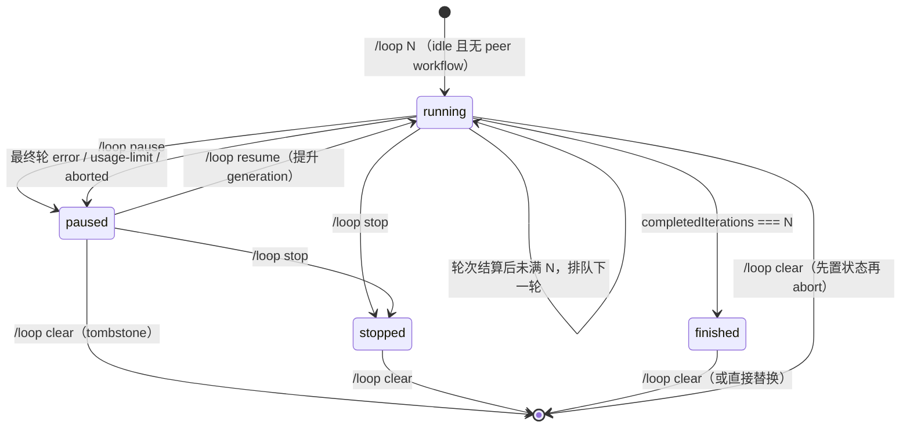

# 12 · Loop 扩展设计：固定轮数迭代

> 文档状态：**设计中（v2 修订 2026-08-02）**。v1 范围：**固定轮数**，仅 `iterations` 一个控制参数；不含验收驱动、停滞检测、token/时间预算与模型工具。顶层 `loop/` package 尚未实现；本文给出可直接开工实现的完整规格。
>
> 运行基线：本仓库实际锁定 `@earendil-works/pi-coding-agent 0.82.1`（见 `goal/package-lock.json` 与本地安装版本），各扩展声明兼容 `>=0.81.0`。本文 API 事实以本地 0.82.1 的 `docs/extensions.md` 与 `dist` 类型为准。所有外部事实均附来源；本文判断以"设计决策"标注，不冒充官方立场。

## 1. 结论先行

`loop` 是一个独立顶层 Pi extension package，为 Pi 增加**固定轮数的迭代执行**：用户执行 `/loop <N> <objective>`，插件启动 N 个 Loop-owned 的完整 agent run（迭代），每轮由一条带 `{loopId, generation, round}` 身份的隐藏续跑消息驱动；一轮真正稳定（`agent_settled`）后结算轮次并在轮数未满时排队下一轮。跑满 N 轮进入 `finished`。

- **唯一控制参数是轮数** `iterations`（必填，1..50）。没有 `until/for`、没有验收标准、没有 `finish_loop`、没有停滞检测、没有 token/时间预算、没有模型工具。
- **正常路径严格执行 N 轮**：模型不能提前宣告完成；只有用户 `pause/stop/clear` 或运行错误/abort 可以提前停止。
- **`finished` 只表示"N 轮计划已执行完"**，不表示 objective 已验收成功。UI 文案写 `Loop finished (5/5 rounds)`，不声称任务完成。
- **一轮不是一次 `agent_start`**：Pi 的 retry / auto-compaction retry 会在同一次 settled 周期内产生多次低层 `agent_start/agent_end`，它们属于同一轮，不重复计数（本地文档明确 `agent_start/end` 是 low-level run，见 §3.1）。
- **只结算 Loop-owned run**：普通用户输入、其他扩展触发的 run、创建命令之前的 run 一律不消耗轮数；当前 Loop 的续跑消息被确认送达（绑定 in-flight）后才进入轮次结算。
- **恢复一律暂停**：startup/reload/resume/fork/`session_tree` 从 journal 恢复出 running 状态时，一律立即持久化为 `paused`（不自动重跑无法判定的 in-flight 副作用），用户显式 `/loop resume` 才继续。
- **状态、轮数与轮次摘要全程可观测**：footer status 显示 `Loop 3/5`，widget 面板按 Plan 插件的显示模式列出已完成轮次摘要（✓/○ 标记 + 摘要文本 + 截断/折叠提示）；`/loop status` 输出完整文本。
- **与 Goal、Plan 互斥**：复用 `pi-extensions:exclusive-workflow:v1` 协议注册 `loop` 模式；正常激活遵循"已有 active workflow 胜出"，恢复冲突采用固定优先级 `Plan > Goal > Loop`。
- 不引入子代理、不做多会话编排、不写独立状态文件；与 `pi-subagents` 的编排式循环范式明确区分。

一句话定义：**Loop 是"按用户指定轮数自动连续执行同一 objective"的固定轮次执行器；到点必停，失败不冒充完成，进度与摘要全程可见。**

## 2. 要解决的问题

### 2.1 现状缺口

| 缺口 | 现状 | 后果 |
| --- | --- | --- |
| 固定轮数执行 | Goal 的自动续跑是开放循环（`active` 就续跑，靠完成/阻塞/预算/错误停止） | 用户无法表达"就连续跑 5 轮"这类有界、重复性工作（如逐轮迭代修复、逐轮复跑验证） |
| 轮次归属不清 | 无插件区分"哪次 agent run 属于自动迭代" | 普通输入、其他扩展触发或创建期 run 可能被误算进轮数，导致少跑或提前结束 |
| 轮数护栏 | 上游无内建 turn/run 上限（`--max-turns` 提案 #1898 关闭未合入） | 长循环只能靠 Ctrl+C 或 provider 报错中断 |
| 进度与摘要可见 | 无插件展示"第几轮、每轮做了什么" | 长循环中用户无法判断进度、每轮结果与失败位置 |

### 2.2 产品目标

| 编号 | 目标 | 可观察验收 |
| --- | --- | --- |
| G1 | 固定轮数创建 | `/loop 5 <objective>` 创建 5 轮循环；N 必填，1..50，非法值报错 |
| G2 | 自动续跑 | 每轮 `agent_settled` 后自动排队下一轮；不重复排队、不丢轮 |
| G3 | 严格 N 轮 | 正常路径恰好结算 N 个 Loop-owned run 后 `finished`；模型无法提前完成 |
| G4 | 失败不冒充完成 | 最终轮 error/usage-limit/aborted 进入 `paused`（带 pauseReason），绝不进入 `finished` |
| G5 | 轮次归属正确 | 普通用户 run、其他扩展 run、创建前 run 不消耗轮数；内部 retry/compaction 不重复计数 |
| G6 | 暂停/恢复/中止/清除 | `/loop pause|resume|stop|clear` 全可用；恢复后轮次延续；`clear` 有可持久化 tombstone |
| G7 | 恢复即暂停 | startup/reload/resume/fork/`session_tree` 恢复出 running 一律转 `paused`，显式 resume 才继续 |
| G8 | 互斥 | active Loop 与 active Goal / active Plan 不并存；恢复仲裁固定 `Plan > Goal > Loop` |
| G9 | 模式无关 | 核心命令/状态逻辑在 TUI、RPC、JSON、print 一致；无 UI 时替换未完成 Loop 确定性拒绝 |
| G10 | 状态/轮数/摘要可见 | footer 显示 `Loop 3/5`；widget 按 Plan 模式列出最近轮次摘要（✓/○ + 文本 + 折叠提示）；`/loop status` 输出完整文本含每轮摘要 |

### 2.3 非目标

v1 明确不做：

- **token/耗时预算与计量**（Goal 的 `--tokens` 与逐轮 usage/时间账务）；
- **验收驱动/提前完成**（`until` 模式、`completionCriteria`、`finish_loop` 完成协议、模型判定"完成"）；
- **停滞检测**（空转/指纹重复自动暂停，社区 `pi-goal` 的 repeat detector 方向）；
- **模型工具与动态工具管理**（`create_loop`/`finish_loop`/`loop_status`；v1 不读写 active-tools 集合，从根源避免与 Plan tool lease 竞争）；
- 每轮脚本化验收（`verifyCommand`）、并行多 loop、队列化多任务、子代理编排、跨会话持久目标；
- 与 Todo board 自动联动；独立状态文件、网络、后台 watcher、子进程；
- 混装旧版本 Goal/Plan 的互斥兼容（见 §8.3，三包需原子升级）。

## 3. 调研摘要

### 3.1 Pi 0.82.1 可依赖的事实（本地源码/文档已复核）

1. **`agent_start/agent_end` 是 low-level run，`agent_settled` 才是稳定边界**。官方文档原文："`agent_start` fires when a low-level agent run begins. `agent_end` fires when that run ends, but Pi may still auto-retry, auto-compact and retry, or continue with queued follow-up messages. Use `agent_settled` for status integrations that need to know Pi will not continue running automatically."（[本地 extensions.md](goal/node_modules/@earendil-works/pi-coding-agent/docs/extensions.md) §agent_start/agent_end/agent_settled）。即一次 settled 周期可能包含多次低层 run。
2. **`ctx.isIdle()` 在 `agent_settled` 中并不绝对**。官方文档："`ctx.isIdle()` is true here **unless another extension started a new run**."（[本地 extensions.md](goal/node_modules/@earendil-works/pi-coding-agent/docs/extensions.md) §agent_start/agent_end/agent_settled）。Extension handler 按加载顺序执行，排在前面的扩展可能先启动新 run。
3. **扩展层 `agent_end` 事件没有 `willRetry` 字段**，只有 `{ type, messages }`（[本地 types.d.ts](goal/node_modules/@earendil-works/pi-coding-agent/dist/core/extensions/types.d.ts) `AgentEndEvent`）。retry 是否发生由 settled 的到达与否体现；不能依赖该字段分类。
4. **`sendMessage()` 返回 `void`**，只是提交请求；同步异常可捕获，异步失败（provider/认证/启动新 run）不会回传给插件（[本地 types.d.ts](goal/node_modules/@earendil-works/pi-coding-agent/dist/core/extensions/types.d.ts) `ExtensionAPI.sendMessage`）。送达确认需靠匹配的 `message_start` 事件。
5. **`context` 事件只能返回 `{ messages }`**，不能修改 system prompt；注入的 custom `AgentMessage` 传给模型时是 user-role 上下文（[本地 extensions.md](goal/node_modules/@earendil-works/pi-coding-agent/docs/extensions.md) §context、[messages 转换](goal/node_modules/@earendil-works/pi-coding-agent/dist/core/messages.js)）。多个扩展的 context handler 按注册顺序链式变换，后注册者可再修改。
6. **默认并行工具执行**：同一 assistant message 的 sibling tool calls "preflighted sequentially, then executed concurrently"（[本地 extensions.md](goal/node_modules/@earendil-works/pi-coding-agent/docs/extensions.md) §tool_call）。因此基于"某个工具先执行"的副作用门禁无法拦截同批已放行的调用。
7. **上游无任何内建 turn/run 上限**：`--max-turns`/`--max-tokens`（[#1898](https://github.com/earendil-works/pi/issues/1898)/[PR #1919](https://github.com/earendil-works/pi/pull/1919)）、`Agent.resume()`（[#3721](https://github.com/earendil-works/pi/issues/3721)、[#6650](https://github.com/earendil-works/pi/issues/6650)）、goal 式 auto-continue 进核心（[#4389](https://github.com/earendil-works/pi/issues/4389)/[PR #6505](https://github.com/earendil-works/pi/pull/6505)）均关闭未合入——auto-continue 属于扩展层。

### 3.2 社区先例

| 项目 | 已观察设计 | v1 采用 |
| --- | --- | --- |
| 本仓库 `goal`（[goal/README.md](goal/README.md)） | `agent_settled` 空闲边界发 follow-up 续跑；journal custom entry 持久化与 branch 恢复；reload 暂停 | 续跑时机、journal/恢复机制、reload 暂停 |
| 本仓库 `plan`（[plan/src/output.ts](plan/src/output.ts)、[plan/src/index.ts](plan/src/index.ts)） | footer `setStatus` + widget `setWidget`；`renderPlanWidget` 返回 `[heading, ...lines]`；步骤行 `· N. text`；截断与 `… N more step(s)` 折叠提示；状态着色 accent/warning | **widget/status 显示模式逐项复用**（§9） |
| `pi-length-continue` | `agent_end` 检测 `stopReason === "length"` 自动续跑；连续截断上限；捕获 runtime 失效异常 | `length` 计一轮并续跑 |
| `@narumitw/pi-goal`（[npm](https://www.npmjs.com/package/@narumitw/pi-goal)） | 续跑上限、重复输出检测 | 不采用（v1 无停滞检测） |
| `pi-subagents` review-loop（[GitHub](https://github.com/nicobailon/pi-subagents)） | 父 agent 编排子代理多轮 | 范式不同，不采用 |

### 3.3 其他 Code Agent 的可借鉴模式

| 模式 | 出处 | v1 采用 |
| --- | --- | --- |
| 轮数上限 | Claude `--max-turns`（[CLI 参考](https://docs.claude.com/en/docs/claude-code/cli-reference)）；OpenHands `max_iterations`（[配置文档](https://docs.openhands.dev/openhands/usage/v0/advanced/V0_configuration-options)） | `iterations`（必填 1..50） |
| 可恢复会话/检查点 | Claude `--resume`、Gemini `/resume`（[命令参考](https://geminicli.com/docs/reference/commands/)） | `/loop pause|resume`，恢复后轮次延续 |
| 固定优先级人工仲裁 | OpenHands 状态机与恢复选项（[agent_controller.py](https://github.com/All-Hands-AI/OpenHands/blob/main/openhands/controller/agent_controller.py)） | 恢复冲突固定 `Plan > Goal > Loop` |

## 4. 核心设计决策

### 4.1 决策 D1：固定轮数契约——一个参数

```ts
interface LoopSpec {
  objective: string;    // ≤ 4,000 字符；不可信用户数据，XML escape
  iterations: number;   // 必填，1..50
}
```

- 命令语法：`/loop <N> <objective>`，N 必填；无默认值，非法值（非整数、<1、>50）直接报错，不静默采用默认轮数。
- 正常路径：恰好结算 N 个 Loop-owned run，进入 `finished`。**没有**提前完成路径。
- 提前停止只可能来自：用户 `pause/stop/clear`、最终轮 error/usage-limit/aborted（进入 `paused`，不计完成轮）。

### 4.2 决策 D2：迭代语义——"settled 区间 + 身份绑定"，而非 agent_start 计数

一轮 = 一条插件签发的续跑消息（custom continuation，`display: false`）从**被确认送达并绑定 in-flight** 起，到最终 `agent_settled` 的完整区间：

- 续跑消息携带 `details: { loopId, generation, round }`，插件在 `context` 事件中首次看到当前有效 continuation 时绑定 `inFlight = { generation, round }`（送达确认）。
- 区间内的 retry / auto-compaction retry 会产生多次低层 `agent_start/agent_end`，全部属于同一轮，`roundTurns` 等统计持续累加，不重置、不重复计数。
- `agent_settled` 只在 `inFlight` 匹配当前 `{loopId, generation}` 时结算该轮；普通用户 run、其他扩展 run、无绑定 run 一律不结算（轮次归属正确性）。
- 每次 `agent_end` 只覆盖"当前最终 stop 缓存"（最后一次低层 run 的结果即最终 disposition）；`agent_settled` 使用最终值分类。
- `stopReason === "normal" | "length"` → 计一轮；`error`（含 usage/rate/quota/limit 文本匹配 → `pauseReason: "usage-limit"`，其他 → `"error"`）、`aborted` → 不计完成轮，持久化 `paused`。第 N 轮失败不得 `finished`。

### 4.3 决策 D3：continuation 生命周期——generation 化，不依赖 hasPendingMessages

运行时状态机 `needed → queued → delivered → settled`：

```
needed    Loop 为 running 且第 round 轮应被执行
queued    sendMessage 已提交（同步无 throw），等送达确认
delivered context 事件确认当前 continuation 并绑定 inFlight
settled   agent_settled 结算该轮；未满 N 轮则回到 needed（round+1）
```

- **自身去重不依赖 `ctx.hasPendingMessages()`**（该 API 统计的是 session 文本 steering/follow-up 队列，不能可靠观测扩展注入的 custom 消息，[types.d.ts](goal/node_modules/@earendil-works/pi-coding-agent/dist/core/extensions/types.d.ts) `hasPendingMessages`）；它只作为"检测到外部文本消息时礼让"的辅助信号。
- 每轮唯一 `(generation, round)`；`context` handler 过滤 stale/旧轮 continuation，只保留当前有效最新一条；`pause/stop/clear` 提升 `generation`，使所有旧消息失效。
- `sendMessage` 返回 `void`：同步 throw（如 stale runtime assertion）可捕获 → fail-closed `paused(send-failed)`；异步失败无法回传，用短 delivery watchdog（`unref()` 定时器，约 10s）等待匹配 `message_start` ack，超时 → `paused(send-failed)`。
- `agent_settled` 中若 `ctx.isIdle()` 为 false（其他扩展已先启动 run），续跑消息使用 `deliverAs: "followUp"`，设计容忍并入其他 run；但轮次结算只认自己的 in-flight 绑定，不因此错算轮数。

### 4.4 决策 D4：恢复一律暂停——不重跑未知 in-flight 副作用

journal 只持久化"已结算"状态，不持久化 in-flight 中间态。因此任何恢复场景都无法确定"第 k+1 轮是否已产生副作用"：

- `session_start`（`reason: startup | reload | resume | fork`）与 `session_tree` 从 branch 恢复出 `running` 时，一律立即转 `paused`（`pauseReason: "restore" | "reload"`）并持久化，通知用户"Loop 已暂停，使用 /loop resume 继续"。
- `/loop resume` 每次提升 `generation` 并排队下一轮（`round = completedIterations + 1`），显式、可预期。
- 崩溃后重启同理：恢复出 running → paused，杜绝自动重跑未知副作用。

### 4.5 决策 D5：互斥——固定优先级 `Plan > Goal > Loop`

- 正常激活（create/resume）：遵循"已有 active workflow 胜出"——`isAnyExclusiveWorkflowActive(events, sessionId, "loop")` 为 true 时拒绝激活；该检查在所有 await（confirm/wait/idle）完成后、持久化前的最后一次同步执行，避免 TOCTOU。
- 恢复冲突仲裁（branch 中同时存在多个 active workflow）：非对称让步，**不做三方对称"看见对手就暂停"**：
  - Plan 恢复时不让步；
  - Goal 只向 active Plan 让步（沿用现有行为）；
  - Loop 向 active Plan 或 Goal 让步（`pauseReason: "restore"`）。
- `isAnyExclusiveWorkflowActive` 实现为对**已知模式列表** `["plan", "goal", "loop"]` 逐个查询（`target` 语义不变，仍是"查询哪个 provider"，不引入"排除谁"的 target 值）：

```ts
const EXCLUSIVE_WORKFLOW_MODES = ["plan", "goal", "loop"] as const;
export function isAnyExclusiveWorkflowActive(
  events: EventBus, sessionId: string, except: ExclusiveWorkflowMode,
): boolean {
  return EXCLUSIVE_WORKFLOW_MODES.some(
    (target) => target !== except && isExclusiveWorkflowActive(events, sessionId, target),
  );
}
```

- `goal/src/workflow-mode.ts` 与 `plan/src/workflow-mode.ts` 保持字节一致（仓库约定），加 `loop` 后共三份；三包需**原子升级**（见 §8.3）。

### 4.6 决策 D6：上下文注入走 `context` 事件

- 续跑消息内容（custom，`display: false`）进入模型上下文，携带当轮指令；
- `context` 事件在每个 LLM 调用前注入 `## Loop iteration {round}/{N}` 块（objective + 轮次 + 停止规则），并完成去重与 in-flight 绑定；
- 注入块与续跑消息均对用户派生文本做 XML-escape；它们是 user-role 上下文，**不是 system prompt**，不获得高于用户指令的优先级。

## 5. 状态模型（`src/state.ts`，纯函数）

### 5.1 类型

```ts
type LoopStatus =
  | "running"   // 已创建并正在自动推进（或等待下一轮）
  | "paused"    // 暂停；pauseReason 说明原因；仅 /loop resume 恢复
  | "finished"  // N 轮计划执行完；不表示 objective 已验收
  | "stopped";  // 用户 /loop stop

type PauseReason =
  | "user"       // /loop pause
  | "error"      // 最终轮普通 agent error
  | "usage-limit"// 最终轮配额/速率限制类 error
  | "abort"      // 用户中断当前 run
  | "reload"     // reload 恢复
  | "restore"    // startup/resume/fork/session_tree 恢复
  | "send-failed"; // 续跑消息提交失败或 delivery watchdog 超时

/** 一轮成功结算（ok/length）的可观测摘要；进入 widget 与 /loop status。 */
interface RoundLogEntry {
  round: number;            // 1..spec.iterations，严格递增
  status: "ok" | "length";  // length = 输出被截断但仍计一轮
  turns: number;            // 该 settled 区间内的 turn 数（自计数，非 turnIndex）
  summary: string;          // ≤ 240 字符：最终 assistant 文本尾部截取（XML-escape 后存储）
  at: number;               // 结算时间戳
}

/** 最近一次失败尝试（不消耗轮数，仅 paused 时存在）。 */
interface LastAttempt {
  round: number;            // 试图完成的轮号
  status: "error" | "aborted";
  reason: string;           // 分类后的原因文本（≤ 200 字符）
  at: number;
}

const MAX_ROUND_LOG = 8;        // roundLog 环形上限，控制 journal/widget 体积

interface LoopState {
  version: 1;
  id: string;              // 创建时生成；continuation/去重/UI 的 key
  generation: number;      // 每次 resume 递增；使旧续跑消息失效
  status: LoopStatus;
  spec: LoopSpec;
  completedIterations: number; // 0..spec.iterations；=== roundLog.length
  roundLog: RoundLogEntry[];   // 已完成轮摘要，round 1..N 连续，长度 ≤ MAX_ROUND_LOG
  lastAttempt?: LastAttempt;   // 最近一次失败尝试（paused 时用于显示）
  pauseReason?: PauseReason;   // paused 时必须存在
  createdAt: number;
  finishedAt?: number;         // finished 时必须存在
}
```

### 5.2 状态机



规则：

- 轮次结算只发生在 `agent_settled` 且 `inFlight` 匹配当前 `{loopId, generation}` 时；`completedIterations += 1` 只对 `normal/length` 最终结果执行，并同步追加 `RoundLogEntry`。
- 失败尝试（error/abort）不增加 `completedIterations`，写入 `lastAttempt`（覆盖上一次）。
- `finished` 要求 `completedIterations === spec.iterations && finishedAt !== undefined`；`stopped`/`paused` 要求 `pauseReason` 存在。
- `paused` 不会因普通用户输入自动恢复；只有 `/loop resume` 恢复。
- `/loop clear` 从任何状态可用，写入 `{ action: "clear", loop: null }` tombstone。

### 5.3 持久化与 decoder 不变量

journal custom entry（`LOOP_STATE_TYPE`）：

```ts
type LoopJournalEntry =
  | { version: 1; action: "create" | "settle" | "status"; loop: LoopState }
  | { version: 1; action: "clear"; loop: null };
```

- `create`：创建与启动（含首轮排队）；`settle`：每轮结算；`status`：pause/resume/stop/恢复降级等状态变化；`clear`：tombstone。
- `clear` 必须携带 `loop: null`；其他 action 必须携带非 null `LoopState`；不符即拒绝恢复并警告。
- decoder 的 canonical invariants（跨字段校验，不仅是类型检查）：
  - `1 <= spec.iterations <= 50`；`objective` 长度/类型校验；
  - `0 <= completedIterations <= spec.iterations`；
  - `roundLog.length === completedIterations`；`round` 从 1 严格递增连续；每条 `summary` ≤ 240、`turns` ≥ 0；
  - `lastAttempt.round` 必须在 `[completedIterations + 1, spec.iterations]` 内（试图完成的轮号有效）；
  - `finished` ⟺ `completedIterations === spec.iterations && finishedAt` 存在；`paused/stopped` ⟹ `pauseReason` 存在；
  - `completedIterations === spec.iterations` 时状态必须为 `finished`（不允许 running 越过上限）；
  - `version === 1`，未知 status/action/字段或任何不变量破坏 → 拒绝恢复（保守按无 Loop 处理并警告），绝不部分信任。
- 提交顺序（所有状态变化统一）：**compute next → `appendEntry` 成功 → 发布内存/UI → 排队下一轮**。`appendEntry` 失败：不排队、内存 fail-closed 为 `paused(send-failed)` 并通知。stale runtime（session replacement 后旧 `pi` 句柄抛错）无法持久化时，内存暂停 + 重启恢复策略（§4.4）兜底。

## 6. 循环语义与事件接线（`src/index.ts`）

### 6.1 运行时字段

```ts
continuationPhase: "needed" | "queued" | "delivered";
inFlight: { generation: number; round: number } | null;
finalStop: { stopReason: string; errorMessage?: string } | null;
roundTurns: number;              // 当前 settled 区间内 turn 计数
roundAssistantTail: string;      // 当前轮最终 assistant 文本尾部（供 summary）
watchdog: ReturnType<typeof setTimeout> | undefined;
```

### 6.2 创建与首轮（`/loop N <objective>`）

1. 解析参数；非法 → 报错返回。
2. 若已有 Loop 且未完成（`running/paused`）：TUI 经 `ctx.ui.confirm()` 确认替换；无 UI（print/JSON）**确定性拒绝**，提示先 `/loop stop|clear`。
3. `ctx.isIdle()` 为 false（当前有 agent run）→ 确定性拒绝："Loop 创建要求 idle"（避免宿主 run 的归属歧义；用户可在本轮结束后再创建）。
4. 所有 await 后最后同步执行 `isAnyExclusiveWorkflowActive(..., "loop")` 检查；命中 → 拒绝。
5. 生成 `LoopState`（`status: running, completedIterations: 0, roundLog: [], generation: 1`），`appendEntry(create)`，发布内存与 UI，`queueContinuation(round = 1)`。

### 6.3 `queueContinuation(round)`

```
if (status !== "running" || continuationPhase !== "needed") return;
continuationPhase = "queued";
roundTurns = 0; roundAssistantTail = "";
message = { customType: LOOP_CONTINUATION_TYPE, content: loopRoundPrompt(...),
            display: false, details: { loopId, generation, round } };
try {
  ctx.isIdle() ? pi.sendMessage(message, { triggerTurn: true })
               : pi.sendMessage(message, { triggerTurn: true, deliverAs: "followUp" });
  armWatchdog(generation, round);   // 10s，unref；等待 message_start ack
} catch {
  failClosedPause("send-failed");   // 清 queued，appendEntry(status)，通知
}
```

- 不依赖 `hasPendingMessages()` 做去重；若检测到外部文本 steering/follow-up，仅选择 `deliverAs: "followUp"` 礼让。
- watchdog 在匹配的 custom `message_start`（`customType + details.loopId/generation/round` 校验）到达时清除；超时 → 清 queued、`failClosedPause("send-failed")`。

### 6.4 `context` 事件：去重 + 送达确认 + 注入

对每个 `event.messages`：

1. 识别本插件的 continuation 消息（`customType` + details 校验）；
2. 丢弃 stale（`loopId` 不匹配 / `generation` 小于当前 / `round` 小于当前 in-flight 的）消息；同轮重复只保留最新一条；
3. 首次看到当前有效 `{generation, round}` 时：`continuationPhase = "delivered"`、`inFlight = {generation, round}`、清 watchdog；
4. 在消息副本末尾追加 `## Loop iteration {round}/{N}` 注入块（XML-escape objective）。

### 6.5 停止分类（`agent_end` / `agent_settled`）

- `agent_end`：仅做 `finalStop = { stopReason, errorMessage }` 覆盖缓存（最后一次低层 run 胜出）并刷新 `roundTurns`/`roundAssistantTail`；不做状态转换。扩展 `AgentEndEvent` 无 `willRetry`（§3.1-3）。
- `turn_end`：`roundTurns += 1`（自计数；上游 `turnIndex` 会在 retry 时归零，不可直接保存）。
- `agent_settled` 结算伪码：

```
if (!loop || loop.status !== "running") return;
if (!inFlight || inFlight.generation !== loop.generation) return;   // 非 Loop-owned run 不结算
settledRound = inFlight.round; inFlight = null; continuationPhase = "needed";
switch (classify(finalStop)):
  error 且 usage|rate|quota|limit 匹配 → paused("usage-limit")，lastAttempt = {round, error, reason, now}
  error（其他）                          → paused("error")，lastAttempt = {round, error, reason, now}
  aborted                              → paused("abort")，lastAttempt = {round, aborted, reason, now}
  normal | length                      → completedIterations += 1
    roundLog.push({ round: completedIterations, status: ok|length,
                    turns: roundTurns, summary: tailSummary(roundAssistantTail), at: now })
    roundLog.length > MAX_ROUND_LOG 时丢弃最旧一条（环形）
    if completedIterations >= spec.iterations → finished（写 finishedAt）
    else                                        → queueContinuation(round = completedIterations + 1)
所有状态变化：compute → appendEntry → publish(updateStatus) → queue（§5.3）
```

- 最终轮 error/abort 不增加 `completedIterations`，因此第 N 轮失败不可能 `finished`（G4）。
- `tailSummary()`：对 `roundAssistantTail` 折叠空白并截断到 240 字符（`uikit` 或官方 `truncateHead` 语义，不按 JS 字符数粗切）。

### 6.6 pause/stop/clear：先失效后中止

顺序固定（RPC/JSON/print 与 TUI 一致）：

1. 同步：compute 新状态（`paused/stopped` 或 null），`generation += 1`（使所有已入队/在飞 continuation 失效）；
2. `appendEntry(status | clear)` 持久化；
3. 发布内存/UI（`updateStatus`），设置 `continuationPhase = "needed"`、`inFlight = null`、清 watchdog；
4. 再 `ctx.abort()`；最后 `ctx.waitForIdle()`。

`tool_call` 门禁（纵深防御）：若 `inFlight` 绑定的是已失效 `{generation, round}`（pause/stop/clear 后当前 run 仍在收尾），对其后新发起的工具调用返回 `{ block: true, reason }`。文档诚实声明：已执行或已并行 preflight 放行的工具副作用**无法回滚**（§3.1-6 并行 preflight 语义），门禁只阻止"失效后新发起的"调用。

## 7. 命令契约（`src/command.ts`）

```text
/loop <N> <objective>            # N 必填 1..50；创建并启动
/loop status                     # 完整文本：状态、轮数、objective、每轮摘要
/loop pause                      # 暂停（running 或等待中）
/loop resume                     # 恢复（仅 paused；提升 generation）
/loop stop                       # 终止（stopped）
/loop clear                      # 清除（tombstone）
```

| 命令 | 行为 |
| --- | --- |
| `/loop <N> <objective>` | 校验 N；idle 检查；unfinished 替换需确认（无 UI 拒绝）；peer workflow 最终复查；create + 首轮排队 |
| `/loop status` | 纯文本/结构化输出（§9.4 `renderLoopStatus`）：状态、`completedIterations/iterations`、pauseReason、lastAttempt、每轮摘要（round/status/turns/summary/at）；无 UI 也完整可用 |
| `/loop pause` | 先持久化 paused 再 abort（§6.6）；`pauseReason: "user"` |
| `/loop resume` | 仅 paused 可用；`generation += 1`；最终同步复查 peer workflow；排队下一轮（`round = completedIterations + 1`） |
| `/loop stop` | 先持久化 stopped 再 abort；不受 peer exclusivity 门禁 |
| `/loop clear` | 任意状态可用；写 tombstone；不受 peer exclusivity 门禁 |

- **pause/stop/clear 不受 exclusivity 门禁**（清理旧 Loop 不因另一个 workflow active 而被阻止）；只有 create/resume 需要。
- 无模型工具（`create_loop`/`finish_loop`/`loop_status` 都不注册），因此本插件**不读写 active-tools 集合**，与 Plan tool lease 零竞争。

## 8. 互斥与共存

### 8.1 与 Goal / Plan

- 正常激活（create/resume）：`isAnyExclusiveWorkflowActive(..., "loop")` 为 true → 拒绝；已有 active workflow 胜出。
- 恢复冲突：`Plan > Goal > Loop` 固定优先级，非对称让步（§4.5）。
- **Loop 与 Plan 绝不共跑**：active Plan 存在时 Loop 不可创建/恢复；"Plan 活跃时 Loop 只读运行"不是产品语义，Plan 的只读 allowlist 仅作为恢复冲突窗口中的纵深防御。
- 协议注册：`registerExclusiveWorkflow(pi.events, "loop", (sessionId) => loop?.status === "running" && currentSessionId === sessionId)`。

### 8.2 与 Todo / Request / rg / lsp

- Todo：独立状态域；Loop 不调用 `pi-extensions:todo-service:v1`，不改变 Todo board，`finished` 不清空 Todo。
- Request：替换确认复用 `ctx.ui.confirm()`；加载 `request` 时自动渲染为统一 Request 界面（同 Goal 的 adapter 模式，不导入 Request package）。
- rg/lsp：不接管 active tools；Loop 轮内照常使用，搜索结果/诊断只是执行证据。

### 8.3 版本兼容声明（三包原子升级）

`exclusive-workflow:v1` 的 `target` 枚举从 `plan|goal` 扩展到 `plan|goal|loop`，旧版 decoder 会拒绝未知 `target` 查询、旧版 listener 不响应 `loop` target。因此：

- **新 Loop + 旧 Goal/旧 Plan 混装不安全**（旧调用方查询不到 Loop，可造成 Loop 与 Goal/Plan 同时 active）；
- v1 明确 **unsupported 混装**：Goal/Plan/Loop 三包必须原子升级（本仓库按统一版本集部署）；不做兼容桥。
- 测试使用冻结的旧版协议 fixture 验证混装被拒（或加载期显式失败），不能只依赖 README 声明。

## 9. UI 与可观测性

显示模式**逐项复用本仓库 Plan 插件的既有实现**（[plan/src/index.ts](plan/src/index.ts) `updateStatus` + [plan/src/output.ts](plan/src/output.ts) `renderPlanWidget`）：footer 用 `ctx.ui.setStatus(key, tone(theme, color, heading))`，面板用 `ctx.ui.setWidget(key, lines)`；widget 首行即 heading，其余行进面板；无状态时两者清空。Loop 对应实现放在 **`src/output.ts`**（仿 plan `output.ts` 命名），由 `src/index.ts` 的 `updateStatus` 调用。

### 9.1 模块与渲染函数

```ts
// src/output.ts（纯函数，可独立测试）
export const MAX_WIDGET_ROUNDS = 5;      // widget 最多列出最近 5 轮（仿 plan MAX_WIDGET_STEPS）
export const MAX_WIDGET_ROUND_CHARS = 72; // 每条轮次摘要截断（仿 plan MAX_WIDGET_STEP_CHARS）

export function loopStatusLabel(state: LoopState): string;       // "running" / "paused" / "finished" / "stopped"
export function renderLoopStatus(state: LoopState | null): string; // /loop status 完整文本
export function renderLoopWidget(state: LoopState | null): string[]; // [heading, ...lines]
```

### 9.2 footer status（heading）

仿 `updateStatus`（[plan/src/index.ts:109](plan/src/index.ts)）：

```ts
function updateStatus(ctx: ExtensionContext): void {
  if (!ctx.hasUI) return;
  if (!loop) {
    ctx.ui.setStatus("loop", undefined);
    ctx.ui.setWidget("loop", undefined);
    return;
  }
  const color = loop.status === "running" ? "accent"
    : loop.status === "finished" ? "success"
    : "warning";                                    // paused / stopped
  const [heading, ...lines] = renderLoopWidget(loop);
  ctx.ui.setStatus("loop", tone(ctx.ui.theme, color, heading));
  ctx.ui.setWidget("loop", lines.length > 0 ? lines : undefined);
}
```

heading 文本（`renderLoopWidget` 首行）：

| 状态 | heading | 着色 |
| --- | --- | --- |
| running | `Loop 3/5` | accent |
| paused | `Loop paused 3/5` | warning |
| finished | `Loop finished 5/5` | success |
| stopped | `Loop stopped 2/5` | warning |

### 9.3 widget 面板（lines）

仿 `renderPlanWidget`（[plan/src/output.ts:109](plan/src/output.ts)）的"状态行 + 列表行 + 折叠提示"结构，每行 ≤ `MAX_WIDGET_ROUND_CHARS` 截断：

```text
Objective: <objective 首行截断>          # 始终显示，截断到 MAX_WIDGET_ROUND_CHARS
! usage-limit                            # paused/stopped 时：pauseReason 标签
! round 3 failed: usage-limit            # paused 且 lastAttempt 存在时（仅最近一次失败）
✓ 1. <summary>                           # roundLog 最近 MAX_WIDGET_ROUNDS 条
○ 3. <summary>                           # status=length 用 ○（截断轮）
… 3 more round(s)                        # roundLog.length > MAX_WIDGET_ROUNDS 时折叠提示
```

- 每轮行格式 `{glyph} {round}. {summary}`（仿 plan 的 `· N. text`）；glyph 映射：`ok → ✓`、`length → ○`。
- widget 行保持纯文本（与 plan 一致：heading 才用 `tone` 上色）；如后续需要彩色 glyph，可换用 `pi-uikit-dev` 的 `statusRow` 原语（[uikit/src/rows.ts](uikit/src/rows.ts)），v1 不做。
- `MAX_ROUND_LOG(8)` 与 `MAX_WIDGET_ROUNDS(5)` 的关系：journal 保存最近 8 轮，widget 只展示最近 5 轮，其余用折叠提示（`… N more round(s)`）表达，与 plan 的"保存全部步骤、展示上限 5"精神一致。
- **更新时机**：仅在状态或轮次变化时调用 `updateStatus`（创建、每轮 settle、pause/resume/stop/clear、恢复降级、send-failed）；**无每秒 timer**（footer 只是静态进度，无计费语义）。

### 9.4 `/loop status` 完整文本（`renderLoopStatus`）

仿 plan `renderPlan`（[plan/src/output.ts:43](plan/src/output.ts)）：

```text
Loop: running (3/5)
Objective: <objective，长文本截断并注明截断行/字节>
Pause reason: usage-limit                 # 如适用
Last failed round: 3 — usage-limit at <time>  # lastAttempt 如存在
Rounds:
  1. [ok] <summary> · 4 turns · <time>
  2. [length] <summary> · 2 turns · <time>
  3. ...
```

- 无 UI 模式（print/JSON）也完整可用；JSON 模式可额外提供结构化字段（`loop_status_summary` 形状：status/iterations/completedIterations/roundLog/lastAttempt/pauseReason），作为 `summarizePlanState`（[plan/src/output.ts:91](plan/src/output.ts)）的对应物，v1 在 `renderLoopStatus` 内实现文本与结构化两种输出。

### 9.5 notify 事件

创建、恢复、finished、paused（附 pauseReason 与失败轮号）、stopped、clear、send 失败、恢复降级。着色经 `pi-uikit-dev` 的 `tone` 原语（`accent`/`success`/`warning`）；无 UI 时 notify 无操作不报错。

### 9.6 四模式契约（务实声明）

- 核心命令/状态逻辑四种模式一致（纯函数状态机 + journal）；
- TUI/RPC（`hasUI`）支持 confirm/notify、footer status 与 widget；
- print/JSON 无 UI：replace 确认确定性拒绝、notify 无操作、`/loop status` 输出纯文本/结构化 JSON；
- RPC 与 print/JSON 的 abort 行为可能不同（host 绑定差异），不承诺逐字节一致，只承诺状态机与持久化一致。

## 10. 安全与防失控

- 参数硬上限：`iterations` 1..50、objective ≤ 4,000 字符、`summary` ≤ 240、`roundLog` ≤ 8（防 journal/widget 膨胀）；非法值创建时报错，不静默纠正。
- **轮数护栏的边界声明**：轮数限制的是**自动启动的完整 agent run 数量**；不限制单个 run 内部的 LLM turn/工具次数（上游无 turn 上限，[#1898](https://github.com/earendil-works/pi/issues/1898) 未合入）。文档不夸大"杜绝烧钱/停不下来"。
- 失败不冒充完成：最终轮 error/abort → `paused`，绝不 `finished`（G4）。
- 恢复 fail-closed：running → paused（§4.4）；decoder 不变量破坏 → 不恢复（§5.3）。
- 续跑去重：`(generation, round)` 身份 + context 过滤 + watchdog；不依赖 `hasPendingMessages`。
- 不可信数据边界：objective/summary 在注入块、widget 与续跑消息中 XML-escape；user-role 上下文，不高于用户指令优先级；不把 secret 写入 prompt/context/entry。
- 副作用防护：pause/stop/clear 先失效后 abort（§6.6）；tool_call 对已失效 owned round 的新调用 fail closed；诚实声明已放行副作用不可回滚。

## 11. 模块与文件结构

```text
loop/
├── package.json / package-lock.json / tsconfig.json / README.md
├── src/
│   ├── index.ts          # composition root：事件接线、settled 编排、watchdog、UI 装配、stale 降级
│   ├── state.ts          # LoopSpec 解析、轮次结算、状态机、持久化 decoder 与不变量（纯函数）
│   ├── command.ts        # /loop 用户控制面（idle/exclusivity 检查、替换确认）
│   ├── output.ts         # renderLoopWidget / renderLoopStatus / loopStatusLabel（纯函数，仿 plan/output.ts）
│   ├── prompts.ts        # 续跑消息内容与 context 注入块 + XML escaping
│   ├── protocol.ts       # journal entry / continuation message 类型与识别（details 严格校验）
│   └── workflow-mode.ts  # 与 goal/plan 字节一致的 exclusivity 协议（加 loop + isAny…）
└── test/
    ├── state.test.ts     # spec 解析、结算、状态机、decoder 不变量、roundLog/lastAttempt
    ├── output.test.ts    # renderLoopWidget/renderLoopStatus 格式、截断、折叠、着色映射
    ├── prompts.test.ts   # 注入块/续跑消息格式与 escaping
    ├── integration.test.ts  # 续跑编排（extension harness）
    └── coexistence.test.ts  # Goal/Plan 互斥、恢复仲裁、加载顺序
```

package manifest 参照 `goal/`：peer 仅 `@earendil-works/pi-ai`、`pi-coding-agent`、`pi-tui`、`typebox`；`pi-uikit-dev` 走 `file:../uikit` + `bundledDependencies`。

## 12. 测试计划

| 层 | 覆盖 | 参考 |
| --- | --- | --- |
| 纯单元（state） | `/loop N` 解析（非整数/<1/>50/缺 N 报错）、结算（normal/length 计一轮并追加 roundLog、error/usage/abort 不计并写 lastAttempt）、状态机全表（含 clear 任意状态、resume 仅 paused）、roundLog 环形上限与连续递增、decoder 不变量（finished 缺 finishedAt、roundLog.length ≠ completedIterations、round 不连续、lastAttempt 越界、clear 携带非 null、未知 action/status/版本） | `goal/test/state.test.ts` |
| 纯单元（output） | `loopStatusLabel` 四态映射；`renderLoopWidget` heading/objective/pauseReason/lastAttempt 行、glyph 映射（ok→✓、length→○）、逐条截断、`… N more round(s)` 折叠、空 state 返回空数组；`renderLoopStatus` 完整文本与截断注明 | `plan/test`（output 相关）、`goal/test/prompts.test.ts` 风格 |
| 提示词 | 注入块/续跑消息格式、XML escaping、续跑消息 details 严格校验 | `goal/test/prompts.test.ts` |
| 集成（harness） | N=1 与 N=50；最终轮 normal/length/error/usage/abort 优先级；retry/compaction 多 `agent_start` 只计一轮；普通用户 run/其他扩展 run/创建前 run 不计；duplicate/stale continuation 丢弃；send 同步 throw 与异步无 ack（watchdog）→ paused(send-failed)；pause/stop/clear 先失效后 abort；clear tombstone 经 startup/reload/session_tree 不复活；startup/reload/resume/fork/session_tree 恢复 running→paused；`appendEntry` 失败不排队且内存 paused；`message_start` ack 清除 watchdog；**settle 后 updateStatus 反映新轮次与摘要** | `todo/test/integration.test.ts` |
| 共存 | active Loop 拒绝 Goal/Plan 创建、active Goal/Plan 拒绝 Loop create/resume；恢复冲突 6 种加载顺序断言固定 winner（Plan>Goal>Loop）；`session_tree`/foreign session/shutdown 后 listener 不误答；冻结旧版协议 fixture 验证混装拒绝 | `plan/test/coexistence.test.ts` 扩展 |
| 模式 | TUI/RPC（confirm/notify、footer/widget）与 print/JSON（确定性拒绝、`/loop status` 纯文本/JSON）四模式行为分别验证 | 新增 harness 用例 |

每个新行为至少覆盖正常路径 + 一个失败路径；轮次归属、最终轮失败、clear tombstone、恢复降级、roundLog 一致性是回归重点。

## 13. 实施阶段

| 阶段 | 内容 | 验收 |
| --- | --- | --- |
| P1 | 骨架 + 命令 `status/pause/resume/stop/clear` + 纯状态机与 decoder（state/command/protocol） | `npm run check`、`npm test`；命令与状态转换全绿 |
| P2 | 创建/续跑核心：`/loop N <objective>`、queueContinuation、context 去重与 in-flight 绑定、settled 结算、message_start ack/watchdog | 手工 `pi --extension ./src/index.ts` 跑 `/loop 3 ...` smoke；轮次归属/去重测试绿 |
| P3 | 停止分类（error/usage/abort/length）、roundLog 结算、pause/stop/clear 先失效后 abort、恢复一律 paused、append 失败路径 | 最终轮失败不 finished、clear 不复活、恢复降级测试绿 |
| P4 | 显示（output.ts：widget/status/`/loop status` + updateStatus 装配）、互斥协议扩展（三份 workflow-mode 同步、goal/plan 门禁改造、coexistence 扩展）、README 定稿、AGENTS/CI/链接脚本更新 | goal/plan/todo 全量测试绿；全仓库 smoke |

## 14. 仓库级配套改动清单

- `AGENTS.md`：包表格加 `loop` 行；"plan/goal 两处 workflow-mode 字节一致"改为"plan/goal/loop 三处"；CI 包数 15 → 16 表述同步。
- `.github/workflows/ci.yml`：package matrix 与 `testDependencies` 加 `loop`。
- `scripts/pi-global-links.sh`（及 Makefile `pi-extensions-*` 目标）：包清单加 `loop`。
- `docs/design/README.md`：索引行已同步为固定轮数描述。
- `goal/src/workflow-mode.ts`、`plan/src/workflow-mode.ts`：与 loop 版保持字节一致（`ExclusiveWorkflowMode` 加 `"loop"`，新增 `isAnyExclusiveWorkflowActive`，启动门禁改用新函数）；goal/plan 的恢复仲裁保持非对称（Goal 只向 Plan 让步）。
- `goal/README.md`、`plan/README.md`：互斥描述更新为包含 Loop（含原子升级要求）。
- `plan/test/coexistence.test.ts`、`todo/test/coexistence.test.ts`：补充 Loop 共存与恢复仲裁用例。

## 15. 风险与开放问题

- **单轮失控**：轮数不限制单 run 内 turn/工具次数（上游无上限）。若实测是真实风险，v2 增量加回 token/时间预算（LoopSpec 加可选字段，不破坏 v1 journal 格式）。
- **custom 消息送达时序**：`sendMessage` 无回传 ack，靠 `message_start` + watchdog 兜底；极端情况下可能误报 send-failed。P2 实测后校准 watchdog 时长。
- **stale runtime（0.82.x field report）**：session replacement 后旧 `pi` 句柄抛错（[#7154](https://github.com/earendil-works/pi/issues/7154)，0.82.x 开放回归）；发送/持久化失败时内存 fail-closed + 重启恢复策略兜底，无法在进程内持久化该暂停。
- **摘要质量**：`summary` 取最终 assistant 文本尾部 240 字符，可能包含低信息量文本（如"好的，完成"）；v1 接受该粗糙度，不做 LLM 摘要。若用户反馈摘要可读性差，v2 评估在 settle 时生成结构化摘要（可观测性开销换质量）。
- **开放问题（v1 不做）**：`verifyCommand` 脚本化验收；多 loop 队列；widget 彩色 glyph（`statusRow` 原语）。

## 16. 参考资料

- 本地（0.82.1）：`goal/node_modules/@earendil-works/pi-coding-agent/docs/extensions.md`（agent_start/end/settled、context、tool_call、isIdle）· `dist/core/extensions/types.d.ts`（`AgentEndEvent`、`sendMessage`、`hasPendingMessages`）· `dist/core/agent-session.js`（settled 时序）· `dist/core/messages.js`（custom→user 转换）
- 本仓库显示参考：[plan/src/output.ts](plan/src/output.ts)（`renderPlanWidget`/`renderPlan`/`summarizePlanState`）· [plan/src/index.ts](plan/src/index.ts)（`updateStatus`：`setStatus`+`setWidget`+`tone`）· [uikit/src/rows.ts](uikit/src/rows.ts)（`statusRow`，v1 可选）· [uikit/src/tones.ts](uikit/src/tones.ts)
- 上游：[Agent loop 源码](https://github.com/earendil-works/pi/blob/main/packages/agent/src/agent-loop.ts) · [Agent 队列与 QueueMode](https://github.com/earendil-works/pi/blob/main/packages/agent/src/agent.ts) · [Extensions 文档](https://github.com/earendil-works/pi/blob/main/packages/coding-agent/docs/extensions.md) · issue：#1898 · #3721 · #4389 · #6650 · #7154（github.com/earendil-works/pi/issues）
- 社区：[`pi-length-continue`](https://www.npmjs.com/package/pi-length-continue) · [`@narumitw/pi-goal`](https://www.npmjs.com/package/@narumitw/pi-goal) · [`pi-subagents`](https://github.com/nicobailon/pi-subagents)
- 其他 agent：[Claude Code CLI 参考](https://docs.claude.com/en/docs/claude-code/cli-reference) · [OpenHands 配置](https://docs.openhands.dev/openhands/usage/v0/advanced/V0_configuration-options) · [Gemini 命令参考](https://geminicli.com/docs/reference/commands/)
- 本仓库：[Goal 插件 README](../goal/README.md) · [运行时分层与 Agent Loop](02-runtime-architecture.md) · [扩展系统设计](04-extension-system.md) · [跨扩展通用协议](09-cross-extension-protocols.md)
