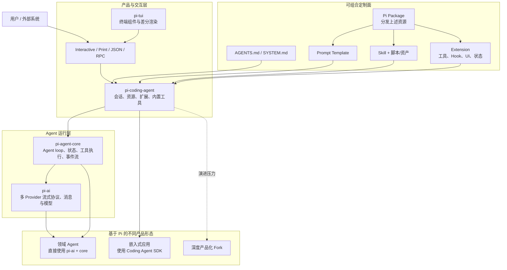
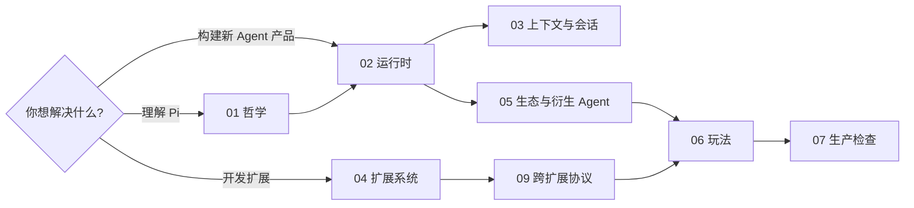

# Pi 底层设计与扩展实践

> 研究基线：2026-07-24。本仓库实际安装 `@earendil-works/pi-coding-agent 0.81.1`，各扩展声明兼容 `>=0.81.0`。上游 `main` 仍在快速演进；本文会明确区分 0.81.1 可用契约、上游当前方向与历史设计动机。

Pi 最准确的定位不是“一个功能齐全的 Coding Agent”，而是一个把上下文、模型、工具、会话和交互界面暴露给使用者控制的 Agent Harness。它默认给出一条足够工作的窄路径，又允许通过 prompt、skill、extension、SDK 乃至 fork 逐层改造。

当前官方 README 用一句话概括这种立场：**“Adapt pi to your workflows, not the other way around.”** Pi 默认不内置 plan mode、sub-agent、MCP 和权限弹窗，不代表这些能力不重要，而是拒绝替所有人固化唯一工作流。

## 一张图先看全局

这张图表达三个核心边界：

1. `pi-ai` 解决“怎样与不同模型可靠通信”，`pi-agent-core` 解决“怎样循环调用模型与工具”，`pi-coding-agent` 才解决“怎样成为一个可使用、可恢复、可扩展的 Coding Agent”。
2. prompt、skill、extension 不是同一种插件的不同写法。它们分别改变上下文、按需知识和运行时行为。
3. “基于 Pi 构建 Agent”有多个深度：可以只注册一个工具，也可以嵌入完整 SDK，或者在产品需求跨越原抽象边界后 fork/内化运行时。

## 系列目录

| 文档 | 回答的问题 | 重点图示 |
| --- | --- | --- |
| [01 · 设计哲学](01-philosophy.md) | Pi 为什么刻意保持小；“缺功能”背后的理由、收益和代价是什么 | 上下文行李箱、安全边界、取舍矩阵 |
| [02 · 运行时分层与 Agent Loop](02-runtime-architecture.md) | 一条 prompt 如何经过模型、工具、事件与下一轮；四个 package 为什么分层 | 分层图、时序图、双循环、turn snapshot |
| [03 · 上下文、会话与记忆](03-context-and-sessions.md) | 什么真正进入模型；JSONL 树、分支、压缩和扩展状态如何协作 | 上下文管线、会话树、压缩流程、状态 replay |
| [04 · 扩展系统设计](04-extension-system.md) | Extension 生命周期、Hook、动态工具、UI、持久状态和扩展共存怎样工作 | 生命周期总图、控制平面、工具租约、资源生命周期 |
| [05 · 社区生态与衍生 Agent](05-ecosystem-and-agents.md) | 社区怎样填补 Pi 刻意留下的空白；怎样沿源码责任链判断 Extension、Core、Port 或 Internalize | 生态地图、源码责任链、产品化责任账本 |
| [06 · 扩展可玩性攻略](06-extension-playbook.md) | 从零配置到领域 Agent 应该按什么顺序玩；有哪些可复用配方 | 选型决策树、能力阶梯、组合玩法、代码骨架 |
| [07 · 生产级最佳实践](07-production-checklist.md) | 状态、并发、取消、安全、输出、UI、测试和发布有哪些硬约束 | 威胁模型、测试分层、反模式对照、检查表 |
| [08 · Todo 扩展实现](08-todo-extension-design.md) | Pi 怎样用 branch-aware 状态机可靠追踪拆分任务、进度、阻塞与完成 | 状态机、原子提交、Plan 共存、验证矩阵 |
| [09 · 跨扩展通用协议](09-cross-extension-protocols.md) | Todo、Request 等通用能力怎样被其他 extension 调用、发现和感知；EventBus 的同步边界是什么 | Request/response、provider discovery、state broadcast、UI adapter |

已有的 [Pi 插件开发参考与最佳实践](../pi-extension-development.md) 是 API/工程速查；本系列专注设计原理和选择依据，两者互补。

## 三条阅读路径

- 第一次接触 Pi：按 `01 → 02 → 03 → 04` 阅读。
- 已经会写 extension：先看 `04 → 09 → 06 → 07`，再用 `02/03` 解释边界问题。
- 在评估 Agent 基座：重点看 `01 → 02 → 05`，尤其是 extension、SDK、fork 的分界。

## 先记住的八个结论

1. **Pi 的核心产品是控制权。** 最小 prompt 和默认四工具不是为了炫耀代码少，而是减少隐藏上下文和行为漂移。
2. **Agent 的主循环很小，复杂度主要在边界。** Provider 差异、消息转换、工具错误、取消、会话恢复、UI 与扩展协作远比 `while (toolCalls)` 难。
3. **会话不是聊天记录，而是 append-only 状态树。** 模型、thinking、工具、压缩、分支和 extension custom entry 都属于可重放状态。
4. **模型看到的内容与系统持有的状态必须分开。** `content` 给模型，`details` 给 UI/机器，custom entry 给持久状态；混在一起会浪费上下文并破坏恢复。
5. **进程内扩展是高能力、低隔离的交换。** 它能修改工具、prompt、Provider、会话和 UI，也与 Pi 进程拥有相同权限和故障域。
6. **权限提示不是沙箱。** Project trust 只保护动态资源加载；真正隔离必须由容器、VM、micro-VM 或 OS policy 提供。
7. **Pi 的最小主义不是功能冻结。** 早期没有 compaction 和工具结果流；0.81.1 已有压缩、并行工具、settled 生命周期和更强 Harness 语义，但 plan/sub-agent/MCP 仍留给扩展生态。
8. **跨扩展“感知”不是自动依赖注入。** `pi.events` 只是同进程 EventBus；request 仲裁、provider 发现、状态重发、版本校验和持久恢复都必须由协议显式实现。

## 证据与解读约定

本文使用三类陈述：

- **事实**：可由 0.81.1 本地文档/源码、上游源码或项目 README 直接核对。
- **作者动机**：来自 Mario Zechner 的设计复盘或 Pi 官方说明，并附原始链接。
- **设计解读**：由已观察机制推导出的工程含义，使用“本文判断”或“设计解读”明确标识，不冒充官方立场。

社区项目只作为设计案例，不构成质量或安全背书。下载量、版本和架构均是 2026-07-24 快照；阅读时应重新核对项目当前状态。

## 核心词汇

| 词 | 本系列中的含义 |
| --- | --- |
| Agent run | 从一次 prompt 开始，到工具循环、重试、follow-up 都完成的一段运行 |
| Turn | 一次 LLM 响应及该响应产生的工具调用；一个 run 可以有多个 turn |
| Context | 某次 Provider 请求真正携带的 system prompt、消息和工具 schema |
| Session | 持久化的 append-only 状态树，不仅是模型消息 |
| Harness | 管理 Agent loop 周围的会话、资源、配置、工具、Hook 和生命周期的运行层 |
| Resource | extension、skill、prompt template、theme、context file 等可发现资源 |
| Extension | 在 Pi 进程内执行、可注册工具/命令/事件/UI/Provider 的 TypeScript 模块 |
| Skill | 按需加载的工作说明，可带参考文件、脚本和资产，不常驻执行 |
| `content` | Tool result 中送入 LLM 上下文的有界内容 |
| `details` | Tool result 中供 UI、状态恢复或机器消费的结构化数据 |
| Event channel | `pi.events` 上带 namespace/version 的进程内通信名称；Bus 本身不持久、不 replay |
| Envelope | 在裸事件 payload 上补充 version、kind、仲裁和 completion callback 的 wire object |
| Provider | 经 discovery offer 能力并由 consumer 确定性选择的同进程实现 |

## 主要一手资料

- [Pi 当前 README](https://github.com/earendil-works/pi/tree/main/packages/coding-agent)
- [Pi Agent Core](https://github.com/earendil-works/pi/tree/main/packages/agent)
- [Agent loop 源码](https://github.com/earendil-works/pi/blob/main/packages/agent/src/agent-loop.ts)
- [Extension 文档](https://github.com/earendil-works/pi/blob/main/packages/coding-agent/docs/extensions.md)
- [SDK 文档](https://github.com/earendil-works/pi/blob/main/packages/coding-agent/docs/sdk.md)
- [Session format](https://github.com/earendil-works/pi/blob/main/packages/coding-agent/docs/session-format.md)
- [Compaction](https://github.com/earendil-works/pi/blob/main/packages/coding-agent/docs/compaction.md)
- [Security](https://github.com/earendil-works/pi/blob/main/packages/coding-agent/docs/security.md)
- [作者设计复盘](https://mariozechner.at/posts/2025-11-30-pi-coding-agent/)
- [Pi Package Catalog](https://pi.dev/packages)
