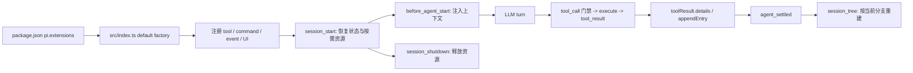

# Pi 插件开发参考与最佳实践

> 适用基线：本仓库使用 `@earendil-works/pi-coding-agent >=0.81.0`，本文依据本地安装的 0.81.0 文档与 2026-07-22 可访问的官方、社区源码编写。Pi API 演进较快；升级 peer dependency 时，先核对本文末尾的官方文档。

本文中的“插件”泛指 Pi extension；“package”是包含 extension、skill、prompt、theme 等资源的分发单元。官方 API 约束高于社区惯例，社区项目只作为设计案例，不代表安全背书。

## 1. 资料优先级

开发或评审插件时按以下顺序取证：

1. [官方 Extensions 文档](https://github.com/earendil-works/pi/blob/main/packages/coding-agent/docs/extensions.md)与[官方示例](https://github.com/earendil-works/pi/tree/main/packages/coding-agent/examples/extensions)：API、事件顺序和返回值语义的唯一规范来源。
2. [官方 Packages 文档](https://github.com/earendil-works/pi/blob/main/packages/coding-agent/docs/packages.md)：安装、manifest、依赖和发布规则。
3. 本仓库相邻插件及测试：本地兼容性、命名、错误处理和测试约定。
4. 社区插件源码：复杂架构、运维、安全和产品交互的参考实现。

不要从旧博客、README 片段或其他 Pi 分支推断当前类型签名。先查看已安装版本的类型和文档。

## 2. 值得研究的生态项目

以下下载量是 [Pi Package Catalog](https://pi.dev/packages) 在 2026-07-22 显示的月度快照，会随时间变化。选择它们是因为使用量和覆盖面，不等于逐行质量认证。

| 项目 | 快照 | 适合学习的内容 |
| --- | ---: | --- |
| [Pi 官方 extension examples](https://github.com/earendil-works/pi/tree/main/packages/coding-agent/examples/extensions) | 官方 | 最小工具、事件门禁、持久状态、动态工具、截断、UI、provider 和资源发现。新 API 优先从这里复制。 |
| [pi-mcp-adapter](https://github.com/nicobailon/pi-mcp-adapter) | 约 138K/月 | 用一个代理工具延迟发现大量 MCP 工具；懒连接、空闲回收、OAuth、输出护栏和大量生命周期测试。 |
| [pi-web-access](https://github.com/nicobailon/pi-web-access) | 约 132.6K/月 | 多 provider 降级链、内容提取、结果落盘、并发限制，以及对 DNS、私网地址和每次重定向的 SSRF 校验。 |
| [pi-subagents](https://github.com/nicobailon/pi-subagents) | 约 117.7K/月 | 前台/后台任务、并行与链式执行、artifact、恢复、资源清理，以及 unit/integration/e2e 分层。 |
| [pi-lens](https://github.com/apmantza/pi-lens) | 约 31.4K/月 | 大型插件模块化、LSP/子进程管理、真实语言 fixture、安装 smoke test、构建产物和兼容性 CI。 |
| [Plannotator](https://github.com/backnotprop/plannotator) | Pi 包约 29.5K/月 | Pi 命令与外部浏览器 UI 的桥接、人类审批闭环、跨 coding-agent 适配和隐私边界。 |
| [@gotgenes/pi-permission-system](https://github.com/gotgenes/pi-packages/tree/main/packages/pi-permission-system) | 约 26.9K/月 | fail-closed 权限门禁、allow/ask/deny 合成、路径 canonicalization、审计记录及密集的安全回归测试。 |
| [luongnv89/pi-extensions](https://github.com/luongnv89/pi-extensions) | 集合 | 多插件仓库、provider bridge、footer/UI、独立 package 发布和开发说明的组织方式。 |

阅读社区项目时重点看 `package.json`、入口文件、生命周期/资源管理模块和测试目录，不要只看 README 功能列表。

## 3. Pi 扩展模型

### 3.1 Package、extension 与运行时能力

一个 Pi package 可以同时声明：

- `extensions`：在 Pi 进程内执行的 TypeScript/JavaScript 模块，可注册工具、命令、事件、UI 或 provider。
- `skills`：按需加载的工作说明，不执行常驻运行时代码。
- `prompts`：可复用 slash prompt。
- `themes`：TUI 色彩资源。

如果需求只是稳定的操作说明，优先 skill；需要新工具、生命周期拦截、持久状态或 UI 时才使用 extension。不要用常驻代码解决静态提示可以解决的问题。

### 3.2 加载与数据流



关键事实：

- factory 用于注册能力。官方明确要求不要在 factory 中启动进程、socket、watcher 或 timer，因为某些 Pi 调用只加载扩展但不会启动 session。
- `session_start` 可能由 startup、reload、new、resume 或 fork 触发；内存状态不能假设连续存在。
- `/new`、`/resume`、`/fork` 会先对旧实例发出 `session_shutdown`，再加载新实例并发出新的 `session_start`。
- `agent_end` 后仍可能自动重试、压缩重试或处理 follow-up；需要“完全空闲”语义时使用 `agent_settled`。
- `/tree` 会改变当前分支。分支相关状态必须在 `session_tree` 后重建。
- 工具默认可能并行执行；不要假设调用顺序等于完成顺序。

### 3.3 常用事件选择

| 目标 | 首选事件/API | 注意事项 |
| --- | --- | --- |
| 恢复 session 状态 | `session_start`、`session_tree` | 从 `ctx.sessionManager.getBranch()` 重建，不信任反序列化数据。 |
| 注入本轮模型上下文 | `before_agent_start` | 保持短小；尊重前序 handler 已修改的 `event.systemPrompt`。 |
| 修改每次模型请求上下文 | `context` | 返回副本，不改写 session 历史。 |
| 阻止危险工具调用 | `tool_call` | 无 UI 时默认阻止，而不是静默放行。 |
| 观察/修正工具结果 | `tool_result` | 不要让观察逻辑破坏原始结果协议。 |
| 等待所有自动行为完成 | `agent_settled` | `agent_end` 不是最终稳定点。 |
| 释放子进程、timer、watcher | `session_shutdown` | handler 应幂等，覆盖 quit/reload/new/resume/fork。 |
| 扩展间通信 | `pi.events` | 使用命名空间和版本号；校验 `unknown` payload。 |
| 动态贡献 skill/prompt/theme | `resources_discover` | 同时处理 startup 与 reload。 |

## 4. 在本仓库创建插件

### 4.1 目录结构

本仓库不是 npm workspace；每个顶层目录都是独立 package。新插件沿用：

```text
<name>/
├── package.json
├── package-lock.json
├── tsconfig.json
├── src/
│   ├── index.ts          # 仅作为 Pi composition root
│   └── <domain>.ts       # 纯逻辑、状态、协议或资源管理
└── test/
    ├── <domain>.test.ts
    └── harness.ts        # 只有需要生命周期集成测试时才添加
```

先复制最接近的现有插件，而不是从空白重新发明结构：

- 简单工具包装：`rg/`
- 状态机、持久化和跨插件协议：`plan/`、`goal/`、`todo/`
- 子进程、协议客户端、配置路由和清理：`lsp/`
- 响应式共享 UI 与 native adapter：`request/`

### 4.2 最小 package manifest

```json
{
  "name": "pi-example-dev",
  "version": "0.1.0",
  "private": true,
  "type": "module",
  "keywords": ["pi-package"],
  "pi": {
    "extensions": ["./src/index.ts"]
  },
  "scripts": {
    "check": "tsc --noEmit",
    "test": "node --import tsx --test test/*.test.ts"
  },
  "peerDependencies": {
    "@earendil-works/pi-ai": ">=0.81.0",
    "@earendil-works/pi-coding-agent": ">=0.81.0",
    "@earendil-works/pi-tui": ">=0.81.0",
    "typebox": ">=1.0.0"
  },
  "devDependencies": {
    "@earendil-works/pi-ai": "^0.81.0",
    "@earendil-works/pi-coding-agent": "^0.81.0",
    "@earendil-works/pi-tui": "^0.81.0",
    "@types/node": "^22.0.0",
    "tsx": "^4.20.0",
    "typebox": "^1.0.0",
    "typescript": "^5.9.0"
  },
  "engines": {
    "node": ">=22.19.0"
  }
}
```

只保留实际使用的 peer。第三方运行时库放 `dependencies`；Pi 从 npm/git 安装 package 时通常使用 production install，不能依赖 `devDependencies` 提供运行时代码。

### 4.3 最小入口

```typescript
import { StringEnum } from "@earendil-works/pi-ai";
import type { ExtensionAPI } from "@earendil-works/pi-coding-agent";
import { Type } from "typebox";

const Parameters = Type.Object({
  action: StringEnum(["inspect", "run"] as const),
  input: Type.Optional(Type.String({ description: "Input to process" })),
});

export default function exampleExtension(pi: ExtensionAPI): void {
  pi.registerTool({
    name: "example",
    label: "Example",
    description: "Inspect or process one input and return a bounded result.",
    promptSnippet: "Inspect or process data with the example tool",
    promptGuidelines: [
      "Use example only when the task needs the example capability.",
    ],
    parameters: Parameters,
    async execute(_toolCallId, params, signal, onUpdate, ctx) {
      if (signal?.aborted) throw new Error("Example operation cancelled");

      onUpdate?.({
        content: [{ type: "text", text: "Working..." }],
        details: { action: params.action },
      });

      const text = `${params.action}: ${params.input ?? "(none)"}`;
      return {
        content: [{ type: "text", text }],
        details: { action: params.action, cwd: ctx.cwd },
      };
    },
  });

  pi.on("session_shutdown", async () => {
    // Idempotently close only resources this extension actually opened.
  });
}
```

约束：字符串枚举使用 `StringEnum`，保证 Google provider 兼容；工具执行失败必须 `throw`，返回 `{ isError: true }` 不会自动标记失败。

### 4.4 本地加载与热重载

从仓库根目录把 package 目录分别软链接到 Pi 的全局 extension 目录：

```sh
mkdir -p "$HOME/.pi/agent/extensions"
ln -sfn "$PWD/example" "$HOME/.pi/agent/extensions/example"
```

本仓库现有插件通过根目录 Makefile 批量管理：

```sh
make pi-extensions-on
make pi-extensions-status
```

`make pi-extensions-off` 只删除仍指向当前仓库的八个链接；`make pi-extensions-toggle` 在全部启用时关闭，否则补齐缺失链接。冲突的普通文件、目录和外部软链接会导致操作在修改前失败。

然后在 Pi 中执行 `/reload`。只链接 package，不链接仓库根目录；根目录没有 `package.json`。完整的扩展与主题开关可使用 `make pi-on|off|toggle|status`，临时试运行单文件可使用 `pi -e ./path/to/extension.ts`。

### 4.5 开发命令

```sh
cd goal  # or plan, lsp, request, rg, or todo
npm ci
npm run check
npm test
```

涉及多个插件协议时，运行所有受影响 package；Plan coordination 协议变更至少运行 `goal`、`plan` 与 `todo`，并覆盖 `plan/test/coexistence.test.ts` 和 `todo/test/coexistence.test.ts`。

`.github/workflows/ci.yml` 在 Node 22.19 上对 `goal`、`plan`、`lsp`、`request`、`rg`、`todo` 分别执行 clean install、typecheck 和完整 package 测试。新增顶层 package 时必须同步扩展 CI matrix 与全局链接管理器。

## 5. API 速查与选择

| 需求 | API | 结果是否进入 LLM 上下文 |
| --- | --- | --- |
| 注册模型可调用能力 | `pi.registerTool()` | 工具描述和 `content` 会进入；`details` 用于状态/渲染。 |
| 注册用户 slash command | `pi.registerCommand()` | 由 handler 决定。 |
| 临时注入扩展消息 | `pi.sendMessage()` | 是；注意 `steer`、`followUp`、`nextTurn` 的时序。 |
| 发送真正的用户消息并触发 turn | `pi.sendUserMessage()` | 是；streaming 时必须指定 delivery mode。 |
| 保存不进入模型上下文的扩展数据 | `pi.appendEntry()` | 否；可配合 entry renderer。 |
| 执行外部命令 | `pi.exec(command, args, { signal, timeout })` | 只有你返回的内容进入。 |
| 修改当前活跃工具 | `getActiveTools()` / `setActiveTools()` | 会改变后续 prompt/tool schema。 |
| 跨插件事件 | `pi.events.on/emit` | 否，除非接收方主动注入。 |
| TUI/RPC 交互 | `ctx.ui.*` | 通常否；必须检查 mode/UI 能力。 |
| 读取当前分支 | `ctx.sessionManager.getBranch()` | 只读。 |

### 5.1 `content`、`details` 与 custom entry

- `content`：给模型看的短结果。必须直接说明成功、失败、截断和下一步。
- `details`：结构化状态、渲染元数据或可恢复快照；同样要有大小上限，因为它会持久化到 session。
- `toolResult.details`：由某次工具调用产生的状态首选位置，天然支持 fork/tree 分支。
- `appendEntry(customType, data)`：适合命令、生命周期事件或 UI 产生、又不应进入模型上下文的状态。使用带版本的 `customType`/payload，并从当前 branch 恢复。
- 外部数据库/文件：可作缓存或大 artifact，不应成为分支相关状态的唯一事实来源。

## 6. 最佳实践

### 6.1 架构与边界

- `src/index.ts` 只做注册、依赖装配和生命周期协调。解析、验证、状态转换、格式化、路径解析和协议客户端放到独立模块。
- 一项插件只拥有一个连贯能力。不要把不相关工具塞进同一个共享 mutable closure。
- 先用纯函数表达状态转换，再由入口层读写 Pi session。纯逻辑应接受 `now`、ID 生成器或 I/O adapter，以便确定性测试。
- 不要为了少量重复立即建立跨 package 公共库。本仓库没有 workspace；共享协议稳定后再显式迁移所有调用方。

### 6.2 工具契约与模型可用性

- 工具名稳定、短、可区分；参数 schema 保持窄且有边界，例如字符串最大长度、数组最大项数、整数范围。
- `description` 说明“做什么、何时使用、关键副作用”；`promptGuidelines` 每一条都写出工具名，不能写含糊的“use this tool”。
- schema 用 `Type.Object`；枚举用 `StringEnum`。对 resumed 旧 session 的参数迁移使用 `prepareArguments()`，不要污染当前 public schema。
- 成功返回 `{ content, details }`；失败抛出 `Error`。不要让错误文本伪装成普通成功结果。
- 自定义 built-in tool 时保持原始 result/details shape；否则内置 renderer 和 session 逻辑可能失效。
- 工具有嵌套模型调用时返回其 `usage`，让 Pi 的 session/footer/RPC 统计保持准确。

### 6.3 状态、分支与版本

- 每次状态变化保存完整、可序列化的小快照，或保存可以确定性 replay 的版本化事件。
- 在 `session_start` 和 `session_tree` 都执行恢复；先清空内存，再按 `getBranch()` 顺序应用记录。
- 反序列化输入一律按 `unknown` 处理：检查版本、discriminant、长度、数值范围和不变量；无法修复时忽略或报告，不要部分信任。
- 不把 `Map`、class instance、process handle、AbortController 或 secret 放进 `details`/custom entry。
- 协议升级采用新版本号和明确迁移，不静默改变旧 payload 含义。

### 6.4 并发、取消与资源生命周期

- 把工具收到的 `AbortSignal` 传给 `pi.exec`、fetch、JSON-RPC 和子任务；取消后停止发 progress update，也不要写入最终状态。
- 对多 server/provider 的独立工作使用有界并发；允许部分成功时使用 `Promise.allSettled` 并逐项报告错误。
- 需要修改文件的自定义工具必须把真实绝对路径传给 `withFileMutationQueue()`，并把整个 read-modify-write 放在队列中。
- 子进程/连接按需启动，按 `{server, workspace}` 等稳定 key 复用；并发启动用 promise map 去重。
- timer 若不应阻止 Node 退出则调用 `unref()`；所有 listener、timer、watcher、server 和 child process 在 `session_shutdown` 幂等释放。
- 考虑 `/reload` 遗留资源。社区成熟插件会显式清理旧 runtime；不要假设模块 reload 自动销毁全局 timer。

### 6.5 输出与上下文预算

- 官方默认上限是 50KB 或 2000 行，先到者为准。所有自定义工具都必须截断。
- 搜索、文件和列表通常保留头部；日志和命令输出通常保留尾部。使用官方 `truncateHead`/`truncateTail`，不要按 JavaScript 字符数粗切 UTF-8。
- 被截断时明确返回原始/返回行数与字节数，并把完整结果写入临时 artifact，告诉模型如何按 offset/grep 继续读取。
- `details` 也要限长。`pi-mcp-adapter` 同时限制模型文本和原始 MCP JSON，是比只截断 `content` 更完整的模式。
- 工具很多时采用“少量 loader/search tool + 动态激活”。动态加载应只追加活跃工具并保留其他插件的工具，避免破坏 prompt cache 和插件共存。

### 6.6 安全与信任边界

- Extension 与当前用户同权限运行。把网络、shell、文件系统、credential 和外部 UI 都当作安全边界，而不是普通 helper。
- 路径输入先相对 `ctx.cwd` 解析为绝对路径；需要权限判断时同时检查用户路径和 `realpath` 后的 canonical path，防止 symlink 绕过。
- 网络 fetch 至少限制 `http`/`https`，拒绝 localhost、私网、link-local 和保留地址；解析 DNS 后检查所有地址，并在每次 redirect 后重新校验。`pi-web-access` 的 `ssrf-protection.ts` 是直接参考。
- 调用命令优先 `pi.exec(executable, args)`，不要拼接未转义 shell 字符串。明确 timeout、signal、cwd 和允许的环境变量。
- 权限/解析/门禁发生内部错误时 fail closed。无 UI 的 JSON/print 模式不能确认危险操作，应阻止并给出原因。
- secret 只从环境或专用配置读取；不要放进 system prompt、tool `content`、session `details`、日志或错误回显。
- 项目本地 `.pi` 资源受 project trust 控制。构造项目配置路径时使用 Pi 导出的 `CONFIG_DIR_NAME`，不要无条件硬编码 `.pi`。

### 6.7 UI 与非交互模式

- `ctx.hasUI` 表示 TUI/RPC 可执行通用 dialog/notification；`ctx.mode === "tui"` 才能使用 `custom()`、组件 factory、直接终端输入等 TUI 专属功能。
- JSON 和 print 模式中 UI 方法可能无操作。核心能力必须有无 UI 路径：返回结构化错误、使用配置默认值，或安全拒绝。
- UI 是状态视图，不是唯一状态存储。reload/resume 后应从 session 状态重建 widget/footer。
- 自定义组件必须处理窄终端、长文本、dispose/invalidate 和重复 render；不要在 render 中执行昂贵 I/O。

### 6.8 配置、依赖与发布

- 配置定义 schema、默认值、版本和明确的 global/project precedence。未知字段、非法 enum 和危险 fallback 应报错，不静默纠正。
- Pi host 包与 `typebox` 按官方规则列为 peer dependency，不捆绑第二份 host runtime。第三方运行时库列入 `dependencies`。
- 本仓库开发包直接加载 TypeScript；发布复杂插件也可以像 `pi-lens` 一样指向 `dist/index.js`，但必须做 production install smoke test，确保不依赖 dev-only 文件。
- 发布时设置 `keywords: ["pi-package"]`、准确 `pi` manifest、`repository`、license、清晰 description 和 `files` allowlist。
- npm 发布前检查 tarball 内容、lockfile、`npm install --omit=dev` 后加载、全新 Pi session 启动及卸载路径。

### 6.9 跨插件协作

- 使用形如 `<owner>:<capability>:vN` 的事件名。本仓库 `pi-extensions:plan-state:v1` 是现有例子。
- 接收方把 payload 当 `unknown` 并验证；发送方不要暴露可变内部对象。
- handler 应对加载顺序和接收方缺失保持安全。需要恢复协作状态时，在 `session_start`/`session_tree` 重新广播快照。
- 修改 active tools 时必须同时保留其他插件在 Plan 期间新增和移除的工具；`plan/src/tool-lease.ts` 展示了 snapshot、reconcile、restore 的完整租约模式。简单的只追加场景才可直接基于 `pi.getActiveTools()` 去重更新。
- 跨插件协议变更同步更新每个生产者/消费者及对应 coexistence tests；不要用生产源码跨目录 import 偷渡耦合。

## 7. 测试与质量门槛

### 7.1 推荐测试层次

| 层次 | 应覆盖的契约 | 本仓库/社区参考 |
| --- | --- | --- |
| 纯单元 | schema、parser、状态转换、不变量、格式化、路径/URL 判定 | `goal/test/state.test.ts`、`plan/test/state.test.ts`、`todo/test/state.test.ts`、Web Access SSRF tests |
| Extension harness | 注册内容、事件顺序、UI/headless 行为、持久化恢复、active tools | `plan/test/coexistence.test.ts`、`todo/test/integration.test.ts`、`todo/test/coexistence.test.ts` |
| 协议/子进程 | 初始化失败、取消、timeout、crash、诊断 settle、部分失败、idle/shutdown | `lsp/test/lsp-client.test.ts`、`lsp/test/server-manager.test.ts`、`lsp/test/fake-server.mjs` |
| 安全回归 | symlink escape、外部 cwd、私网/DNS redirect、shell indirection、fail-closed | `lsp/test/roots.test.ts`、Permission System test matrix、Web Access SSRF tests |
| 安装 smoke | manifest entry、fresh no-session load、全局软链接、reload、退出 | 本节命令、Pi Lens install/compat smoke workflow |

### 7.2 每个新增行为至少检查

- 正常路径和一个真实失败路径。
- 参数边界与 malformed persisted/config input。
- 已取消、超时和资源释放。
- `tui` 与 `hasUI === false` 路径。
- reload、resume/fork 或 tree navigation 后的状态。
- 大输出和 artifact fallback。
- 与其他活跃插件共存，不覆盖工具列表、widget key 或事件名。

测试行为，不测试源文件字符串或内部默认值。Bug fix 要有一个在旧实现上失败的回归测试。

### 7.3 当前仓库验证命令

```sh
for dir in goal plan lsp ast-grep request rg todo promptline-editor; do
  (cd "$dir" && npm run check && npm test) || exit 1
done
```

CI 会执行上述 package matrix。提交前还要从仓库根目录执行隔离加载 smoke，不读取当前 session 或全局链接：

```sh
for name in goal plan lsp ast-grep request rg todo promptline-editor; do
  pi --no-session -p --extension "$PWD/$name" "Reply with exactly: SMOKE_OK"
done
```

最后通过全局软链接在交互式 Pi 中调用受影响的主要工具/命令、执行 `/reload`，并确认 session 退出后无残留进程或 timer；自动 load smoke 不能替代行为 smoke。

## 8. 开发与评审检查表

### 设计前

- [ ] 该需求确实需要 extension，而不是 skill/prompt。
- [ ] 选定最接近的官方示例和本仓库插件作为基线。
- [ ] 写清工具/命令契约、状态所有者、信任边界和资源生命周期。
- [ ] 明确在 TUI、RPC、JSON、print 四种模式中的行为。

### 实现中

- [ ] 入口仅负责注册和装配，纯逻辑可独立测试。
- [ ] TypeBox schema 有边界；string enum 使用 `StringEnum`。
- [ ] 所有异步 I/O 传播取消和 timeout。
- [ ] 输出和 `details` 有明确上限。
- [ ] 状态可从当前 branch 恢复，并响应 `session_tree`。
- [ ] 长生命周期资源惰性启动并在 `session_shutdown` 幂等关闭。
- [ ] 文件、shell、URL 和 secret 输入经过对应安全校验。

### 合并前

- [ ] 受影响 package 的 `npm run check`、`npm test` 通过，CI 配置仍覆盖全部八个顶层插件。
- [ ] 新可观察契约有回归测试，跨插件协议有 coexistence test。
- [ ] 真实 Pi 完成主路径、失败路径、`/reload` 和退出 smoke test。
- [ ] package manifest、runtime dependencies、lockfile 和全局软链接说明一致。
- [ ] 新增或改变的架构约束同步更新 `AGENTS.md` 或本文。

## 9. 官方与社区来源

官方：

- [Pi Extensions](https://github.com/earendil-works/pi/blob/main/packages/coding-agent/docs/extensions.md)
- [Pi Extension Examples](https://github.com/earendil-works/pi/tree/main/packages/coding-agent/examples/extensions)
- [Pi Packages](https://github.com/earendil-works/pi/blob/main/packages/coding-agent/docs/packages.md)
- [Pi Package Catalog](https://pi.dev/packages)

社区案例：

- [nicobailon/pi-mcp-adapter](https://github.com/nicobailon/pi-mcp-adapter)
- [nicobailon/pi-web-access](https://github.com/nicobailon/pi-web-access)
- [nicobailon/pi-subagents](https://github.com/nicobailon/pi-subagents)
- [apmantza/pi-lens](https://github.com/apmantza/pi-lens)
- [backnotprop/plannotator](https://github.com/backnotprop/plannotator)
- [gotgenes/pi-packages](https://github.com/gotgenes/pi-packages)
- [luongnv89/pi-extensions](https://github.com/luongnv89/pi-extensions)
