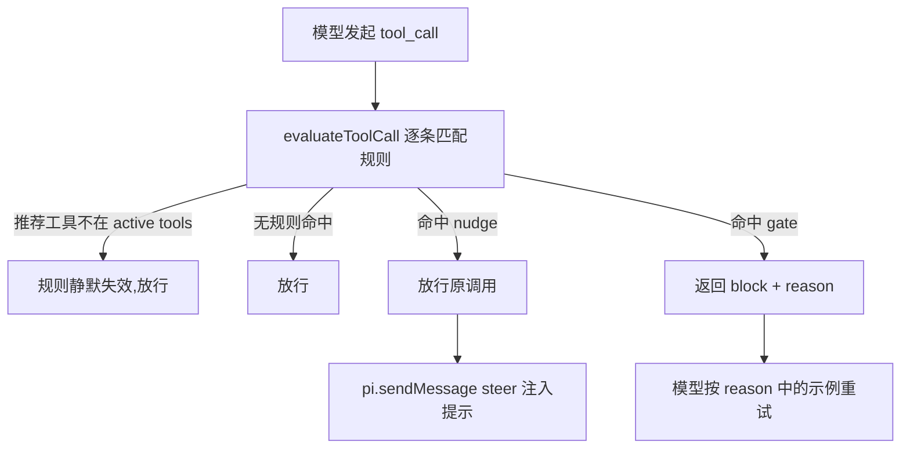

# Enforce 插件

工具促活层（enforcement kit）：在 `tool_call` 事件上用确定性的规则表，把模型从低效工具引导到低频但高价值的工具（`lsp`、`ast_grep_*` 等）。

为什么需要它：仅靠工具描述和 prompt guideline 提示，模型在有 `rg`/`grep`/`bash` 这些"肌肉记忆"工具时仍会绕过专用工具（上游 earendil-works/pi#5680 的复盘结论：纯提示词修复不够）。Enforce 把促活从"提示词请求"升级为"运行时确定性干预"：命中规则就必然提醒或阻断，不依赖模型自觉。手法对标社区的 claude-code-lsp-enforcement-kit（阻断/提醒 + 给出可直接复制的替代调用），但更克制：**默认规则全部是 nudge（放行 + steer 提示），gate（阻断调用）只能在配置文件中显式启用**。

## 工作原理



每次工具调用经过三层判定：

1. **生效判定**：规则的 `recommend` 字段声明它推荐的工具；该工具不在 `pi.getActiveTools()` 里时整条规则跳过。Enforce 不 import、不探测 lsp / ast-grep 包是否存在——没装这些包时对应规则静默失效，装了才生效。
2. **匹配判定**：精确匹配工具名，再可选地对参数标量跑正则（`paramField`/`paramPattern`）、对文件路径参数跑 glob（`fileParam`/`fileGlob`）。纯函数，无 I/O。
3. **动作判定**：gate 优先于 nudge。
   - **nudge**：放行原调用，同时用 `pi.sendMessage(..., { deliverAs: "steer" })` 向正在运行的 agent 注入一条提示。提示 = 插值后的 message + "Suggested replacement call" JSON 示例（从当次调用参数插值生成，可直接复制）。同一规则每个 session 最多提示一次（`once`，可配置关闭），避免刷屏。steer 消息 `display: false`，不进 transcript，只影响模型。
   - **gate**：返回 `{ block: true, reason }`，本次调用失败，reason 内含同样的插值提示与替代调用示例，模型看到失败后通常直接复制示例重试。gate 每次都阻断，不受 `once` 限制。

nudge 投递失败（如 session 正忙）被吞掉，绝不影响原工具调用；观察与提示路径不可能破坏原调用协议。

## 效果示例

### 示例 1：nudge（默认行为，零配置）

项目里装了 lsp 扩展，模型查找符号时习惯性调文本搜索：

```json
{ "tool": "rg", "input": { "pattern": "UserService" } }
```

调用**照常执行**（结果不受影响），同时模型在运行中收到这样一条 steer 提示（`${pattern}` 已被当次参数插值）：

```text
The rg pattern is a bare identifier. The lsp tool resolves symbols semantically
(definitions, references, workspace symbols) and usually answers this faster than text search.

Suggested replacement call:
{
  "tool": "lsp",
  "input": {
    "action": "workspace_symbols",
    "query": "UserService"
  }
}
```

下一次需要解析符号时，模型更可能直接调 `lsp`。同一条规则本 session 不会再提醒第二次。

### 示例 2：gate（配置显式升级后）

在 `~/.pi/agent/enforce.json` 中把该规则升级为 gate：

```json
{ "rules": { "prefer-lsp-symbols-rg": { "action": "gate" } } }
```

同样的 `rg { pattern: "UserService" }` 调用现在被**阻断**，模型收到工具调用失败，reason 与上面的提示文本相同（含可复制的 `lsp` 调用示例）。模型通常随即用示例重试，`workspace_symbols` 直接给出符号位置，省掉"grep 出一堆文本匹配再逐个 read 确认"的循环。

### 示例 3：控制面输出

`/enforce status`：

```text
Enforce: 6 rule(s) active (1 gate, 5 nudge); 2 nudge(s) sent this session.
Config files: /Users/you/.pi/agent/enforce.json
```

`/enforce rules`：

```text
prefer-lsp-symbols-grep [nudge, builtin, requires lsp active] → grep
prefer-lsp-symbols-rg [gate, global, requires lsp active] → rg
prefer-ast-grep-search-grep [nudge, builtin, requires ast_grep_search active] → grep
prefer-ast-grep-search-rg [nudge, builtin, requires ast_grep_search active] → rg
prefer-ast-grep-edit-sed [nudge, builtin, requires ast_grep_edit active] → bash
no-curl [gate, project, requires request active] → bash
```

## 场景示例

### 场景 A：零配置开箱（装了 lsp / ast-grep 的项目）

什么都不用配。`make pi-extensions-on` + `/reload` 后，五条内置 nudge 规则自动生效：模型用 `grep`/`rg` 搜裸标识符时被提醒一次"用 lsp workspace_symbols"，用 `$$$` 元变量写文本搜索时被提醒"这是 ast-grep 语法"，用 `sed -i` 改代码时被提醒"ast_grep_edit 有强制 preview"。没装 lsp / ast-grep 的 session 里这些规则完全静默——不会推荐不存在的工具。

### 场景 B：用 telemetry 数据驱动，把 nudge 升级为 gate

nudge 只是提示，模型可能照样不理。配合 telemetry 扩展做闭环：

1. 正常使用一到两周，`/telemetry export` 导出数据。
2. 对比维度：`rg`/`grep` 的调用次数 vs `lsp` 的调用次数。如果裸标识符搜索仍占大头，说明 nudge 不够。
3. 在全局配置把对应规则升级为 gate（示例 2），`/enforce reload` 生效。
4. 再观察一段时间，导出对比：`lsp` 调用占比应上升，`rg` 总时长应下降。若误伤（合法文本搜索被误拦），把规则调回 nudge 或加 `fileGlob` 收窄范围。

### 场景 C：项目级自定义规则

团队项目里想禁止模型用 `curl` 探测内网 API、统一走项目自带的请求工具（假设其工具名为 `request`，按实际替换），在项目根建 `.pi/enforce.json`（仅项目受信任时生效）：

```json
{
  "rules": {
    "no-curl": {
      "tool": "bash",
      "action": "gate",
      "paramField": "command",
      "paramPattern": "\\bcurl\\s+\\S*(https?://\\S+)",
      "message": "Do not probe endpoints with curl. Use the request tooling instead for ${1}.",
      "example": { "tool": "request", "input": { "url": "${1}" } },
      "recommend": "request"
    }
  }
}
```

模型执行 `curl https://api.internal/health` 时被阻断，reason 中的 `${1}` 已被捕获组插值为实际 URL，示例可直接复制。

## 如何接入

按强度递进的落地路径：

1. **直接启用**：链接 + `/reload`，五条内置 nudge 零配置生效。先跑一段时间。
2. **观测**：用 telemetry 扩展（或 `/enforce status` 的 nudge 计数）确认规则确实在命中、模型是否有改变。
3. **全局调优**：在 `~/.pi/agent/enforce.json` 里 `disabled: true` 关掉误报规则，或把验证有效的规则升级为 gate。
4. **项目规则**：项目级习惯（禁止某命令、优先某内部工具）写进 `.pi/enforce.json`，随项目走。
5. **持续校准**：升级 gate 后若 telemetry 显示误伤率上升，退回 nudge 或收紧 `paramPattern`/`fileGlob`。

## 安装与启用

本包是私有开发包（`pi-enforce-dev`）。仓库根目录执行：

```sh
make pi-extensions-on    # 或 scripts/pi-global-links.sh 管理的等价链接
```

然后在 Pi 中 `/reload`。隔离加载 smoke：

```sh
pi --no-session -p --extension "$PWD/enforce" "Reply with exactly: SMOKE_OK"
```

## 使用方法

`/enforce` 支持三个子命令（均可 Tab 补全）：

- `/enforce status`（或无参数）：规则总数、gate/nudge 分布、本 session 已发送 nudge 数、生效的配置文件、配置错误。
- `/enforce rules`：逐条列出规则（id、action、来源、生效条件、匹配的工具名），最多 30 条。
- `/enforce reload`：重新读取两层配置文件、清空 nudge 记忆并报告结果；配置错误时 fail closed（见下）。

## 默认规则

全部 nudge，均要求推荐工具在 active tools 中才生效：

| id | 匹配 | 推荐 | 意图 |
| --- | --- | --- | --- |
| `prefer-lsp-symbols-grep` | `grep`，pattern 为裸标识符 | `lsp` | 语义符号解析优于文本搜索，示例 `lsp { action: "workspace_symbols", query: "<匹配值>" }` |
| `prefer-lsp-symbols-rg` | `rg`，pattern 为裸标识符 | `lsp` | 同上 |
| `prefer-ast-grep-search-grep` | `grep`，pattern 含 `$$$` 元变量 | `ast_grep_search` | 文本搜索无法解释 ast-grep 元变量 |
| `prefer-ast-grep-search-rg` | `rg`，pattern 含 `$$$` 元变量 | `ast_grep_search` | 同上 |
| `prefer-ast-grep-edit-sed` | `bash`，命令含 `sed ... -i` | `ast_grep_edit` | 结构化重写 + 强制 preview 比 sed -i 更适合改代码 |

## 配置位置与优先级

内置默认 < 全局 `~/.pi/agent/enforce.json` < 项目 `.pi/enforce.json`（项目层路径用 Pi 导出的 `CONFIG_DIR_NAME` 构造，仅在项目受信任时读取）。

配置按规则 id 打补丁（与 lsp 的 server 配置同款语义）：与内置规则同 id 的条目合并覆盖单个字段；新 id 必须是完整规则；`disabled: true` 删除该规则。

```jsonc
{
  "rules": {
    // 显式把内置 nudge 升级为 gate（gate 的唯一启用方式）
    "prefer-lsp-symbols-grep": { "action": "gate" },
    // 关掉某条内置规则
    "prefer-ast-grep-edit-sed": { "disabled": true },
    // 自定义规则
    "no-curl": {
      "tool": "bash",
      "action": "gate",
      "message": "Use the request tooling instead of curl for ${1}.",
      "example": { "tool": "request", "input": { "url": "${1}" } },
      "paramField": "command",
      "paramPattern": "\\bcurl\\s+\\S*(https?://\\S+)",
      "recommend": "request"
    }
  }
}
```

### 顶层字段

- `rules`：对象，key 为规则 id（≤64 字符，小写字母/数字/连字符）。只允许这一个顶层字段。

### 规则字段

- `tool`（新规则必填）：精确匹配的工具名。
- `action`（新规则必填）：`"nudge"` 或 `"gate"`。
- `message`（新规则必填，≤1000 字符）：提示/阻断文本，支持插值。
- `example`：对象（≤20 键），替代调用示例，字符串值支持插值，渲染为 JSON 附在 message 后。约定形状 `{ "tool": "...", "input": { ... } }`。
- `paramField` / `paramPattern`：对 `input[paramField]`（标量）执行正则（≤500 字符，必须可编译）；`paramPattern` 要求同时给 `paramField`。
- `fileParam`（默认 `"path"`）/ `fileGlob`：对文件路径参数做 glob 匹配（`*` 段内、`**` 跨段、`?` 单字符）。
- `recommend`：被推荐的工具名；设置后规则只在该工具处于 active tools 时生效。
- `once`（默认 `true`）：nudge 每 session 只发一次；对 gate 无效。
- `disabled`：`true` 时删除该规则。

### 插值

message 与 example 的字符串支持 `${paramField名}`（取工具入参标量）、`${0}`（正则整体匹配）、`${1..9}`（捕获组）。单个插值上限 200 字符，整条提示上限 4000 字符。未知占位符原样保留。

### 校验与 fail closed

配置按 `unknown` 严格校验：未知字段、错误类型、不可编译正则、超限一律报错。任何一层配置出错（含 JSON 语法错误）都 fail closed：忽略全部配置文件，回退到仅内置 nudge 规则，错误文本通过 `/enforce status` 与 session 开始时的 warning 暴露。内置规则永远不可能变成 gate —— gate 只能由合法配置文件显式产生。

## 与 Plan 的共存语义

Plan 在 `tool_call` 里做只读门禁，Enforce 也在同一事件里匹配规则，二者独立判定、互不调用：

- **无死锁**：Enforce 的 handler 只做纯函数匹配 + fire-and-forget 的 `sendMessage`，不等待 agent 空闲、不监听 Plan 的事件、不修改 active tools。
- **不双重阻断**：Plan 放行其只读工具（grep/rg/lsp 等），Enforce 的默认 nudge 对这些工具幂等（每规则每 session 一次），不会在 Plan 期间刷屏。Plan 阻断 mutation 工具时 Enforce 规则根本不匹配这些工具，保持沉默。
- **gate 组合**：若同一调用被 Plan 和 Enforce gate 同时命中，Pi 合并 block 结果，reason 取先返回者；两个 handler 任意注册顺序都安全（coexistence 测试覆盖两种顺序中的关键一种）。
- Enforce 不使用 `pi-extensions:exclusive-workflow:v1`，与 Plan/Goal 互斥协议无关。

## 边界与模式

- 不注册任何工具；只注册 `/enforce` 命令与 `session_start` / `tool_call` / `session_shutdown` 三个生命周期 handler。
- 无分支相关状态，不持久化；`session_start` 重新加载配置并清空 nudge 记忆，`session_shutdown` 幂等清理。
- TUI / RPC / JSON / print 四种模式行为一致：核心路径不依赖 UI；配置错误仅在 `ctx.hasUI` 时额外 notify 一次。

## 实现原理与关键节点

- `src/index.ts`：装配根。注册 `/enforce` 与三个生命周期 handler；配置 lazy 加载（promise 去重）并在 `session_start` 预热；`tool_call` 里评估规则，gate 返回 `{ block, reason }`，nudge 记 `once` 集合后 steer 投递；`session_shutdown` 幂等清空内存状态。
- `src/rules.ts`：纯函数。内置规则表、规则归一化（边界校验 + 正则编译）、迷你 glob 匹配、`${...}` 插值、`evaluateToolCall`（推荐工具不在 active tools 则跳过；gate 优先于 nudge）。
- `src/config.ts`：分层加载（内置 < 全局 < 项目），按 id 打补丁合并，严格 unknown 校验，任何错误 fail closed 到仅内置 nudge 规则。
- `src/command.ts`：`/enforce status|rules|reload`。
- nudge 消息 customType 为 `enforce-nudge-v1`，`display: false`（不进 transcript），`details` 只含 `ruleId` 与 `tool`。

## 开发与验证

```sh
cd enforce
npm ci
npm run check
npm test
```

测试覆盖：规则匹配/插值/glob 纯函数、分层配置与 fail closed、extension harness（nudge/gate/once/无 UI/投递失败/命令/幂等 shutdown）、与 Plan 的 coexistence（`test/coexistence.test.ts`，复用 `plan/test/harness.ts`；需要先 `cd ../plan && npm ci`）。
