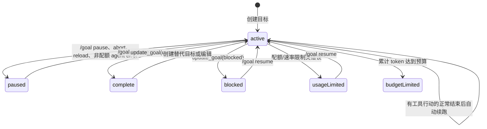

# Goal 插件

`goal` 为 Pi 增加可持久化的长程目标：它保存用户明确指定的目标，在每轮结束后自动继续工作，并记录累计时间与 token 使用量，直到目标完成、暂停、受限或真正阻塞。

> 维护约束：凡是改变 Goal 的行为、命令、工具 schema、状态、配置、与 Plan 的协作协议或安装方式，都必须在同一改动中同步本 README。

## 适用场景与效果

适合需要跨多轮持续推进、不能把“完成一部分”当作结束的任务，例如大规模迁移、长时间排障或带明确验收条件的实现工作。普通一次性请求不会自动变成 Goal；只有用户明确要求时才应创建。

启用目标后：

- 当前目标及完整状态会注入每次 agent 的 system prompt；目标文本按不可信用户数据处理，不获得更高指令优先级。
- 一轮正常结束且目标仍为 `active` 时，插件发送隐藏的 continuation message，自动触发下一轮；若某个自动 continuation 整轮未发起任何工具调用，则 Goal 保持 `active` 但停止继续排队，避免空转。
- TUI footer 以独立 keyed status 横向显示 Goal 与 Plan；active turn 中 Goal 耗时每秒刷新。设置预算时同时显示 `耗时 · 已用 / 预算` token，不再占用叠层 widget。
- 状态作为 Pi session journal 的 custom entry 保存，切换 session tree 分支时按当前分支恢复。
- reload 会把仍活跃的目标安全地暂停，需显式 `/goal resume` 后继续。

## 安装与启用

要求：Node.js `>=22.19.0`、npm，以及兼容 `@earendil-works/pi-coding-agent >=0.81.0` 的 Pi。

```bash
cd /path/to/pi-extensions/goal
npm ci
mkdir -p "$HOME/.pi/agent/extensions"
ln -sfn "$PWD" "$HOME/.pi/agent/extensions/goal"
```

软链接必须指向 `goal/` 包根目录，而不是 `src/index.ts`；Pi 会读取 `package.json` 中的 `pi.extensions` 并加载 `./src/index.ts`。仓库移动后应重新创建链接。随后重启 Pi，或在已运行的 Pi 中执行 `/reload`。

开发时也可绕过全局发现，直接从本目录启动：

```bash
pi --extension ./src/index.ts
```

## 使用方法

### 用户命令

```text
/goal [--tokens 50k] <objective>
/goal status
/goal pause
/goal resume
/goal edit
/goal clear
```

| 命令 | 行为 |
| --- | --- |
| `/goal <objective>` | 创建并立即启动目标；如已有未完成目标，交互式 UI 会要求确认替换。 |
| `/goal --tokens 50k <objective>` | 创建带 token 预算的目标；支持正整数及 `k`、`m` 后缀，例如 `75000`、`50k`、`1.5m`。 |
| `/goal`、`/goal status` | 显示状态、目标、累计时间、token 使用量与可选预算。 |
| `/goal pause` | 中止当前 agent（若正在运行）并暂停自动续跑。 |
| `/goal resume` | 恢复并排队下一轮，也可重新启用因“无工具调用”而停止的自动续跑；`budgetLimited` 目标不能直接恢复，需创建带新预算的替代目标。 |
| `/goal edit` | 使用 TUI 编辑器修改目标；无对话框 UI 时用 `/goal <objective>` 替代。 |
| `/goal clear` | 清除目标及其后续自动推进。 |

目标最长 4,000 个 Unicode 字符。更长的规格应写入仓库文件，并在 objective 中引用该文件。

### Agent 工具

插件根据状态动态暴露三个工具：

| 工具 | 参数 | 可用条件与用途 |
| --- | --- | --- |
| `create_goal` | `objective`, 可选 `tokenBudget` | 始终注册；只能在用户明确要求 Goal 且没有未完成目标时创建。 |
| `get_goal` | 无 | 仅在目标活跃时启用；当前 prompt 已含完整状态时不应重复读取。 |
| `update_goal` | 完成分支：`status`, `evidence[]`；阻塞分支：`status`, `reason`, `attempted[]`, `unblocksWhen` | 仅在目标活跃且 Plan 未阻塞执行时启用；完成必须逐项提交 requirement-to-evidence 证据，阻塞必须说明真实外部阻碍、已尝试动作及精确解除条件。 |

用户通常使用 `/goal` 命令；这些工具用于 agent 在执行过程中创建或结束目标。

## 状态与生命周期



关键规则：

- `turn_start` 到 `turn_end` 计入耗时，active turn 中状态每秒刷新；assistant message 的 usage 计入 token。`update_goal(complete)` 必须携带逐项证据，并会先结算当前 turn 到完成瞬间的耗时，再显示完成耗时及证据报告；后续 `turn_end` 只补记 usage，不重复计时。达到预算的当轮会正常结算，然后停止自动续跑。
- 正常 `agent_end` 会排队续跑；abort 会暂停。agent error 会等 `agent_settled` 后再归类：配额/速率限制进入 `usageLimited`，其他错误进入 `paused`，避免把 provider 或工具故障误报为业务阻塞，也避免状态与仍在收尾的 agent 竞争。
- continuation message 去重：已有待处理消息或已有 continuation 时不会重复排队；context hook 只保留当前目标最新的一条隐藏续跑消息。自动 continuation 若没有任何工具调用，则设置 session 内续跑抑制但不篡改 Goal 状态；新用户 turn、`/goal resume`、目标编辑或 Plan 控制流释放会重新启用。
- session journal 解码失败时拒绝恢复不安全状态，并在有 UI 时显示警告；未知状态会保守恢复为 paused。

## 与 Plan 插件协作

Goal 通过 `pi.events` 监听 Plan 的版本化协调信号：

- Plan 处于 `planning` 或 `awaitingApproval` 时，Goal 保持状态但不自动执行，也不暴露 `update_goal`。
- `/plan approve` 恢复执行工具并由 Plan 排队执行轮，Goal 不额外重复排队。
- `/plan cancel` 保持 Goal active；Plan 不再阻塞且无需发起 Plan turn 时，Goal 依既有门控规则续跑。
- Goal 与 Plan 通过 session ID 隔离信号，避免其他 session 的 Plan 状态污染当前目标。

协议定义在 `goal/src/protocol.ts` 与 `plan/src/protocol.ts`。修改 channel、payload 或协作语义时必须同时更新两个插件及 `plan/test/coexistence.test.ts`。

## 与 Request UI 插件协作

Goal 的未完成目标替换确认继续调用标准 `ctx.ui.confirm()`。同时加载 `request` 时，共享 UI adapter 会把 “Replace active goal?” 自动渲染为统一 Request 单选界面；未加载 `request`、非 TUI 或 Request 对输入采取保守 fallback 时，Goal 仍使用 Pi 原生确认语义。Goal 不导入 Request package，也不依赖其事件 channel，因此两者可独立安装。

Request 在 session shutdown 时只恢复自己仍持有的 `confirm` wrapper，不覆盖其他 extension 后续安装的 adapter。真实 Goal/Request 共存路径由 `request/test/integration.test.ts` 覆盖。

## 配置

Goal 没有外部配置文件。运行期控制项只有：

- objective：由 `/goal` 或 `create_goal` 设置。
- token budget：可选；命令使用 `--tokens`，工具使用 `tokenBudget`。
- session/branch：持久化跟随 Pi session journal，不写独立状态文件。

## 实现原理与关键节点

- `src/index.ts`：扩展入口；持有 session 内状态，注册生命周期 hooks，负责续跑去重、无行动空转抑制、usage 计量、journal 恢复、UI 与 Plan 协调。
- `src/state.ts`：纯状态模型、输入解析、预算结算及严格的持久化解码边界。
- `src/command.ts`：`/goal` 用户控制面；先 abort 并等待 agent idle，再执行 pause/resume/edit/clear，避免并发状态竞争。
- `src/tools.ts`、`src/tool-schema.ts`：agent 工具边界、结构化终态证据及 TypeBox 参数约束。
- `src/prompts.ts`：活跃目标与 continuation prompt；对 objective 做 XML escaping，明确其不可信数据属性，并要求 prompt-to-artifact 完成审计。
- `src/protocol.ts`：与 Plan 的版本化事件契约。
- `test/state.test.ts`、`test/prompts.test.ts`：Goal 输入、状态转换、预算、usage、持久化解码及提示词契约的纯测试；命令、结构化终态、续跑保护、恢复、错误、UI 和 Goal/Plan 协作由 `plan/test/coexistence.test.ts` 覆盖。

## 开发与验证

```bash
cd /path/to/pi-extensions/goal
npm run check
npm test
```

`npm run check` 执行严格 TypeScript `noEmit` 检查；`npm test` 使用 Node `node:test` + `tsx`。改变 Goal/Plan 协作时，还应在 `plan/` 运行完整测试。
