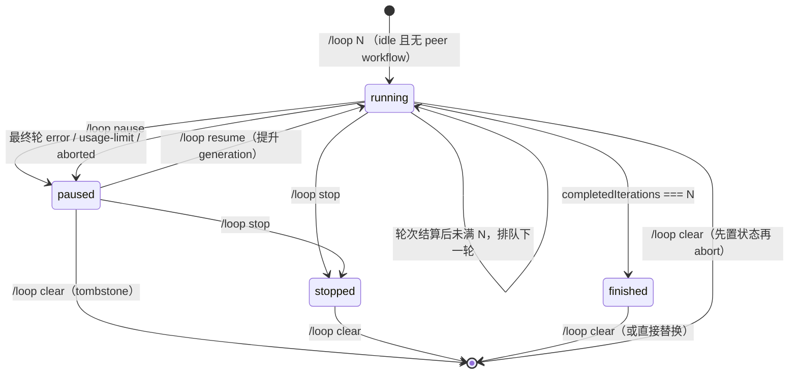

# Loop 插件

`loop` 为 Pi 增加**固定轮数的迭代执行**：用户执行 `/loop <N> <objective>`，插件按用户指定的轮数连续自动运行同一 objective 的完整 agent 轮次，每轮由一条带 `{loopId, generation, round}` 身份的隐藏续跑消息驱动，一轮真正稳定（`agent_settled`）后结算轮次并在轮数未满时排队下一轮。跑满 N 轮进入 `finished`。

> 维护约束：凡是改变 Loop 的行为、命令、状态 schema、持久化、与 Plan/Goal/Todo/Request 的协作协议或安装方式，都必须在同一改动中同步本 README 与 `docs/design/12-loop-extension-design.md`。

## 适用场景与效果

适合需要按固定次数重复执行同一任务的工作，例如逐轮迭代修复、逐轮复跑验证、多轮提示词改进。普通一次性请求不会自动变成 Loop；只有用户明确使用 `/loop` 时才创建。

启用循环后：

- 正常路径**严格执行 N 轮**：模型不能提前宣告完成；只有用户 `pause/stop/clear` 或运行错误/abort 可以提前停止。
- `finished` 只表示"N 轮计划已执行完"，不表示 objective 已验收成功（UI 文案写 `Loop finished (5/5 rounds)`，不声称任务完成）。
- 每轮完成后记录轮次摘要（最终 assistant 文本尾部、turn 数、ok/length 结局），footer 与 widget 按 Plan 插件的显示模式展示 `Loop 3/5` 与最近轮次列表；`/loop status` 输出完整文本。
- 内部 retry / auto-compaction retry 属于同一轮，不重复计数；普通用户输入、其他扩展触发的 run 不消耗轮数。
- 状态作为 Pi session journal 的 custom entry 保存，切换 session tree 分支时按当前分支恢复。
- startup/reload/resume/fork/`session_tree` 恢复出 running 状态时一律立即持久化为 `paused`（不自动重跑无法判定的 in-flight 副作用），需显式 `/loop resume` 继续。

## 安装与启用

要求：Node.js `>=22.19.0`、npm，以及兼容 `@earendil-works/pi-coding-agent >=0.83.0` 的 Pi。

```bash
cd /path/to/pi-extensions/loop
npm ci
mkdir -p "$HOME/.pi/agent/extensions"
ln -sfn "$PWD" "$HOME/.pi/agent/extensions/loop"
```

软链接必须指向 `loop/` 包根目录，而不是 `src/index.ts`；Pi 会读取 `package.json` 中的 `pi.extensions` 并加载 `./src/index.ts`。仓库移动后应重新创建链接。随后重启 Pi，或在已运行的 Pi 中执行 `/reload`。

开发时也可绕过全局发现，直接从本目录启动：

```bash
pi --extension ./src/index.ts
```

## 使用方法

### 用户命令

```text
/loop <N> <objective>
/loop status
/loop pause
/loop resume
/loop stop
/loop clear
```

| 命令 | 行为 |
| --- | --- |
| `/loop <N> <objective>` | 创建并启动 N 轮循环（N 必填，1..50，非法值报错）；要求 agent 空闲，且无其他 exclusive workflow（Goal/Plan）active；已有未完成 Loop 时需确认替换（无 UI 模式确定性拒绝，先 `/loop stop` 或 `/loop clear`） |
| `/loop status` | 输出状态、轮数、objective、暂停原因、最近失败轮与每轮摘要；无 UI 模式同样可用 |
| `/loop pause` | 先持久化 `paused` 再中止当前 agent；`pauseReason: user` |
| `/loop resume` | 仅 `paused` 可用；提升 generation 并排队下一轮（失败轮重试同一轮号） |
| `/loop stop` | 先持久化 `stopped` 再中止当前 agent；不继续 |
| `/loop clear` | 任意状态可用；写入 `loop: null` tombstone，清除后 reload 不会复活 |

目标最长 4,000 个 Unicode 字符。更长的规格应写入仓库文件，并在 objective 中引用该文件。

### Agent 工具

无。Loop v1 不注册模型工具、不读写 active-tools 集合（与 Plan tool lease 零竞争）。

## 状态与生命周期



关键规则：

- 一轮 = 一条插件签发的续跑消息从被确认送达（`context` 绑定 in-flight）到最终 `agent_settled` 的 settled 区间；区间内 retry/compaction 的多次低层 `agent_start/agent_end` 不重复计数。
- 只结算 Loop-owned run：普通用户 run、其他扩展 run、创建前 run 一律不消耗轮数；每轮唯一 `(generation, round)`，`pause/stop/clear` 提升 generation 使旧消息失效。
- `normal` 与 `length`（输出截断）计一轮；最终轮 `error`（含 `usage|rate|quota|limit` 匹配 → `usage-limit`）、`aborted` 不计完成轮，进入 `paused` 并记录 `lastAttempt`——**第 N 轮失败绝不进入 `finished`**。
- 续跑去重依赖 `(generation, round)` 身份 + `context` 过滤 + `message_start` 送达确认 + 10s watchdog（`unref`）；不依赖 `hasPendingMessages()`。
- 所有状态变化按"compute next → `appendEntry` 成功 → 发布内存/UI → 排队"提交；`appendEntry` 失败时不排队并内存 fail-closed 为 `paused`。
- journal 解码失败或跨字段不变量破坏时拒绝恢复（保守按无 Loop 处理并警告）；未知状态恢复为 `paused`。

## 与 Plan / Goal 插件协作

Loop 与 Goal、Plan 使用版本化 `pi-extensions:exclusive-workflow:v1` query channel 仲裁同一 session 的 active workflow：

- active Loop 存在时，`/goal`、`create_goal`、`/goal resume`、`/plan` 拒绝；active Goal/Plan 存在时，`/loop`、`/loop resume` 拒绝。
- 恢复冲突采用固定优先级 **Plan > Goal > Loop**：Plan 恢复不让步；Goal 只向 active Plan 让步；Loop 向 active Plan 或 Goal 让步。恢复出的 running Loop 一律先转 `paused`。
- `pause/stop/clear` 不受 exclusivity 门禁（清理旧 Loop 不因另一个 workflow active 而被阻止）；只有 create/resume 需要检查。
- **原子升级要求**：Goal/Plan/Loop 三包必须同时升级（`exclusive-workflow:v1` 的 `target` 枚举扩展为 `plan|goal|loop` 后，旧版调用方查询不到 Loop）。混装旧版本明确 unsupported。
- 协议在三个包各自的 `src/workflow-mode.ts` 中独立定义且字节一致（`plan/test/workflow-mode-sync.test.ts` 验证），避免 production cross-import。

## 与 Todo / Request / RG / LSP 插件协作

- Todo：独立状态域；Loop 每轮摘要写入自己的 journal entry，不调用 `pi-extensions:todo-service:v1`，不改变 Todo board；`finished` 不清空 Todo。
- Request：替换确认复用 `ctx.ui.confirm()`；加载 `request` 时自动渲染为统一 Request 界面（同 Goal 的 adapter 模式，不导入 Request package）。
- RG/LSP：不接管 active tools；Loop 轮内照常使用，搜索结果/诊断只是执行证据。

## 配置

Loop 没有外部配置文件。运行期控制项只有：objective 与迭代轮数（`/loop <N> <objective>` 设置）。持久化跟随 Pi session journal，不写独立状态文件。

## 实现原理与关键节点

- `src/index.ts`：扩展入口；持有 session 内状态与 continuation 运行时（`needed → queued → delivered → settled`），负责续跑去重、in-flight 绑定、watchdog、账务、恢复降级、UI 与 stale-handle 降级。
- `src/state.ts`：纯状态模型：`LoopSpec` 解析、`settleRound`/`failAttempt`/`resumeLoop`、状态机、持久化 decoder 与跨字段不变量（`roundLog.length === completedIterations`、`finished` ⟺ 满轮且 `finishedAt`、`clear` 必须 `loop: null` 等）。
- `src/command.ts`：`/loop` 用户控制面；创建要求 idle，所有 await 后最后同步检查 exclusivity；pause/stop/clear 先持久化再 abort。
- `src/output.ts`：`renderLoopWidget`（heading + objective + pauseReason + 最近 5 轮 ✓/○ 列表 + 折叠提示）、`renderLoopStatus`（`/loop status` 完整文本）、`loopStatusLabel`；仿 `plan/src/output.ts`。
- `src/prompts.ts`：续跑消息与 context 注入块（XML-escape objective，user-role 上下文，不具更高指令优先级）。
- `src/protocol.ts`：journal entry / continuation message 类型与识别（details 严格校验）、`lastAssistantStop`、`assistantTailText`。
- `src/workflow-mode.ts`：与 goal/plan 字节一致的 exclusivity 协议（加 `loop` 模式与 `isAnyExclusiveWorkflowActive` fan-out 查询）。
- `test/state.test.ts`、`test/output.test.ts`、`test/prompts.test.ts`：纯逻辑契约；`test/integration.test.ts`：续跑编排、轮次归属、最终轮失败优先级、恢复降级、tombstone、append 失败；`test/coexistence.test.ts`：与 Goal/Plan 互斥、恢复仲裁、旧版协议 fixture。

## 开发与验证

```bash
cd /path/to/pi-extensions/loop
npm run check
npm test
```

`npm run check` 执行严格 TypeScript `noEmit` 检查；`npm test` 使用 Node `node:test` + `tsx`。改变 Loop/Goal/Plan 协作时，还应在 `goal/`、`plan/`、`todo/` 运行完整测试（三份 workflow-mode 字节一致由 `plan/test/workflow-mode-sync.test.ts` 强制）。
