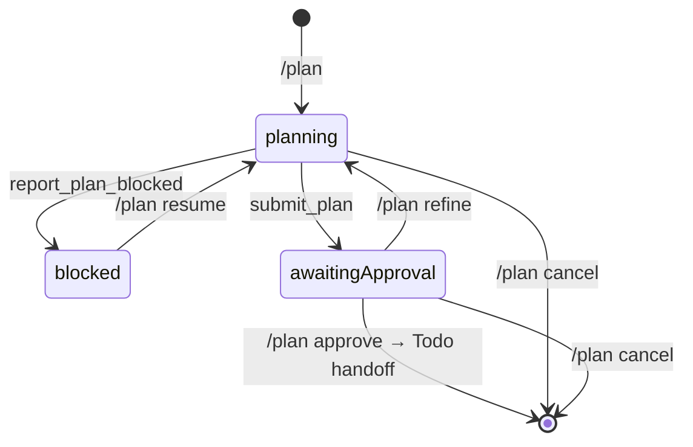

# Plan 插件

`plan` 为 Pi 增加“只读调研 → 提交计划或报告阻塞 → 用户审批 → 转交 Todo 执行”的状态机，在用户批准前从工具选择和 tool-call 拦截两层阻止工作区写入。

> 维护约束：凡是改变 Plan 的行为、命令、工具 schema、状态机、工具策略、与 Goal/Todo/Request/RG/LSP 的协作协议或安装方式，都必须在同一改动中同步本 README。

## 适用场景与效果

适合风险较高、范围较大，或用户希望先审查实施方案再允许修改的任务。进入 Plan 后：

- agent 只能使用显式只读工具做调查；出现会实质改变计划的取舍时，交由外部 Request 插件的 `ask` 完成交互，答案直接返回当前规划轮。
- `submit_plan` 成功后立即返回摘要与 Review 提示并进入 `awaitingApproval`；完整候选计划仅在 Review、Copy、`/plan status` 与 journal state 中呈现，工具调用不等待 UI。
- 若已按比例完成只读调查仍无法形成可审批实施计划，agent 调用 `report_plan_blocked` 记录已验证阻塞事实、已查证据来源和用户可提供的前提或替代方向，进入 `blocked`；该结果不创建 artifact、不进入 Review，仍保持只读，用户补充信息后通过 `/plan resume` 回到规划。
- 每次成功初次提交或 refinement 重提都会创建一份不可变、仅含 Plan body 的 Markdown artifact；同一绝对路径只写入持久 Plan state 与 machine-readable tool result details，不进入 model-visible content。
- 批准时把顶层执行步骤原子写入普通 Todo board：phase 名由当前 Plan summary 派生（净化为单行、折叠空白、截断到 Todo 的 80 字符 phase 上限，净化后为空则回退 `Plan`）；空或已 settled 的 board 以该名新建，open board 则追加唯一命名的 phase（冲突时追加 ` (2)` 等）；随后 Plan 立即退出并恢复进入 Plan 前的工具集。
- 批准后只显示普通 Todo 的 `#N` 任务、活动指针与完成计数；Plan status/widget 清除，也不再暴露第二套步骤更新工具。
- Plan 候选状态写入 Pi session journal；批准 handoff 后由 Todo 的普通 branch journal 独立持久化执行进度。

## 安装与启用

要求：Node.js `>=22.19.0`、npm，以及兼容 `@earendil-works/pi-coding-agent >=0.81.0` 的 Pi。

```bash
cd /path/to/pi-extensions/plan
npm ci
mkdir -p "$HOME/.pi/agent/extensions"
ln -sfn "$PWD" "$HOME/.pi/agent/extensions/plan"
```

软链接必须指向 `plan/` 包根目录。其 manifest 按 Request → Todo → Plan 顺序加载 `node_modules` 中捆绑的 dependency extension resource 与自身入口；因此只安装 Plan package 也会加载三者。开发时直接加载 `src/index.ts` 同样会通过 installer 组合 Request 和 Todo。仓库移动后需重建链接；随后重启 Pi，或执行 `/reload`。

Plan 不实现用户问答 UI。需要交互式澄清时应同时加载 `request` 扩展，由其提供 `ask`；若没有外部问答工具，agent 以普通回复列出选项并等待用户下一条消息，Plan 保持 `planning`。

开发时可直接加载入口：

```bash
pi --extension ./src/index.ts
```

## 使用方法

### 典型流程

1. 输入 `/plan`。插件停止当前 agent、进入只读 `planning`，但不发送消息或触发模型。
2. 发送需要规划的真实请求；该消息是本轮规划的直接范围。若存在无法由仓库证据解决且会改变方案的取舍，agent 调用外部 Request 的 `ask`，用户答案直接返回同一规划轮。
3. agent 调查仓库并调用 `submit_plan`。每次成功提交都会生成一个新的不可变 preview artifact。
4. `submit_plan` 所在 agent 轮完全 settled 后，TUI 自动打开 Review；可复制、批准、refine、stay 或取消。关闭后使用 `/plan review` 重新打开，也可直接使用显式命令。
5. 批准时步骤转入普通 Todo board，Plan 立即退出；agent 使用 Todo 的数字 `#ID` 执行、完成或阻塞任务。
6. 后续执行只遵循 Todo 生命周期；Todo settled 不重新激活或自动完成 Plan。



### 规划提示词契约

`planning` 阶段注入完整的英文规划契约：

- Plan 与 Goal 是互斥的 active workflow；启动 Plan 前必须暂停、完成或清除 active Goal，Plan 活跃时不能创建或恢复 Goal。
- agent 先通过仓库代码、配置、测试、历史和既有模式消除不确定性，不得询问能够自行查到的信息；具体路径、符号、命令和行为判断必须有证据。
- 只有缺少正确规划所需事实、存在实质性取舍、假设可能破坏数据或契约，或业务语义无法从代码和测试确定时，才使用 `request_plan_choice` 或外部 Request `ask`；提供 2–5 个有区别的选项与取舍描述，不得询问工具可查的信息。
- 每个顶层实施阶段都写明 Target、Change 和 Check，并按照真实依赖排序；计划层面还必须说明有证据支持的问题、为用户/调用方/系统带来的具体价值及方案理由，不得编造业务收益或影响指标。验证方式必须对应 bug、API、UI、数据库或内部重构的可观察行为；只能承诺当前已确认可执行的验证，真实 UI、外部服务或迁移环境不可用时应写明所需环境、手工路径和不可替代的成功信号。
- 所有面向用户的 Plan 文本——`summary`、`plan`、`steps`、choice 问题与选项、阻塞报告——默认使用简体中文撰写，除非用户明确要求其他语言；代码符号、文件路径、命令和配置键保持原文。
- `summary` 是最多 80 字符的短标题，批准后将原样成为 Todo board phase 名，提示词要求写成紧凑标签而非带从句的完整句子；`plan` 保存完整技术细节；`steps` 与顶层阶段一一对应，通常为 2–8 项且提示词要求每项不超过 120 字符。工具 schema 保留 1–50 项、每项最多 240 字符的硬上限。
- 存在旧计划时，它会经过 XML 转义后放入 `<untrusted_plan>`；refinement 必须重新核对证据并提交完整替代计划，而不是 diff 或局部补丁。
- refinement 时，用户最新明确需求定义目标状态；仓库证据定义当前行为和技术约束。两者无法安全协调时，agent 必须澄清，而不是静默偏向任一方。
- 所有实质问题解决后，agent 恰好调用一次 `submit_plan` 并结束规划轮，不在同一轮执行计划。

### 用户命令

```text
/plan
/plan status
/plan review
/plan resume
/plan approve
/plan refine
/plan cancel
```

| 命令 | 行为 |
| --- | --- |
| `/plan` | Plan 关闭时进入 `planning`，但不排队消息或触发模型；随后发送真实规划请求。Plan 已开启时等同于 status。 |
| `/plan status` | 显示当前 phase、完整计划和步骤状态。 |
| `/plan review` | 仅在 `awaitingApproval` 可用；重新打开自动审批窗口，支持滚动和复制；Stay 或 Esc 后可再次 review。 |
| `/plan resume` | 继续已存在的 `planning`；若为 `blocked`，在用户补充前提或指定替代方向后恢复只读规划并要求 agent 重新核验证据；不会绕过 awaiting approval。 |
| `/plan approve` | 仅在 `awaitingApproval` 可用；把步骤写入普通 Todo board，关闭 Plan，恢复原工具并排队执行轮。 |
| `/plan refine [feedback]` | 仅在 `awaitingApproval` 可用；收集具体反馈后回到只读 planning，并要求 agent 提交完整替代计划。TUI 省略参数时打开 editor。 |
| `/plan cancel` | 任意活跃 phase 均可取消；恢复原工具并解除 Todo mutation gate。Plan 已为 `off` 时仍重发 `off` phase sync。 |

命令在改变状态前会 abort 当前 agent 并等待 idle，防止旧 agent 在新策略下继续运行。

### Agent 工具

四个工具的 description 都说明调用时机，并各带一行 `promptSnippet` 与逐条点名工具名的 `promptGuidelines`，使它们进入 system prompt 的 Available tools 段。`report_plan_blocked` 与 `request_plan_choice`/`answer_plan_choice` 属于边缘路径：其引导只保证元数据准确，不主动推广调用。

#### `submit_plan`

仅在 `planning` 启用，一次提交完整计划：

```json
{
  "summary": "新增语音资产训练接口",
  "plan": "完整 Markdown 实施计划",
  "steps": [
    "调查并确认现有契约",
    "实施变更",
    "验证端到端行为"
  ]
}
```

约束：summary 硬上限 500 字符（提示词契约要求不超过 80 字符的标题），plan 最多 20,000 字符，1–50 个步骤，每步最多 240 字符；完整 payload 还受 40 KiB UTF-8 上限约束。插件规范化步骤文本，写入不可变 body-only artifact，并以 `terminate: true` 结束当前规划轮。model-visible 调用结果只返回摘要与 Review 提示；绝对路径只在 machine-readable `details.planPath` 和 journal state 中公开，完整 body 与步骤文本不复制到调用结果。

#### `report_plan_blocked`

仅在 `planning` 启用；当按任务复杂度完成只读调查后，仍无法形成可审批实施计划时使用：

```json
{
  "summary": "缺少签名凭据，无法形成可审批的发布计划",
  "blockingFacts": ["配置的凭据存储中不存在签名密钥"],
  "evidenceSources": ["config/signing.ts", "凭据存储读取结果"],
  "resolutions": [
    { "kind": "prerequisite", "label": "提供凭据", "description": "将有效签名密钥加入配置的凭据存储" },
    { "kind": "alternative", "label": "延后签名发布", "description": "改为规划未签名的内部构建" }
  ]
}
```

每个报告至少包含一项已验证阻塞事实、证据来源和用户解决路径；每项路径的 `kind` 为 `prerequisite` 或 `alternative`。调用以 `terminate: true` 结束本轮，不创建 Plan artifact，也不能被 approve。Plan 在 `blocked` 保持只读；用户提供新信息后执行 `/plan resume`，agent 才能重新调查并调用 `submit_plan` 或再次报告阻塞。

#### `request_plan_choice` 与 `answer_plan_choice`

当仓库证据无法决定会实质改变方案的取舍时，`request_plan_choice` 在 `planning` 创建 2–5 个选项并进入 `awaitingClarification`；TUI 在该轮 settled 后通过 Request UI 打开选择。`answer_plan_choice` 记录用户明确选择并恢复只读规划。能从仓库、配置、测试或工具查到的问题不得询问用户。

#### 批准后的 Todo handoff

Plan 没有 `executing` phase，也不注册步骤更新工具。`/plan approve` 把 `submit_plan.steps` 作为普通 Todo 任务提交，phase 名由 `planHandoffPhaseName(summary)` 从当前 Plan summary 派生（净化为单行、截断到 80 字符，为空时回退 `Plan`）：若当前 board 为空或已 settled，则以该名创建 board；若已有 open board，则追加该名（冲突时追加 ` (2)` 等唯一后缀）的 phase，并保留原活动任务。handoff 成功后 Plan journal 写入 terminal state、清除 Plan UI、恢复工具并排队一轮带完整已批准计划的执行消息。handoff 结果与执行消息都明确说明步骤已初始化在 Todo 看板上、禁止再次 `init` 或重复 `append` 同一批步骤；后续更新全部使用普通 `todo` 工具与既有数字 `#ID`。

## 阶段与工具策略

| Phase | 可用工具 | 写入能力 |
| --- | --- | --- |
| `planning` | `read`、`rg` 或 `grep`（同时存在时仅 `rg`）、`find`、`ls`、`lsp`、外部 `questionnaire`/Request `ask`、`submit_plan`、`report_plan_blocked`、`request_plan_choice` | 禁止工作区修改和任意 shell；Goal/Todo mutation 工具不暴露。 |
| `awaitingClarification` | 同一只读集合，加 `answer_plan_choice`，无提交或阻塞报告 | 等待用户明确选择后恢复 planning。 |
| `awaitingApproval` | 同一只读集合，但无提交、阻塞报告或选择工具 | 等待用户批准、refine 或 cancel。 |
| `blocked` | 同一只读集合，但无提交、阻塞报告或选择工具 | 等待用户补充前提或指定替代方向，再使用 `/plan resume` 重新规划。 |
| `off` | 不接管工具；批准产生的执行进度由 Todo 独立管理 | 无额外限制。 |

防护有两层：

1. `setActiveTools` 只向 agent 暴露当前 phase 允许的工具。
2. `tool_call` hook 再次检查 `isPlanToolAllowed`；即使其他扩展误把写工具重新启用，调用仍会被 block。

`PlanToolLease` 不是简单保存/覆盖数组：它在 Plan 活跃期间观察其他扩展新增或移除的工具，退出时合并这些外部变化，避免把并发的工具配置回滚。`rg` 与 `grep` 同时存在时只暴露 `rg`；只有一个搜索别名时保留现有名称。

注意：只读判定按工具名白名单执行。新增真正只读的工具不会自动获准；应先审查语义，再更新 `src/tool-policy.ts` 和测试。

## 审批与无界面模式

`submit_plan` 不在工具执行期间打开或等待审批 UI。它先原子地持久化 `awaitingApproval` 与 artifact，随后立即返回摘要、可用命令及 `terminate: true` 结束规划轮。Pi 的重试、压缩重试和 follow-up 全部结束并触发 `agent_settled` 后，TUI 才自动打开 Review，因此审阅时间不占用工具调用期限；同一提交只自动打开一次。

有 Markdown heading 时，宽度至少 72 列的 Review 会显示 Outline 和 Preview 分栏；窄屏保留完整 Preview 宽度，仅在 Outline 获取 focus 时切换为 heading 列表。没有 heading 时不会显示 Outline。Outline Enter 会跳到对应 Markdown 渲染行。Preview、Outline 与 Actions 用 Tab/Shift+Tab 切换焦点；焦点内的 `↑`/`↓`、Home/End、PgUp/PgDn 分别滚动、选择或跳转。`←`/`→` 切换 Actions，初始 Enter 执行，`c` 复制，Esc 或 Ctrl+C 保持等待。

Review 不维护私有 RGB 或 ANSI palette：普通正文、层级提示、focus、状态和 Markdown 元素分别使用 Pi 的 `text`/`muted`、`accent`、`success`/`warning`/`error` 与 `md*` 语义 token，因此会随当前全局 theme（包括仓库顶层 `themes/` 提供的全部 `pi-extensions-*` palette）一致切换；Plan 不导入、注册或选择任何 palette。

Copy 把未装饰的完整 `renderPlan(plan)` 写入系统剪贴板，并保持 Review 打开；它既不是 body-only artifact，也不包含 Outline marker。复制成功或失败状态直接显示在窗口内。选择 Stay 或按 Esc 只关闭窗口，不改变 `awaitingApproval`；`/plan review` 可随时重新打开。

所有模式使用相同的显式审批命令：

- `/plan approve`：把步骤转交普通 Todo、关闭 Plan 并排队执行。
- `/plan refine [feedback]`：收集具体修改意见后回到只读 refinement；Review 与无参数 TUI 命令会打开 editor。
- `/plan cancel`：取消并恢复工具，不产生 Todo 任务。

这既是安全边界，也是可靠性边界：没有界面会隐式批准，用户审阅长计划也不会让 `submit_plan` 因等待输入而超时。`/plan status` 可随时重新显示已持久化的完整候选计划。

## 与 Goal 插件协作

Plan 与 Goal 使用版本化 `pi-extensions:exclusive-workflow:v1` query channel 保证同一 session 只有一个 active workflow：

- active Goal 存在时，`/plan` 拒绝启动；用户需先 pause、complete 或 clear Goal。
- Plan 任一活跃 phase 存在时，Goal 的 create/resume 及会恢复 active 状态的 edit 都拒绝；Plan 的 tool lease 也不暴露 Goal mutation 工具。
- branch restore 若同时发现 active Plan 与 active Goal，Goal 在所有 session handlers 完成后持久化为 `paused`，避免依赖扩展加载顺序。
- 查询带 session ID；其他 session 的状态不会参与仲裁。Plan 批准或取消后即不再占用 workflow，Todo 执行与 Goal 仍各自独立，系统不会自动恢复 paused Goal。

## 与 Todo 插件协作

Plan 对 Todo 是硬依赖：`plan/package.json` 声明并捆绑 `pi-todo-dev`，Plan 在 factory 中通过 `installTodo(pi)` 取得 typed service。Todo 默认 entry 与 Plan installer 共享 EventBus-scoped installation registry，因此任意加载顺序都不会重复注册 tool、command、listener 或 runtime。

- Plan 每次 phase transition 调用 `todo.syncPlanPhase({ sessionId, phase })`；planning、clarification、approval 与 blocked 期间，Todo mutation 和普通 widget/prompt 均被冻结，read-only `view/get` 仍可用。
- `/plan approve` 调用 `todo.handoffPlan()`，用普通 Todo `init` 或 `append` transition 提交全部步骤。handoff 失败时 Plan 恢复 `awaitingApproval`，不排队执行。
- open Todo board 保留当前 active 指针，Plan tasks 作为后续唯一命名 phase 排队；空或 settled board 则创建新 board 并启动第一项。
- handoff 成功后 Plan 写 terminal state、同步 `off`、清除自身 UI 并恢复原工具；Todo 立即成为唯一执行账本，后续 reload/branch replay 只依赖普通 `todo-state-v2`/tool details。

## 与 Request、RG 和 LSP 插件协作

- Plan 对 Request 也是硬依赖：factory 通过 `installRequest(pi)` 取得 typed service。Plan Review 使用领域组件；`request_plan_choice` 将 2–5 个选项映射为 Request 单选结果，Plan 自己校验并写 journal。无界面时要求用户编号回复与 `answer_plan_choice`，绝不隐式选择；`ask` 仍可用于同轮外部问答。
- `rg` 与 `lsp` 都在活跃 Plan phase 的只读 allowlist 中。RG 继续保持在 `grep` 前；LSP 的 rename/code action 只返回 preview，因此不会绕过 Plan 的工作区写保护。
- 批准后 Plan 不再接管工具；Request、RG、LSP 与其他工具是否可用由批准前保存的工具集及其他扩展决定，执行进度只由 Todo 投影。

## 配置与持久化

Plan 没有外部配置文件。状态完全来自命令、工具调用和 Pi session journal：

- 当前 `plan-state-v4` journal entry 记录 start、clarify、answer、resume、submit、block、approve、refine 与 cancel；approve/cancel 写 terminal `state: null`。新状态只写 v4，不双写旧格式。
- v4 保存候选计划、步骤、可选 choice/blocker、artifact 路径和进入时工具集，不保存执行进度。合法 v1–v3 候选状态会规范迁移；旧 `executing` approve/step/complete entry 只恢复为 terminal Plan，不复活已废弃的执行模式；其他无效 entry 不会部分恢复。
- 有 session 文件时，artifact 位于 session JSONL 相邻的 `.plan-artifacts/<sessionId>/`；无 session 时位于 OS 临时目录，并在 `session_shutdown` 清理。每份文件使用私有权限、UTF-8 与终止换行，内容只等于规范化后的 `state.plan` body。
- `details.planPath` 与对应 `plan-state-v4.data.state.planPath` 是第三方发现 artifact 的稳定接口。journal 是权威状态：写成但尚未 append journal 的孤立文件不会被恢复；后续 UI 或 Goal 刷新失败不会回滚已提交 artifact。
- context hook 只保留与当前 Plan `updatedAt` 对应的最新显式 phase-transition 隐藏控制消息，避免旧分支消息重复执行；初次 `/plan` 不创建控制消息。
- Plan 输出按 Pi 通用行数/字节限制截断，但完整计划仍保存在 journal state 中。

## 实现原理与关键节点

- `src/index.ts`：扩展入口和状态机编排；Request/Todo direct service、工具 lease、journal、UI、workflow 仲裁、显式控制轮与批准 handoff 在此汇合。
- `src/clarification.ts`：Plan choice 到 Request question/result 的领域 adapter。
- `src/state.ts`：纯状态转移、v1–v4 journal/state 解码及 obsolete executing-state cutover。
- `src/review.ts`：Plan 专用 Markdown Review、Copy、refinement editor 与 action UI。
- `src/artifacts.ts`：private、原子、不可变的 body-only artifact writer 与临时目录清理。
- `src/outline.ts`：Markdown heading 解析、渲染跳转 marker 与 marker 清理。
- `src/tools.ts`、`src/tool-schema.ts`：提交、阻塞报告与 Plan choice 工具边界。
- `src/tool-policy.ts`：只读白名单、phase 判定及 RG 优先顺序。
- `src/tool-lease.ts`：与其他扩展共存时的工具集合并算法。
- `src/workflow-mode.ts`：Plan/Goal 互斥 workflow query 协议。
- `src/prompts.ts`：各 phase 注入的证据、互斥与 handoff 约束。
- `src/protocol.ts`：Plan journal/control/execution message 类型与 context 识别。
- `src/output.ts`：Plan 状态、候选步骤 widget、有界文本和 details。
- `test/coexistence.test.ts`：Plan/Goal 互斥、Request choice/refinement、Todo handoff 与恢复的端到端交互；`../todo/test/coexistence.test.ts` 覆盖三种 package 加载顺序与普通 board 语义。

## 开发与验证

```bash
cd /path/to/pi-extensions/plan
npm ci
# test/coexistence.test.ts imports Goal source, so TypeScript needs Goal's package-local dependencies.
(cd ../goal && npm ci)
npm run check
npm test
```

改变协调协议或 Goal/Todo 协作时，同时在 `goal/` 与 `todo/` 运行 `npm run check && npm test`。
