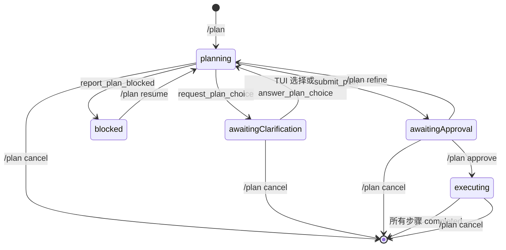

# Plan 插件

`plan` 为 Pi 增加“只读调研 → 提交计划或报告阻塞 → 用户审批 → 按步骤执行”的状态机，在用户批准前从工具选择和 tool-call 拦截两层阻止工作区写入。

> 维护约束：凡是改变 Plan 的行为、命令、工具 schema、状态机、工具策略、与 Goal/Todo/Request/RG/LSP 的协作协议或安装方式，都必须在同一改动中同步本 README。

## 适用场景与效果

适合风险较高、范围较大，或用户希望先审查实施方案再允许修改的任务。进入 Plan 后：

- agent 只能使用显式只读工具做调查；出现会实质改变计划的取舍时，可用 `request_plan_choice` 请求用户在 2–5 个选项间选择。
- `submit_plan` 成功后立即返回摘要与 Review 提示并进入 `awaitingApproval`；完整候选计划仅在 Review、Copy、`/plan status` 与 journal state 中呈现，工具调用不等待 UI。
- 若已按比例完成只读调查仍无法形成可审批实施计划，agent 调用 `report_plan_blocked` 记录已验证阻塞事实、已查证据来源和用户可提供的前提或替代方向，进入 `blocked`；该结果不创建 artifact、不进入 Review，仍保持只读，用户补充信息后通过 `/plan resume` 回到规划。
- 每次成功初次提交或 refinement 重提都会创建一份不可变、仅含 Plan body 的 Markdown artifact；同一绝对路径只写入持久 Plan state 与 machine-readable tool result details，不进入 model-visible content。
- 批准后恢复进入 Plan 前的工具集，并额外启用 `update_plan_step`；每次新批准的执行由直接依赖的 Todo managed ledger 持有。
- TUI footer 以独立 keyed status 横向显示 Plan 与 Goal；执行期 Plan 显示 `Plan · todo`，步骤 status/widget 只由 Todo 投影，避免双份进度面板。
- 状态写入 Pi session journal；切换 session tree 分支会恢复该分支最后的有效 Plan 状态。

## 安装与启用

要求：Node.js `>=22.19.0`、npm，以及兼容 `@earendil-works/pi-coding-agent >=0.81.0` 的 Pi。

```bash
cd /path/to/pi-extensions/plan
npm ci
mkdir -p "$HOME/.pi/agent/extensions"
ln -sfn "$PWD" "$HOME/.pi/agent/extensions/plan"
```

软链接必须指向 `plan/` 包根目录。其 manifest 按 Request → Todo → Plan 顺序加载 `node_modules` 中捆绑的 dependency extension resource 与自身入口；因此只安装 Plan package 也会加载三者。开发时直接加载 `src/index.ts` 同样会通过 installer 组合 Request 和 Todo。仓库移动后需重建链接；随后重启 Pi，或执行 `/reload`。

开发时可直接加载入口：

```bash
pi --extension ./src/index.ts
```

## 使用方法

### 典型流程

1. 输入 `/plan`。插件停止当前 agent、进入只读 `planning`，但不发送消息或触发模型。
2. 发送需要规划的真实请求；该消息是本轮规划的直接范围。若存在无法由仓库证据解决且会改变方案的取舍，agent 调用 `request_plan_choice`，TUI 在本轮 settled 后显示选择窗口。
3. agent 调查仓库并调用 `submit_plan`。每次成功提交都会生成一个新的不可变 preview artifact。
4. `submit_plan` 所在 agent 轮完全 settled 后，TUI 自动打开 Review；可复制、批准、refine、stay 或取消。关闭后使用 `/plan review` 重新打开，也可直接使用显式命令。
5. 批准后 agent 执行计划，并用 `update_plan_step` 更新每一步。
6. 所有步骤变为 `completed` 时，Plan 自动退出并恢复工具。



### 规划提示词契约

`planning` 阶段注入完整的英文规划契约：

- Plan 以用户当前的规划请求为直接范围；Goal 不是前置条件。两者同时活跃且目标相关时，Goal 只提供补充上下文或外层约束，不会使 Plan 自动覆盖整个 Goal。
- agent 先通过仓库代码、配置、测试、历史和既有模式消除不确定性，不得询问能够自行查到的信息；具体路径、符号、命令和行为判断必须有证据。
- 只有缺少正确规划所需事实、存在实质性取舍、假设可能破坏数据或契约，或业务语义无法从代码和测试确定时，才调用 `request_plan_choice`；提供 2–5 个有区别的选项及其描述。TUI 会在当前轮 settled 后以键盘选择窗口收集答案；无界面时，用户回复一个选项编号后 agent 调用 `answer_plan_choice`。
- 每个顶层实施阶段都写明 Target、Change 和 Check，并按照真实依赖排序；计划层面还必须说明有证据支持的问题、为用户/调用方/系统带来的具体价值及方案理由，不得编造业务收益或影响指标。验证方式必须对应 bug、API、UI、数据库或内部重构的可观察行为；只能承诺当前已确认可执行的验证，真实 UI、外部服务或迁移环境不可用时应写明所需环境、手工路径和不可替代的成功信号。
- `summary` 是一句结果与范围摘要；`plan` 保存完整技术细节；`steps` 与顶层阶段一一对应，通常为 2–8 项且提示词要求每项不超过 120 字符。工具 schema 仍保留 1–50 项、每项最多 500 字符的硬上限。
- 存在旧计划时，它会经过 XML 转义后放入 `<untrusted_plan>`；refinement 必须重新核对证据并提交完整替代计划，而不是 diff 或局部补丁。
- refinement 时，用户最新明确需求定义目标状态；仓库证据定义当前行为和技术约束。两者无法安全协调时，agent 必须澄清，而不是静默偏向任一方。
- 所有实质问题解决后，agent 恰好调用一次 `submit_plan` 并结束规划轮，不在同一轮执行计划。

### 用户命令

```text
/plan
/plan status
/plan review
/plan resume
/plan approve
/plan refine
/plan cancel
```

| 命令 | 行为 |
| --- | --- |
| `/plan` | Plan 关闭时进入 `planning`，但不排队消息或触发模型；随后发送真实规划请求。Plan 已开启时等同于 status。 |
| `/plan status` | 显示当前 phase、完整计划和步骤状态。 |
| `/plan review` | 仅在 `awaitingApproval` 可用；重新打开自动审批窗口，支持滚动和复制；Stay 或 Esc 后可再次 review。 |
| `/plan resume` | 继续已存在的 planning 或 executing 状态；若为 `blocked`，在用户补充前提或指定替代方向后恢复只读规划并要求 agent 重新核验证据；不会绕过 awaiting approval。 |
| `/plan approve` | 仅在 `awaitingApproval` 可用；恢复原工具并排队执行轮。 |
| `/plan refine` | 仅在 `awaitingApproval` 可用；回到只读 planning，并要求 agent 提交完整替代计划。 |
| `/plan cancel` | 任意活跃 phase 均可取消；恢复原工具，不暂停 active Goal。Plan 已为 `off` 时仍重发权威 `off` 协调信号，以解除消费者的陈旧冻结状态。 |

命令在改变状态前会 abort 当前 agent 并等待 idle，防止旧 agent 在新策略下继续运行。

### Agent 工具

#### `submit_plan`

仅在 `planning` 启用，一次提交完整计划：

```json
{
  "summary": "简洁的结果与范围摘要",
  "plan": "完整 Markdown 实施计划",
  "steps": [
    "调查并确认现有契约",
    "实施变更",
    "验证端到端行为"
  ]
}
```

约束：summary 最多 500 字符，plan 最多 20,000 字符，1–50 个步骤，每步最多 500 字符；完整 payload 还受 40 KiB UTF-8 上限约束。插件为步骤生成稳定 ID，写入不可变 body-only artifact，并以 `terminate: true` 结束当前规划轮。model-visible 调用结果只返回摘要与 Review 提示；绝对路径只在 machine-readable `details.planPath` 和 journal state 中公开，完整 body 与步骤文本不复制到调用结果。

#### `report_plan_blocked`

仅在 `planning` 启用；当按任务复杂度完成只读调查后，仍无法形成可审批实施计划时使用：

```json
{
  "summary": "缺少签名凭据，无法形成可审批的发布计划",
  "blockingFacts": ["配置的凭据存储中不存在签名密钥"],
  "evidenceSources": ["config/signing.ts", "凭据存储读取结果"],
  "resolutions": [
    { "kind": "prerequisite", "label": "提供凭据", "description": "将有效签名密钥加入配置的凭据存储" },
    { "kind": "alternative", "label": "延后签名发布", "description": "改为规划未签名的内部构建" }
  ]
}
```

每个报告至少包含一项已验证阻塞事实、证据来源和用户解决路径；每项路径的 `kind` 为 `prerequisite` 或 `alternative`。调用以 `terminate: true` 结束本轮，不创建 Plan artifact，也不能被 approve。Plan 在 `blocked` 保持只读；用户提供新信息后执行 `/plan resume`，agent 才能重新调查并调用 `submit_plan` 或再次报告阻塞。

#### `request_plan_choice` 与 `answer_plan_choice`

`request_plan_choice` 仅在 `planning` 启用。它暂停只读规划，记录一个问题及 2–5 个带描述的选项，并在 TUI 当前轮 settled 后显示选择窗口；`↑`/`↓` 选择、Enter 确认、Esc 保持等待。确认后状态返回 `planning` 并排队下一轮。无界面时用户必须明确回复一个一基选项编号，agent 才能在 `awaitingClarification` 调用 `answer_plan_choice`。

#### `update_plan_step`

仅在 `executing` 启用：

```json
{
  "id": "submit_plan 返回的步骤 ID",
  "status": "inProgress"
}
```

status 可为 `pending`、`inProgress`、`completed`、`blocked`。`update_plan_step` 始终是 agent 面向的唯一更新入口：本地模式由 Plan reducer 更新，外部模式由 Plan 转发给批准时选定的 provider。最后一个未完成步骤变为 `completed` 时，Plan 自动完成并退出；外部 provider 更新失败会让工具调用失败，不会静默分叉出一份本地进度。

## 阶段与工具策略

| Phase | 可用工具 | 写入能力 |
| --- | --- | --- |
| `planning` | `read`、`rg`、`grep`、`find`、`ls`、`lsp`、`questionnaire`、`ask`、`create_goal`、`get_goal`、`submit_plan`、`report_plan_blocked`、`request_plan_choice` | 禁止工作区修改和任意 shell。 |
| `awaitingClarification` | 同一只读集合，但无提交、新选择或阻塞报告；额外启用 `answer_plan_choice` | 等待明确选择或 cancel。 |
| `awaitingApproval` | 同一只读集合，但无 `submit_plan`、阻塞报告或选择工具 | 等待用户批准、refine 或 cancel。 |
| `blocked` | 同一只读集合，但无提交、阻塞报告或选择工具 | 等待用户补充前提或指定替代方向，再使用 `/plan resume` 重新规划。 |
| `executing` | 进入 Plan 前的有效工具集，加 `update_plan_step` | 按原工具能力执行。 |
| `off` | 不接管工具 | 无额外限制。 |

防护有两层：

1. `setActiveTools` 只向 agent 暴露当前 phase 允许的工具。
2. `tool_call` hook 再次检查 `isPlanToolAllowed`；即使其他扩展误把写工具重新启用，调用仍会被 block。

`PlanToolLease` 不是简单保存/覆盖数组：它在 Plan 活跃期间观察其他扩展新增或移除的工具，退出时合并这些外部变化，避免把并发的工具配置回滚。`rg` 与 `grep` 同时存在时保持 `rg` 优先。

注意：只读判定按工具名白名单执行。新增真正只读的工具不会自动获准；应先审查语义，再更新 `src/tool-policy.ts` 和测试。

## 审批与无界面模式

`submit_plan` 不在工具执行期间打开或等待审批 UI。它先原子地持久化 `awaitingApproval` 与 artifact，随后立即返回摘要、可用命令及 `terminate: true` 结束规划轮。Pi 的重试、压缩重试和 follow-up 全部结束并触发 `agent_settled` 后，TUI 才自动打开 Review，因此审阅时间不占用工具调用期限；同一提交只自动打开一次。

有 Markdown heading 时，宽度至少 72 列的 Review 会显示 Outline 和 Preview 分栏；窄屏保留完整 Preview 宽度，仅在 Outline 获取 focus 时切换为 heading 列表。没有 heading 时不会显示 Outline。Outline Enter 会跳到对应 Markdown 渲染行。Preview、Outline 与 Actions 用 Tab/Shift+Tab 切换焦点；焦点内的 `↑`/`↓`、Home/End、PgUp/PgDn 分别滚动、选择或跳转。`←`/`→` 切换 Actions，初始 Enter 执行，`c` 复制，Esc 或 Ctrl+C 保持等待。

Review 不维护私有 RGB 或 ANSI palette：普通正文、层级提示、focus、状态和 Markdown 元素分别使用 Pi 的 `text`/`muted`、`accent`、`success`/`warning`/`error` 与 `md*` 语义 token，因此会随当前全局 theme（包括仓库顶层 `themes/` 提供的全部 `pi-extensions-*` palette）一致切换；Plan 不导入、注册或选择任何 palette。

Copy 把未装饰的完整 `renderPlan(plan)` 写入系统剪贴板，并保持 Review 打开；它既不是 body-only artifact，也不包含 Outline marker。复制成功或失败状态直接显示在窗口内。选择 Stay 或按 Esc 只关闭窗口，不改变 `awaitingApproval`；`/plan review` 可随时重新打开。

所有模式使用相同的显式审批命令：

- `/plan approve`：批准并排队执行。
- `/plan refine`：回到只读 refinement。
- `/plan cancel`：取消并恢复工具。

这既是安全边界，也是可靠性边界：没有界面会隐式批准，用户审阅长计划也不会让 `submit_plan` 因等待输入而超时。`/plan status` 可随时重新显示已持久化的完整候选计划。

## 与 Goal 插件协作

Plan 通过版本化 `pi.events` channel 广播 phase、只读状态及是否即将触发下一轮：

- planning/awaiting approval 阻止 Goal 自动续跑和 `update_goal`。
- approve/refine 由 Plan 自己排队下一轮，Goal 不重复发送 continuation。
- cancel 结束 Plan read-only 门控；active Goal 按既有无 pending turn、runtime idle 条件恢复 continuation。
- 所有信号带 session ID；跨 session 的事件会被 Goal 忽略。


## 与 Todo 插件协作

Plan 对 Todo 是硬依赖：`plan/package.json` 声明并捆绑 `pi-todo-dev`，Plan 在 factory 中通过 `installTodo(pi)` 取得 typed service。Todo 默认 entry 与 Plan installer 共享 EventBus-scoped installation registry，因此任意加载顺序都不会重复注册 tool、command、listener 或 runtime。

- `emitPlanState()` 继续广播 `pi-extensions:plan-state:v1` 给可选 Goal，同时直接调用 `todo.syncPlanPhase({ sessionId, phase })`。Todo 不消费该 broadcast。
- `/plan approve` 直接调用 `todo.progress.open` 并严格校验完整 snapshot；失败时 Plan 保持 `awaitingApproval`，不排队执行轮、不创建 local fallback。
- Plan 只接受持久化 owner `todo`。它固定通过同一 service read/update/close；恢复到非 Todo owner、Todo snapshot 无效或 Todo lifetime 已失效都会 fail closed，不会切换 owner 或伪造成功。
- Todo managed ledger 持久化 mutable status；Plan 只持久化不可变步骤定义、owner ID 与 execution ID。agent 仍只调用 `update_plan_step`，不能用普通 `todo` 修改 managed ledger。
- Todo 执行期投影 managed prompt/widget；Plan 与 Todo 都不在底部状态栏显示执行标识，普通 Todo board 保持冻结且不被覆盖。
- 全部步骤完成或 `/plan cancel` 时，Plan 先 append v3 terminal tombstone、恢复工具、直接同步 `off`，再 best-effort 调用 `todo.progress.close`。close 失败只 warning，不能回滚已持久化 Plan 终态。

## 与 Request、RG 和 LSP 插件协作

- Plan 对 Request 也是硬依赖：factory 通过 `installRequest(pi)` 取得 typed service。Plan Review 仍使用领域组件；持久化 clarification 将 Plan choice 映射成 Request 单选结果，Plan 自己校验并写 journal。无界面时仍要求用户编号回复与 `answer_plan_choice`，绝不隐式选择。
- `rg` 与 `lsp` 都在 `planning`、`awaitingClarification`、`awaitingApproval` 的只读 allowlist 中。RG 继续保持在 `grep` 前；LSP 的 rename/code action 只返回 preview，因此不会绕过 Plan 的工作区写保护。
- 这些工具/UI 扩展不读取或更新 Plan managed progress。进入执行期后，它们是否可用仍取决于进入 Plan 前的有效工具集；Plan 的 tool lease 会保留其他扩展在生命周期内对工具集做出的变化。

## 配置与持久化

Plan 没有外部配置文件。状态完全来自命令、工具调用和 Pi session journal：

- 当前 `plan-state-v3` journal entry 记录 start、clarify、answer、resume、submit、block、approve、refine、本地 step、cancel、complete；恢复仍读取并规范迁移合法 `plan-state-v1` 与 `plan-state-v2`，但新状态只写 v3，不双写旧格式。
- v3 在 v2 的已批准步骤定义与 mutable progress 分离基础上，新增无可审批计划时的有界 blocker report；`blocked` 只保存已验证事实、证据来源和用户解决路径，不含 artifact 或执行步骤。恢复严格校验 journal/state version 匹配、phase、owner、blocker、步骤、时间戳及进入时工具集；无效 entry 不会部分恢复。
- 有 session 文件时，artifact 位于 session JSONL 相邻的 `.plan-artifacts/<sessionId>/`；无 session 时位于 OS 临时目录，并在 `session_shutdown` 清理。每份文件使用私有权限、UTF-8 与终止换行，内容只等于规范化后的 `state.plan` body。
- `details.planPath` 与对应 `plan-state-v3.data.state.planPath` 是第三方发现 artifact 的稳定接口。journal 是权威状态：写成但尚未 append journal 的孤立文件不会被恢复；后续 UI 或 Goal 刷新失败不会回滚已提交 artifact。
- context hook 只保留与当前 Plan `updatedAt` 对应的最新显式 phase-transition 隐藏控制消息，避免旧分支消息重复执行；初次 `/plan` 不创建控制消息。
- Plan 输出按 Pi 通用行数/字节限制截断，但完整计划仍保存在 journal state 中。

## 实现原理与关键节点

- `src/index.ts`：扩展入口和状态机编排；直接 Request/Todo service、工具 lease、journal、managed-progress lifecycle、UI、生命周期 hooks、显式 phase-transition 控制轮及 Goal event broadcast 均在此汇合。
- `src/clarification.ts`：Plan clarification 到 Request question/result 的领域 adapter。
- `src/progress.ts`：Todo managed snapshot 的请求边界、严格解码及 close/update 辅助。
- `src/state.ts`：纯状态转移、v1/v2/v3 journal/state 解码与 legacy local progress 恢复。
- `src/review.ts`：Plan 专用 Markdown Review、Copy 与 action UI。
- `src/artifacts.ts`：private、原子、不可变的 body-only artifact writer 与临时目录清理。
- `src/outline.ts`：Markdown heading 解析、渲染跳转 marker 与 marker 清理。
- `src/tools.ts`、`src/tool-schema.ts`：提交、选择与统一步骤更新 facade。
- `src/tool-policy.ts`：只读白名单、phase 判定及 RG 优先顺序。
- `src/tool-lease.ts`：与其他扩展共存时的工具集合并算法。
- `src/prompts.ts`：各 phase 注入的强制约束；managed 状态由 Todo 单独投影。
- `src/protocol.ts`：Goal 消费的 Plan 版本化 phase 广播协议。
- `src/output.ts`：footer 状态文本、本地 legacy 步骤 widget、有界输出和 details。
- `test/coexistence.test.ts`：Goal/Plan 生命周期、Request clarification 与 Todo direct service failure 的端到端交互；`../todo/test/coexistence.test.ts` 覆盖三种 package 加载顺序与 Todo managed ledger；两套 harness 都记录注册次数以防 Map 覆盖掩盖重复 surface。

## 开发与验证

```bash
cd /path/to/pi-extensions/plan
npm run check
npm test
```

改变协调协议或 Goal/Todo 协作时，同时在 `goal/` 与 `todo/` 运行 `npm run check && npm test`。
