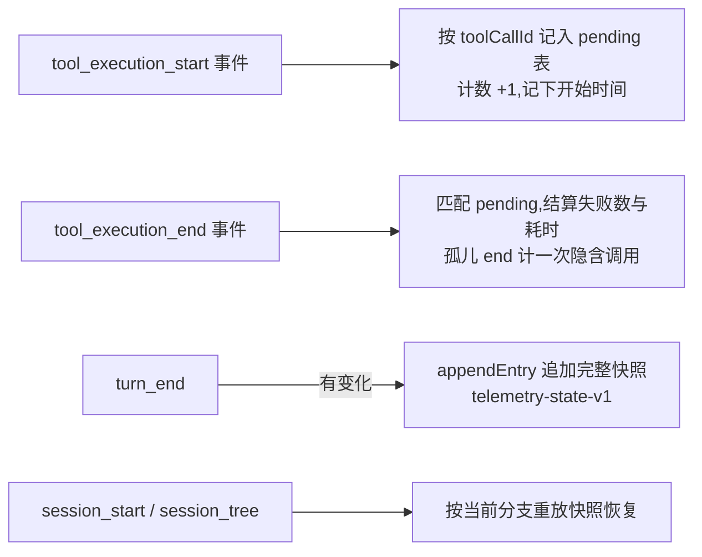

# Telemetry 插件

`telemetry` 是一个纯观察型 Pi 扩展：它统计模型在会话中实际调用了哪些工具、成功率如何、随 provider/model 如何变化，为排查"工具不活跃"类问题和离线评测提供数据基础。它不注册任何模型工具、不注入 prompt、不拦截或修改任何工具调用，对 agent 行为零干预。

> 维护约束：凡是改变 Telemetry 的行为、命令、数据维度、持久化格式、隐私边界或安装方式，都必须在同一改动中同步本 README。

## 它解决什么问题

"哪些工具装了但模型从来不用"过去只能靠感觉猜。模型工具调用率高度依赖 provider/模型（上游 earendil-works/pi#6717：同一工具在一个 provider 下 23 次响应 0 调用，换一个 provider 就 45/83），凭印象下结论经常是错的。Telemetry 把这个问题变成可查的数据：装了哪些工具不重要，**被调用了多少次、成功了多少、在哪个模型下**，一目了然。它是 enforce（促活层）、prompt 元数据调优等一切"提利用率"动作的测量基础。

## 工作原理



- 宿主对每次工具尝试都会发 `tool_execution_start`/`tool_execution_end` 一对事件，Telemetry 据此按 `{tool, provider, model}` 维度计数；`tool_execution_end` 补记失败与耗时（从 start 到 end 的墙钟时间）。未知工具、schema 校验失败、输出截断与 gate 阻断等即时失败路径只发这一对事件（从不触发 `tool_call`/`tool_result` 钩子），同样计入调用与失败。provider/model 取自事件发生时 `ctx.model`，模型缺失时降级为 `unknown`。
- 聚合数据有界：最多 256 个 `{tool, provider, model}` 分组，超出时淘汰最久未使用的分组；单个维度值最长 128 个 Unicode 字符；pending 表上限 128（FIFO）。
- 每个 turn 结束且数据有变化时，把完整快照作为 Pi session journal 的 custom entry（`telemetry-state-v1`）持久化；`session_start` 与 `session_tree` 都按当前分支重放恢复，最后一条有效快照生效。
- 恢复不信任反序列化数据：版本不符或结构非法的快照跳过不采用（不影响之前已恢复的有效状态，最后一条有效快照仍然生效），单条非法聚合（计数为负、failures > calls、重复维度等）逐条跳过并告警。
- handler 返回 `undefined`，永不阻塞或改写工具调用；观察逻辑失败不会影响原工具协议。

## 适用场景与效果

适合回答这类问题：

- 当前 provider/model 下，模型实际调用了哪些工具，各占多少次？
- 某个工具的失败率是否异常偏高（例如 schema 不兼容导致模型反复调用失败）？
- 切换 provider/model 后，工具使用分布和成功率如何变化？

### 效果示例：`/telemetry status`

正常开发一段时间后执行 `/telemetry`，得到（notify 弹出的实际格式）：

```text
Tool calls: 137 · failures: 4 · success: 97% · groups: 9/256
- read @ anthropic/claude-sonnet-4: 48 calls, 0 failed (100% ok), avg 320ms
- edit @ anthropic/claude-sonnet-4: 31 calls, 2 failed (94% ok), avg 1.1s
- rg @ anthropic/claude-sonnet-4: 22 calls, 0 failed (100% ok), avg 450ms
- bash @ anthropic/claude-sonnet-4: 18 calls, 1 failed (94% ok), avg 4.2s
- todo @ anthropic/claude-sonnet-4: 12 calls, 1 failed (92% ok), avg 80ms
- lsp @ anthropic/claude-sonnet-4: 3 calls, 0 failed (100% ok), avg 2.8s
- ask @ anthropic/claude-sonnet-4: 2 calls, 0 failed (100% ok), avg n/a
… 2 more group(s). Use /telemetry export for the full data.
```

判读示例：`lsp` 只有 3 次调用而 `rg` 有 22 次——如果其中大量是符号导航，说明 lsp 活跃度低，值得用 enforce 的 nudge/gate 或 prompt guideline 干预；干预后再看同一张表，占比变化就是干预效果的直接度量。

### 场景示例

**场景 1：找出"装了没人用"的工具。** 对比 status 列表与你全局启用的扩展清单：注册了但完全不出现在聚合里的工具就是零调用工具。零调用不等于该删——`report_plan_blocked` 这类边缘路径工具设计上低频——但它告诉你促活资源该投给谁。

**场景 2：provider/模型切换对比。** 同一套扩展，上午用 `anthropic/claude-sonnet-4`、下午切到另一个 model，export 后按 `provider`/`model` 字段切片对比：某工具在 A 模型成功率 98%、在 B 模型 60%，说明是模型/B 的 schema 兼容问题而非工具本身的问题，可以向 enforce 加模型维度的应对或换模型。

**场景 3：与 enforce 的评测闭环（推荐工作流）。**

1. 两个扩展都启用，正常使用一到两周，攒基线数据。
2. `/telemetry export baseline.json`，看目标工具（如 `lsp`、`ast_grep_search`）的调用占比。
3. 用 enforce 干预（先默认 nudge，不够再配置 gate），同时按需调整目标工具的 promptGuidelines。
4. 再运行相同时长，`/telemetry export after.json` 对比：调用占比上升 = 干预有效；占比没变但 nudge 命中多次（`/enforce status` 可见） = 提示被无视，该升 gate。
5. 数据驱动地决定每条规则停留在 nudge 还是升级 gate，而不是凭感觉一次到位。

## 隐私边界

Telemetry **只**记录工具名、provider ID、model ID、计数与耗时。它绝不读取、记录或导出工具参数（`args`）、工具输出（`result`/`details`）、prompt 文本或任何会话内容。`tool_execution_start`/`tool_execution_end` 事件中的 `args` 与 `result` 对象从不进入聚合状态、journal 快照或 export 文件。导出 JSON 可安全地离开本机用于离线评测，但仍包含你使用的 provider/model 名称，分享前请自行确认。

## 如何接入

1. **启用**：`make pi-extensions-on` + `/reload`（或按下节手动链接）。零配置，即刻开始统计。
2. **日常**：不需要任何操作，它纯被动观察。偶尔 `/telemetry status` 扫一眼。
3. **评测**：需要正式对比（provider 切换、促活干预前后）时，用 `/telemetry reset` 清出干净起点，干预后 `/telemetry export` 留档。
4. **清理**：换实验轮次用 `reset`；数据跟随 session 分支，不写独立状态文件，无磁盘残留需要清理。

## 安装与启用

要求：Node.js `>=22.19.0`、npm，以及兼容 `@earendil-works/pi-coding-agent >=0.83.0` 的 Pi。

```bash
cd /path/to/pi-extensions/telemetry
npm ci
mkdir -p "$HOME/.pi/agent/extensions"
ln -sfn "$PWD" "$HOME/.pi/agent/extensions/telemetry"
```

软链接必须指向 `telemetry/` 包根目录，而不是 `src/index.ts`；Pi 会读取 `package.json` 中的 `pi.extensions` 并加载 `./src/index.ts`。仓库移动后应重新创建链接。随后重启 Pi，或在已运行的 Pi 中执行 `/reload`。

开发时也可绕过全局发现，直接从本目录启动：

```bash
pi --extension ./src/index.ts
```

## 使用方法

### 用户命令

```text
/telemetry [status]
/telemetry export [file]
/telemetry reset
```

| 命令 | 行为 |
| --- | --- |
| `/telemetry`、`/telemetry status` | 显示总调用数、失败数、成功率、分组占用，以及按调用数排序的前 10 个 `{tool @ provider/model}` 分组（调用数、失败数、成功率、平均耗时）。 |
| `/telemetry export [file]` | 把完整聚合数据导出为 JSON（默认 `telemetry-export.json`，写入会话 cwd）。路径必须是 cwd 内的相对路径：绝对路径、`..` 逃逸、符号链接逃逸一律拒绝；目标目录必须已存在；已存在的文件不会被覆盖。 |
| `/telemetry reset` | 清空全部聚合数据并追加一条空快照（保证分支重放后仍为空）。有对话框 UI 时先要求确认；无 UI 路径直接执行。空快照追加失败时报告失败（不报成功），内存态已清空并保持 dirty 标记，由下一个 `turn_end` 重试持久化。 |

命令仅注册 `telemetry` 一个；扩展不注册任何 agent 工具，也不修改 active tools。

### 导出格式

`/telemetry export` 生成的 JSON（版本 `1`）：

```json
{
  "version": 1,
  "generatedAt": 1754000000000,
  "totals": { "calls": 42, "failures": 3, "successRate": 0.9286 },
  "aggregates": [
    {
      "tool": "read",
      "provider": "anthropic",
      "model": "claude-sonnet-4",
      "calls": 20,
      "failures": 1,
      "totalDurationMs": 8400,
      "timedCalls": 20,
      "firstSeenAt": 1753999900000,
      "lastSeenAt": 1753999990000,
      "successRate": 0.95,
      "avgDurationMs": 420
    }
  ]
}
```

`aggregates` 按调用数降序排列。`timedCalls` 可能小于 `calls`：只有本进程观察到的完整 start→end 对才有耗时样本；恢复后到达（或超过 pending 上限）的孤儿 end 只计入调用与失败数，且已有聚合时也补记一次调用。离线评测（对比不同 provider/model 的工具活跃度与成功率）直接按 `provider`/`model` 字段切片即可。

## 状态与生命周期

- 观察：`tool_execution_start` 记录一次调用并把 `{dims, startedAt}` 按 `toolCallId` 存入有界 pending 表（上限 128，FIFO 淘汰）；`tool_execution_end` 匹配 pending 计算耗时并结算失败。未知工具、schema 校验失败、输出截断与 gate 阻断等路径宿主只发 start/end 一对事件（从不触发 `tool_call`/`tool_result` 钩子），因此也被完整计入调用与失败。无匹配 start 的孤儿 end（跨 restore 丢失或超过 pending 上限）按一次隐含调用计数——即使该维度已有聚合——只是没有耗时样本。
- 持久化：`turn_end` 时如有变化则追加完整快照；reset 追加空快照（追加失败时 reset 报失败，内存态已清空并保持 dirty 标记，下个 `turn_end` 重试）。恢复时从 `ctx.sessionManager.getBranch()` 顺序重放，最后一条有效快照生效；解码失败跳过该条并在有 UI 时告警，保留之前恢复的有效状态。
- `session_start` 与 `session_tree` 都会清空内存与 pending 表后重放，保证分支切换后数据与当前分支一致；restore 后到达的无匹配 end 按一次隐含调用计数。
- `session_shutdown` 幂等清空 pending 表；本扩展没有 timer、子进程或监听器需要释放。
- 四种模式：TUI/RPC 下命令通过 `ctx.ui.notify`/`confirm` 交互；JSON/print 模式下观察与持久化照常工作（不依赖任何 UI），slash 命令本身不可调用，也不会因为没有 UI 而崩溃。

## 与其他插件协作

Telemetry 是纯观察者：不注册工具、不接管 active tools、不使用跨插件事件 channel，也不读取其他扩展的 custom entry。它与 Goal/Plan/Todo/Request 等插件可任意组合加载，互不影响；其他扩展注册的自定义工具同样以 `{tool, provider, model}` 维度被统计。工具调用若被 Plan 等门禁阻止（`tool_call` 钩子返回 block），宿主仍会发出 `tool_execution_end`（`isError`），该次尝试被计入调用与失败——这正是评测"模型想用什么"与"实际能用什么"差异所需的数据。

## 配置

Telemetry 没有外部配置文件。运行期控制项只有 `/telemetry` 命令；持久化跟随 Pi session journal，不写独立状态文件（export 是显式的用户动作）。

## 实现原理与关键节点

- `src/index.ts`：扩展入口与装配根；持有聚合状态、有界 pending 表与 dirty 标记，注册生命周期与观察 hooks，负责 branch 恢复与快照持久化。
- `src/state.ts`：纯聚合模块；维度规范化、有界分组（LRU 淘汰）、不可变状态转换、严格的持久化解码边界、汇总/导出/状态格式化。
- `src/command.ts`：`/telemetry` 用户控制面（status/export/reset）。
- `src/export.ts`：导出路径安全（cwd 内解析、`realpath` 防符号链接逃逸、拒绝覆盖）与 JSON 写盘。
- `test/state.test.ts`：聚合、边界、淘汰、解码拒绝/跳过、导出与格式化的纯单元测试。
- `test/extension.test.ts` + `test/harness.ts`：注册面（零工具）、观察流、持久化时机、分支恢复、malformed 快照、无 UI 路径、export 安全（逃逸/覆盖/符号链接）与 reset 确认流。

## 开发与验证

```bash
cd /path/to/pi-extensions/telemetry
npm run check
npm test
```

`npm run check` 执行严格 TypeScript `noEmit` 检查；`npm test` 使用 Node `node:test` + `tsx`。
